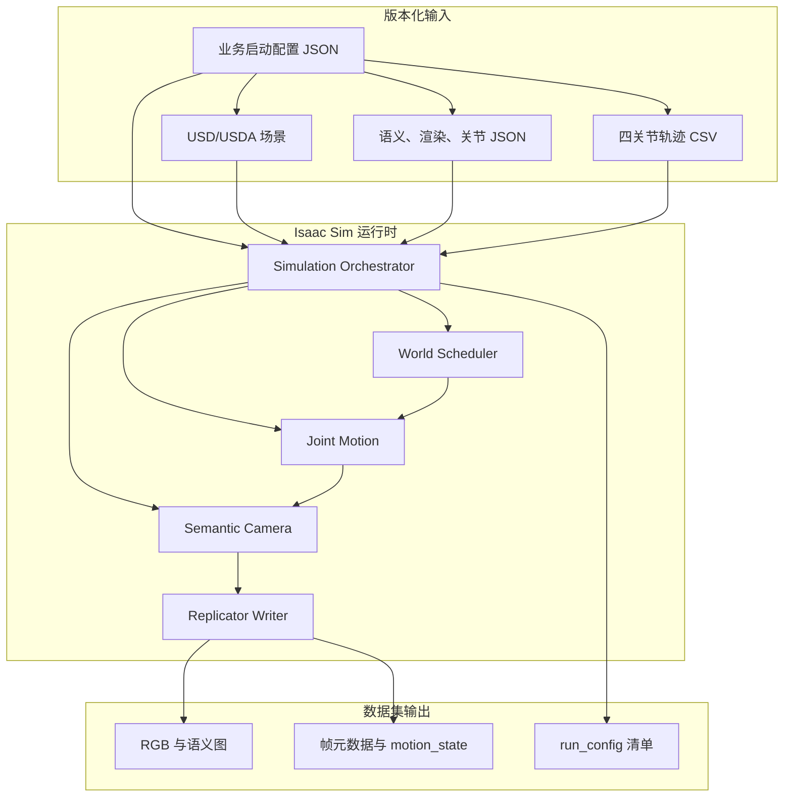
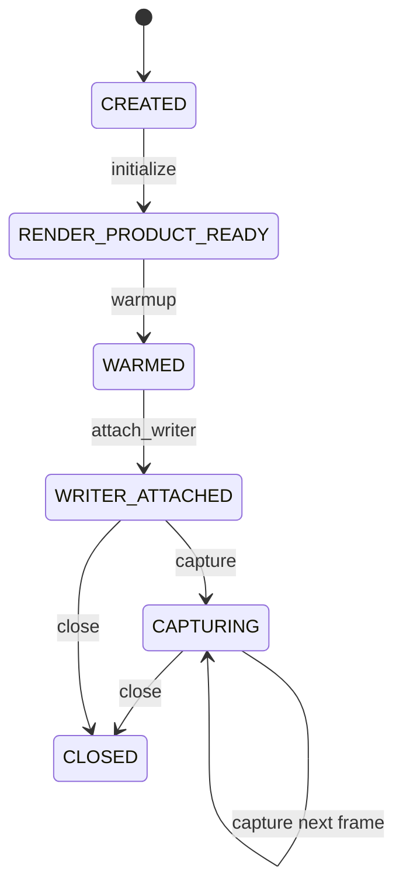
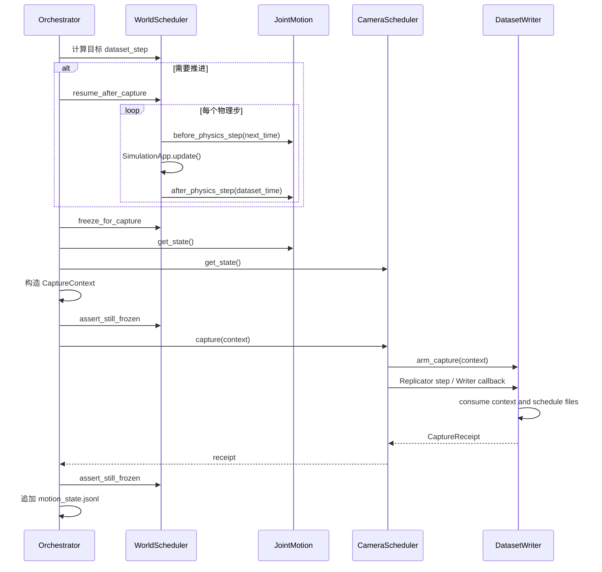

# 02 架构与完整运行流程

## 1. 先看系统边界

这个项目有三类输入、一个运行时和一组可验收输出：



`simulation_orchestrator.py` 是组合根。它不实现复杂算法，而是规定模块出现的顺序、故障如何落盘以及最终何时可以把运行标为 `complete`。

## 2. 模块职责与依赖

| 模块 | 核心对象 | 输入 | 输出/副作用 |
|---|---|---|---|
| `capture_launch_config.py` | `CaptureLaunchConfig` | 唯一的业务配置 JSON | 严格校验、相对路径解析、不可变有效配置 |
| `capture_timing.py` | `CaptureTiming` | 物理 Hz、采集 FPS、模式 | 帧对应的步数和时间 |
| `world_scheduler.py` | `WorldScheduler` | `SimulationApp`、Stage | Timeline 控制、精确物理步、冻结快照 |
| `joint_control_profile.py` | `JointControlProfile` | JSON | 经验证的四关节契约 |
| `articulation_stage_validator.py` | `validate_articulation_stage` | Stage、关节契约 | 解析出的根、DOF、链、限位、诊断 |
| `articulation_adapter.py` | `IsaacArticulationAdapter` | 根路径、DOF 名 | 批量位置命令与回读 |
| `excavator_joint_motion.py` | `ExcavatorJointMotion` | CSV、契约、Stage 报告 | 每步命令、实际位置、误差、刚体矩阵 |
| `stage_preflight.py` | `StagePreflight` | Stage、文件、相机 | 资产/相机/语义诊断与输入哈希 |
| `render_profile.py` | `RenderProfileManager` | 渲染 JSON、Carb Settings | 实际设置快照或阻断错误 |
| `semantic_capture_custom.py` | `SemanticCameraScheduler` | 相机、RenderProduct 参数 | 阻塞式逐帧采集回执 |
| `capture_context.py` | `CaptureContext`、`CaptureLedger` | 帧的权威状态 | Writer 与请求帧的绑定 |
| `semantic_mapping.py` | `SemanticMapping` | 映射 JSON、运行时 ID | 稳定 ID、颜色、诊断 |
| `semantic_dataset_writer.py` | `SemanticDatasetWriter` | Replicator 标注 | NPY、PNG、JSON |
| `validate_semantic_output.py` | 多级校验函数 | 完成的数据集 | PASS 或精确异常 |

## 3. 入口为什么分成启动前和启动后

入口 `main()` 位于 `simulation_orchestrator.py`。在创建 Isaac Sim 前，它先完成：

1. 严格解析唯一的 `--config` 选项，拒绝其他业务或 Kit 参数；
2. 加载完整业务 JSON，检查缺失字段、额外字段、类型和枚举；
3. 把相对路径统一解析到配置文件所在目录；
4. 加载渲染配置与关节配置；
5. 验证可选轨迹 sidecar；
6. 检查文件、参数和时间比例；
7. 检查输出目录是否允许写入；
8. 先写一个 `status=running` 的 `run_config.json`。

这些步骤失败时不需要启动昂贵的 GPU/Kit 运行时。`RenderProfile` 与 `JointControlProfile` 也刻意不在模块顶层导入 Isaac API，因此可以用普通 Python 做快速测试。

入口使用严格的 `parse_args()`，只声明 `--config`。项目不再允许通过命令行覆盖 JSON，也不再把未知参数转交给 Kit。

## 4. 启动阶段逐步追踪

### 4.1 创建清单

`base_manifest()` 先记录：

- 源场景、语义映射、轨迹、关节配置的路径与 SHA-256；
- 输入业务配置的路径、SHA-256 和 schema；
- 路径解析及 profile 覆盖后的 `effective_config`；
- 命令行、平台、Python 版本；
- 分辨率、帧数、各类频率；
- 计划使用的渲染配置；
- 当前状态 `running`。

清单使用 `write_json_atomic()` 写入：先写 `run_config.json.tmp`，再用文件替换完成提交。这样进程崩溃时不容易留下半截 JSON。

### 4.2 启动 `SimulationApp`

```python
simulation_app = SimulationApp(
    launch_config=profile.launch_config(args.headless)
)
```

`launch_config` 包含 `headless`、渲染器、`sync_loads=True` 和配置中的启动参数。此后才导入 `omni.usd`、相机调度器、世界调度器等 Kit 依赖模块。

### 4.3 打开并等待 Stage

`open_stage()` 只发起打开；`wait_for_opened_stage()` 最多执行 600 次应用更新，等待组合真正就绪。它还核对根层真实路径，防止错误地拿到前一个 Stage。

### 4.4 重新应用渲染设置

打开 Stage 可能恢复资产保存时的渲染模式，因此入口会：

1. `simulation_app.reset_render_settings()`；
2. 写入 profile 中的 Carb Settings；
3. 逐项读回实际值；
4. 对 `required_settings` 做严格比较；
5. 把初始值、请求值、实际值、差异全部记录到清单。

任何必需项不一致都会抛出 `RenderProfileApplicationError`，并保留完整快照，而不是只报一句“渲染失败”。

## 5. 两道 Stage 检查

### 5.1 通用预检

`StagePreflight` 检查：

- 源文件与映射文件是否存在；
- Layer Stack 和外部依赖能否解析；
- 业务配置中的 `camera_prim_path` 是否指向有效的 Camera；
- Stage 中是否至少有一个语义标签。

未找到纹理、HDR、EXR 等渲染资源被记为 warning；未找到 USD 组合层或未知类型依赖记为 error。

### 5.2 Articulation 专用预检

只要启用 motion，`validate_articulation_stage()` 还会检查：

- 唯一或明确指定的 Articulation Root；
- 固定根和启用状态；
- 四个 RevoluteJoint 能唯一解析；
- 没有 Angular Drive 冲突；
- `body0/body1` 严格连成五刚体链；
- 所有刚体有 RigidBodyAPI、MassAPI、正质量与正惯量；
- 关节限位有效，减去安全裕量后仍有可用区间。

注意：业务配置中的 `strict_stage=false` 只放宽通用预检中的部分错误。缺少场景/映射/相机/语义仍会阻断；启用运动时，Articulation 报告也始终必须通过。

## 6. 建立物理与关节运行时

完成预检后，入口按以下顺序工作：

1. 创建 `WorldScheduler`，启用固定时间步；
2. 创建 `ExcavatorJointMotion`；
3. 在 Timeline 播放前调用 `bind()`，解析 DOF 名到索引；
4. 播放 Timeline；
5. 逐物理步等待 Articulation physics tensor 变为 ready；
6. 初始化运行时并读取当前位置；
7. 用一个 setup step 提交轨迹 t=0 的位置并回读；
8. 如果要求 pre-roll，则继续保持 t=0 姿态推进指定步数；
9. 此时才把当前位置设为数据集时间原点。

Bootstrap、setup 和 pre-roll 都计入总 `physics_step`，但因为数据集原点稍后才建立，它们不计入 `dataset_step`。

## 7. 建立语义相机

数据集时间原点建立后，世界立即被冻结。然后相机调度器依次经历：



初始化会验证相机，并确认 Stage 至少有一个语义 Prim。接着创建唯一的持久 RenderProduct。Warm-up 调用若干次 `SimulationApp.update()`，但 Timeline 仍暂停；完成后世界调度器再次验证 physics step 和 timeline time 都没有变化。Writer 在 warm-up 后才挂接，防止预热帧被误写进数据集。

## 8. 一帧采集的完整时序

以第 `frame_id` 帧为例：



关键点有四个：

- 关节命令在物理步前提交；
- 实际位置在同一物理步后回读；
- 相机和运动状态只在冻结后读取；
- Replicator 渲染前后都断言世界未前进。

## 9. 结束、失败与清理

全部帧完成后：

1. 等待 Replicator 队列完成；
2. 检查 Writer 没有待消费上下文；
3. 把 Writer 的 pending/completed 数量写入清单；
4. 把清单状态改为 `complete`。

任何异常都会：

- 将退出码设为 1；
- 把清单状态改为 `failed`；
- 记录异常类型和消息；
- 输出 traceback；
- 在 `finally` 中依次停止世界、销毁相机/Writer、释放关节适配器并关闭 `SimulationApp`。

因此排错第一入口通常不是海量控制台日志，而是输出目录里的 `run_config.json`。

## 10. 两个状态机为何必要

`WorldScheduler` 的状态为：

```text
NEW -> INITIALIZED -> RUNNING <-> FROZEN -> STOPPED
```

相机调度器也有严格状态。状态机把非法顺序转成早期、明确的错误。例如：

- 未播放 Timeline 就推进物理：拒绝；
- 未 warm-up 就挂 Writer：拒绝；
- 世界未冻结却要求冻结快照一致性：拒绝；
- 相机已经关闭后再次采集：拒绝。

它们不是多余的“防御式代码”，而是对同步采集协议的可执行描述。

## 11. 本章小结

整个项目可以浓缩成一句话：**入口把配置契约、只读预检、固定步物理、直接关节控制、冻结渲染和独立验收串成一个失败可追溯的事务。**

下一章深入这套架构最难、也最值得复用的部分：多种时间的关系与帧同步。
