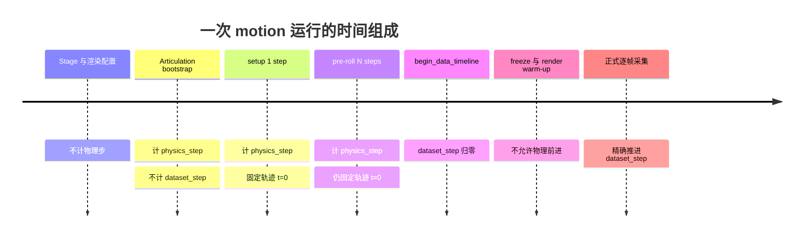

# 03 固定时间步与同步采集

## 1. 为什么时间同步是项目核心

如果仿真一边播放、渲染器一边积累子帧，就可能出现：

- 元数据在时刻 A 读取；
- RGB 在时刻 B 渲染；
- 语义分割在时刻 C 回调；
- 文件名却都叫同一个帧号。

肉眼看图往往发现不了这种错位，但它会破坏监督学习数据。项目的策略是：**只在离散、可计算的物理步上采样；采集期间冻结物理与 Timeline；用不可变上下文把所有输出绑定到同一状态。**

## 2. 四种时间/计数

### 2.1 `physics_step`

从 `WorldScheduler` 启动后实际执行过的物理步总数。Bootstrap、setup、pre-roll 和正式数据步都计入。

### 2.2 `simulation_time`

总仿真时间：

\[
t_{simulation}=\frac{physics\_step}{physics\_hz}
\]

它包含数据采集开始前的准备阶段。

### 2.3 `dataset_step` 与 `dataset_time`

建立数据集原点时记住当前总步数：

\[
dataset\_step=physics\_step-dataset\_origin\_step
\]

\[
t_{dataset}=\frac{dataset\_step}{physics\_hz}
\]

这使准备阶段可以真实推进物理，又不会让第 0 帧的“数据集时间”从一个随机正数开始。

### 2.4 `timeline_time`

Kit Timeline 的当前值。项目把它也写入元数据，并在采集前后检查不变。它与手工计数的 `simulation_time` 可能因准备阶段和运行时细节不同，不能拿一个字段代替另一个。

## 3. 帧号如何映射到物理步

`CaptureTiming` 要求：

```text
physics_hz > 0
capture_fps > 0
physics_hz % capture_fps == 0
```

每次采集之间的整数步数：

\[
steps\_per\_capture=\frac{physics\_hz}{capture\_fps}
\]

默认 `60 Hz / 10 FPS = 6` 步。

启用初始帧时：

\[
data\_step(frame)=frame\times 6
\]

\[
t_{dataset}(frame)=\frac{data\_step(frame)}{60}
\]

默认 50 帧的前后位置如下：

| frame_id | data_step | dataset_time | 与上一帧间隔 |
|---:|---:|---:|---:|
| 0 | 0 | 0.0 s | 0 步，直接采集初始状态 |
| 1 | 6 | 0.1 s | 6 步 |
| 2 | 12 | 0.2 s | 6 步 |
| 10 | 60 | 1.0 s | 6 步 |
| 49 | 294 | 4.9 s | 6 步 |

50 帧不是采到 5.0 秒，而是包含 t=0 后采到 t=4.9 秒。若想同时包含 t=5.0，需要 51 帧。

## 4. 三种采集时间策略

### 4.1 默认：捕获初始帧

`--capture-initial-frame` 下，第 0 帧位于 t=0：

```text
frame 0 -> 0.0 s
frame 1 -> 0.1 s
frame 2 -> 0.2 s
```

适合记录轨迹起点，也方便用帧号直接推导时间。

### 4.2 不捕获初始帧

`--no-capture-initial-frame` 会给帧号加一个时间间隔偏移：

\[
data\_step(frame)=(frame+1)\times steps\_per\_capture
\]

于是第 0 帧位于 t=0.1 秒。输出文件仍从 `0000` 命名，所以不能仅从文件名猜时间，必须读元数据。

### 4.3 静态模式

业务配置设为 `"capture_mode": "static"` 时，所有帧的 data step 都是 0。可以重复渲染同一状态来比较随机噪声、渲染配置或稳定性。验证器要求静态数据中刚体和相机矩阵都不能变化。

## 5. 一次运行的时间阶段



### 5.1 Bootstrap

Timeline 启动后，Articulation physics tensor 可能要过若干帧才 ready。`bootstrap_until()` 每执行一次 `SimulationApp.update()` 都同步增加 `_step_count`，避免出现“物理已经动了，但清单不知道”的隐形时间。

### 5.2 Setup step

适配器 ready 后，项目先把轨迹 t=0 的四个位置一次提交，再执行一个物理步并回读。这样正式第 0 帧看到的是引擎接受后的起始姿态，而不是资产文件里碰巧保存的姿态。

### 5.3 Pre-roll

Pre-roll 可让物理系统在正式采集前稳定，但每一步都反复命令轨迹 t=0，而不是提前播放轨迹。否则“预热”会偷偷消费轨迹时间。

### 5.4 Render warm-up

Warm-up 发生在世界冻结后，目的是建立渲染时间历史，与物理 pre-roll 完全不同。Writer 直到 warm-up 完成才 attach，因此预热更新不会生成数据文件。

## 6. 每个物理步的钩子顺序

`WorldScheduler.advance_exact_steps()` 的顺序是：

```python
next_time = self.next_dataset_time
self.update(next_time)
before_step_callback(next_time)
self.step()
after_step_callback(self.dataset_time)
```

对应关节系统：

```text
下一个数据集时间
    -> 插值并提交四关节位置
    -> PhysX 前进一步
    -> 回读四关节实际位置
    -> 计算 actual - commanded
    -> 检查误差容差
```

如果把命令放在 step 后面，当前图像将对应上一个命令；如果把回读放在 step 前面，记录的是引擎尚未接受命令的状态。这是项目中测试专门保护的顺序。

## 7. 冻结是一种采集事务

`freeze_for_capture()`：

1. 暂停 Timeline；
2. `commit()`；
3. 将状态改为 `FROZEN`；
4. 返回 `FrozenWorldSnapshot`。

快照只包含三个不可变值：

```json
{
  "physics_step": 123,
  "dataset_time": 1.2,
  "timeline_time": 2.05
}
```

`assert_still_frozen()` 不仅看状态枚举，还比较：

- 内部物理步计数是否完全相等；
- Timeline 时间是否在 `1e-9` 绝对容差内相等。

调用点位于相机 warm-up 后、每次采集前、每次采集后。这相当于给每帧建立“事务边界”。

## 8. `CaptureContext`：一帧的权威身份

冻结后，入口读取相机和运动状态，并构造不可变 `CaptureContext`：

```python
CaptureContext(
    frame_id=frame_id,
    dataset_time=expected_time,
    timeline_time=frozen_world.timeline_time,
    physics_step=frozen_world.physics_step,
    camera_path=camera_scheduler.camera_path,
    camera_world_transform=tuple(camera_state["world_transform"]),
    motion_state=motion_state,
)
```

对象构造时会拒绝负帧号、负数据集时间、负物理步、空相机路径和非 16 元素矩阵。因为 dataclass 是 `frozen=True`，进入 Writer 后不会被其他代码偷偷修改。

## 9. `CaptureLedger`：解决异步回调归属

Replicator 调用 Writer 时只给标注数据，不天然携带项目的 `frame_id`。项目使用线程安全 FIFO：

```text
arm(context 7) -> Writer 回调 -> consume() 得到 context 7
                -> schedule 文件 -> complete(receipt 7)
                -> require_completed(7)
```

账本会拒绝：

- 同一帧重复 arm；
- Writer 没有上下文却收到回调；
- 同一帧重复 complete；
- 采集器请求一个尚未完成的回执。

当前实现一次只进行一个阻塞式采集，因此 FIFO 足够可靠。如果以后改成并发多 RenderProduct 或异步批量采集，仅依赖 FIFO 可能不够，需要显式的请求 ID 关联协议。

## 10. 三处一致性校验

### 10.1 运行时即时校验

- `steps_to_advance` 不得为负；
- 实际 `dataset_time` 必须等于数学期望值；
- 采集前后世界冻结快照必须一致；
- Writer 必须完成当前 frame ID。

### 10.2 每帧双份记录

同一个 `CaptureContext` 被写进：

- `metadata/frame_XXXX.json`；
- `motion_state.jsonl` 对应行。

后者还增加 world 全状态、相机光学信息和文件回执。验证器会比较两处的时间与 physics step，防止文件串帧。

### 10.3 事后数据集校验

验证器重新使用 `CaptureTiming` 计算每帧应有时间，而不是相信输出中的时间字段。它还验证 motion 模式下刚体和车载相机真的发生了位姿变化。

## 11. 手算练习

给定：

```text
physics_hz = 120
capture_fps = 20
capture_initial_frame = false
```

则每帧间隔 6 步；frame 0 在第 6 个 data step，即 0.05 秒；frame 3 在第 24 个 data step，即 0.2 秒。

若 `physics_hz=60, capture_fps=24`，项目会在启动前拒绝，因为 60 不能整除 24。这样做牺牲了非整数采样频率的灵活性，但换来每帧都落在精确整数物理步上，不需要舍入和累积误差。

## 12. 本章结论

同步正确性建立在五层防线上：整数时间数学、固定步调度、步前/步后钩子、冻结事务、上下文与回执绑定。任意一层被绕过，都可能生成“文件齐全但标签错位”的危险数据。
