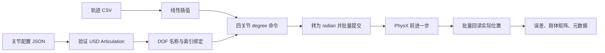

# 04 四关节运动系统

## 1. 从 CSV 到图像中的机械姿态

运动链路如下：



这里有三个独立契约：

1. **配置契约**：逻辑上的四个关节是什么；
2. **Stage 契约**：USD 中实际有哪些根、关节、刚体和限位；
3. **轨迹契约**：CSV 列顺序、时间和角度是否合法。

只有三者同时匹配，运动系统才会 bind。

## 2. 关节控制配置

默认文件 `configs/excavator_four_joint_articulation.json` 包含：

```json
{
  "schema_version": 1,
  "profile_name": "four_joint_fixed_base_excavator",
  "articulation_root_path": "/World/Joints/world_track_fixed_joint",
  "require_fixed_base": true,
  "forbid_angular_drives": true,
  "readback_tolerance_degrees": 0.05
}
```

每个关节都有：

- `logical_name`：CSV 和输出中使用的稳定名称；
- `candidate_names`：可接受的 USD Prim/DOF 名；
- `candidate_paths`：可接受的绝对 USD 路径；
- `safety_margin_degrees`：从 USD 原始上下限两端扣除的安全裕量。

候选名让同一种资产可以在不同层级路径中复用；候选路径用于消除同名 Prim 的歧义。如果路径和名称匹配出多个不同关节，验证器会报 `AMBIGUOUS_JOINT`，不会“随便选一个”。

`JointControlProfile.load()` 还会检查：

- 必须恰好四个关节；
- 逻辑名不能重复；
- 不同逻辑关节不能共享候选名或候选路径；
- 安全裕量必须有限且非负；
- `articulation_root_path` 若存在必须是绝对路径；
- 回读容差必须为正有限值。

## 3. USD Articulation 验证

`validate_articulation_stage()` 只读 Stage，不写属性、不应用 API、不推进时间。

### 3.1 根节点

若 profile 指定根路径，则该 Prim 必须有 `PhysicsArticulationRootAPI`。默认根被期望为一个 `PhysicsFixedJoint`，它的 `physics:body0` 必须唯一指向根刚体，且 `physics:jointEnabled` 为 true。

如果根是普通刚体，而配置要求 fixed base，会报 `FLOATING_ROOT`。

### 3.2 四个 RevoluteJoint

每个逻辑关节必须唯一解析为 `UsdPhysics.RevoluteJoint`，并满足：

- `physics:jointEnabled == true`；
- 没有 `PhysicsDriveAPI:angular`；
- `physics:body0` 和 `physics:body1` 各只有一个目标；
- lower/upper limit 存在且有限。

禁止 Angular Drive 的原因不是 Drive 本身不好，而是当前控制方式是 `articulation_direct_position`。两个控制源同时存在会使“commanded”含义不再唯一。

### 3.3 安全限位

假设 USD 原始关节限位是：

```text
lower = -30°
upper = 50°
safety_margin = 2°
```

项目真正允许轨迹使用的区间为：

```text
safe_lower = -30 + 2 = -28°
safe_upper =  50 - 2 =  48°
```

如果裕量使 `safe_lower >= safe_upper`，Stage 契约无效。实际安全限位来自 USD 运行时读取，不硬编码在 JSON 中，并会写进清单的 `joints` 与 `motion_control.binding`。

### 3.4 五刚体链

验证器从固定根的 root body 开始，按 profile 中的逻辑关节顺序检查：

```text
expected_parent == 当前关节 body0
下一个 expected_parent = 当前关节 body1
```

四个关节最终应得到五个刚体路径。重复 child 会报 `CHAIN_CYCLE`，父子顺序错误会报 `BROKEN_CHAIN`。

每个链上刚体还必须：

- 有 RigidBodyAPI 与 MassAPI；
- `rigidBodyEnabled == true`；
- `kinematicEnabled == false`；
- 质量为正；
- 三轴对角惯量均为正有限值。

## 4. 轨迹 CSV 契约

默认轨迹 `trajectories/excavator_motion_01.csv`：

```csv
time,cab,boom,small_arm,bucket
0.0,-2.4,-8.0,29.666664,-8.833334
1.25,17.6,7.0,9.666664,16.166666
2.5,-2.4,-8.0,29.666664,-8.833334
3.75,-22.4,-23.0,49.666664,-33.833334
5.0,-2.4,-8.0,29.666664,-8.833334
```

解析器要求：

- 表头必须**完全**等于 `time,cab,boom,small_arm,bucket`；
- 至少两个关键帧；
- 第一行时间必须是 0.0；
- 时间严格递增；
- 所有时间与角度必须有限；
- 每个关键帧都必须处于 Stage 的安全限位内。

文件内容还会计算 SHA-256，写入运行清单。

## 5. 线性插值如何工作

在相邻关键帧 \((t_0, q_0)\) 与 \((t_1, q_1)\) 之间：

\[
\alpha=\frac{t-t_0}{t_1-t_0}
\]

\[
q(t)=q_0+\alpha(q_1-q_0)
\]

例如默认轨迹 t=0.625 秒正好位于 0 与 1.25 秒中间，\(\alpha=0.5\)：

| 关节 | t=0 | t=1.25 | t=0.625 插值 |
|---|---:|---:|---:|
| cab | -2.4 | 17.6 | 7.6 |
| boom | -8.0 | 7.0 | -0.5 |
| small_arm | 29.666664 | 9.666664 | 19.666664 |
| bucket | -8.833334 | 16.166666 | 3.666666 |

代码用 `bisect_right()` 找到区间，复杂度比逐帧从头搜索更稳定。当前只接受 `interpolation=linear`。

## 6. `hold` 与 `loop`

### 6.1 Hold

超过轨迹时长后保持最后一个关键帧：

\[
t_{trajectory}=\min(t_{simulation}, duration)
\]

这是默认模式，适合录制器生成的不闭合动作。

### 6.2 Loop

用模运算循环：

\[
t_{trajectory}=t_{simulation}\bmod duration
\]

当时间正好落在正周期边界时，代码把它解释为上一个周期的末帧，避免在同一个采样点突然跳回 t=0。

Loop 还要求最后一帧四个角度与第一帧完全闭合。当前样本 CSV 满足这一条件，因此可在业务配置中设置 `"trajectory_mode": "loop"`。

## 7. Recorder metadata sidecar

关节配置定义可选 sidecar 后缀 `.metadata.json`。手写 CSV 没有 sidecar 也能使用；但只要 sidecar 存在，就必须合法，不能静默忽略。

被检查的字段包括：

- `completed` 必须为 true；
- `joint_order` 必须严格是 `cab, boom, small_arm, bucket`；
- `angle_unit` 必须是 `degree`；
- 若提供 `control_mode`，必须兼容 `articulation_direct_position`；
- 若提供 `profile` 且配置要求匹配，必须等于当前 profile name。

这防止把来自不同机械结构、不同角度单位或未完成录制的轨迹错误用于生产。

## 8. Articulation Adapter 生命周期

### 8.1 Bind：Timeline 播放前

`IsaacArticulationAdapter.bind()`：

1. 创建 Isaac Articulation wrapper；
2. 读取全部 `dof_names`；
3. 确认四个所需名称存在；
4. 一次查询对应索引；
5. 检查索引数量、唯一性和非负；
6. 全部成功后才发布绑定状态。

失败时不会留下“半绑定”对象。

### 8.2 Ready：Timeline 播放后

Wrapper 已存在不等于 physics tensor 已建立。`ready` 读取 `is_physics_tensor_entity_valid()`。入口启动 Timeline 后，用有界 bootstrap 最多等待默认 240 步。

### 8.3 Runtime validation

Tensor ready 后还要求 Articulation 的 `num_dofs` **恰好**等于四。当前项目不是“从大型机械中选择四个 DOF 控制”，而是一个严格四 DOF Articulation 契约。

### 8.4 批量写入

适配器把四个 degree 值转成形状为 `[1, 4]` 的 `float32` radian 数组，并执行：

```python
articulation.set_dof_positions(radians, dof_indices=indices)
articulation.set_dof_velocities(zeros, dof_indices=indices)
```

一次批量设置保证四个关节共享同一命令边界。速度同时清零，使直接位置播放不继承上一物理步的残余速度。

### 8.5 批量回读

物理步后读取相同索引，转回 degree。返回值会被展平并检查长度和有限性。

## 9. Commanded、Actual 与 Error

每个物理步后：

\[
error=name_{actual}-name_{commanded}
\]

默认允许绝对误差不超过 0.05°。超出会立即中止运行。每帧运动状态大致为：

```json
{
  "enabled": true,
  "control_mode": "articulation_direct_position",
  "simulation_time": 0.1,
  "trajectory_time": 0.1,
  "commanded_degrees": {"cab": -0.8, "boom": -6.8, "small_arm": 28.066664, "bucket": -6.833334},
  "actual_degrees": {"cab": -0.8, "boom": -6.8, "small_arm": 28.066664, "bucket": -6.833334},
  "position_error_degrees": {"cab": 0.0, "boom": 0.0, "small_arm": 0.0, "bucket": 0.0},
  "target_degrees": {"...": "与 commanded 相同的兼容字段"},
  "body_world_transform": {"...": "每个受控刚体的 4x4 矩阵"}
}
```

`target_degrees` 是 schema 迁移期间保留的旧字段，当前语义等于 `commanded_degrees`。新代码应优先使用 commanded/actual/error 三元组。

## 10. 相机父级与世界位姿

Camera 位于运动 Prim 下时，`UsdGeom.XformCache.GetLocalToWorldTransform()` 会把父级变换
组合进去；Camera 位于世界根层级时则可以保持固定。两种 Camera 都允许用于采集。

验证器对 motion 数据要求：

- 至少一个受控刚体世界矩阵发生变化；
- Camera 世界矩阵始终被记录，但允许保持固定或发生变化。

受控刚体矩阵检查仍用于证明关节数字变化已经传递到 Stage；Camera 是否移动不再参与
Articulation 正确性的判定。

## 11. 修改轨迹的安全流程

1. 复制 CSV 到新文件，不覆盖已用于生产的轨迹；
2. 保持列名和顺序完全一致；
3. 从 t=0 开始并严格递增；
4. 根据 `run_config.json -> joints` 或 Articulation 预检结果确认安全限位；
5. 若使用 loop，让首尾四个角度一致；
6. 先用少量帧、低分辨率和 `hold` 试跑；
7. 执行完整输出验证；
8. 若轨迹来自 Recorder，同时保留并验证 sidecar。

不要仅根据网格看起来“没有穿模”判断安全。配置使用的是物理关节角度和安全裕量，必须遵守数值契约。
