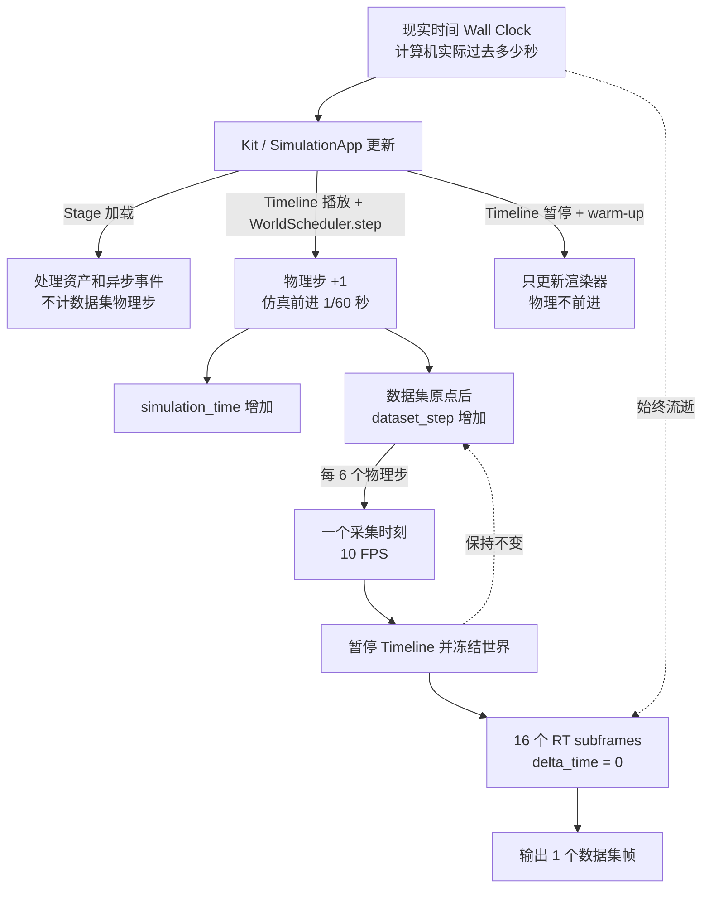

# KeyPoint 01：彻底理解本项目中的帧、时间与步长

# 第一部分：从现实时间到仿真时间

## 1. 学习目标

学完本部分，你应当能够准确解释：

1. Kit Timeline、物理步和渲染更新分别是什么；
2. 为什么一次 `SimulationApp.update()` 不一定等于一个物理步；
3. `physics_step`、`simulation_time`、`dataset_step`、`dataset_time`、`timeline_time` 的区别；
4. `capture_fps=10` 为什么不等于现实中每秒生成 10 张图片；
5. `rt_subframes=16` 为什么不是 16 个物理步；
6. bootstrap、setup、pre-roll、render warm-up 分别推进哪一种时间；
7. 默认第 49 帧为什么位于数据集时间 4.9 秒；
8. 为什么渲染花费几秒现实时间，数据集时间仍可保持不变。

相关源码：

- [`capture_timing.py`](../../capture_timing.py)：帧号、物理步与数据集时间的数学关系；
- [`world_scheduler.py`](../../world_scheduler.py)：Timeline、固定步、冻结与恢复；
- [`simulation_orchestrator.py`](../../simulation_orchestrator.py)：完整准备阶段和逐帧采集顺序；
- [`semantic_capture_custom.py`](../../semantic_capture_custom.py)：warm-up、RT subframes 与 Replicator；
- [`excavator_joint_motion.py`](../../excavator_joint_motion.py)：轨迹时间和物理步前后钩子；
- [`capture_context.py`](../../capture_context.py)：一张输出帧的权威时间上下文。

---

## 2. 核心结论：项目里不只有一条时间轴

最重要的一句话是：

> 现实世界过去多少秒、Kit Timeline 走到哪里、PhysX 执行多少步、数据集记录到几秒，以及渲染器计算多少次，是相互关联但不等价的事情。

本项目同时出现：

```text
现实时间 wall-clock time
Kit Timeline 时间 timeline_time
总物理步 physics_step
总仿真时间 simulation_time
数据集原点 dataset_origin_step
数据集物理步 dataset_step
数据集时间 dataset_time
轨迹采样时间 trajectory_time
数据集输出帧 frame_id
渲染预热帧 warmup render frame
渲染子帧 rt_subframe
轨迹关键帧 trajectory keyframe
Path Tracing 样本 SPP
```

可以先把系统看成三只钟：

1. **现实世界的钟**：计算机真正工作了多久；
2. **仿真世界的钟**：模型中的物理世界前进了多久；
3. **数据集的钟**：正式采集从自己的时间零点前进了多久。

渲染器则像一台可以在仿真时钟暂停时继续计算的相机。

---

## 3. 最初的三个概念

### 3.1 Timeline：Kit 的播放时间轴

Timeline 可以类比视频播放器的播放指针：

```text
play()   开始播放
pause()  暂停
stop()   停止
seek     跳转到某个时刻
```

项目初始化时会设置固定步，并把 Timeline 置于 0：

```python
settings.set("/app/player/useFixedTimeStepping", True)
self._timeline.set_looping(False)
self._timeline.set_current_time(0.0)
self._timeline.set_time_codes_per_second(float(self.physics_hz))
self._timeline.set_end_time(...)
self._timeline.commit()
```

默认 `physics_hz=60`，所以 Timeline 使用每秒 60 个 time codes。

Timeline 的职责是控制：

- 仿真是否处于播放状态；
- 当前播放指针在哪里；
- 依赖时间轴的系统是否允许继续更新。

Timeline 不是 PhysX 本身，它更像物理和动画系统上方的时间开关。

### 3.2 物理步：PhysX 更新一次世界状态

一个物理步是物理系统的一次离散更新。默认：

\[
physics\_dt=\frac{1}{physics\_hz}=\frac{1}{60}\text{ 秒}
\]

即一个物理步代表约：

```text
0.0166666667 个仿真秒
```

一个正式物理步的顺序是：

```text
计算下一步的数据集时间
        ↓
根据 CSV 轨迹插值四个关节目标
        ↓
在物理步前批量提交关节位置
        ↓
执行一次 SimulationApp.update()
        ↓
physics_step 加 1
        ↓
在物理步后回读 PhysX 接受的位置
        ↓
计算 actual - commanded 并检查误差
```

`WorldScheduler.step()` 的核心是：

```python
self._app.update()
self._step_count += 1
```

但是必须记住：

> 不是每次 `SimulationApp.update()` 都是物理步。只有 Timeline 正在播放，并由 `WorldScheduler.step()` 按固定步协议调用时，项目才把它计为物理步。

### 3.3 渲染更新：重新计算画面，不一定更新物理

渲染更新让 RTX、Hydra、Replicator 根据当前场景状态生成或积累图像。

Timeline 暂停时，物理状态保持不变，但渲染器仍可继续：

- 加载纹理；
- 更新渲染缓存；
- 建立时间历史；
- 执行降噪；
- 增加 Path Tracing 样本；
- 生成 RGB 与语义分割。

因此：

```text
物理步 = 让被观察的世界发生变化
渲染更新 = 对当前世界状态重新观察或拍摄
```

---

## 4. 一个冻结世界的直观例子

假设当前状态是：

```text
timeline_time = 1.000 秒
dataset_time = 0.800 秒
bucket 实际角度 = 10°
相机世界矩阵 = M
```

项目暂停 Timeline。随后计算机花费 3 秒现实时间执行 16 个渲染子帧：

```text
现实时间：经过 3 秒
timeline_time：仍为 1.000 秒
dataset_time：仍为 0.800 秒
physics_step：没有增加
bucket 角度：仍为 10°
相机矩阵：仍为 M
渲染器：完成 16 个子帧
数据集：最终生成 1 张 RGB 和一套语义标注
```

之后恢复 Timeline 并执行一个物理步：

```text
physics_step 增加 1
仿真时间增加 1/60 秒
dataset_time 增加 1/60 秒
关节接受下一时刻的插值位置
```

这就是“渲染更新不一定让物理世界前进”的完整含义。

---

## 5. 总体时间关系图



默认参数：

```text
physics_hz = 60
capture_fps = 10
steps_per_capture = 60 / 10 = 6
rt_subframes = 16
warmup_render_frames = 16
```

准确含义是：

> 物理世界每次前进 1/60 仿真秒；每隔 6 个物理步选择一个数据集时刻；到达该时刻后冻结世界，在同一状态上执行 16 个渲染子帧，最终生成一个数据集输出帧。

---

## 6. 现实时间 `wall-clock time`

现实时间是计算机外部的时间，也就是手表和系统时钟显示的时间。

例如：

```text
10:00:00 启动任务
10:03:20 任务完成
```

现实耗时为 200 秒。

它受到以下因素影响：

- GPU 和 CPU 性能；
- 场景规模；
- USD 与纹理加载速度；
- RealTimePathTracing 或 PathTracing；
- RT subframes；
- Path Tracing SPP；
- 磁盘写入；
- CUDA/OptiX 缓存是否已经建立。

现实时间不参与关节轨迹采样。同一组输入可能出现：

```text
机器 A：30 秒完成
机器 B：300 秒完成
```

但两边的 `frame_id`、`dataset_time`、`trajectory_time` 和关节命令仍可完全一致。

因此本项目首先追求**仿真时间确定性**，而不是现实时间实时性。

---

## 7. Timeline 时间 `timeline_time`

`timeline_time` 来自：

```python
self._timeline.get_current_time()
```

项目每次冻结时记录：

```python
FrozenWorldSnapshot(
    physics_step=self._step_count,
    dataset_time=self.dataset_time,
    timeline_time=float(self._timeline.get_current_time()),
)
```

采集前后会比较 Timeline 时间。如果它发生变化，项目会报：

```text
Timeline advanced during capture
```

它要防止：

```text
元数据在时刻 A 读取
渲染期间 Timeline 前进到时刻 B
RGB 和语义属于时刻 B
文件却仍使用时刻 A 的 frame_id
```

Timeline 时间通常包含播放后发生的 bootstrap、setup 和 pre-roll。建立数据集原点时，项目不会重置 Timeline，而是单独记录 `dataset_origin_step`。

因此：

> `timeline_time` 不是 `dataset_time` 的别名。

---

## 8. `physics_step`、`simulation_time`、`dataset_step`、`dataset_time`

### 8.1 总物理步 `physics_step`

`physics_step` 是 `WorldScheduler` 的 `_step_count`。它包含：

- Articulation bootstrap；
- setup step；
- pre-roll；
- 正式数据集物理步。

它不包含：

- Stage 加载时的普通更新；
- Timeline 冻结后的 render warm-up；
- RT subframes。

### 8.2 总仿真时间 `simulation_time`

\[
simulation\_time=\frac{physics\_step}{physics\_hz}
\]

默认 60 Hz 时，如果 `physics_step=22`：

\[
simulation\_time=\frac{22}{60}\approx0.366667\text{ 秒}
\]

它包含正式采集前的准备物理过程。

### 8.3 数据集原点 `dataset_origin_step`

准备完成后调用：

```python
world_scheduler.begin_data_timeline()
```

内部记录：

```python
self._dataset_origin_step = self._step_count
```

假设此时已经执行 10 个准备物理步：

```text
physics_step = 10
dataset_origin_step = 10
```

数据集自己的时间从此处归零。

### 8.4 数据集物理步 `dataset_step`

\[
dataset\_step=physics\_step-dataset\_origin\_step
\]

如果当前 `physics_step=16`、原点为 10：

```text
dataset_step = 16 - 10 = 6
```

### 8.5 数据集时间 `dataset_time`

\[
dataset\_time=\frac{dataset\_step}{physics\_hz}
\]

默认 60 Hz、`dataset_step=6`：

\[
dataset\_time=\frac{6}{60}=0.1\text{ 秒}
\]

它是数据集消费者最应关注的时间，表示当前 RGB、语义、相机状态和关节状态属于数据集中的哪个时刻。

### 8.6 数值对照

假设准备阶段用了 10 步，正式数据阶段又走了 6 步：

| 概念 | 示例值 | 说明 |
|---|---:|---|
| 现实耗时 | 可能 20 秒 | 由硬件决定 |
| `physics_step` | 16 | 准备 10 步 + 数据 6 步 |
| `simulation_time` | 16/60 ≈ 0.266667 s | 包含准备阶段 |
| `dataset_origin_step` | 10 | 数据集零点 |
| `dataset_step` | 6 | 正式数据物理步 |
| `dataset_time` | 0.1 s | 当前数据集时刻 |

---

## 9. 轨迹时间 `trajectory_time`

项目根据 `dataset_time` 对 CSV 轨迹采样，然后应用 `hold` 或 `loop` 规则。

### 9.1 Hold 模式

\[
trajectory\_time=\min(dataset\_time, trajectory\_duration)
\]

轨迹结束后保持最后姿态。默认轨迹长 5 秒，如果 `dataset_time=6.25`：

```text
trajectory_time = 5.0
```

### 9.2 Loop 模式

\[
trajectory\_time=dataset\_time\bmod trajectory\_duration
\]

轨迹长 5 秒、`dataset_time=6.25` 时：

```text
trajectory_time = 1.25
```

正好位于周期边界时，项目会采样上一周期末端。例如 t=5.0 取轨迹末帧，而不是立即跳回 t=0。

### 9.3 时间字段完整对照

| 名称 | 表示什么 | 是否包含准备阶段 | 冻结采集时是否前进 |
|---|---|---:|---:|
| 现实时间 | 计算机实际过去多久 | 是 | 是 |
| `timeline_time` | Kit Timeline 播放位置 | 通常是 | 否 |
| `physics_step` | 总计数物理步 | 是 | 否 |
| `simulation_time` | 总物理步对应时间 | 是 | 否 |
| `dataset_step` | 数据集原点后的物理步 | 否 | 否 |
| `dataset_time` | 数据集权威时间 | 否 | 否 |
| `trajectory_time` | hold/loop 后的轨迹位置 | 否 | 否 |

---

## 10. 项目中所有“帧”的概念

### 10.1 物理帧、物理步

PhysX 更新一次世界状态。默认每步代表 1/60 仿真秒。

它会改变：

- 刚体状态；
- 关节实际位置；
- `physics_step`；
- `simulation_time`；
- 数据集原点后的 `dataset_step` 和 `dataset_time`。

### 10.2 Kit/Application update frame

`simulation_app.update()` 是让 Kit 主循环工作一次。它可以处理加载、物理、UI、渲染和异步事件，不天然具有固定的物理含义。

| 调用阶段 | Timeline | 主要用途 | 是否计为物理步 |
|---|---|---|---:|
| Stage 加载 | 未正式调度 | 资产和异步组合 | 否 |
| `WorldScheduler.step()` | Playing | 固定物理步 | 是 |
| Render warm-up | Paused | 预热渲染器 | 否 |
| Replicator capture | Paused | 生成正式图像 | 否 |

因此 Application update 是外层事件循环，物理步只是它在特定状态下触发的一类工作。

### 10.3 数据集帧、采集帧 `frame_id`

一个数据集帧对应一整套相同帧号的输出：

```text
rgb/rgb_XXXX.png
semantic_id/semantic_id_XXXX.npy
semantic_color/semantic_color_XXXX.png
semantic_runtime_id/semantic_runtime_id_XXXX.npy
metadata/frame_XXXX.json
motion_state.jsonl 中的一行
```

默认 `capture_fps=10` 的准确含义是：

> 每一秒数据集时间安排 10 个输出采样点。

它不表示现实中每秒必须生成 10 张图片。

### 10.4 Render warm-up frame

默认：

```text
warmup_render_frames = 16
```

相机调度器在世界冻结后执行：

```python
for _ in range(render_frame_count):
    self._app.update()
```

这些更新：

- 不推进物理；
- 不推进 Timeline；
- 不推进数据集时间；
- 不分配正式 `frame_id`；
- 不生成正式文件；
- 发生在 Writer attach 之前。

它们用于建立渲染缓存、时间历史和降噪状态。可以类比正式录像前先让相机曝光和降噪系统稳定，但尚未按下录制键。

### 10.5 RT subframe，渲染子帧

默认实时 profile 使用：

```text
rt_subframes = 16
```

每张正式输出调用：

```python
rep.orchestrator.step(
    rt_subframes=16,
    delta_time=0.0,
    pause_timeline=False,
)
```

调用前 Timeline 已暂停，`delta_time=0.0` 又明确要求不推进时间。因此：

```text
1 个数据集输出帧
    └─ 1 次 Replicator capture
          └─ 16 个 RT subframes
                └─ 输出 1 张 RGB 和一套语义数据
```

RT subframe 不是：

- 物理步；
- 数据集帧；
- 轨迹关键帧；
- 固定的 1/60 秒；
- 固定长度的现实时间。

它是渲染器在同一个冻结世界状态上的内部采样/更新单位。

### 10.6 Path Tracing sample（SPP）

Path Tracing profile 中：

```text
spp_per_render_frame = 8
rt_subframes = 8
nominal_spp_per_output = 8 × 8 = 64
```

SPP 是每像素光线路径采样数，是画质与计算量概念，不是仿真时间。提高 SPP 通常增加现实耗时，但不会让挖掘机多运动。

### 10.7 轨迹关键帧

CSV 中每一行是一个关键帧：

```csv
time,cab,boom,small_arm,bucket
0.0,-2.4,-8.0,29.666664,-8.833334
1.25,17.6,7.0,9.666664,16.166666
2.5,-2.4,-8.0,29.666664,-8.833334
```

关键帧只是稀疏控制点，不等于物理帧或输出帧。从 t=0 到 t=1.25 有：

\[
1.25\times60=75
\]

个物理时间间隔。CSV 只给出两端，项目为中间物理步计算线性插值。

---

## 11. 准备阶段的特殊物理步

### 11.1 Bootstrap steps

Timeline 启动后，Articulation wrapper 已创建，但 physics tensor 可能尚未 ready。项目反复执行：

```text
检查 tensor
未 ready -> 执行一个物理步
再次检查
直到 ready 或达到超时
```

这些步骤：

- 是真实物理步；
- 增加 `physics_step` 和 `simulation_time`；
- 发生在数据集原点前；
- 不进入最终 `dataset_time`。

### 11.2 Setup step

Tensor ready 后：

```text
提交轨迹 t=0 的四关节位置
        ↓
执行一个物理步
        ↓
回读实际位置
```

因此 motion schema 要求：

```text
setup_steps = 1
```

### 11.3 Pre-roll steps

`--pre-roll-steps 30` 表示正式采集前执行 30 个物理步。每一步都保持轨迹 t=0 姿态，不提前消费轨迹时间。

作用是预热和稳定物理系统。

### 11.4 准备阶段对照

| 阶段 | 执行物理 | 更新渲染 | 增加 `physics_step` | 增加 `dataset_time` |
|---|---:|---:|---:|---:|
| Bootstrap | 是 | 可能伴随 | 是 | 否 |
| Setup | 是 | 可能伴随 | 是 | 否 |
| Pre-roll | 是 | 可能伴随 | 是 | 否 |
| Render warm-up | 否 | 是 | 否 | 否 |
| 正式 data step | 是 | 可能伴随 | 是 | 是 |
| RT subframe | 否 | 是 | 否 | 否 |

记忆方法：

```text
pre-roll 预热物理世界
render warm-up 预热相机和渲染器
```

---

## 12. 帧号如何映射到数据集时间

`CaptureTiming` 要求：

```text
physics_hz > 0
capture_fps > 0
physics_hz % capture_fps == 0
```

默认：

\[
steps\_per\_capture=\frac{60}{10}=6
\]

### 12.1 捕获初始帧

默认启用 `--capture-initial-frame`：

\[
data\_step(frame\_id)=frame\_id\times6
\]

\[
dataset\_time(frame\_id)=\frac{frame\_id\times6}{60}=\frac{frame\_id}{10}
\]

| `frame_id` | `data_step` | `dataset_time` |
|---:|---:|---:|
| 0 | 0 | 0.0 s |
| 1 | 6 | 0.1 s |
| 2 | 12 | 0.2 s |
| 3 | 18 | 0.3 s |
| 10 | 60 | 1.0 s |
| 49 | 294 | 4.9 s |

50 个帧号是 0～49。第 0 帧已经占用 t=0，因此第 49 帧位于 4.9 秒。要同时采到 t=5.0，需要 `frame_id=50`，即总共 51 帧。

### 12.2 不捕获初始帧

使用 `--no-capture-initial-frame` 时：

\[
data\_step(frame\_id)=(frame\_id+1)\times6
\]

| `frame_id` | `data_step` | `dataset_time` |
|---:|---:|---:|
| 0 | 6 | 0.1 s |
| 1 | 12 | 0.2 s |
| 49 | 300 | 5.0 s |

文件仍从 `rgb_0000.png` 开始，但它已经对应 0.1 秒。正式处理必须读取 metadata，不能只根据文件名猜时间。

### 12.3 Static 模式

`--capture-mode static` 时，所有帧：

```text
data_step = 0
dataset_time = 0
```

系统重复渲染同一状态，可用于分析渲染噪声和配置差异。验证器会要求相机和刚体矩阵均不变化。

---

## 13. 一张正式输出帧的完整生命周期

以默认 `frame_id=1` 为例。第 0 帧已经在 `dataset_time=0` 完成。

### 13.1 推进到目标时刻

```text
target_data_step = 6
expected_dataset_time = 0.1 秒
```

项目恢复 Timeline，并执行：

```text
物理步 1：命令并回读 t=1/60
物理步 2：命令并回读 t=2/60
物理步 3：命令并回读 t=3/60
物理步 4：命令并回读 t=4/60
物理步 5：命令并回读 t=5/60
物理步 6：命令并回读 t=6/60=0.1
```

### 13.2 冻结世界

到达 0.1 秒后：

```python
frozen_world = world_scheduler.freeze_for_capture()
```

冻结快照记录三个值：

```text
physics_step
dataset_time
timeline_time
```

### 13.3 读取权威状态

冻结后才读取：

- 相机世界矩阵；
- 相机光学属性；
- 四个关节 commanded 值；
- 四个关节 actual 值；
- 位置误差；
- 受控刚体世界矩阵。

### 13.4 构造不可变帧上下文

```python
CaptureContext(
    frame_id=1,
    dataset_time=0.1,
    timeline_time=frozen_world.timeline_time,
    physics_step=frozen_world.physics_step,
    camera_path=...,
    camera_world_transform=...,
    motion_state=...,
)
```

这个对象是本帧文件和元数据的权威身份。

### 13.5 执行渲染子帧

上下文先进入 Writer Ledger，随后执行 16 个 RT subframes。它们共享同一个：

```text
frame_id = 1
dataset_time = 0.1
physics_step = 固定值
camera matrix = 固定值
joint actual = 固定值
```

### 13.6 等待写盘并再次验证冻结

Writer 保存 RGB、语义和 metadata。完成后入口重新检查：

```text
physics_step 是否改变
timeline_time 是否改变
WorldState 是否仍为 FROZEN
```

若发生变化，本次运行会失败，而不是继续生产状态错位的数据。

完整时序：

```text
dataset time
0.000                                  0.100
  │                                      │
  ├─物理步1─物理步2─3─4─5─物理步6────────┤
                                         │
                                         ├─暂停 Timeline
                                         ├─读取相机和关节
                                         ├─建立 CaptureContext
                                         ├─RT subframe 1
                                         ├─RT subframe 2
                                         ├─……
                                         ├─RT subframe 16
                                         ├─写出 frame 0001
                                         └─确认世界没有前进
```

---

## 14. 与现实摄像机比较

### 14.1 现实世界中的 10 FPS

现实挖掘机连续运动，摄像机 10 FPS：

```text
现实 t=0.0 秒：拍第 0 张
现实 t=0.1 秒：拍第 1 张
现实 t=0.2 秒：拍第 2 张
```

现实机械、摄像机和手表通常共享一条无法随意暂停的时间轴。图像处理再慢，挖掘机也不会自动停下来等它。

### 14.2 本项目中的 10 FPS

```text
仿真 t=0.0 秒：冻结并计算第 0 张
仿真 t=0.1 秒：冻结并计算第 1 张
仿真 t=0.2 秒：冻结并计算第 2 张
```

每到一个采样点，仿真世界都可以暂停，计算机可花任意现实时间完成渲染。

假设每张图需要 3 秒现实计算时间，可能出现：

| 输出帧 | 数据集时间 | 假设的现实完成时刻 |
|---:|---:|---:|
| 0 | 0.0 s | 启动后 8 s |
| 1 | 0.1 s | 启动后 11 s |
| 2 | 0.2 s | 启动后 14 s |
| 49 | 4.9 s | 启动后 155 s |

现实时间只是示例。即使计算机花了 155 秒，数据集描述的仍是挖掘机 0～4.9 仿真秒的运动。

### 14.3 最接近的现实类比

本项目接近停止动画摄影：

1. 把机械移动到精确姿态；
2. 完全停止机械；
3. 相机对当前姿态多次采样和降噪；
4. 得到一张正式图片；
5. 再移动到下一个姿态。

RT subframes 可类比同一姿态上的多次采样，但不能完全等同于现实长曝光，因为项目使用 `delta_time=0` 且 Timeline 暂停，子帧之间没有机械运动。

---

## 15. 固定时间步不等于实时运行

固定时间步表示：

```text
每次物理更新都代表相同的 1/60 仿真秒
```

实时运行表示：

```text
1 个仿真秒恰好使用 1 个现实秒完成
```

两者完全不同。本项目要求固定步和确定性，不要求实时：

```text
60 个物理步 = 1 个仿真秒
```

但现实中执行这 60 步可能花 0.2 秒、1 秒、5 秒或更久。每隔 6 步还要冻结并阻塞渲染，所以现实总耗时通常远大于数据集时间。

---

## 16. 输出文件中如何观察这些时间

每帧 metadata 记录：

```json
{
  "frame_id": 1,
  "dataset_time": 0.1,
  "timeline_time": 0.2666666667,
  "physics_step": 16,
  "camera": {
    "path": "...",
    "world_transform": ["16 个矩阵元素"]
  },
  "motion": {
    "trajectory_time": 0.1,
    "commanded_degrees": {},
    "actual_degrees": {},
    "position_error_degrees": {}
  }
}
```

上述数值只用于说明字段关系，不代表实际 bootstrap 一定使用了 10 步。

`motion_state.jsonl` 顶层还记录：

```text
simulation_time
world.physics_step
world.dataset_origin_step
world.dataset_step
world.dataset_time
world.timeline_time
```

特别注意：

- 顶层 `simulation_time` 来自 `WorldScheduler`，包含准备物理步；
- `motion.simulation_time` 在当前实现中传入的是该帧期望的数据集时间，应结合 `motion.trajectory_time` 理解；
- 最权威的数据集采样时间是上下文顶层的 `dataset_time`。

独立验证器会重新计算每帧应有的时间，并比较 metadata 与 `motion_state.jsonl` 中的 physics step 和 timeline time。

---

## 17. 四个最常见的误解

### 误解一：`capture_fps=10` 表示现实每秒输出 10 张图

错误。它表示每一秒 `dataset_time` 安排 10 个采样点。现实吞吐量可能每秒几张，也可能几十秒一张。

### 误解二：`rt_subframes=16` 表示执行了 16 个物理步

错误。它们发生在世界冻结后：

```text
physics_step 不变
dataset_time 不变
timeline_time 不变
```

### 误解三：每次 `SimulationApp.update()` 都是物理步

错误。Stage 加载和 render warm-up 也调用 `update()`，但不计入项目物理步。

### 误解四：Timeline 时间就是数据集时间

错误。Timeline 可以包含 bootstrap、setup 和 pre-roll；数据集时间在这些阶段后单独建立原点。

---

## 18. 最终速记表

| 概念 | 一句话解释 | 默认数量/步长 | 推进物理吗 |
|---|---|---:|---:|
| 现实时间 | 计算机真正运行多久 | 不固定 | 不直接决定 |
| Timeline | Kit 播放指针和状态 | 60 time codes/s | 播放时允许 |
| 物理步 | PhysX 更新一次世界 | 1/60 仿真秒 | 是 |
| `physics_step` | 总计数物理步 | 每步 +1 | 是 |
| `simulation_time` | 总物理步对应时间 | step/60 | 是 |
| `dataset_step` | 数据集零点后的物理步 | 正式步 +1 | 是 |
| `dataset_time` | 数据集权威时刻 | dataset step/60 | 是 |
| `frame_id` | 输出数据集帧编号 | 默认 0～49 | 否 |
| 采集间隔 | 两个输出帧之间的物理步 | 6 步 | 是 |
| Warm-up frame | 正式写盘前预热渲染 | 默认 16 | 否 |
| RT subframe | 单张输出内部渲染采样 | 默认 16 | 否 |
| 轨迹关键帧 | CSV 中的稀疏姿态点 | 0、1.25、2.5… | 否 |
| SPP | 每像素光线采样数量 | profile 决定 | 否 |

---

## 19. 本部分总结

默认运行可浓缩为：

\[
physics\_dt=\frac{1}{60}\text{ 秒}
\]

\[
steps\_per\_capture=\frac{60}{10}=6
\]

捕获初始帧时，第 \(n\) 张输出图：

\[
dataset\_step(n)=6n
\]

\[
dataset\_time(n)=\frac{6n}{60}=\frac{n}{10}
\]

到达该时刻后：

```text
暂停 Timeline
冻结 PhysX 世界状态
读取相机与关节实际状态
建立不可变 CaptureContext
执行 16 个 RT subframes
输出 1 个数据集帧
验证 Timeline 和 physics_step 均未变化
```

现实计算时间没有进入这些公式。

最终应牢牢记住：

> 本项目的 60 Hz 描述物理世界如何离散前进；10 FPS 描述数据集在仿真时间上如何采样；16 RT subframes 描述每个冻结采样点上渲染器计算多少次；现实时间只决定任务多久完成，不决定挖掘机在数据集中运动到哪里。

