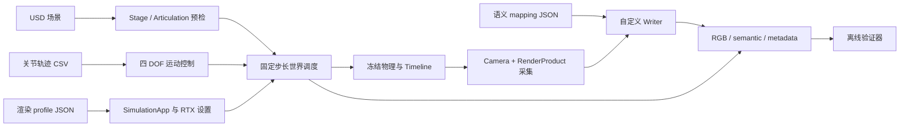
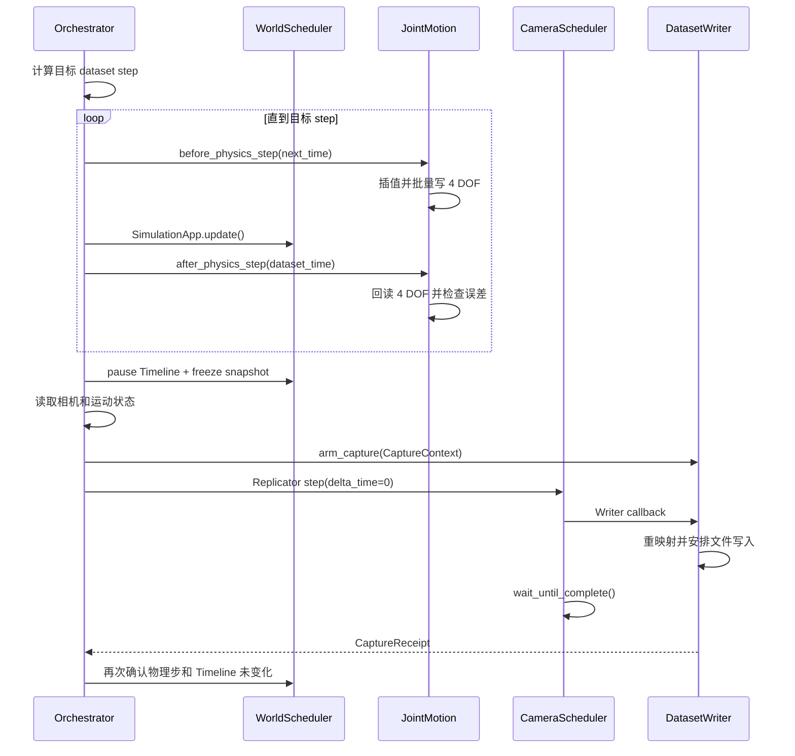

# Isaac Sim 语义世界模块完整学习笔记

> 适用版本：2026-07-23 当前代码，`run_config.json` schema v4。
>
> 本文已将旧版“给 Angular Drive 写目标角”的说明更新为当前的
> `Articulation` 四 DOF 直接位置控制。阅读时以当前源码和测试为准。

## 0. 先建立一个正确的心智模型

这个项目是一条“确定性仿真合成数据生产线”。输入是 USD 场景、关节轨迹、语义类别表、
渲染配置和采集参数；输出是同步的 RGB、语义分割、相机状态、关节状态和可审计清单。

最简化的数据流是：



一句话记忆主循环：

> 先算目标时刻，再在每个物理步前写关节、步后读关节；到采集点暂停世界，锁定一帧的
> `CaptureContext`，完成 Replicator 写盘后才继续物理。

项目最看重“正确性和可追溯性”，不是极限吞吐量。它故意逐帧阻塞等待 Writer 完成，
用速度换取图像与状态一一对应。

---

## 1. 零基础必备概念

### 1.1 USD、Stage、Prim 和 overlay

- **USD**：描述场景层级、几何、材质、相机、物理属性等的数据格式。
- **Stage**：多个 USD layer 组合后得到的完整场景视图。
- **Prim**：Stage 树上的节点，例如相机、网格、刚体或关节。
- **Prim path**：Prim 的绝对路径，例如 `/root/Xform/operator_cab_mesh/Camera_01`。
- **overlay**：很薄的覆盖层。它通过 `subLayers` 引用原场景，只覆盖少量属性，而不复制
  整个资产。

默认 `configs/Sim_Fangshan_07_capture_overlay.usda` 只引用远端原场景：

```usda
#usda 1.0
(
    subLayers = [
        @/root/gpufree-data/wyb/StageMaterial02/Sim_Fangshan_07.usda@
    ]
)
```

好处是修改小、资产职责清晰；代价是该绝对 Linux 路径必须真实存在。把项目拷到另一台
机器，并不会自动带走底层场景和纹理。

### 1.2 Articulation、刚体、关节和 DOF

**Articulation** 是一组由关节连接的刚体系统。这里的挖掘机是固定底座加 4 个旋转自由度：

1. `cab`：驾驶室/平台回转；
2. `boom`：大臂；
3. `small_arm`：小臂；
4. `bucket`：铲斗。

逻辑名称是数据和轨迹层的稳定名称；USD 里的真实 DOF 名称分别来自配置中的
`candidate_names`。`articulation_stage_validator.py` 负责发现并确认它们，
`articulation_adapter.py` 再把 DOF 名称一次性绑定成索引。

### 1.3 Timeline、物理步和渲染帧

三者不是一回事：

- **Timeline** 决定场景播放时间；
- **物理步** 推进刚体和关节模拟；
- **渲染帧** 让 RTX/Hydra 更新图像，可以在物理暂停时继续发生。

这一区分是项目正确性的根基。预热和 `rt_subframes` 会产生渲染更新，但不应推进数据集
物理时间；采集时也使用 `delta_time=0.0`。

### 1.4 Replicator、RenderProduct、Annotator 和 Writer

- **Replicator**：Isaac Sim 中的合成数据生成框架。
- **RenderProduct**：某一台相机和某一分辨率对应的渲染输出。
- **Annotator**：从 RenderProduct 取得一种数据，本项目使用 `rgb` 和
  `semantic_segmentation`。
- **Writer**：接收 Annotator 数据，转换格式并写盘。

本项目不用通用 Writer 直接保存所有内容，而是实现 `SemanticDatasetWriter`，以便把临时
runtime ID 转成稳定 dataset ID，并严格绑定帧上下文。

### 1.5 语义分割中的两种 ID

- **runtime ID**：Isaac/Replicator 在本次运行中分配的实例值，可能随运行和场景组合变化。
- **dataset ID**：项目 mapping 文件固定定义的训练标签，例如背景 0、某类别 1～10。

训练数据必须使用 dataset ID；runtime ID 只作为诊断和追溯信息保存。

---

## 2. 项目文件地图

### 2.1 运行时主模块

| 文件 | 职责 | 是否依赖 Isaac 运行时 |
|---|---|---|
| `simulation_orchestrator.py` | 参数、生命周期、预检、调度和总清单 | 部分；先解析纯配置，后启动 Isaac |
| `world_scheduler.py` | 固定时间步、Timeline、冻结/恢复、bootstrap | 是，导入 `carb`、`omni.timeline` |
| `semantic_capture_custom.py` | 相机、RenderProduct、预热、Writer、逐帧 capture | 是 |
| `semantic_dataset_writer.py` | RGB/语义/metadata 落盘 | 是，使用 Replicator API |
| `articulation_stage_validator.py` | 只读检查固定底座四关节链 | 调用检查函数时才需要 `pxr` |
| `articulation_adapter.py` | 名称绑定、度/弧度转换、批量读写 DOF | 默认工厂运行时才导入 Isaac |
| `excavator_joint_motion.py` | CSV、插值、安全限位、命令、回读和误差 | 运动执行依赖 Stage/Adapter |

### 2.2 可在普通 Python 中重点学习的模块

| 文件 | 主要知识点 |
|---|---|
| `capture_timing.py` | 帧号、物理步和时间的纯数学关系 |
| `capture_context.py` | 不可变帧上下文、线程安全 FIFO、完成回执 |
| `semantic_mapping.py` | 标签规范化、runtime ID 重映射、颜色 LUT |
| `joint_control_profile.py` | 版本化 JSON 契约、sidecar 校验、文件哈希 |
| `render_profile.py` | 渲染配置 schema、互斥约束、设置回读 |
| `compare_render_quality.py` | MAE、RMSE、PSNR、全局 SSIM、锐度等指标 |
| `validate_semantic_output.py` | 输出数据集的离线一致性验证 |

### 2.3 数据和配置

- `configs/capture_motion_camera02.json`：一次采集任务的完整业务启动配置。
- `configs/excavator_four_joint_articulation.json`：四关节控制契约。
- `configs/render_realtime_pathtracing_720p.json`：默认实时路径追踪配置。
- `configs/render_pathtracing_720p_64spp.json`：高质量 Path Tracing 配置。
- `configs/render_quality_dlss_720p.json`：schema v1 历史配置，仅用于复现。
- `configs/semantic_mapping_*.json`：场景对应的稳定语义类别。
- `trajectories/excavator_motion_01.csv`：默认关节关键帧。
- `tests/`：普通 Python 单元测试，是理解契约的可执行说明书。

---

## 3. 完整运行链路：从命令到一帧数据

`simulation_orchestrator.py:main()` 是唯一需要先掌握的入口。它的执行顺序如下。

### 3.1 Isaac 启动前：纯 Python 阶段

1. `parse_args()` 严格解析唯一的 `--config` 业务选项，拒绝其他参数。
2. `CaptureLaunchConfig.load()` 校验完整业务 JSON 的 schema、字段、类型与枚举。
3. 配置内相对路径统一解释为“相对业务配置文件所在目录”。
4. 加载 `RenderProfile`，应用 `rt_subframes` 和预热帧覆盖值。
5. 校验配置中的 renderer 与 profile 的 renderer 一致，冲突直接报错。
6. 加载 `JointControlProfile`。
7. 若轨迹旁存在 `<stem>.metadata.json`，严格校验 Recorder sidecar。
8. `CaptureTiming` 校验频率并建立帧时间映射。
9. 检查输出目录。目录非空且配置中的 `overwrite` 为 false 时拒绝启动。
10. 先原子写入状态为 `running` 的 `run_config.json`。

“先写 running 清单”很重要：即使后面 GPU 初始化失败，目录中仍会留下失败原因和输入
配置，而不是一个无法解释的半成品目录。

### 3.2 创建 SimulationApp 后

只有在 `SimulationApp(...)` 创建之后，代码才导入 `omni.usd`、Replicator、Isaac
Articulation 等运行时模块。Isaac/Kit 会在应用启动时注册扩展和插件；过早导入容易出现
模块不可用或扩展未初始化。

接着执行：

1. 异步打开 USD；
2. 反复 `simulation_app.update()`，直到 Stage composition 完成；
3. `reset_render_settings()`，再应用 profile 的 Carb 设置；
4. 逐项读取 effective value；必需项与 requested value 不一致就停止；
5. 解析相机路径；
6. 执行通用 Stage preflight；
7. 动态模式额外执行 Articulation preflight；
8. 把报告写回 `run_config.json`。

### 3.3 建立运动与时间轴

1. 创建并初始化 `WorldScheduler`；
2. 创建 `ExcavatorJointMotion`；
3. Timeline 播放前调用 `bind()`，完成稳定的 DOF 名称到索引绑定；
4. 启动 Timeline；
5. `bootstrap_until()` 逐物理步等待 Articulation tensor ready；
6. `initialize_runtime()` 做运行时 DOF 数量/ready 校验并第一次回读；
7. 用 1 个计数 setup step 写入并接受轨迹 `t=0` 初始姿态；
8. 可选执行 pre-roll，期间一直保持初始姿态；
9. `begin_data_timeline()` 把当前位置设成数据集时间原点；
10. 暂停 Timeline，取得 `FrozenWorldSnapshot`。

bootstrap、setup、pre-roll 都记入总物理步和 `simulation_time`，但发生在数据集原点之前，
所以 `dataset_time` 可以从 0 开始。这避免初始化过程污染训练数据时间轴。

### 3.4 建立相机采集链

1. 校验配置中的 `camera_prim_path` 指向存在的 `UsdGeom.Camera`；
2. 检查 Stage 至少有一个 `SemanticsLabelsAPI`；
3. 关闭 capture-on-play；
4. 创建一个贯穿整次运行的 RenderProduct；
5. 保持 Hydra texture 更新；
6. 在世界冻结状态做渲染预热；
7. 预热后再 attach Writer，避免把预热帧误保存为数据帧。

### 3.5 每个数据帧的严格顺序



任何环节失败，`except` 都会把清单改成 `failed` 并记录异常类型和信息；`finally` 依次停止
世界、关闭相机/Writer、释放运动 adapter、关闭 SimulationApp。

---

## 4. 四种时间必须分清

项目同时记录四种时间：

| 名称 | 含义 | 是否包含初始化步 |
|---|---|---|
| `simulation_time` | 从 WorldScheduler 启动后累计的物理时间 | 是 |
| `dataset_time` | 从 `begin_data_timeline()` 起算的训练数据时间 | 否 |
| `timeline_time` | Isaac Timeline 接口实际报告的时间 | 会受 bootstrap/pre-roll 影响 |
| `trajectory_time` | 轨迹在 loop/hold 规则下采样的时间 | 由 `dataset_time` 映射 |

### 4.1 60 Hz 物理与 10 FPS 采集

`CaptureTiming` 要求：

```text
physics_hz % capture_fps == 0
steps_per_capture = physics_hz // capture_fps
```

默认值给出：

```text
steps_per_capture = 60 // 10 = 6
```

启用默认 `capture_initial_frame=True` 时：

| frame_id | dataset_step | dataset_time |
|---:|---:|---:|
| 0 | 0 | 0.0 s |
| 1 | 6 | 0.1 s |
| 2 | 12 | 0.2 s |
| 3 | 18 | 0.3 s |

禁用首帧后，帧 0 才会落在 step 6、`t=0.1 s`，这是保留的旧行为。

### 4.2 静态模式

`capture_mode=static` 时，所有帧的目标 dataset step 都是 0。物理世界始终冻结，多帧主要
用于相同状态下的渲染稳定性、GUI/脚本对比或诊断，不代表时间序列。

### 4.3 为什么只支持整除频率

整除时每次采集之间恰好是固定整数物理步，不需要累计浮点误差，也不需要交替使用 5 步、
6 步等节奏。若要支持 60 Hz 对 7 FPS，不能只删掉校验；应实现整数相位累加器或基于
有理数的目标步调度，并新增长期漂移测试。

### 4.4 冻结为何如此严格

调用 `freeze_for_capture()` 后，代码保存：

- 物理步号；
- dataset time；
- Timeline time。

采集前后 `assert_still_frozen()` 会验证它们没有变化。这样 `rt_subframes=16` 即使进行了
多次 RTX 更新，也只能改善同一世界状态的渲染，不能偷偷让挖掘机前进 16 个物理步。

---

## 5. 当前运动控制：四 DOF 直接位置写入

### 5.1 为什么旧版 Drive 说明已经失效

旧实现思路是给 USD 关节的 `PhysicsDriveAPI:angular` 写 `targetPosition`。当前版本明确采用
`articulation_direct_position`：通过 Isaac Articulation API 批量写 DOF 位置。因此静态
预检把 Angular Drive 当作 `DRIVE_CONFLICT` 阻塞错误，避免同一个关节同时受两套控制器
影响。

直接位置写入更接近“把状态设到确定角度”，并会把选中 DOF 的速度清零。它适合本项目的
确定性姿态采集，但不等同于真实液压执行器的力/速度/闭环动力学仿真。

### 5.2 关节配置契约

`configs/excavator_four_joint_articulation.json` 固定了：

- profile 名称；
- Articulation root 路径；
- 必须是 fixed base；
- 禁止 Angular Drive；
- 回读容差 0.05°；
- 4 个逻辑关节的候选名称和候选路径；
- 每个关节 2° 安全余量；
- 可接受的轨迹 sidecar 单位、顺序和控制模式。

配置加载阶段检查 schema、字段类型、唯一性、绝对路径、关节数量、margin 和容差。它不
依赖 Isaac Sim，因此错误可以在昂贵的 GPU 初始化之前暴露。

### 5.3 Articulation Stage 预检

`validate_articulation_stage()` 只读场景，不修改 Stage。动态采集必须满足：

1. 配置路径处存在 `PhysicsArticulationRootAPI`；
2. root 是有效且启用的 fixed joint，并只连接一个根刚体；
3. 恰好找到配置顺序中的 4 个 RevoluteJoint；
4. 每个关节启用，且 `body0`、`body1` 各有一个目标；
5. 没有 `PhysicsDriveAPI:angular`；
6. 关节按 `cab → boom → small_arm → bucket` 构成连续父子链；
7. 四关节链共有 5 个不重复刚体；
8. 所有刚体启用、非 kinematic，并具备 RigidBodyAPI 和 MassAPI；
9. 质量和三个对角惯量都是正有限数；
10. 关节上下限有限，扣除 safety margin 后仍有合法区间。

Articulation 报告与通用 `--strict-stage` 不同：运动模式下的 Articulation 错误总是阻塞，
不能用配置中的 `strict_stage=false` 绕过。

### 5.4 轨迹 CSV 和线性插值

列必须严格为：

```csv
time,cab,boom,small_arm,bucket
```

至少两个关键帧；第一行时间必须是 0；后续时间严格递增；所有数字必须有限。若左右关键帧
时间为 `t0`、`t1`，当前时间为 `t`，则：

```text
alpha = (t - t0) / (t1 - t0)
q(t) = q0 + alpha * (q1 - q0)
```

这对四个关节分别计算。所有关键帧先与 Stage 报告的安全限位比较，越界会在播放前失败。

### 5.5 `hold` 和 `loop`

- `hold`：超过轨迹 duration 后保持最后关键帧，默认采用。
- `loop`：按 duration 取模循环。为避免周期边界跳变，首尾四个角度必须相同。

Recorder 生成的轨迹通常不闭合，因此不要随意改成 `loop`。

### 5.6 可选 Recorder sidecar

若 CSV 旁存在 `<trajectory-stem>.metadata.json`，则必须满足：

- `completed` 为 true；
- `joint_order` 精确等于 `cab, boom, small_arm, bucket`；
- `angle_unit` 为 `degree`；
- 若提供 `control_mode`，必须兼容 `articulation_direct_position`；
- 若要求 profile 匹配并提供 `profile`，名称必须一致。

sidecar 不存在时允许手写 CSV；一旦存在，格式错误就不能静默忽略。

### 5.7 bind、bootstrap 和 runtime initialization

Timeline 播放前：

- 依据 Stage 报告取得真实 DOF 名称；
- 创建 Articulation wrapper；
- 从 `articulation.dof_names` 中查找名称；
- 一次解析成 4 个稳定索引。

Timeline 播放后，物理 tensor 可能尚未创建。`bootstrap_until()` 会推进有上限的计数物理步，
直到 `is_physics_tensor_entity_valid()` 为真。然后 `validate_runtime()` 再确认整个
Articulation 恰好有 4 个 DOF，索引合法。

### 5.8 每个物理步的命令和回读

步前：

1. 用下一步的 `dataset_time` 采样轨迹；
2. 按固定逻辑顺序组成 4 个角度；
3. 度转换成弧度；
4. 组成形状为 `1×4` 的 `float32` 数组；
5. 一次调用 `set_dof_positions()`；
6. 一次调用 `set_dof_velocities()` 把对应速度设为 0。

步后：

1. 一次读取 4 个 DOF 位置；
2. 弧度转换回度；
3. 保存 `actual_degrees`；
4. 计算 `position_error_degrees = actual - commanded`；
5. 任一绝对误差超过 profile 容差即终止运行。

因此每帧的 `motion` 同时记录：

- `commanded_degrees`：要求 Isaac 接受的角度；
- `actual_degrees`：物理步后真正读到的角度；
- `position_error_degrees`：两者差；
- `target_degrees`：为旧下游兼容保留，值等于 commanded；
- `body_world_transform`：各受控刚体的 4×4 世界矩阵。

只记录命令不能证明场景真的处于该姿态；回读和误差阈值才构成闭环证据。

---

## 6. WorldScheduler 的状态机

状态依次为：

```text
NEW → INITIALIZED → RUNNING ⇄ FROZEN → STOPPED
```

- `initialize()`：开启 fixed time stepping，设置 Timeline 起点、时间码频率和终点。
- `start()`：播放 Timeline。
- `advance_exact_steps(n)`：严格调用 n 次 app update，并支持步前/步后 hook。
- `bootstrap_until()`：带最大步数地等待运行时资源。
- `begin_data_timeline()`：记录数据集原点物理步。
- `freeze_for_capture()`：暂停 Timeline，返回不可变快照。
- `assert_still_frozen()`：检查采集中没有时间漂移。
- `resume_after_capture()`：继续播放。
- `stop()`：暂停并进入 STOPPED。

步前 hook 接收“即将到达的数据集时间”，步后 hook 接收“已经完成的数据集时间”。这保证
命令在物理计算之前提交，回读在物理计算之后发生。

---

## 7. 渲染 profile 与可复现性

### 7.1 两种正式 renderer

| renderer | 默认 profile | 核心采样模型 | 适用场景 |
|---|---|---|---|
| `RealTimePathTracing` | `render_realtime_pathtracing_720p.json` | 实时时域 subframes + DLSS Quality | 默认批量采集候选 |
| `PathTracing` | `render_pathtracing_720p_64spp.json` | 每渲染帧 SPP × RT subframes，受 totalSpp 上限约束 | 静态或小规模高质量采集 |

业务配置中的 `renderer` 和 profile 不一致会立刻报错，防止“配置写的是 A，profile 实际切到 B”。

### 7.2 为什么分 launch、capture、settings

- `launch_settings`：创建 `SimulationApp` 时就要给出的配置；
- `capture_settings`：`rt_subframes` 和 warmup 帧数；
- `settings`：应用到 Carb settings 的键值；
- `required_settings`：必须读回一致的关键键；
- `metadata`：用途、质量状态和策略说明。

Stage 打开后可能恢复或写入自己的 render mode，所以项目会重新设置 renderer，应用 profile，
再读取 effective values。存在 mismatch 时清单会保留快照，然后运行失败。

### 7.3 Path Tracing 样本预算

默认配置：

```text
spp_per_render_frame = 8
rt_subframes = 8
nominal_spp_per_output = 8 × 8 = 64
total_spp_cap = 64
planned_spp_per_output = min(64, 64) = 64
```

配置还要求动画时间变化时重置累积，避免上一姿态的样本污染下一姿态。

### 7.4 预热与时域历史

RenderProduct 先创建，Hydra updates 一直开启；完成若干 app update 后才挂 Writer。这样可以：

- 等待材质/纹理/RTX 管线稳定；
- 建立 DLSS 等时域历史；
- 不把预热图写入数据集；
- 不在每帧重建 RenderProduct。

---

## 8. Stage 通用预检

`stage_preflight.py` 也是只读检查，主要包括：

- source Stage 文件和 mapping 文件是否存在；
- composed layers 是否能解析；
- 外部依赖是否存在；
- 相机 Prim 是否有效；
- Stage 是否包含语义标签；
- 通用关节/刚体属性是否有效（当前主流程把专用四关节检查交给 Articulation validator）。

缺失依赖有两档：

- 图片、HDR、EXR、纹理等渲染资源：`RENDER_ASSET_UNRESOLVED` warning；
- USD composition layer 或未知类型依赖：`ASSET_UNRESOLVED` error。

原因是缺纹理会影响外观但未必让相机、语义和物理不可运行；缺 USD layer 会直接改变场景
组成，不能当作可接受的生产输入。

`PreflightReport` 有两种阻断规则：

- `raise_if_unusable()`：关键场景错误始终阻断；
- `raise_if_blocking(strict=...)`：普通严格错误受业务配置中的 `strict_stage` 控制。

生产数据应保持 strict；放宽只适合定位一般诊断问题。

---

## 9. 相机、CaptureContext 与 Writer

### 9.1 相机选择

每次运行都必须通过业务配置的 `camera_prim_path` 显式选择 Stage 中已有的 `UsdGeom.Camera`，例如：

```text
/root/Xform/operator_cab_mesh/Camera_01
```

Camera 可以位于 Stage 的任意父级下。父子层级只决定它是否继承父节点的变换，不影响
采集资格。程序不再从 cab 层级自动发现 Camera，也不要求 Camera 随 cab 移动。

### 9.2 CaptureContext 是帧的权威身份

每次采集前创建不可变 `CaptureContext`：

- `frame_id`；
- `dataset_time`；
- `timeline_time`；
- `physics_step`；
- `camera_path`；
- 16 个数的相机世界矩阵；
- 完整运动状态。

这份上下文同时进入逐帧 metadata 和 `motion_state.jsonl`，让两类文件可以互相核对。

### 9.3 CaptureLedger 为什么存在

Replicator 调用 Writer 的时机由框架控制，Writer 自己不能可靠猜测“这次回调属于哪个
业务 frame_id”。项目使用线程安全 FIFO：

```text
arm(context) → Replicator callback consume() → complete(receipt)
```

它拒绝：重复 frame ID、未 arm 就收到回调、同一帧完成两次、请求的帧没有完成。这样业务
帧号不再依赖 Writer 内部计数器。

### 9.4 每次 capture 的行为

`SemanticCameraScheduler.capture()`：

1. 校验状态机和 camera path；
2. arm `CaptureContext`；
3. `rep.orchestrator.step(rt_subframes=..., delta_time=0.0, pause_timeline=False)`；
4. 阻塞等待 Replicator 完成；
5. 向 Writer 索要同 frame ID 的 `CaptureReceipt`。

Timeline 在外部已经暂停，`delta_time=0.0` 又明确要求不推进仿真。采集前后还会用世界快照
检查物理没有变化。

---

## 10. 语义映射与自定义 Writer

### 10.1 mapping schema

mapping 文件定义：

- `schema_version=1`；
- `semantic_type=class`；
- `dataset_dtype=uint16`；
- background：ID 0；
- classes：稳定 ID、标签和颜色；
- unknown：通常 ID 65535、品红色、policy error。

加载时要求 ID、大小写无关标签和 RGB 颜色都唯一。

### 10.2 标签规范化

Isaac 的 `idToLabels` 可能是字符串、列表或嵌套 mapping，继承标签还可能表现为逗号分隔
文本。`canonical_label()` 的规则是递归提取目标 semantic type，并取最后一个非空标签。

例如：

```text
"vehicle, boom"              → "boom"
{"class": "vehicle, cab"}   → "cab"
["vehicle", "bucket_noteeth"] → "bucket_noteeth"
```

解析后使用 `casefold()` 查稳定 ID。背景别名映射为 0；缺少类别则映射为 65535。严格模式下
出现任何未知标签就抛异常，不发布一帧带错误标签的数据。

### 10.3 runtime ID 数组兼容

Annotator 可能返回：

- 直接的二维 `uint32`；
- `HxWx4` 的 `uint8`，四字节组成一个 uint32；
- 其他可转换到 `uint32` 的数组。

Writer 统一转换成 `H×W uint32`，然后针对该帧出现的每个唯一 runtime ID 建映射，并生成
`H×W uint16` dataset ID。

### 10.4 颜色 LUT

`SemanticMapping` 创建 `65536×3` 的 `uint8` 查找表：

```text
semantic_color[y, x] = color_lut[dataset_id[y, x]]
```

这样颜色 PNG 是 dataset ID 的确定性可视化，不依赖 Isaac 随机配色。验证器会重新 colorize
NPY，并要求与保存的 PNG 逐像素相同。

### 10.5 Writer 的逐帧输出

每帧安排写入：

- RGB PNG；
- 稳定语义 ID NPY；
- 语义颜色 PNG；
- 可选 runtime ID NPY；
- metadata JSON。

metadata 还包含 runtime-to-dataset 映射、各 dataset ID 像素数和未知标签列表。完成安排后
Ledger 保存一张 `CaptureReceipt`，主循环据此确认该帧的业务输出路径。

---

## 11. 输出目录与数据含义

一次完整输出形如：

```text
output/
├── run_config.json
├── motion_state.jsonl
├── semantic_mapping.json
├── rgb/
│   └── rgb_0000.png
├── semantic_id/
│   └── semantic_id_0000.npy
├── semantic_color/
│   └── semantic_color_0000.png
├── semantic_runtime_id/
│   └── semantic_runtime_id_0000.npy
└── metadata/
    └── frame_0000.json
```

### 11.1 `run_config.json`

这是“整次运行”的审计清单。schema v4 记录：

- 状态 `running / complete / failed` 和时间戳；
- 原始命令行；
- 输入业务配置的路径、SHA-256 和解析后的 `effective_config`；
- 输入文件路径、大小、修改时间和 SHA-256；
- 帧数、分辨率、频率和采集模式；
- 渲染 profile、requested/effective setting 和 mismatch；
- Stage 与 Articulation preflight；
- joint profile、trajectory sidecar、bootstrap/setup 步数；
- DOF binding、索引和 ready 状态；
- 相机初始状态；
- Writer pending/completed 统计；
- Python 和平台信息；
- 失败时的异常类型与消息。

只有 `status=complete` 仍不够；还要由离线验证器检查内容一致性。

### 11.2 `motion_state.jsonl`

一行一帧，便于流式追加。除 CaptureContext 外，还记录：

- 总 simulation time；
- WorldScheduler 完整状态；
- 相机光学属性与世界矩阵；
- 命令、回读、误差和刚体矩阵；
- CaptureReceipt 中的相对路径。

### 11.3 逐帧 metadata

它由 Writer 写出，重点记录“Writer 实际处理的这帧”：帧身份、相机与运动状态、分辨率、
runtime ID 映射、像素计数和未知标签。验证器会把它和同帧 `motion_state.jsonl` 对齐。

### 11.4 NPY 与 PNG 的分工

- `semantic_id_*.npy` 是训练/计算的权威语义标签，保留 `uint16` 精确值；
- `semantic_color_*.png` 用于人眼检查，不能反过来代替权威 ID；
- `semantic_runtime_id_*.npy` 用于诊断 Isaac 原始输出；
- RGB PNG 是对应相机画面。

---

## 12. 离线验证器在证明什么

`validate_semantic_output.py` 不是简单数文件。它按层检查：

### 12.1 清单级

- status 必须是 complete；
- frames 与期望数量一致；
- renderer/profile/requested/effective 一致；
- `rt_subframes` 和采样模型合法；
- Path Tracing 的 SPP 预算计算一致；
- strict Stage preflight 必须通过；
- Writer pending 为 0，completed 等于帧数。

schema v3 及以上还要求：

- motion control mode 正确；
- joint order 正确且容差为正有限值；
- 动态模式 Articulation preflight 通过；
- bootstrap 非负，setup 恰好 1 步；
- adapter 记录为 bound/ready；
- DOF 名称和顺序与逻辑契约一致。

### 12.2 文件级

- 必需目录中的帧数完全一致；
- `semantic_id` 形状等于分辨率，dtype 为 `uint16`；
- ID 只属于 mapping 定义；
- semantic color 与 ID 经 LUT 生成的结果逐像素相同；
- RGB 尺寸正确；
- metadata 的 frame ID、resolution、dataset time 正确；
- unknown labels 必须为空。

### 12.3 状态级

- JSONL 行数和 frame ID 正确；
- metadata/state 的 timeline time 和 physics step 对齐；
- commanded、actual、error、legacy target 都恰好包含四个关节且为有限数；
- `error == actual - commanded`；
- error 未超过容差；
- 命令和回读都在安全限位内。

动态模式多帧时要求至少一个受控刚体世界矩阵发生变化；Camera 可以固定，也可以移动。
静态模式则要求刚体和 Camera 矩阵都不变化。

注意：当前“运动发生”检查只证明至少一个刚体矩阵变化，不是完整的运动学正确性证明。

---

## 13. 如何运行

### 13.1 普通 Python 单元测试

必须先进入项目目录，因为测试以顶层模块名导入源码：

```powershell
Set-Location 'D:\learning\IntelligentDepartment\CodesSet\Self\260707IsaacSIm\scripts\260714_01semantic_worldModule'
python -m pytest tests -q
```

当前基线：

```text
69 passed
```

若从仓库根目录直接传入测试绝对路径，可能因项目目录不在 `sys.path` 而出现
`ModuleNotFoundError`；这不是源码逻辑失败。

### 13.2 默认远端动态采集

在具有 `/root/isaacsim/python.sh` 和默认资产路径的 Linux 主机上：

```bash
cd /path/to/260714_01semantic_worldModule
./run_capture_remote.sh \
  --config configs/capture_motion_camera02.json
```

启动脚本创建项目内 `.runtime` 的 tmp/cache/config/home/CUDA/OptiX 缓存目录，避免使用环境
中不可写的默认目录，然后 `exec` Isaac Python。`--config` 是唯一业务选项，其他参数都在
JSON 中配置。

### 13.3 最小静态冒烟测试

复制完整样本为 `configs/capture_static_smoke.json`，然后至少修改：

```json
{
  "camera_prim_path": "/root/Xform/operator_cab_mesh/Camera_02",
  "capture_mode": "static",
  "enable_motion": false,
  "frames": 2,
  "width": 640,
  "height": 360,
  "warmup_render_frames": 4,
  "output": "../output/smoke/static"
}
```

上面只展示修改项，文件中仍须保留完整字段。运行：

```bash
./run_capture_remote.sh \
  --config configs/capture_static_smoke.json
```

静态测试能验证 Stage、相机、语义、渲染和 Writer，但不会验证动态 Articulation 路径。

### 13.4 最小动态冒烟测试

复制完整样本为 `configs/capture_motion_smoke.json`，将 `frames` 改为 3、分辨率改为
640×360，并设置新的 `output`，然后运行：

```bash
./run_capture_remote.sh \
  --config configs/capture_motion_smoke.json
```

这会覆盖 bind、tensor bootstrap、初始姿态、逐步命令、回读、相机随动和 Writer。

### 13.5 Path Tracing

复制完整样本为 `configs/capture_pathtracing_static.json`，修改 `renderer`、
`render_profile`、`camera_prim_path`、`capture_mode`、`frames` 与 `output`，然后运行：

```bash
./run_capture_remote.sh \
  --config configs/capture_pathtracing_static.json
```

先在静态小样本上评估质量和耗时，再决定是否用于动态批量数据。

### 13.6 验证输出

```bash
/root/isaacsim/python.sh validate_semantic_output.py \
  --output /absolute/output/path \
  --mapping configs/semantic_mapping_Sim_Fangshan_07_native.json
```

manifest 可以记录帧数；`--expected-frames` 可用于显式复核。

---

## 14. 业务配置字段分组速查

### 输入和输出

- `usd`：Stage/overlay。
- `mapping`：稳定语义 mapping。
- `trajectory`：动态轨迹 CSV。
- `joint_profile`：四关节契约。
- `output`：输出目录。
- `overwrite`：允许写入非空目录；使用前确认旧文件不会混入结果。

### 时间和模式

- `frames`：输出帧数。
- `physics_hz`：物理频率。
- `capture_fps`：采集频率，必须整除物理频率。
- `capture_mode`：`static` 或 `motion`。
- `capture_initial_frame`：是否从数据集时间零点采第 0 帧。
- `pre_roll_steps`：数据集原点前的稳定步数。
- `articulation_ready_timeout_steps`：等待 tensor 的上限。
- `enable_motion`：独立的运动开关。只有 `capture_mode=motion` 且它为 true 时创建运动控制器。

### 运动

- `trajectory_mode`：`hold` 或 `loop`。
- `interpolation`：目前只有 `linear`。

### 相机与图像

- `camera_prim_path`：必填的 Camera 绝对 Prim path。
- `width`、`height`。

### 渲染

- `renderer`：`RealTimePathTracing` 或 `PathTracing`。
- `render_profile`：版本化 profile。
- `rt_subframes`：覆盖 profile capture 设置，`null` 表示沿用。
- `warmup_render_frames`：覆盖预热帧，`null` 表示沿用。
- `headless`：无窗口运行开关。

### 严格性与诊断

- `strict_stage`。
- `strict_mapping`。
- `save_runtime_ids`。

生产数据建议保持三个默认严格选项。放宽选项应只用于定位问题，并在输出用途说明中明确。

---

## 15. 推荐源码阅读法

### 第一轮：只看接口

先阅读每个模块的 docstring、class、公开 method 和 dataclass 字段，不追内部细节。目标是能
说出每个对象“拥有什么状态、接收什么、产出什么”。

### 第二轮：沿一帧向前追

从 orchestrator 的 frame loop 开始，依次进入：

```text
CaptureTiming
→ WorldScheduler.advance_exact_steps
→ ExcavatorJointMotion.before/after_physics_step
→ freeze_for_capture
→ CaptureContext
→ SemanticCameraScheduler.capture
→ SemanticDatasetWriter.write
→ CaptureReceipt
```

### 第三轮：从验证器反推

逐条查看验证器会拒绝什么，再回到生产代码找出是谁负责生成对应证据。例如：

- 验证器检查 adapter ready → orchestrator 何时保存 binding？
- 验证器检查误差 → motion scheduler 何时回读？
- 验证器检查 metadata/state 时间一致 → CaptureContext 在哪里共享？
- 验证器检查颜色可逆 → Writer 在哪里使用同一 LUT？

### 第四轮：读测试

测试中使用 fake object 隔离 Isaac 依赖，很适合学习边界条件。重点关注：

- timing 的 t=0、static、非整除频率；
- trajectory 的插值、hold、loop；
- adapter 的批量弧度写入和速度清零；
- Articulation 链、Drive conflict、质量惯量；
- renderer profile 的互斥配置和 readback mismatch；
- CaptureLedger 的重复/漏配对；
- schema v3 回读超差时的验证失败。

---

## 16. 常见修改及影响范围

### 16.1 修改轨迹

只改 CSV 时至少检查：列顺序、起点 0、时间递增、有限值、安全范围、loop 首尾闭合、sidecar
兼容性。先运行轨迹相关单元测试，再做 3 帧动态冒烟和完整验证。

### 16.2 添加语义类别

1. 在 USD/overlay 对正确 Prim 添加 `SemanticsLabelsAPI:class`；
2. 在对应 mapping 的 `classes` 中添加唯一 ID、label、color；
3. 更新声明性的 `class_count` / `semantic_prim_count`；
4. 小样本采集；
5. 查看 metadata 的 `runtime_id_mapping` 和 `unknown_labels`；
6. 运行验证器。

不要只改 mapping 而不改 USD，也不要只改 USD 而漏掉 mapping。

### 16.3 替换挖掘机 Stage

通常需要一起更新：overlay sublayer、mapping、camera path、Articulation root、四关节候选
名称/路径、质量惯量、关节限位、轨迹范围。新场景先通过静态 preflight，再处理动态契约。

### 16.4 修改相机

通过业务配置中的 `camera_prim_path` 可以选择 Stage 任意父级下的 Camera。父子层级决定 Camera 是否
继承父节点运动，但不影响采集资格；修改路径后应核对视野、世界矩阵和光学参数。

### 16.5 增加多相机

当前 Writer 明确要求恰好一个 RenderProduct。多相机不是简单多 attach 一次，需要设计：

- 每台相机的稳定名称与目录；
- 一个 frame ID 对多个 RenderProduct 的完成屏障；
- CaptureReceipt 的一对多结构；
- 每台相机独立的矩阵和光学 metadata；
- 缺少某一路时如何失败；
- 验证器的跨相机文件计数和同步检查。

### 16.6 修改 renderer

优先新增版本化 profile，不在 orchestrator 中散落 `settings.set()`。将关键键加入
`required_settings`，保留 readback 审计，并为互斥配置、样本预算和 mismatch 新增测试。

---

## 17. 排错顺序

按成本从低到高排查：

1. **主配置和 cwd**：普通测试是否在项目目录执行，`--config` 是否指向正确文件？
2. **输入文件**：Stage、mapping、trajectory、profile 是否存在？
3. **绝对资产路径**：overlay 的 `/root/gpufree-data/...` 在运行主机是否存在？
4. **`run_config.json` 状态**：是 running、failed 还是 complete？
5. **error 字段**：异常类型和消息是什么？
6. **preflight issues**：是缺相机、缺语义、缺 layer，还是仅缺纹理 warning？
7. **Articulation 报告**：root、joint、body chain、Drive、limit、mass、inertia 哪项失败？
8. **binding**：DOF names、indices、bound、ready 是否正确？
9. **第一帧 motion state**：commanded、actual、error 是否齐全并在容差内？
10. **Writer 统计**：pending 是否 0，completed 是否等于 frames？
11. **逐帧 metadata**：unknown labels、resolution、frame/time 是否正确？
12. **离线验证器**：让它给出第一个可复现的失败点。

### 常见现象

| 现象 | 常见原因 | 首查位置 |
|---|---|---|
| `ModuleNotFoundError` | 在仓库根目录直接跑 tests，项目目录不在 `sys.path` | `Set-Location` 到项目目录 |
| Stage 久等不完成 | 底层 USD layer 路径不存在或加载卡住 | overlay 与 preflight layers |
| 只有纹理/HDR warning | 远端渲染资源缺失 | `warnings`；画质受影响但未必阻断 |
| `DRIVE_CONFLICT` | 关节仍应用 Angular Drive | USD joint applied schemas |
| tensor 一直 not ready | Timeline/物理未正确启动，或 Articulation root 无效 | bootstrap 和 articulation report |
| readback 超过 0.05° | DOF 绑定、物理状态、控制冲突或数值接受异常 | commanded/actual/error |
| unknown labels | USD 标签与 mapping 不一致 | metadata `runtime_id_mapping` |
| 相机视角不符合预期 | 选择了错误路径或父级变换与预期不同 | `camera_prim_path` 与 world transforms |
| 输出目录被拒绝 | 非空且配置中的 `overwrite` 为 false | 换新目录优先 |

---

## 18. 已知边界与不要误解的地方

1. **直接位置控制不是高保真液压动力学。** 它追求姿态确定性，并将 DOF 速度清零。
2. **回读接近命令不证明视觉资产一定正确。** 网格层级、蒙皮或局部变换错误仍需人工检查。
3. **动态验证只要求至少一个受控刚体变化。** 它没有逐关节证明每个链接都按完整运动学链变化。
4. **RGB 画质指标需要严格可比输入。** `compare_render_quality.py` 自己把 metadata
   comparability 标为未验证；先匹配 Stage、相机矩阵、光学、状态和 renderer。
5. **全局 SSIM 是简化指标。** 它不是滑窗、多尺度 SSIM 的完整实现。
6. **默认资产路径是远端 Linux 绝对路径。** Windows 本地可跑纯 Python 测试，不代表可直接
   完整采集。
7. **`strict_mapping=false` 会允许 unknown ID 进入 Writer，但当前生产验证器仍会拒绝
   unknown labels。** 它是诊断开关，不是合格数据捷径。
8. **关闭 runtime ID 保存是支持的。** 验证器会按 manifest 的 `save_runtime_ids` 决定是否
   要求该目录；但失去这份原始诊断证据后，排查映射问题更困难。
9. **`class_count`、`semantic_prim_count` 主要是描述字段。** mapping loader 当前重点验证
   schema、dtype、ID/label/color 唯一性，不会用这两个声明自动遍历 Stage 做完全交叉校验。
10. **原子清单不等于原子数据集。** `run_config.json` 用临时文件 replace，但图像是逐帧写入；
    failed 目录可能保留部分文件，不能继续当成完整数据。

---

## 19. 设计原则总结

这个项目最值得学习的并非某个 Isaac API，而是以下工程习惯：

1. **昂贵运行前先做纯配置校验。**
2. **把输入配置版本化并记录哈希。**
3. **requested setting 必须读取 effective value 复核。**
4. **用整数物理步构造时间，不靠漂移的浮点累加。**
5. **命令与实际回读都保存。**
6. **采集时冻结世界，并在采集前后断言没有推进。**
7. **业务 frame ID 与异步 Writer 回调用显式 Ledger 配对。**
8. **runtime ID 与 dataset ID 分离。**
9. **生产端和离线验证端使用相同的时间、映射和渲染契约。**
10. **失败也必须留下可审计清单。**

---

## 20. 学习完成自测

尝试不看源码回答：

1. 60 Hz / 10 FPS 下帧 17 对应多少 dataset step 和 dataset time？
2. bootstrap 走了 4 步、setup 1 步、pre-roll 3 步时，为什么帧 0 仍可记录 `dataset_time=0`？
3. `rt_subframes=16` 为什么不应该让挖掘机运动 16 次？
4. 为什么 motion step 要先 command、再 physics update、最后 readback？
5. 为什么预检禁止 Angular Drive？
6. 为什么 trajectory 输入用度，而 adapter 调 Isaac 前转换为弧度？
7. `actual-commanded=0.06°` 时会发生什么？
8. runtime ID 为 37 为什么不能直接作为训练类别 37？
9. `semantic_color` 与 `semantic_id` 的权威关系是什么？
10. 一个目录有完整图片但 `run_config.status=failed`，能否当作生产数据？

参考答案：

1. step 102，time 1.7 s（默认含 t=0 首帧）。
2. 数据集原点在这些初始化/稳定步骤之后单独设置。
3. 世界已冻结且 Replicator 使用 `delta_time=0.0`，subframes 是同一状态的渲染更新。
4. 这样图像元数据记录的是该物理步真正接受后的关节状态。
5. 当前用直接 Articulation 位置写入，Drive 会造成控制冲突。
6. 人类轨迹和配置使用度更直观；Isaac DOF API 使用弧度。
7. 超过默认 0.05° 容差，运行失败并将 manifest 标记为 failed。
8. runtime ID 是本次运行临时分配，必须依据标签映射到稳定 dataset ID。
9. NPY 中的 dataset ID 是权威值，颜色 PNG 是用固定 LUT 生成的可视化。
10. 不能；失败或未完成清单不能作为生产数据，且还需通过离线验证器。

继续实践请阅读 [动手实验与二次开发指南.md](./动手实验与二次开发指南.md)。
