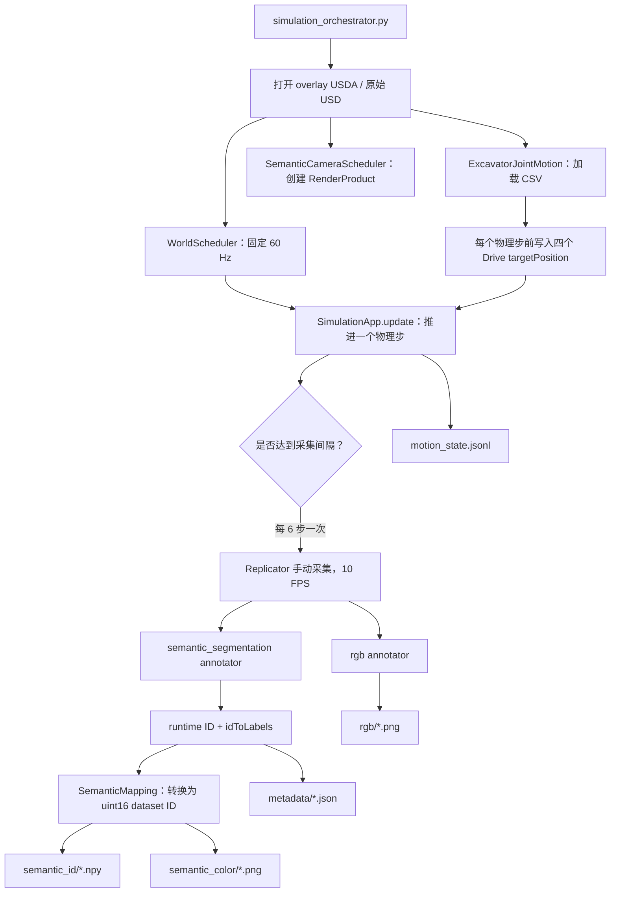

# Isaac Sim 语义世界模块完整学习笔记

> 对应工程：`260714_01semantic_worldModule`  
> 核心主题：固定步长物理仿真、挖掘机关节轨迹、随驾驶室运动的语义相机、稳定语义 ID 映射、自定义 Replicator Writer、结果验证  
> 阅读对象：希望理解“运动仿真 + 语义分割数据采集”完整工程链路的学习者

## 1. 模块要解决什么问题

该模块的目标不是简单地从 Isaac Sim 中截取若干图片，而是建立一条**可复现、可验证、可用于训练的数据生产流水线**：

1. 加载已经存在的挖掘机 USD 场景；
2. 通过一个轻量 USDA overlay 统一场景中的语义标签，并修正会干扰关节运动的嵌套刚体设置；
3. 按 CSV 轨迹驱动驾驶室、动臂、小臂和铲斗四个旋转关节；
4. 使用固定物理步长推进世界；
5. 让安装在驾驶室下的相机按独立于物理频率的采集频率生成 RGB 和语义分割图；
6. 把 Isaac Sim 每次运行时临时分配的 semantic runtime ID，转换成跨运行稳定的 dataset ID；
7. 保存逐帧元数据、运动状态和运行配置；
8. 在采集结束后检查文件数量、数组类型、颜色重建、关节限位、刚体运动和相机随动。

模块的核心价值可以概括为：

> **用固定时间基准同步物理、关节目标和相机采集，再把易变化的运行时语义结果转换为稳定、可审计的数据集格式。**

## 2. 文件结构与职责

主要文件如下：

```text
260714_01semantic_worldModule/
├── simulation_orchestrator.py       # 总入口：SimulationApp 生命周期和主调度循环
├── world_scheduler.py               # 固定步长 Timeline/physics 调度
├── excavator_joint_motion.py        # CSV 轨迹、插值、限位检查、Drive 目标写入
├── semantic_capture_custom.py       # Camera、RenderProduct 和手动采集
├── semantic_dataset_writer.py       # 自定义 Replicator Writer
├── semantic_mapping.py              # runtime ID → stable dataset ID
├── validate_semantic_output.py      # 采集结果验证
├── run_capture_remote.sh            # 远端 Isaac Sim 启动封装
├── trajectories/
│   └── excavator_motion_01.csv       # 默认四关节轨迹
├── configs/
│   ├── usd_ply_combined_02_capture_overlay.usda
│   ├── Sim_FangShan_02_capture_overlay.usda
│   ├── semantic_mapping_usd_ply_combined_02.json
│   ├── semantic_mapping_Sim_FangShan_02.json
│   └── semantic_mapping_Sim_FangShan_02_native.json
└── tests/
    └── test_joint_motion.py          # 不依赖 Isaac Sim 的纯 Python 轨迹单元测试
```

对应源文件可直接查阅：

- [simulation_orchestrator.py](../../simulation_orchestrator.py)
- [world_scheduler.py](../../world_scheduler.py)
- [excavator_joint_motion.py](../../excavator_joint_motion.py)
- [semantic_capture_custom.py](../../semantic_capture_custom.py)
- [semantic_dataset_writer.py](../../semantic_dataset_writer.py)
- [semantic_mapping.py](../../semantic_mapping.py)
- [validate_semantic_output.py](../../validate_semantic_output.py)

这种拆分遵循“一个对象只拥有一种生命周期”的思路：

| 组件 | 拥有的状态 | 不负责的内容 |
|---|---|---|
| `simulation_orchestrator` | `SimulationApp`、顶层执行顺序、异常清理 | 具体插值、具体写盘格式 |
| `WorldScheduler` | Timeline、物理步数、仿真时间 | 关节和相机 |
| `ExcavatorJointMotion` | 轨迹、关节 Drive、关节目标 | 世界推进和图像采集 |
| `SemanticCameraScheduler` | Camera、RenderProduct、Writer | 物理和运动 |
| `SemanticDatasetWriter` | Annotator 输出解析、逐帧落盘 | 仿真调度 |
| `SemanticMapping` | 稳定 ID 与颜色规则 | Isaac Sim 生命周期 |

## 3. 总体架构和数据流



按默认参数：

```text
physics_hz = 60
capture_fps = 10
steps_per_capture = 60 // 10 = 6
physics_dt = 1 / 60 ≈ 0.016666667 s
capture_interval = 6 × physics_dt = 0.1 s
```

因此，每个语义帧对应 6 个确定的物理步。运动不是按“渲染帧”更新，而是按更细的“物理步”更新，这可以减少低频控制造成的跳变。

## 4. 为什么必须先创建 `SimulationApp`

入口中有一个非常关键的导入顺序：

```python
from isaacsim import SimulationApp

simulation_app = SimulationApp(
    launch_config={
        "headless": args.headless,
        "renderer": "RaytracedLighting",
        "sync_loads": True,
    }
)

try:
    import omni.usd
    from isaacsim.core.experimental.utils.stage import is_stage_loading

    # 依赖 Kit/Replicator 的本地模块也在 SimulationApp 创建后导入
    from excavator_joint_motion import ExcavatorJointMotion
    from semantic_capture_custom import SemanticCameraScheduler
    from world_scheduler import WorldScheduler
```

Isaac Sim 中许多 `omni.*`、Replicator 和 Kit API 依赖已经启动的 Kit 应用上下文。如果在 `SimulationApp(...)` 之前导入这些模块，常见后果包括插件没有加载、接口为空或初始化过程行为不稳定。

这里还使用了：

```python
args, kit_args = parse_args()
sys.argv = [sys.argv[0], *kit_args]
```

`parse_known_args()` 只消费本脚本认识的业务参数，把剩余参数保留给 Kit/Isaac Sim。这样既能使用 `--frames`、`--physics-hz` 等项目参数，也不会误吞底层运行时参数。

## 5. USD overlay：不复制原场景，只覆盖必要属性

默认入口加载：

```python
DEFAULT_STAGE = PROJECT_DIR / "configs" / "usd_ply_combined_02_capture_overlay.usda"
```

overlay 的开头如下：

```usda
#usda 1.0
(
    subLayers = [
        @/root/gpufree-data/wyb/StageMaterial/usd_ply_combined_02.usda@
    ]
)
```

这表示当前 USDA 不重新保存整个重型场景，而是把原始场景作为较弱的 sublayer，再使用 `over` 覆盖局部属性。好处是：

- 原始资产与采集配置解耦；
- overlay 文件体积很小；
- 可以随时替换或回退采集层；
- 不需要直接修改共享的源 USD；
- 语义规范化规则可以进入代码版本管理。

### 5.1 添加语义标签

以动臂为例：

```usda
over "boom_mesh" (
    prepend apiSchemas = ["SemanticsLabelsAPI:class"]
)
{
    token[] semantics:labels:class = ["boom"]

    over "boom" (
        prepend apiSchemas = ["SemanticsLabelsAPI:class"]
    )
    {
        token[] semantics:labels:class = ["boom"]
    }
}
```

`SemanticsLabelsAPI:class` 表示应用一个名为 `class` 的语义标签实例，真正的标签值写在 `semantics:labels:class` 中。默认 overlay 最终把场景归一为六类：

| dataset ID | 标签 | 颜色 RGB |
|---:|---|---|
| 0 | `BACKGROUND` | `[0, 0, 0]` |
| 1 | `boom` | `[188, 172, 29]` |
| 2 | `bucket` | `[190, 68, 110]` |
| 3 | `ground` | `[189, 68, 246]` |
| 4 | `operator_cab` | `[148, 218, 60]` |
| 5 | `small_arm` | `[69, 225, 201]` |
| 6 | `track` | `[39, 232, 216]` |
| 65535 | `UNLABELLED` | `[255, 0, 255]` |

`65535` 是 `uint16` 的最大值，被保留为未知类别。醒目的品红色有助于肉眼发现漏标。

### 5.2 禁用嵌套子网格刚体

overlay 中还包含：

```usda
over "small_arm_mesh"
{
    bool physics:rigidBodyEnabled = 0
}
```

其目的不是让整个小臂失去物理属性，而是禁用嵌套 child mesh 上重复的刚体，让关节继续控制父级刚体。若父子层级同时存在互相冲突的刚体，可能出现关节驱动对象不明确、刚体层级非法或运动结果不符合预期。

## 6. 轨迹文件：把动作从代码中解耦

默认轨迹是：

```csv
time,cab,boom,small_arm,bucket
0.0,-2.4,-8.0,29.666664,-8.833334
1.25,17.6,7.0,9.666664,16.166666
2.5,-2.4,-8.0,29.666664,-8.833334
3.75,-22.4,-23.0,49.666664,-33.833334
5.0,-2.4,-8.0,29.666664,-8.833334
```

四列关节名必须与代码中的 `JOINT_SPECS` 对应：

```python
JOINT_SPECS = (
    JointSpec(
        name="cab",
        path="/World/Joints/track_operator_cab_joint",
        body_path="/root/Xform/operator_cab_mesh",
    ),
    JointSpec(
        name="boom",
        path="/World/Joints/platform_boom_joint",
        body_path="/root/Xform/boom_mesh",
    ),
    JointSpec(
        name="small_arm",
        path="/World/Joints/boom_small_arm_joint",
        body_path="/root/Xform/small_arm_mesh",
    ),
    JointSpec(
        name="bucket",
        path="/World/Joints/small_arm_bucket_joint",
        body_path="/root/Xform/bucket_only_full_teeth_mesh",
    ),
)
```

每个 `JointSpec` 同时保存：

- `name`：CSV 列名和运行时字典键；
- `path`：USD 中 `PhysicsRevoluteJoint` 的路径；
- `body_path`：用于验证运动是否实际发生的刚体路径。

### 6.1 轨迹加载时的完整校验

`JointTrajectory.from_csv()` 会检查：

1. 文件必须存在；
2. 列必须**准确等于** `time,cab,boom,small_arm,bucket`，顺序也必须相同；
3. 所有值都能转换为浮点数；
4. 不允许 `NaN` 和正负无穷；
5. 至少需要两个关键帧；
6. 首帧必须从 `0.0` 开始；
7. 时间必须严格递增。

核心代码：

```python
expected_columns = ("time", *JOINT_NAMES)
if reader.fieldnames != list(expected_columns):
    raise ValueError(
        f"Trajectory columns must be exactly {expected_columns}, got {reader.fieldnames}"
    )

if len(keyframes) < 2:
    raise ValueError("Trajectory must contain at least two keyframes")
if not math.isclose(keyframes[0].time, 0.0, abs_tol=1e-12):
    raise ValueError("The first trajectory keyframe must start at time 0.0")
if any(current.time <= previous.time for previous, current in zip(keyframes, keyframes[1:])):
    raise ValueError("Trajectory times must be strictly increasing")
```

轨迹对象还会记录文件的 SHA-256：

```python
self.sha256 = hashlib.sha256(self.source_path.read_bytes()).hexdigest()
```

这让数据集中的 `run_config.json` 可以准确追踪“本次采集使用的是哪一个字节版本的轨迹”，避免只看同名文件而无法复现实验。

### 6.2 线性插值

假设当前时间位于关键帧 `(t0, q0)` 和 `(t1, q1)` 之间，则：

```text
alpha = (t - t0) / (t1 - t0)
q(t) = q0 + alpha × (q1 - q0)
```

代码使用 `bisect_right` 找到右侧关键帧：

```python
right = bisect.bisect_right(self.times, trajectory_time)
left_frame = self.keyframes[right - 1]
right_frame = self.keyframes[right]
alpha = (trajectory_time - left_frame.time) / (right_frame.time - left_frame.time)
targets = {
    name: left_frame.targets[name]
    + alpha * (right_frame.targets[name] - left_frame.targets[name])
    for name in JOINT_NAMES
}
```

例如默认首个区间是 `0.0s → 1.25s`。第一次采集发生在 `0.1s`，所以 `alpha = 0.1 / 1.25 = 0.08`。此时驾驶室目标约为：

```text
-2.4 + 0.08 × (17.6 - (-2.4)) = -0.8°
```

由于目标在每个 1/60 秒的物理步上更新，Drive 看到的是连续变化的小步目标，而不是每 0.1 秒突跳一次。

### 6.3 `loop` 与 `hold`

```python
if playback_mode == "loop":
    trajectory_time = simulation_time % self.duration
    if simulation_time > 0 and math.isclose(trajectory_time, 0.0, abs_tol=1e-12):
        trajectory_time = self.duration
elif playback_mode == "hold":
    trajectory_time = min(simulation_time, self.duration)
```

- `loop`：时间对轨迹总时长取模，循环播放；
- `hold`：到达末帧后一直保持最后一个关键帧。

`loop` 初始化时还会检查首尾关节值完全闭合：

```python
if any(not math.isclose(first[name], last[name], abs_tol=1e-9) for name in JOINT_NAMES):
    raise ValueError("Loop trajectory must end at the same joint targets where it starts")
```

这是为了避免每个循环边界发生目标角度突变。恰好落在一个完整周期末端时，代码返回 `duration` 而不是立刻变成 `0`；默认轨迹首尾相同，所以数值连续。

### 6.4 关节类型、Drive 和安全限位

初始化时，每个 USD 关节必须满足：

- Prim 有效；
- 类型是 `PhysicsRevoluteJoint`；
- 存在 `physics:lowerLimit`；
- 存在 `physics:upperLimit`；
- 存在 `drive:angular:physics:targetPosition`。

```python
lower_attr = prim.GetAttribute("physics:lowerLimit")
upper_attr = prim.GetAttribute("physics:upperLimit")
target_attr = prim.GetAttribute("drive:angular:physics:targetPosition")
```

所有关键帧还要经过 2° 安全边界检查：

```python
safe_lower = joint.lower_limit + self.safety_margin_degrees
safe_upper = joint.upper_limit - self.safety_margin_degrees
if not safe_lower <= target <= safe_upper:
    raise ValueError(...)
```

注意，这里不是运行时把越界值裁剪到安全区间，而是**在初始化阶段直接拒绝整条非法轨迹**。这种 fail-fast 行为更适合离线数据集生产：坏配置不会悄悄生成看似正常的数据。

### 6.5 每步写入 Drive 目标

```python
def update(self, simulation_time: float) -> None:
    trajectory_time, targets = self.trajectory.sample(simulation_time, self.playback_mode)
    self._last_trajectory_time = trajectory_time
    for name, target in targets.items():
        joint = self._joints[name]
        joint.target = target
        joint.target_attribute.Set(target)
```

这里写的是角度目标，不是直接修改刚体世界变换。真正的运动仍由 USD Physics joint 和 angular Drive 求解，因此会受到 Drive 刚度、阻尼、质量、碰撞等物理属性影响。

## 7. `WorldScheduler`：建立确定的物理时间轴

初始化代码：

```python
self.physics_hz = int(physics_hz)
self.physics_dt = 1.0 / float(self.physics_hz)

settings.set("/app/player/useFixedTimeStepping", True)
self._timeline.set_looping(False)
self._timeline.set_current_time(0.0)
self._timeline.set_time_codes_per_second(float(self.physics_hz))
self._timeline.set_end_time(max(self.maximum_duration_seconds, 1.0))
self._timeline.commit()
```

固定步长的意义是：运行机器的快慢只影响任务花多少现实时间完成，不应改变每次 `app.update()` 对应的仿真时间长度。

模块不直接依赖 Timeline 返回值来累计主时间，而是使用整数步数：

```python
@property
def simulation_time(self) -> float:
    return self._step_count * self.physics_dt

@property
def next_simulation_time(self) -> float:
    return (self._step_count + 1) * self.physics_dt
```

这样做比反复浮点累加 `time += dt` 更清晰，也避免累加误差不断传播。`get_state()` 同时记录自算的 `simulation_time` 和 Timeline 的 `timeline_time`，便于事后比较两套时间是否一致。

`update()` 当前是空实现：

```python
def update(self, simulation_time: float) -> None:
    """Update scheduled world attributes before the next physics step."""
    _ = simulation_time
```

这是有意保留的扩展点。未来可在这里按仿真时间调度灯光、天气、材质或环境状态，而不会把它们塞进关节控制器。

## 8. 相机调度：让相机真正属于驾驶室

### 8.1 显式路径与自动发现

默认相机路径是：

```text
/root/Xform/operator_cab_mesh/Camera_01
```

如果显式传入相机路径，程序会检查：

1. Prim 存在；
2. Prim 类型是 `UsdGeom.Camera`；
3. 相机是 `cab_root` 的后代。

第三项很重要：只有相机位于驾驶室层级下，它的世界变换才会继承驾驶室运动。

如果传入空字符串 `--camera ""`，代码会遍历 `cab_root`：

```python
cameras = [
    str(prim.GetPath())
    for prim in Usd.PrimRange(cab_prim)
    if prim.IsA(UsdGeom.Camera)
]
if len(cameras) != 1:
    raise RuntimeError(...)
```

自动发现要求恰好只有一台相机。这比“随便取第一台”安全，因为多相机场景下静默选择会让数据来源不明确。

### 8.2 初始化 RenderProduct 和 Writer

```python
carb.settings.get_settings().set("rtx/post/dlss/execMode", 2)
rep.orchestrator.set_capture_on_play(False)
self._render_product = rep.create.render_product(
    self.camera_path,
    resolution=(self._width, self._height),
    name="SemanticCapture",
)
self._backend = DiskBackend(output_dir=str(self._output_path), overwrite=True)
self._writer = SemanticDatasetWriter(
    backend=self._backend,
    semantic_schema=str(self._mapping_path),
    rgb=True,
    save_runtime_ids=self._save_runtime_ids,
    strict_mapping=self._strict_mapping,
)
self._writer.attach(self._render_product)
```

关键点：

- `set_capture_on_play(False)` 禁止 Timeline 一播放就按默认机制自动采集；
- 采集时刻完全由顶层循环决定；
- 一个 RenderProduct 将相机与分辨率绑定；
- 自定义 Writer 同时订阅 RGB 和非着色语义分割 Annotator；
- 写盘由 `DiskBackend` 调度。

### 8.3 预热

```python
self._render_product.hydra_texture.set_updates_enabled(True)
for _ in range(update_count):
    self._app.update()
self._render_product.hydra_texture.set_updates_enabled(False)
```

预热让渲染管线、材质、纹理和相关资源在正式计数前稳定下来。默认预热 10 次。预热发生在 `world_scheduler.start()` 之前，因此正式物理步计数仍从 0 开始。

### 8.4 手动采集且不额外推进物理时间

```python
rep.orchestrator.step(
    rt_subframes=self._rt_subframes,
    delta_time=0.0,
    pause_timeline=False,
)
```

设计意图是：

- `rt_subframes` 为光线追踪提供多个子帧，提高渲染稳定性；
- `delta_time=0.0` 在采集动作中不额外推进仿真时间；
- 物理时间只由 `WorldScheduler.step()` 推进；
- `pause_timeline=False` 不在每帧采集时反复暂停 Timeline。

这能避免“6 个显式物理步 + 1 个隐式渲染步”的时间漂移。

### 8.5 相机状态记录

```python
cache = UsdGeom.XformCache(Usd.TimeCode.Default())
matrix = cache.GetLocalToWorldTransform(prim)
world_transform = [
    float(matrix[row][column]) for row in range(4) for column in range(4)
]
```

4×4 世界变换矩阵按行展开为 16 个浮点数，写入 `motion_state.jsonl`。验证器会检查这些矩阵在不同帧间是否改变，从而证明相机确实跟随驾驶室运动。

## 9. 语义映射：为什么不能直接保存 runtime ID

Isaac Sim 的 semantic segmentation Annotator 输出的是当前运行中的 ID。这些 ID 可能受场景加载、Prim 顺序或运行环境影响，不适合作为长期数据集类别编号。

因此模块区分两种 ID：

| 类型 | 来源 | 稳定性 | 用途 |
|---|---|---|---|
| runtime ID | Isaac Sim 当前 Annotator | 不保证跨运行稳定 | 调试、追踪源输出 |
| dataset ID | 项目的 JSON schema | 稳定 | 训练、评估、跨批次合并 |

映射过程是：

```text
每像素 runtime ID
        ↓
idToLabels[runtime ID]
        ↓
canonical_label(...)
        ↓
label_to_id[规范化标签]
        ↓
每像素 uint16 dataset ID
```

### 9.1 Schema 的约束

`load_schema()` 会检查：

- `schema_version == 1`；
- `dataset_dtype == "uint16"`；
- background、classes、unknown 的 ID 唯一；
- 标签忽略大小写后唯一；
- RGB 颜色唯一；
- background ID 必须为 0。

```python
entries = [schema["background"], *schema["classes"], schema["unknown"]]
ids = [entry["id"] for entry in entries]
labels = [entry["label"].casefold() for entry in entries]
colors = [tuple(entry["color"]) for entry in entries]
if len(ids) != len(set(ids)) or len(labels) != len(set(labels)) or len(colors) != len(set(colors)):
    raise ValueError("Semantic IDs, labels, and colors must be unique")
```

这里的“颜色唯一”同样重要：如果两个类别颜色相同，彩色预览图将无法无歧义地反映 dataset ID。

### 9.2 继承标签和逗号分隔标签的解析

`canonical_label()` 可处理字典、序列和字符串：

```python
def canonical_label(value: Any, semantic_type: str = "class") -> str | None:
    if value is None:
        return None
    if isinstance(value, Mapping):
        if semantic_type in value:
            return canonical_label(value[semantic_type], semantic_type)
        labels = [canonical_label(item, semantic_type) for item in value.values()]
        labels = [label for label in labels if label]
        return labels[-1] if labels else None
    if isinstance(value, Sequence) and not isinstance(value, (str, bytes, bytearray)):
        labels = [canonical_label(item, semantic_type) for item in value]
        labels = [label for label in labels if label]
        return labels[-1] if labels else None
    text = str(value).strip()
    labels = [item.strip() for item in text.split(",") if item.strip()]
    return labels[-1] if labels else None
```

核心规则是取最后一个非空标签。例如：

```text
"vehicle, excavator, boom" → "boom"
{"class": "machine, bucket"} → "bucket"
```

这适合处理从祖先 Prim 继承到子 Prim 的多层语义。schema 中的 `label_resolution` 字段记录了该约定，但当前实现的实际行为由 `canonical_label()` 固定完成。

### 9.3 逐帧重映射

核心逻辑：

```python
dataset_ids = np.full(runtime_ids.shape, self.unknown_id, dtype=np.uint16)

for raw_runtime_id in np.unique(runtime_ids):
    runtime_id = int(raw_runtime_id)
    label_info = normalized.get(runtime_id)
    if runtime_id == 0 and label_info is None:
        dataset_id, label = self.background_id, "BACKGROUND"
    else:
        dataset_id, label = self.resolve(label_info)
    dataset_ids[runtime_ids == runtime_id] = dataset_id
```

程序只遍历该帧实际出现过的唯一 runtime ID，而不是逐像素调用 Python 字典。每个 ID 对应的像素通过 NumPy 布尔掩码批量赋值。

若出现 schema 中不存在的标签：

```python
if unknown_labels and strict:
    raise KeyError(
        "Semantic labels are missing from the mapping: "
        + ", ".join(sorted(set(unknown_labels)))
    )
```

默认 `strict_mapping=True`，任何漏标都会让采集失败。关闭严格模式后，未知像素会写成 `65535`，但仍会记录在逐帧 metadata 中。

### 9.4 颜色查找表

```python
self.color_lut = np.zeros((np.iinfo(np.uint16).max + 1, 3), dtype=np.uint8)
for entry in entries:
    self.color_lut[int(entry["id"])] = entry["color"]

def colorize(self, dataset_ids: np.ndarray) -> np.ndarray:
    return self.color_lut[dataset_ids.astype(np.uint16, copy=False)]
```

查找表包含 65536 个 RGB 项，占用约 `65536 × 3 = 196608` 字节。以 ID 图直接索引 LUT，得到 `[H, W, 3]` 彩色图，速度快且结果完全确定。

## 10. 自定义 `SemanticDatasetWriter`

### 10.1 Annotator 配置

```python
if rgb:
    self.annotators.append(AnnotatorRegistry.get_annotator("rgb"))
self.annotators.append(
    AnnotatorRegistry.get_annotator(
        "semantic_segmentation",
        init_params={"colorize": False, "semanticFilter": "class:*"},
    )
)
```

语义 Annotator 使用 `colorize=False`，因为项目需要原始 runtime ID，而不是 Isaac 自动生成的颜色图。`semanticFilter="class:*"` 表示只采集 `class` 类型语义。

初始化时 Writer 还会把实际使用的 schema 复制到输出根目录：

```python
self.backend.schedule(
    F.write_json,
    data=self.mapping.schema,
    path="semantic_mapping.json",
)
```

因此即使之后项目配置发生变化，数据集目录内仍保留当次采集的映射快照。

### 10.2 兼容不同 runtime ID 数组格式

```python
if data.dtype == np.uint32:
    return data.reshape(height, width)
if data.dtype == np.uint8 and data.ndim == 3 and data.shape[2] == 4:
    return np.ascontiguousarray(data).view(np.uint32).reshape(height, width)
return data.astype(np.uint32, copy=False).reshape(height, width)
```

Annotator 结果可能直接是 `uint32` 二维 ID，也可能以 4 个 `uint8` 通道承载一个 32 位整数。第二种情况下先确保内存连续，再用 `.view(np.uint32)` 按相同字节重新解释，避免把 RGBA 当作四个独立类别值。

### 10.3 每帧写入内容

Writer 对每个 RenderProduct 执行：

1. 提取 semantic entry；
2. 还原 runtime ID 二维图；
3. 读取 `idToLabels`；
4. 转换成 dataset ID；
5. 保存 `semantic_id/*.npy`；
6. 由 dataset ID 重建并保存 `semantic_color/*.png`；
7. 可选保存 runtime ID；
8. 保存 RGB；
9. 保存逐帧 metadata。

核心写盘代码：

```python
self.backend.schedule(
    F.write_np,
    data=dataset_ids,
    path=self._path(root, "semantic_id", f"semantic_id_{frame_name}.npy"),
)
self.backend.schedule(
    F.write_image,
    data=self.mapping.colorize(dataset_ids),
    path=self._path(root, "semantic_color", f"semantic_color_{frame_name}.png"),
)
```

语义训练应优先使用 `.npy` 中的 `uint16` ID，而不是把彩色 PNG 再反解成类别。彩色 PNG 的主要用途是可视化检查。

### 10.4 多 RenderProduct 的预留支持

```python
multi = len(render_products) > 1
root = self._safe_name(render_product_name) if multi else ""
```

当前相机调度器只创建一个 RenderProduct，因此输出直接位于 `rgb/`、`semantic_id/` 等目录。Writer 已为多 RenderProduct 预留了按安全名称分目录的逻辑。

### 10.5 Writer 帧号与调度器帧号

Writer 使用自己的 `_frame_id`，每次 `write()` 后加一：

```python
frame_name = f"{self._frame_id:0{self._frame_padding}d}"
...
self._frame_id += 1
```

而 `SemanticCameraScheduler.capture(frame_id, simulation_time)` 当前没有把传入的两个值交给 Writer：

```python
_ = frame_id, simulation_time
```

所以现有设计隐含一个前提：**每次顶层 `capture()` 必须恰好触发一次 Writer `write()`**。若未来加入丢帧、条件采集或多次子采集，应显式建立调度帧号与 Writer 帧号的关联。

## 11. 顶层主循环：同步世界、运动和相机

主循环是整个工程最关键的代码：

```python
steps_per_capture = args.physics_hz // args.capture_fps

world_scheduler.start()
for frame_id in range(args.frames):
    for _ in range(steps_per_capture):
        next_time = world_scheduler.next_simulation_time
        world_scheduler.update(next_time)
        if motion_scheduler is not None:
            motion_scheduler.update(next_time)
        world_scheduler.step()

    capture_time = world_scheduler.simulation_time
    camera_scheduler.capture(frame_id=frame_id, simulation_time=capture_time)
```

单个物理步的严格顺序是：

```text
计算下一物理时刻
    → 更新世界计划属性
    → 按该时刻计算并写入关节目标
    → app.update() 推进物理
    → 步数加一
```

关节目标必须在 `app.update()` 之前写入，这样本次物理求解看到的是“即将到达时刻”的目标。

### 11.1 默认首帧不是 `t=0`

主循环先推进 6 个物理步，再采集 `frame_id=0`。因此默认时间序列是：

```text
frame 0  → t = 0.1 s
frame 1  → t = 0.2 s
...
frame 49 → t = 5.0 s
```

如果需求是额外保存初始姿态 `t=0`，需要在进入物理步循环前执行一次采集，并相应调整帧数与验证逻辑；仅修改帧号不能得到真正的零时刻图像。

### 11.2 为什么要求频率整除

参数验证中有：

```python
if args.physics_hz % args.capture_fps != 0:
    raise ValueError(
        "First-version scheduling requires physics-hz to be divisible by capture-fps"
    )
```

当前调度器使用固定整数 `steps_per_capture`。若 60 Hz 物理要按 24 FPS 采集，则 `60 / 24 = 2.5`，不能每帧都推进相同整数步。要支持非整除频率，可以引入相位累加器或按“下一个采集时间”判定，但要处理 2 步、3 步交替采集及浮点容差。

### 11.3 运行状态的双重记录

每帧采集后写一行 JSON：

```python
state = {
    "frame_id": frame_id,
    "simulation_time": capture_time,
    "world": world_scheduler.get_state(),
    "camera": camera_scheduler.get_state(),
    "motion": motion_scheduler.get_state(capture_time)
    if motion_scheduler is not None
    else {"enabled": False},
}
motion_stream.write(json.dumps(state, ensure_ascii=False) + "\n")
motion_stream.flush()
```

这里采用 JSON Lines 而不是一个超大 JSON 数组，优点是：

- 每帧立即落盘并 `flush()`；
- 任务中途失败时，已经完成的状态仍可读取；
- 可以按行流式处理；
- 单帧记录天然与 frame ID 对齐。

`run_config.json` 记录整次运行不变的配置，`motion_state.jsonl` 记录每帧变化的状态。两者配合，可以区分“实验参数”和“时序观测值”。

## 12. 生命周期与异常清理

入口将所有执行放在 `try/except/finally` 中：

```python
except Exception as exc:
    exit_code = 1
    print(f"[simulation-orchestrator] ERROR: {exc}", file=sys.stderr)
    traceback.print_exc()
finally:
    if world_scheduler is not None:
        world_scheduler.stop()
    if camera_scheduler is not None:
        camera_scheduler.close()
    simulation_app.close()
```

即使轨迹非法、语义映射缺类或写盘失败，也会尽力：

1. 暂停 Timeline；
2. detach Writer；
3. destroy RenderProduct；
4. 关闭 SimulationApp。

各清理动作又分别放入局部 `try/except`，避免一个清理失败阻止其他资源释放。

## 13. 输出数据集结构

单 RenderProduct 的默认输出大致如下：

```text
output_directory/
├── run_config.json
├── semantic_mapping.json
├── motion_state.jsonl
├── rgb/
│   ├── rgb_0000.png
│   └── ...
├── semantic_id/
│   ├── semantic_id_0000.npy
│   └── ...
├── semantic_color/
│   ├── semantic_color_0000.png
│   └── ...
├── semantic_runtime_id/
│   ├── semantic_runtime_id_0000.npy
│   └── ...
└── metadata/
    ├── frame_0000.json
    └── ...
```

各产物的职责：

| 文件 | 内容 | 主要用途 |
|---|---|---|
| `run_config.json` | 场景、相机、频率、分辨率、轨迹摘要、关节限位 | 复现实验 |
| `semantic_mapping.json` | 当次实际使用的稳定标签 schema | 数据解释与归档 |
| `motion_state.jsonl` | 每帧世界时间、目标角、刚体和相机变换 | 时序审计 |
| `rgb_XXXX.png` | 相机 RGB 图像 | 训练输入或可视化 |
| `semantic_id_XXXX.npy` | `[H,W] uint16` 稳定类别 ID | 训练标签真值 |
| `semantic_color_XXXX.png` | `[H,W,3]` 类别颜色 | 人工检查 |
| `semantic_runtime_id_XXXX.npy` | Isaac 原始 runtime ID | 排查映射问题 |
| `frame_XXXX.json` | 该帧 runtime→dataset 映射、像素计数、未知标签 | 逐帧诊断 |

逐帧 metadata 的核心结构：

```json
{
  "frame_id": 0,
  "render_product": "...",
  "resolution": [1280, 720],
  "runtime_id_mapping": {
    "1": {
      "source": {"class": "boom"},
      "resolved_label": "boom",
      "dataset_id": 1,
      "dataset_label": "boom"
    }
  },
  "dataset_pixel_counts": {"0": 500000, "1": 20000},
  "unknown_labels": []
}
```

实际键和值取决于该帧可见对象，上例仅用于说明字段含义。

## 14. 结果验证器检查了什么

验证脚本不是只看“文件存在”，而是进行多层一致性检查。

### 14.1 文件数量

以下目录必须都包含 `expected_frames` 个文件：

```python
required_patterns = {
    "rgb": "rgb_*.png",
    "semantic_id": "semantic_id_*.npy",
    "semantic_color": "semantic_color_*.png",
    "semantic_runtime_id": "semantic_runtime_id_*.npy",
    "metadata": "frame_*.json",
}
```

### 14.2 ID 数组

逐帧检查：

- shape 是否等于 `[height, width]`；
- dtype 是否严格为 `np.uint16`；
- 所有值是否属于 `{0, 65535, schema classes...}`。

### 14.3 颜色图可逆一致

```python
if not np.array_equal(saved_color, mapping.colorize(dataset_ids)):
    raise RuntimeError(
        f"Frame {frame_id}: semantic color PNG does not match semantic ID NPY"
    )
```

验证器不相信已经保存的颜色 PNG，而是从 `.npy` 重新查 LUT，再逐像素比较。这能发现错误配色、错帧或写盘损坏。

### 14.4 未知标签

即使 `65535` 属于合法 `uint16` 保留值，当前验证器仍要求：

```python
if metadata.get("unknown_labels"):
    raise RuntimeError(...)
```

所以最终“通过验证”的标准是没有任何未知语义标签。

### 14.5 运动与相机随动

验证器会：

1. 检查每帧目标角是否位于 USD 原始上下限内；
2. 比较每个受控刚体的 4×4 世界变换；
3. 至少一个受控刚体必须发生变化；
4. 相机世界变换必须发生变化。

`changed()` 使用固定绝对容差：

```python
return any(
    not np.allclose(present[0], value, atol=tolerance, rtol=0.0)
    for value in present[1:]
)
```

这验证的是物理结果，而不仅是 Drive 目标数值发生了改变。若目标变了但刚体没动，验证仍会失败。

## 15. 如何运行

### 15.1 默认远端采集

在 Linux/Isaac Sim 运行环境中进入项目目录：

```bash
./run_capture_remote.sh \
  --frames 50 \
  --physics-hz 60 \
  --capture-fps 10 \
  --trajectory trajectories/excavator_motion_01.csv \
  --trajectory-mode loop \
  --interpolation linear \
  --width 1280 \
  --height 720 \
  --rt-subframes 4
```

首次写入默认输出目录不需要 `--overwrite`；若目标目录已非空，要么换新目录，要么明确传入：

```bash
--overwrite
```

### 15.2 远端启动脚本做了什么

`run_capture_remote.sh` 为每个项目建立隔离的运行目录：

```bash
export HOME="${RUNTIME_DIR}/home"
export TMPDIR="${RUNTIME_DIR}/tmp"
export XDG_CACHE_HOME="${RUNTIME_DIR}/cache"
export XDG_CONFIG_HOME="${RUNTIME_DIR}/config"
export CUDA_CACHE_PATH="${RUNTIME_DIR}/cuda_cache"
export OPTIX_CACHE_PATH="${RUNTIME_DIR}/optix_cache"
export PYTHONUNBUFFERED=1
```

这样能减少用户主目录权限、共享缓存和远端无交互环境带来的问题。最后通过 Isaac Sim 自带 Python 启动：

```bash
exec /root/isaacsim/python.sh "${PROJECT_DIR}/simulation_orchestrator.py" "$@"
```

必须使用 Isaac Sim 的 Python，而不是普通系统 Python，因为主流程依赖 `isaacsim`、`omni`、`pxr` 和 Replicator 环境。

### 15.3 验证输出

```bash
/root/isaacsim/python.sh validate_semantic_output.py \
  --output /absolute/output/path \
  --mapping configs/semantic_mapping_usd_ply_combined_02.json \
  --expected-frames 50
```

### 15.4 运行纯 Python 单元测试

轨迹加载和插值不依赖 Isaac Sim，可以在项目根目录用普通 Python 测试：

```bash
python -m unittest discover -s tests -v
```

必须从模块根目录运行，或者把模块根目录加入 `PYTHONPATH`，因为测试通过：

```python
from excavator_joint_motion import JointTrajectory
```

直接导入同级源码模块。

当前 6 个测试覆盖：

- 关键帧数量、总时长和 SHA-256；
- 两关键帧之间的线性插值；
- `loop` 周期回绕；
- `hold` 末帧保持；
- 错误列结构拒绝；
- 非严格递增时间拒绝。

## 16. 参数速查

| 参数 | 默认值 | 含义 |
|---|---:|---|
| `--usd` | 默认 overlay | 要打开的 USD/USDA |
| `--mapping` | 默认六类 JSON | 稳定语义映射 |
| `--camera` | 驾驶室下 `Camera_01` | 相机 Prim 路径；空字符串表示自动发现 |
| `--cab-root` | `/root/Xform/operator_cab_mesh` | 相机必须位于其下 |
| `--output` | 项目内默认输出目录 | 数据集根目录 |
| `--frames` | `50` | 采集帧数 |
| `--width` | `1280` | 图像宽度 |
| `--height` | `720` | 图像高度 |
| `--warmup` | `10` | 正式采集前渲染更新次数 |
| `--rt-subframes` | `4` | 每次 Replicator step 的光追子帧数 |
| `--physics-hz` | `60` | 固定物理频率 |
| `--capture-fps` | `10` | 语义相机采集频率 |
| `--trajectory` | 默认 CSV | 四关节关键帧文件 |
| `--trajectory-mode` | `loop` | 循环或末帧保持 |
| `--interpolation` | `linear` | 当前只支持线性插值 |
| `--no-enable-motion` | 未启用 | 禁用运动，仅采集静态场景 |
| `--no-headless` | 未启用 | 显示 Isaac Sim 窗口 |
| `--no-save-runtime-ids` | 未启用 | 不保存原始 runtime ID |
| `--no-strict-mapping` | 未启用 | 未知标签写为 65535 而不是立即报错 |
| `--overwrite` | 关闭 | 允许写入非空输出目录 |

## 17. 已知边界条件与容易踩坑的地方

### 17.1 `--no-save-runtime-ids` 与当前验证器不兼容

Writer 支持关闭 runtime ID 保存，但验证器无条件要求 `semantic_runtime_id/semantic_runtime_id_*.npy` 数量正确。因此：

```text
采集时 --no-save-runtime-ids
        +
原样运行 validate_semantic_output.py
        =
验证失败
```

若要正式支持该参数，应把 `save_runtime_ids` 写入 `run_config.json`，并让验证器按配置决定是否检查该目录。

### 17.2 `--no-strict-mapping` 不能让当前验证器接受未知类

关闭严格映射只会让 Writer 继续写出 `65535`；验证器仍会因为 `metadata.unknown_labels` 非空而失败。这很适合“先采集诊断，再补 schema”，但不等于数据集达标。

### 17.3 schema 中有些字段目前是描述性元数据

当前代码实际强校验 `schema_version`、`dataset_dtype`、ID、标签、颜色和 background ID；但以下字段主要用于记录，没有被完整交叉验证：

- `source_usd`；
- `semantic_prim_count`；
- `class_count`；
- `unknown.policy`；
- `label_resolution`。

例如 `unknown.policy` 写成 `error` 不会自动决定行为，真正控制严格性的仍是命令行 `--strict-mapping/--no-strict-mapping`。

### 17.4 相机 `frame_id` 与 Writer `_frame_id` 没有显式绑定

当前一采一写时没有问题。未来若增加跳帧、失败重试或多相机，需要把帧号作为数据显式传递，或在输出后建立可靠索引。

### 17.5 只验证“至少一个刚体移动”

验证器当前要求 `moving_bodies` 非空，但不要求四个受控刚体全部移动。如果需要更严格的数据质量门槛，可改为检查预期 body 集合全部出现在 `moving_bodies` 中。

### 17.6 目标角在限位内，不代表物理姿态一定准确到达

Drive 目标只是控制输入。刚体最终角度还受 stiffness、damping、max force、质量和碰撞影响。当前状态记录了目标和 body world transform，没有直接记录实际 joint position。若训练任务对关节角真值敏感，应额外读取实际 joint state。

### 17.7 overlay 使用绝对 Linux 路径

两个 overlay 的 `subLayers` 都指向 `/root/gpufree-data/...`。项目复制到另一台机器后，必须保证同一路径存在，或修改 sublayer 路径。Windows 本地普通 Python 可以测试轨迹，但不能直接完成依赖该远端资产路径的 Isaac Sim 采集。

## 18. 常见修改方法

### 18.1 新增语义类别

需要同步完成：

1. 在 overlay 对目标 Prim 应用 `SemanticsLabelsAPI:class`；
2. 在对应 mapping JSON 的 `classes` 中加入唯一 ID、标签和颜色；
3. 更新 `class_count` 和必要的说明性元数据；
4. 用严格映射模式进行一次短采集；
5. 检查每帧 metadata 中 `unknown_labels` 为空；
6. 运行验证器。

仅修改 JSON 而不在 USD 上打标签，像素仍可能被视为 background；仅修改 USD 而不修改 JSON，严格模式会因未知标签失败。

### 18.2 替换挖掘机资产

至少要核对：

- 四个 joint Prim 路径和类型；
- 四个 body Prim 路径；
- 每个 joint 是否存在 angular Drive target；
- joint limit 的单位和范围；
- 相机是否在驾驶室层级下；
- overlay 中需要标注的 Prim 路径；
- mapping JSON 标签是否与 overlay 完全一致。

若新资产命名不同，应优先修改 `JOINT_SPECS` 和配置，不要在轨迹 CSV 中混用 USD 长路径。

### 18.3 改成多相机

当前 `SemanticCameraScheduler` 只拥有一个 RenderProduct。扩展时有两种思路：

- 一个 scheduler 创建多个 RenderProduct，并让同一个 Writer 的多 RenderProduct 分目录逻辑接管输出；
- 每个相机一个 scheduler/Writer，输出到独立根目录。

无论哪种方式，都要重新定义：

- 同一物理时刻各相机是否必须严格同步；
- `motion_state.jsonl` 如何保存多个相机变换；
- 验证器如何计数；
- Writer 帧号与顶层帧号如何对应。

### 18.4 支持非整除采集频率

可维护下一个采集时间 `next_capture_time`：

```text
每推进一个固定物理步：
    simulation_time += physics_dt
    当 simulation_time >= next_capture_time - tolerance：
        capture()
        next_capture_time += 1 / capture_fps
```

这样 60 Hz/24 FPS 会自然形成 2 步和 3 步交替。需要额外定义采集使用“刚超过目标时间的状态”还是进行状态插值。

### 18.5 采集真正的 `t=0` 初始帧

应在 `world_scheduler.start()` 后、第一次 `world_scheduler.step()` 前完成一次采集和状态记录，然后再进入常规循环。与此同时需决定：

- `frames` 是包含初始帧还是额外增加一帧；
- Writer 和 motion JSONL 的帧号从 0 如何对齐；
- 最终时刻是 `(frames-1)/fps` 还是 `frames/fps`；
- 验证器的期望数量是否变化。

## 19. 推荐的排错顺序

当采集失败时，按以下顺序定位通常最快：

1. **参数阶段**：USD、mapping、trajectory 文件是否存在，频率能否整除；
2. **场景阶段**：overlay 的 sublayer 绝对路径是否有效，Stage 是否完成加载；
3. **关节阶段**：四个 joint 路径、类型、限位和 Drive target 是否存在；
4. **轨迹阶段**：CSV 列、时间、首尾闭合、安全限位是否通过；
5. **相机阶段**：相机路径有效且位于 `cab_root` 下；
6. **语义阶段**：Stage 中至少有一个 `SemanticsLabelsAPI`，metadata 是否出现未知标签；
7. **写盘阶段**：输出目录权限、空间、是否需要 `--overwrite`；
8. **验证阶段**：文件计数、ID dtype/shape、彩色图重建、刚体与相机变换。

如果严格映射报错，优先查看异常中的标签名，或临时使用 `--no-strict-mapping` 生成 metadata 诊断；补齐 schema 后再恢复严格模式生产正式数据。

## 20. 代码设计中值得学习的原则

1. **把时间基准集中管理**：所有运动和采集都服从同一个固定步长世界时钟。
2. **状态更新先于物理推进**：目标属于“下一个物理时刻”，应在求解前写入。
3. **运行时 ID 与数据集 ID 分离**：不要把引擎临时编号当作训练标签协议。
4. **保留原始数据和派生数据**：runtime ID 用于诊断，dataset ID 用于训练，颜色 PNG 用于查看。
5. **配置快照进入输出**：数据集自带 mapping、轨迹 hash 和 run config，便于复现。
6. **初始化阶段 fail fast**：路径、类型、限位和标签问题尽量在长时间采集前暴露。
7. **验证物理结果而非只验证控制命令**：目标值变化不代表刚体真的运动。
8. **使用 overlay 而非破坏源资产**：语义和采集修正作为轻量层叠加。
9. **区分实验级元数据和逐帧时序数据**：`run_config.json` 与 `motion_state.jsonl` 各司其职。
10. **清晰划分资源所有权**：谁创建 Timeline、RenderProduct、Writer，谁负责停止或销毁。

## 21. 一次完整运行的心智模型

可以把整个程序记成下面这条主线：

```text
解析业务参数并保留 Kit 参数
    ↓
创建 SimulationApp
    ↓
导入依赖 Kit 的模块
    ↓
校验路径、频率和输出目录
    ↓
打开 overlay Stage 并等待加载完成
    ↓
初始化固定步长世界
    ↓
加载并校验轨迹、关节和 Drive
    ↓
定位驾驶室相机、创建 RenderProduct 和 Writer
    ↓
渲染预热
    ↓
写 run_config.json
    ↓
每帧：6 次“目标更新 + 物理步” → 1 次语义采集 → 1 行运动状态
    ↓
等待异步写盘完成
    ↓
detach Writer、销毁 RenderProduct、暂停 Timeline、关闭 SimulationApp
    ↓
独立运行验证器检查数据与真实运动
```

掌握这条主线之后，再阅读各个类的细节会非常清楚：它们不是互相随意调用，而是在顶层编排器中按严格的生命周期和时间顺序组合。

---

## 22. 本地核对记录

本文整理时已对模块执行以下静态/纯 Python 检查：

```text
python -m compileall -q <module-root>       → PASS
python -m unittest discover -s tests -v    → 6 tests PASS
```

完整 Isaac Sim 采集和 GPU 渲染仍需在具备 `/root/isaacsim/python.sh`、对应 USD 资产和渲染环境的远端 Isaac Sim 环境中运行。
