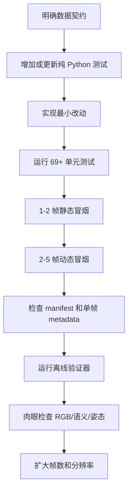

# 动手实验与二次开发指南

> 目标：不只“看懂”项目，还能通过小实验验证自己的理解，并以可控方式修改轨迹、语义、
> 相机和渲染配置。

## 1. 实验环境分层

本指南把练习分为两类：

- **A 类：普通 Python 实验**。当前 Windows 环境即可完成，不启动 Isaac Sim。
- **B 类：Isaac Sim 集成实验**。需要项目部署的 Linux/Isaac Sim/GPU 环境及有效资产路径。

先完成 A 类，再进行 B 类。A 类能快速发现轨迹、时间、JSON schema 和映射错误；B 类只
承担必须由 USD composition、物理、RTX、Replicator 验证的部分。

所有 PowerShell 示例先进入项目目录：

```powershell
$Project = 'D:\learning\IntelligentDepartment\CodesSet\Self\260707IsaacSIm\scripts\260714_01semantic_worldModule'
Set-Location -LiteralPath $Project
```

---

## 2. 实验 A1：建立测试基线

运行：

```powershell
python -m pytest tests -q
```

当前预期：

```text
69 passed
```

为什么必须先做：

- 证明当前环境能导入项目顶层模块；
- 证明修改前的代码基线是绿的；
- 修改后若失败，可以判断是自己引入的回归；
- 测试名本身就是需求清单。

如果从仓库根目录运行并看到 `ModuleNotFoundError: No module named 'capture_timing'`，先检查
当前目录，而不是立刻安装同名 pip 包。这个项目使用顶层模块导入，并没有安装成 Python
package。

想边学习边看测试名：

```powershell
rg -n '^\s*def test_' tests
```

建议按下面分组运行：

```powershell
python -m pytest tests/test_capture_timing.py -q
python -m pytest tests/test_joint_motion.py -q
python -m pytest tests/test_articulation_adapter.py -q
python -m pytest tests/test_render_profile.py -q
python -m pytest tests/test_validate_output_v2.py -q
```

---

## 3. 实验 A2：亲手计算采集时间

在项目目录执行：

```powershell
python -c "from capture_timing import CaptureTiming; t=CaptureTiming(60,10,True,False); print([(i,t.data_step_for_frame(i),t.dataset_time_for_frame(i)) for i in range(5)])"
```

预期核心结果：

```text
[(0, 0, 0.0), (1, 6, 0.1), (2, 12, 0.2), ...]
```

然后分别修改：

```powershell
python -c "from capture_timing import CaptureTiming; t=CaptureTiming(60,10,False,False); print([(i,t.data_step_for_frame(i),t.dataset_time_for_frame(i)) for i in range(3)])"
python -c "from capture_timing import CaptureTiming; t=CaptureTiming(60,10,True,True); print([(i,t.data_step_for_frame(i),t.dataset_time_for_frame(i)) for i in range(3)])"
```

观察：

- 关闭 initial frame 后，frame 0 从 0.1 s 开始；
- static 模式所有 frame 都在 step 0、time 0；
- frame ID 是文件身份，不必等于物理步号。

尝试错误频率：

```powershell
python -c "from capture_timing import CaptureTiming; CaptureTiming(60,7)"
```

应得到整除校验错误。请不要为了“让命令能跑”而删除校验；先设计非整除调度算法和测试。

练习题：72 Hz 物理、12 FPS 采集、默认首帧为 t=0 时，frame 25 对应 step 和 time 分别是
多少？答案是 150 步、2.083333... 秒。

---

## 4. 实验 A3：理解轨迹插值

查看默认轨迹：

```powershell
Get-Content trajectories/excavator_motion_01.csv
```

加载并在若干时刻采样：

```powershell
python -c "from excavator_joint_motion import JointTrajectory; t=JointTrajectory.from_csv('trajectories/excavator_motion_01.csv'); [print(x,t.sample(x,'hold')) for x in (0,0.625,1.25,2.0,5.0,6.0)]"
```

以 0～1.25 s 为例，0.625 s 正好位于中间，所以 `cab` 从 -2.4° 到 17.6° 的中值为 7.6°。
其余关节同理。

比较 hold 和 loop：

```powershell
python -c "from excavator_joint_motion import JointTrajectory; t=JointTrajectory.from_csv('trajectories/excavator_motion_01.csv'); print('hold',t.sample(6,'hold')); print('loop',t.sample(6,'loop'))"
```

默认 CSV 首尾相同，所以 loop 在数学上连续；Recorder 产生的新 CSV 未必如此。真正绑定
`ExcavatorJointMotion` 时，loop 会再次检查四关节首尾是否全部闭合。

### 自己设计一条轨迹

复制默认文件到一个新名字，不要直接破坏已知基线。规则：

```csv
time,cab,boom,small_arm,bucket
0.0,-2.4,-8.0,29.666664,-8.833334
1.0,0.0,-4.0,25.0,-4.0
2.0,-2.4,-8.0,29.666664,-8.833334
```

检查清单：

- UTF-8/UTF-8 BOM 都可读取；
- 标题和顺序必须完全一致；
- 至少两行数据；
- 时间从 0 开始且严格递增；
- 不允许 `NaN`、`inf`；
- 每个角度必须位于 Stage 限位扣除 2° margin 后的安全区间；
- loop 时四关节首尾一致。

普通 Python 能检查格式和插值，但真实安全限位来自 Stage preflight，因此最终仍需 Isaac
集成冒烟测试。

---

## 5. 实验 A4：理解 profile 和 Recorder sidecar

加载默认关节配置：

```powershell
python -c "from joint_control_profile import JointControlProfile; p=JointControlProfile.load('configs/excavator_four_joint_articulation.json'); print(p.logical_joint_names); print(p.articulation_root_path); print(p.readback_tolerance_degrees); print(p.source_sha256)"
```

预期看到固定顺序：

```text
('cab', 'boom', 'small_arm', 'bucket')
```

如果轨迹为 `foo.csv`，sidecar 默认名不是 `foo.csv.metadata.json`，而是：

```text
foo.metadata.json
```

可用下面命令确认：

```powershell
python -c "from joint_control_profile import JointControlProfile; p=JointControlProfile.load('configs/excavator_four_joint_articulation.json'); print(p.trajectory_metadata_path('foo.csv'))"
```

一个最小兼容 sidecar 的关键字段示例：

```json
{
  "completed": true,
  "joint_order": ["cab", "boom", "small_arm", "bucket"],
  "angle_unit": "degree",
  "control_mode": "articulation_direct_position",
  "profile": "four_joint_fixed_base_excavator"
}
```

存在 sidecar 时，任何错误都阻断；没有 sidecar 时，手写 CSV 仍然允许。

---

## 6. 实验 A5：理解语义标签和稳定 ID

### 6.1 标签规范化

```powershell
python -c "from semantic_mapping import canonical_label; samples=['vehicle, boom', {'class':'vehicle, cab'}, ['vehicle','bucket_noteeth'], None]; [print(repr(x),'->',canonical_label(x)) for x in samples]"
```

应看到每个结构最终解析到最后一个有效 class 标签，`None` 仍为 `None`。

### 6.2 构造一张微型 runtime ID 图

```powershell
python -c "import numpy as np; from semantic_mapping import SemanticMapping; m=SemanticMapping('configs/semantic_mapping_Sim_Fangshan_07_native.json'); raw=np.array([[0,7,7],[2,2,9]],dtype=np.uint32); labels={2:{'class':'boom'},7:{'class':'cab'},9:{'class':'tooth_1'}}; ids,diag=m.remap(raw,labels,strict=True); print(ids,ids.dtype,sep='\n'); print(diag)"
```

观察点：

- runtime 2 不会保留为 dataset 2，结果取决于 label `boom` 的稳定配置；
- runtime 7 可以映射到 dataset 中 `cab` 的稳定 ID；
- runtime 0 且没有 label 时按背景处理；
- 输出 dtype 是 `uint16`。

### 6.3 触发 unknown

```powershell
python -c "import numpy as np; from semantic_mapping import SemanticMapping; m=SemanticMapping('configs/semantic_mapping_Sim_Fangshan_07_native.json'); m.remap(np.array([[99]],dtype=np.uint32),{99:{'class':'new_part'}},strict=True)"
```

严格模式应报 `new_part` 缺失。正确修复是让 USD label 和 mapping 同步，而不是长期关闭
strict mapping。

---

## 7. 实验 A6：读懂渲染 profile

```powershell
python -c "from render_profile import RenderProfile; [print(p.renderer,p.sampling_summary()) for p in map(RenderProfile.load,['configs/render_realtime_pathtracing_720p.json','configs/render_pathtracing_720p_64spp.json'])]"
```

需要能解释：

- RealTimePathTracing 记录的是时域 subframes 与 DLSS mode，不应冒充 Path Tracing SPP；
- PathTracing 的默认 nominal SPP 是 8×8=64，并被 totalSpp 64 限制；
- PathTracing 要求 `resetPtAccumOnAnimTimeChange=true`；
- profile 中 `required_settings` 是运行后必须读回一致的配置。

覆盖只改变内存中的 capture settings，不修改源 JSON 和源哈希：

```powershell
python -c "from render_profile import RenderProfile; p=RenderProfile.load('configs/render_realtime_pathtracing_720p.json'); q=p.with_capture_overrides(rt_subframes=4,warmup_render_frames=2); print(p.capture_settings); print(q.capture_settings); print(p.source_sha256==q.source_sha256)"
```

---

## 8. 实验 A7：理解 CaptureLedger

阅读 `tests/test_capture_context.py`，重点追踪：

```text
CaptureContext(frame_id=...)
→ ledger.arm(context)
→ ledger.consume()
→ ledger.complete(receipt)
→ ledger.require_completed(frame_id)
```

思考为什么不能直接使用 Writer 的 `_frame_id`：

- Writer 回调由 Replicator 驱动；
- 预热、attach 时机或未来多 RenderProduct 都可能让内部计数含义变化；
- 业务 `frame_id` 必须来自 orchestrator 的采集计划；
- Ledger 显式建立“请求 → 回调 → 输出路径”的闭环。

如果未来改为异步排队采集，FIFO 是否仍充分取决于 Replicator 是否保证回调顺序；若不保证，
需要可传播的 correlation ID，而不是简单增加线程。

---

## 9. 实验 A8：从验证器反推数据契约

打开 `validate_semantic_output.py`，按函数顺序阅读：

1. `validate_render_manifest()`；
2. `validate_manifest_v2()`；
3. `validate_manifest_v3()`；
4. `validate_articulation_motion_state()`；
5. `validate_frame_files()`；
6. `validate_states()`。

为每个函数写一句“它阻止什么坏数据”：

| 函数 | 阻止的典型坏数据 |
|---|---|
| `validate_render_manifest` | renderer 没真正生效、Path Tracing 样本预算自相矛盾 |
| `validate_manifest_v2` | 未完成运行、帧数不符、Writer 仍有 pending |
| `validate_manifest_v3` | 未通过 Articulation 契约、adapter 未 ready、DOF 顺序错误 |
| `validate_articulation_motion_state` | 命令/回读缺字段、非有限数、误差超差、越界 |
| `validate_frame_files` | 缺图、shape/dtype 错、未知 ID、颜色与 ID 不一致 |
| `validate_states` | 帧时间错位、静态场景发生变化、动态场景或相机完全未动 |

这个练习能帮助你在改生产代码时同步考虑“怎样让结果可证明”。

---

## 10. 实验 B1：最小静态采集

在有 Isaac Sim 的 Linux 主机上，为每次实验选择一个全新输出目录：

```bash
cd /path/to/260714_01semantic_worldModule
./run_capture_remote.sh \
  --capture-mode static \
  --frames 2 \
  --width 640 \
  --height 360 \
  --warmup-render-frames 4 \
  --output /new/smoke/static_001
```

结束后按顺序检查：

```bash
python -m json.tool /new/smoke/static_001/run_config.json | less
find /new/smoke/static_001 -maxdepth 2 -type f | sort
/root/isaacsim/python.sh validate_semantic_output.py \
  --output /new/smoke/static_001 \
  --mapping configs/semantic_mapping_Sim_Fangshan_07_native.json
```

验收：

- manifest status complete；
- renderer effective 与 profile 一致；
- preflight 无阻塞错误；
- Writer completed=2、pending=0；
- 两帧 dataset time 都是 0；
- 验证器 PASS；
- RGB 与 semantic color 肉眼对齐。

静态实验不会验证四关节 Articulation，所以不能停在这一步。

---

## 11. 实验 B2：最小动态采集

```bash
./run_capture_remote.sh \
  --capture-mode motion \
  --frames 3 \
  --physics-hz 60 \
  --capture-fps 10 \
  --width 640 \
  --height 360 \
  --warmup-render-frames 4 \
  --output /new/smoke/motion_001
```

除通用项目外，重点查看 `run_config.json`：

- `schema_version` 是否为 3；
- `preflight.articulation.passed` 是否为 true；
- `motion_control.bootstrap_steps` 是否为非负整数；
- `motion_control.setup_steps` 是否为 1；
- `motion_control.binding.adapter.bound/ready` 是否为 true；
- `ordered_dof_names`、`dof_indices` 是否完整且唯一。

查看 JSONL 前三行：

```bash
head -n 3 /new/smoke/motion_001/motion_state.jsonl
```

逐帧确认：

- time 为 0、0.1、0.2 s；
- commanded 与 actual 都有四个关节；
- error 等于 actual-commanded，且绝对值不超过 0.05°；
- 相机矩阵随 cab 运动发生合理变化；
- CaptureReceipt 指向同 frame ID 文件。

最后运行完整验证器。

---

## 12. 实验 B3：渲染质量 A/B

比较 GUI 与脚本或两个 profile 时，先固定：

- 同一个 Stage 和 composition；
- 同一个 frame/物理状态；
- 完全相同的 camera world matrix；
- 同样的相机 optics；
- 同分辨率；
- 明确的 renderer/profile；
- 同样的曝光、DOF 和 motion blur 策略。

然后执行：

```bash
python compare_render_quality.py \
  --reference /path/to/reference.png \
  --candidate /path/to/candidate.png \
  --roi 500,100,250,300 \
  --output-report /path/to/quality_report.json
```

指标解释：

- MAE/RMSE 越小越接近；
- PSNR 越大通常越接近，完全相同时代码返回 null 而不是无穷大；
- global SSIM 越接近 1 越相似，但这是简化的全局统计；
- mean luminance 帮助发现曝光差异；
- near-black fraction 帮助发现黑屏/暗部异常；
- Laplacian variance 可粗略衡量锐度或噪声，不能独立代表画质。

报告中的 `comparability.verified` 固定为 false，因为脚本只看像素，不会替你证明 Stage、相机
和状态真的相同。

---

## 13. 二次开发任务 1：添加语义类别

假设需要新增 `hydraulic_cylinder`：

1. 在 USD 或 overlay 的正确 Prim 上应用 `SemanticsLabelsAPI:class`；
2. 将 label 设为 `hydraulic_cylinder`；
3. 在本场景 mapping `classes` 中选择未使用的 `uint16` ID；
4. 选择不重复 RGB 颜色；
5. 更新描述字段 `class_count` 和 `semantic_prim_count`；
6. 普通 Python 加载 mapping，确认唯一性校验通过；
7. 做 1 帧静态采集；
8. 查看 metadata 的 `runtime_id_mapping`，确认 resolved label 和 dataset ID；
9. 确认 `unknown_labels=[]`；
10. 运行验证器，并肉眼检查颜色覆盖位置。

不要使用两个不同 spelling（如 `hydraulic-cylinder` 与 `hydraulic_cylinder`）。mapping 只做
大小写折叠，不自动把连字符、空格和下划线视为相同。

---

## 14. 二次开发任务 2：替换挖掘机资产

推荐分阶段：

### 阶段 1：只让 Stage 可用

- 新建 overlay，不直接修改大型原资产；
- 修正 sublayer 路径；
- 确认所有 USD layer 能 composition；
- 确认目标相机有效；
- 确认语义标签和 mapping 对齐；
- 通过静态采集。

### 阶段 2：建立 Articulation 契约

- 找到唯一 Articulation root；
- 确认 fixed base；
- 确认 4 个 RevoluteJoint 的 body0/body1 连续；
- 去除受控关节上的 Angular Drive；
- 确认 5 个 link 均为启用、非 kinematic 刚体；
- 写入正质量和正对角惯量；
- 写入有限关节上下限；
- 更新 joint profile 的 root、candidate name/path 和 margin。

### 阶段 3：建立运动数据

- 让 trajectory 列保持逻辑顺序不变；
- 根据新 Stage 的安全限位调整角度；
- 做 3 帧动态采集；
- 检查实际回读误差；
- 检查每个 link 的矩阵与画面；
- 完整验证后再扩大数据量。

若新模型不是 4 DOF，这已经不是“换配置”而是修改产品契约：profile、motion class、adapter
exact-DOF check、manifest schema、Writer metadata 和验证器都需要一起设计。

---

## 15. 二次开发任务 3：支持多相机

先定义期望的数据布局，例如：

```text
rgb/cab/rgb_0000.png
rgb/external/rgb_0000.png
metadata/cab/frame_0000.json
metadata/external/frame_0000.json
```

然后再改代码。至少需要解决：

1. `SemanticCameraScheduler` 是管理一台相机，还是管理相机集合？
2. 每台相机独立 RenderProduct，还是复用一个多输出 Writer？
3. Writer 当前拒绝 `len(render_products) != 1`，需要改为稳定命名映射。
4. 一个业务 frame ID 何时算 complete：所有相机都成功，还是允许部分成功？
5. `CaptureReceipt` 需要从单路径字段变成按 camera 分组。
6. `CaptureContext` 需要记录每台相机的 path、world transform 和 optics。
7. Ledger 要防止一帧只收到部分 callback 就提前完成。
8. 验证器要检查每台相机的帧数、分辨率、时间和 metadata。

先写测试表达上述契约，再改运行时代码。

---

## 16. 二次开发任务 4：支持非整除采集频率

以 60 Hz 物理、7 FPS 为例，理想帧时刻不是整数物理步。常见策略：

### 策略 A：最近物理步

```text
target_step(frame) = round(frame × physics_hz / capture_fps)
```

简单，但相邻间隔会在 8/9 步间变化，实际时间有量化误差。

### 策略 B：整数相位累加器

每帧累加 `physics_hz`，当相位跨过 `capture_fps` 的倍数时调度物理步。它可以完全使用整数，
长期不会产生浮点漂移。

无论采用哪种策略，都要更新：

- `CaptureTiming` 数据模型；
- manifest 中的 timing 描述，不能再只有一个固定 `physics_steps_per_capture`；
- frame metadata 的预期时间定义；
- validator；
- 长运行测试，例如十万帧后累计偏差；
- 首帧、static 和 legacy no-initial-frame 行为。

不要用 `time += 1/capture_fps` 再反复转 step，这容易积累浮点边界问题。

---

## 17. 修改后的验证闭环

每次改动都按下面顺序收敛：



如果改动只涉及纯算法，也不要省略测试；如果涉及 USD、相机、物理或渲染，也不要因为普通
测试全绿就省略 Isaac 冒烟。

---

## 18. 最终学习成果清单

完成本指南后，应保留自己的学习记录：

- 一张四种时间的对照表；
- 一张一帧采集 sequence diagram；
- 一个自己计算过的插值例子；
- 一次 mapping remap 的输入、输出和 diagnostics；
- 一份完整 `run_config.json` 的字段注释；
- 一帧 `motion_state` 与 metadata 的对照；
- 一次静态 PASS 和一次动态 PASS 日志；
- 一项小改动及其测试、冒烟和验证结果。

达到这些成果后，再深入 Isaac 的材料、灯光、域随机化、多传感器和高保真动力学，会比直接
在大脚本中试 API 稳健得多。
