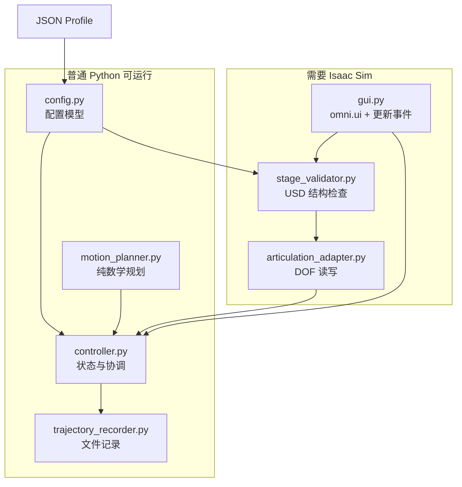

# 01 项目全景与核心概念

## 1. 项目要解决什么问题

目标场景中有一台四关节挖掘机，运动链依次为：

```text
固定底盘 → 驾驶室 Cab → 动臂 Boom → 小臂 Small arm → 铲斗 Bucket
```

用户希望完成四件事：

1. 在 Isaac Sim GUI 中输入每个关节的目标角度。
2. 为每个关节指定独立角速度，让四关节同时开始、各自到达。
3. 随时停止、回到 Home，或把目标重置到当前位置。
4. 将每帧从 Articulation 回读的角度保存为 CSV。

旧方案依赖关节的 Angular Drive。当前目标 USD 已移除 Drive，因此本项目实现了一套完全独立的 Articulation 直接位置控制器。

## 2. 从零认识 Isaac Sim 中的几个对象

### 2.1 USD、Stage 和 Prim

USD（Universal Scene Description）是场景描述体系。可以先把它理解成一棵带属性和关系的场景树。

- **Stage**：当前打开的完整场景。
- **Prim**：Stage 树上的一个节点，例如一个网格、刚体或关节。
- **Prim Path**：节点在树中的绝对路径，例如 `/World/Joints/platform_boom_joint`。
- **Schema/API**：附加在 Prim 上的一组语义和属性，例如 `PhysicsRigidBodyAPI`、`PhysicsMassAPI`。

一个看起来像挖掘机零件的 Mesh，并不会自动成为物理刚体。只有具备对应 Physics API、质量、惯量等属性后，PhysX 才能按物理对象处理它。

### 2.2 Rigid Body、Joint 与 Articulation

- **Rigid Body（刚体）**：不会自身变形的物理物体。本项目有五个 link：底盘、驾驶室、动臂、小臂、铲斗。
- **RevoluteJoint（旋转关节）**：约束两个刚体只允许绕一个轴相对旋转。
- **FixedJoint（固定关节）**：把底盘固定在世界上。
- **Articulation（关节系统）**：PhysX 将一串刚体和关节识别为一个整体后形成的高效多刚体结构。

这个项目要求固定根关节具有 `PhysicsArticulationRootAPI`。PhysX 从根开始沿着四个 RevoluteJoint 发现整条无环链。

### 2.3 DOF 是什么

DOF 是自由度。一个 RevoluteJoint 允许一个角度变化，因此对应一个旋转 DOF。

本项目的四个逻辑关节名是：

```python
("cab", "boom", "small_arm", "bucket")
```

它们是业务层和 CSV 使用的名称。USD/Articulation 中实际使用的 DOF 名则来自关节 Prim 名，例如：

```python
(
    "track_operator_cab_joint",
    "platform_boom_joint",
    "boom_small_arm_joint",
    "small_arm_bucket_joint",
)
```

二者通过 JSON Profile 和 Stage 校验报告建立映射。

### 2.4 Timeline 与物理张量

打开 USD 不代表 Articulation 的运行时对象已经可读写。通常还要：

1. 启动 Timeline。
2. 让 Isaac Sim 更新至少一个或若干个物理帧。
3. 等待 Articulation 的 physics tensor entity 变为有效。

所以面板绑定 Stage 后不会立刻进入可操作状态，而是显示“等待 Articulation physics tensor”。GUI 更新回调会持续检查 `adapter.ready`，准备好后再同步当前角度。

## 3. 两种位置控制思路的区别

| 比较项 | Angular Drive | 本项目的直接位置控制 |
|---|---|---|
| 命令内容 | 目标位置/速度、刚度、阻尼、最大力等 | 直接写 DOF position，并把 velocity 清零 |
| 是否通过力矩追踪 | 是 | 否 |
| 是否体现质量、惯量和跟踪误差 | 可以 | 基本不体现 |
| 运动连续性来源 | 物理求解器与 Drive 参数 | 脚本每帧生成中间位置 |
| “实际角度”含义 | 物理跟踪后的状态 | Articulation 接受并应用后的状态 |
| 典型用途 | 物理合理的机器人驱动 | 确定性摆姿、轨迹播放、数据采集 |

`set_dof_positions` 看上去是瞬时设置。为了避免从 0° 一帧跳到 30°，规划器把整个角度差拆成很多帧，每帧最多走 `speed × dt`。

需要特别明确：这里的恒角速度是**命令位置序列的离散斜率恒定**，不是用力矩让真实机械系统在负载下维持恒速。

## 4. 为什么不能同时保留 Angular Drive

如果同一个 DOF 同时被两套机制控制：

- 脚本每帧直接写位置；
- Angular Drive 又根据自己的历史目标施加力矩；

二者会竞争，可能造成自动运动、位置抖动或结果不可预测。因此 `stage_validator.py` 把应用了 `PhysicsDriveAPI:angular` 的目标关节判定为 `DRIVE_CONFLICT` 错误。

移除 Drive 不等于禁用关节。四个 RevoluteJoint 仍必须满足：

- `physics:jointEnabled = true`；
- 正确且唯一的 `body0`、`body1`；
- 有限的上、下限；
- 父子链连续且无环。

## 5. 分层架构

这个项目刻意把“可在普通 Python 测试的逻辑”和“依赖 Isaac Sim 的逻辑”分开。



### 5.1 每层的单一职责

| 文件 | 只负责什么 | 不负责什么 |
|---|---|---|
| `config.py` | 读取和校验 Profile | 不访问 USD，不控制关节 |
| `stage_validator.py` | 只读发现和检查 Stage | 不修改 USD，不启动运动 |
| `articulation_adapter.py` | 名称到索引、度/弧度转换、批量读写 | 不决定目标和速度 |
| `motion_planner.py` | 根据当前、目标、速度、`dt` 计算下一步 | 不知道 Isaac Sim 和 GUI |
| `controller.py` | 状态机、输入校验、每帧协调、记录生命周期 | 不直接导入 Isaac API |
| `trajectory_recorder.py` | 安全写 CSV 和元数据 | 不读取 Articulation |
| `gui.py` | UI、按钮、Timeline 和更新订阅 | 不重复实现规划公式 |

这种分层让规划器、控制器和记录器能用假的 Adapter 在普通 Python 中测试，不需要每次都启动沉重的 Isaac Sim。

## 6. 一次完整运行的数据流

假设用户把 Cab 目标设为 10°、速度设为 8°/s，然后点击 `Move all`：

1. GUI 从 `SimpleFloatModel` 读取四个目标和四个速度。
2. `MotionController.start_motion()` 校验键集合、有限数、正速度和安全限位。
3. Controller 从 Adapter 回读当前四关节角度。
4. 若不是全部已到达，状态进入 `MOVING`。
5. 每次 App update，GUI 从事件 payload 取得 `dt`。
6. Controller 把 `dt` 限制为不大于 `max_update_dt`。
7. Planner 为每个关节计算 `next = current ± speed × dt`，最后一步直接吸附到目标。
8. Adapter 把 4 个“度”转成形状为 `[1, 4]` 的弧度数组，一次性写入 DOF，并把速度写成 0。
9. Controller 再回读角度，判断是否到达，并更新 GUI。
10. 如果正在记录，把本帧回读角和累计控制时间写入 CSV。

所有关节在同一更新内批量提交，因此不会出现“Cab 已更新但 Bucket 还是上一帧”的人为四次提交问题。

## 7. 项目明确支持与不支持的范围

### 当前支持

- 正好四个 DOF 的固定基座 Articulation；
- 四个串联 RevoluteJoint；
- 每关节独立的正角速度大小；
- 正、反两个方向运动；
- 无超调的目标吸附；
- Stop、Home、目标重置；
- 回读角 CSV 和元数据；
- Stage 变化和窗口关闭时中止记录、释放绑定。

### 当前不支持或没有实现

- 力矩控制、真实动力学速度跟踪；
- 加速度限制、梯形速度、S 曲线；
- 四关节强制同时到达；
- 浮动基座（默认 Profile 明确要求固定基座）；
- 多于或少于四个 DOF；
- 自动修改不合格的 USD；
- 从 GUI 浏览选择文件；当前用字符串字段输入目录和文件名；
- 覆盖已有 CSV；出于安全考虑会直接拒绝。

## 8. “实际角度”应该如何理解

记录器叫 `ActualAngleRecorder`，但要避免过度解读“Actual”：

```text
GUI 目标值
  ↓ 规划器生成本帧命令值
set_dof_positions
  ↓ Isaac Articulation 接受状态
get_dof_positions
  ↓
CSV 中的 actual angle
```

它能确认 Isaac 运行时接受了什么状态，也能排除“只把目标输入写进 CSV”的错误；但它不是编码器测量值，也不代表 Drive/力矩控制中的跟踪误差。

## 9. 下一步

下一章先跑通普通 Python 测试，再进入 Isaac Sim GUI。只有先知道环境分界，后面遇到 `ModuleNotFoundError: omni` 时才不会误判为项目逻辑坏了。
