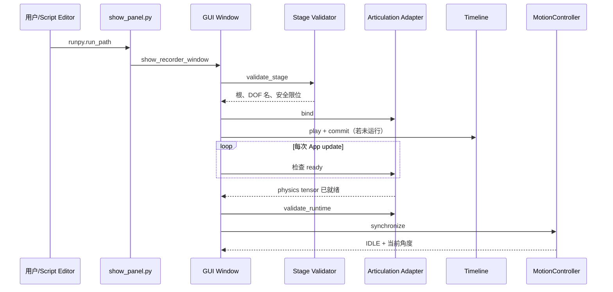

# 02 环境准备与第一次运行

## 1. 先区分两套 Python 环境

这个项目会在两种环境中运行：

| 环境 | 能运行的内容 | 不能运行的内容 |
|---|---|---|
| 普通 Python 3.10+ | 配置、规划器、Controller 的 FakeAdapter 测试、CSV 记录器测试 | `pxr`、`isaacsim`、`omni.*` 相关运行时代码通常不可用 |
| Isaac Sim 自带 Python/Script Editor | 完整 GUI、USD 校验、Articulation 读写、smoke test | 环境启动较重，不适合每次只测一个纯公式 |

`pyproject.toml` 只声明 `requires-python = ">=3.10"`，没有声明 Isaac Sim、NumPy 或 pytest 等依赖。原因是 Isaac 相关包由 Isaac Sim 运行环境提供，而不是普通 PyPI 依赖。

## 2. 在普通 Python 中跑单元测试

### 2.1 当前仓库位置

```text
D:\learning\IntelligentDepartment\CodesSet\Self\260707IsaacSIm
```

项目子目录：

```text
scripts\260720_01JointPositionRecorder
```

### 2.2 检查 Python

```powershell
python --version
```

应为 Python 3.10 或更高版本。若没有 pytest：

```powershell
python -m pip install pytest
```

### 2.3 运行全部纯 Python 测试

在仓库根目录执行：

```powershell
python -m pytest scripts/260720_01JointPositionRecorder/tests -q
```

测试目录中的 `conftest.py` 会把项目的 `src` 目录插入 `sys.path`，所以跑测试不必先安装包。

也可以进入项目目录运行：

```powershell
Set-Location D:\learning\IntelligentDepartment\CodesSet\Self\260707IsaacSIm\scripts\260720_01JointPositionRecorder
python -m pytest
```

### 2.4 可选：以 editable 模式安装

如果想在普通 Python 交互环境直接导入纯逻辑模块：

```powershell
python -m pip install -e D:\learning\IntelligentDepartment\CodesSet\Self\260707IsaacSIm\scripts\260720_01JointPositionRecorder
```

然后可尝试：

```python
from joint_position_recorder.motion_planner import ConstantSpeedPlanner

result = ConstantSpeedPlanner().step(
    current_degrees=(0.0,),
    target_degrees=(10.0,),
    speed_degrees_per_second=(5.0,),
    dt=0.1,
)
print(result.positions_degrees)  # (0.5,)
```

不要在普通 Python 中实例化 `JointPositionRecorderWindow` 或调用 `validate_stage`，因为它们会在方法内部导入 Isaac/pxr 模块。

## 3. 运行 GUI 前检查目标 USD

项目不会把任意挖掘机 USD 自动改造成可控 Articulation。目标 Stage 至少需要：

- 恰好一个可解析的 Articulation Root，或在 Profile 中明确指定根路径；
- 根为 FixedJoint，且通过 `physics:body0` 指向固定基座 link；
- 按 Cab、Boom、Small arm、Bucket 顺序连接的四个 RevoluteJoint；
- 四个关节 enabled、有限位、没有 Angular Drive；
- 五个 link 都启用 RigidBodyAPI、MassAPI，非 kinematic，质量和对角惯量为正；
- 整条父子链单一、连续、无环；
- 运行时整个 Articulation 的 DOF 总数正好是 4。

默认 Profile 针对的关节 Prim 路径是：

```text
/World/Joints/track_operator_cab_joint
/World/Joints/platform_boom_joint
/World/Joints/boom_small_arm_joint
/World/Joints/small_arm_bucket_joint
```

若你的 USD 名称不同，先修改或复制 Profile，不要直接修改控制器源码。

## 4. 在 Isaac Sim GUI 中启动面板

### 4.1 把项目放到 Isaac Sim 所在机器

README 的 Linux 示例位置是：

```text
/root/gpufree-data/repositories/260720_01JointPositionRecorder
```

需要复制的是完整项目目录，而不仅是 `entrypoints/show_panel.py`，因为入口还会加载 `src` 和 `profiles`。

### 4.2 打开目标 Stage

在 Isaac Sim 中打开兼容的 USD，例如设计文档中的：

```text
/root/gpufree-data/wyb/StageMaterial02/Sim_Fangshan_07.usda
```

这里的路径只是项目历史环境示例；以你实际机器上的 USD 路径为准。

### 4.3 从 Script Editor 运行入口

打开：

```text
Window > Script Editor
```

执行：

```python
import runpy

entrypoint = "/root/gpufree-data/repositories/260720_01JointPositionRecorder/entrypoints/show_panel.py"
runpy.run_path(entrypoint, run_name="__main__")
```

入口脚本只做三件事：

```python
PROJECT_ROOT = Path(__file__).resolve().parents[1]
sys.path.insert(0, str(PROJECT_ROOT / "src"))
config = load_project_config(PROFILE_PATH)
show_recorder_window(config, PROJECT_ROOT)
```

因此它不依赖你提前 `pip install` 项目包。

## 5. 面板启动后会发生什么



看到以下状态变化通常是正常的：

```text
Initializing...
→ Stage validated; waiting for the Articulation physics tensor
→ Ready: 4-DOF Articulation is initialized
```

若直接显示 `ERROR:`，到第 7 章按错误代码排查。

## 6. 第一次安全操作建议

建议先做很小的角度变化，不要一上来移动几十度。

1. 等待状态显示 `Ready`。
2. 记下四个 `Current (deg)`。
3. 只把一个关节目标增加 `0.25°`，其他目标保持当前值。
4. 将四个速度先设为 `5°/s`。
5. 点击 `Move all`。
6. 确认被修改的关节从 `Moving` 变成 `Reached`，其他关节保持目标。
7. 点击 `Move home` 前，先确认 Profile 中所有 Home 值都落在当前 Stage 的安全限位内。

注意：编辑 Target 或 Speed 本身不会触发运动，只有 `Move all` 和 `Move home` 才会开始写关节位置。

## 7. 各按钮的准确语义

| 按钮 | 行为 | 是否写 Articulation |
|---|---|---|
| `Bind current stage` | 释放旧绑定、校验当前 Stage、重建 Adapter/Controller，必要时启动 Timeline | 就绪后先回读同步；不发起目标运动 |
| `Move all` | 读取输入框，校验目标/速度，从当前回读位置开始移动 | 是，每个更新帧批量写四 DOF |
| `Stop` | 回读当前角，立刻把当前位置写回并清零速度；目标同步到当前位置 | 是 |
| `Targets = current` | 回读当前角，只把内部目标和 GUI 输入框设为当前值 | 否（不调用 set position） |
| `Move home` | 使用当前 Speed 输入，目标改为 Profile 的 Home 后开始运动 | 是 |
| `Start recording` | 创建 partial CSV，立即写入 `t=0` 初始回读角 | 不因记录本身写关节 |
| `Stop recording` | 要求至少已有第二条样本，落盘并发布 CSV/metadata | 否 |

`Stop` 和 `Targets = current` 最容易混淆：前者调用 `hold_current_position()`，明确写回当前位置并清零 DOF 速度；后者只回读并重置目标。

## 8. 完成一次记录

默认输出位置相对于项目根目录解析：

```text
trajectories/excavator_actual_angles.csv
```

建议操作：

1. 确认 CSV 目录和文件名。
2. 确认同名 `.csv`、`.partial.csv`、`.metadata.json`、`.metadata.partial.json` 都不存在。
3. 点击 `Start recording`。
4. 执行一次或多次运动。
5. 至少等待一个有效更新帧。
6. 点击 `Stop recording`。

成功后得到：

```text
excavator_actual_angles.csv
excavator_actual_angles.metadata.json
```

如果窗口关闭、Stage 被替换或发生运行时错误，记录会被中止，保留 `.partial.csv`，不会冒充完整结果。

## 9. 用 Isaac Sim Python 运行 smoke test

必须使用 Isaac Sim 自带的 Python 启动器，而不是普通 `python`。在 Linux Isaac Sim 环境中，命令形式通常为：

```bash
./python.sh /root/gpufree-data/repositories/260720_01JointPositionRecorder/tests/isaac_articulation_smoke_test.py \
  --usd /root/gpufree-data/wyb/StageMaterial02/Sim_Fangshan_07.usda
```

它会：校验 Stage、初始化 4 DOF、临时偏移约 `0.25°`、回读验证、最后恢复初始角。

GUI smoke test：

```bash
./python.sh /root/gpufree-data/repositories/260720_01JointPositionRecorder/tests/isaac_gui_smoke_test.py \
  --usd /root/gpufree-data/wyb/StageMaterial02/Sim_Fangshan_07.usda
```

它会在 headless Kit 中创建真实窗口对象，等待自动绑定为 `IDLE`，移动并恢复四关节，然后关闭窗口。

这两个测试都会短暂改写关节状态。运行时不要让其他控制器同时写同一个 Articulation。

## 10. 下一步

能够启动不代表理解了“为什么这个 USD 可以绑定”。下一章将沿 `Profile → ProjectConfig → validate_stage → StageValidationReport` 拆解完整校验链。
