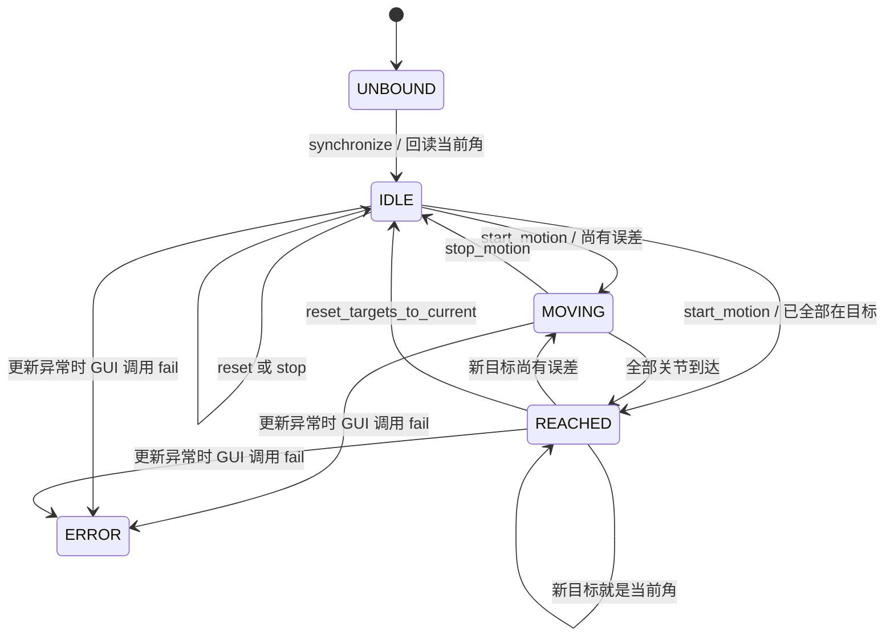

# 04 运动规划器与控制状态机

## 1. 规划问题的最小形式

对一个关节，已知：

- 当前角度 `q`；
- 目标角度 `q_target`；
- 用户指定速度大小 `v > 0`；
- 本帧时间步长 `dt > 0`。

角度误差和本帧最大步长为：

```text
error = q_target - q
maximum_step = v × dt
```

更新规则：

```text
如果 |error| <= 到达容差，直接设为目标
或者 |error| <= maximum_step，直接设为目标，避免越过
否则 q_next = q + sign(error) × maximum_step
```

代码使用 `math.copysign(maximum_step, error)` 同时处理正向和反向。

## 2. 用数字手算一帧

### 2.1 正方向

```text
current = 0°
target = 10°
speed = 4°/s
dt = 0.25 s
maximum_step = 4 × 0.25 = 1°
next = 0 + 1 = 1°
```

### 2.2 反方向

```text
current = 10°
target = -10°
speed = 8°/s
dt = 0.25 s
maximum_step = 2°
error = -20°
next = 10 - 2 = 8°
```

这正是 `test_step_moves_in_both_directions_at_requested_speed` 覆盖的例子。

### 2.3 最后一帧防超调

```text
current = 9.9°
target = 10°
speed = 5°/s
dt = 0.1 s
maximum_step = 0.5°
```

若机械地加 0.5° 会得到 10.4°。规划器发现剩余误差 0.1° 小于最大步长，直接输出 10° 并标记 reached。

## 3. `ConstantSpeedPlanner` 为什么是“纯”模块

`motion_planner.py` 不导入 Isaac Sim、NumPy、GUI 或文件模块。输入是普通 `Sequence[float]`，输出是不可变 `PlannerResult`：

```python
PlannerResult(
    positions_degrees=(...),
    reached=(...),
)
```

这种纯函数式边界带来三个好处：

- 可以用普通 pytest 快速测试；
- 相同输入一定得到相同输出；
- 将来替换 Isaac Adapter 或 GUI，不影响规划数学。

规划器会拒绝：

- 三组数组为空或长度不一致；
- `dt <= 0`、NaN 或 Infinity；
- 任一角度/速度不是有限数；
- 任一速度不为正。

用户输入的是速度**大小**，运动方向由目标误差决定，所以反向运动也仍输入正速度。

## 4. 四关节如何一起运动

Planner 用 `zip(current, targets, speeds)` 对每个关节独立套用同一公式：

```text
Cab        目标距离  8° / 速度 8°/s → 1 s 到达
Boom       目标距离 20° / 速度 5°/s → 4 s 到达
Small arm  目标距离 10° / 速度 5°/s → 2 s 到达
Bucket     目标距离  1° / 速度 1°/s → 1 s 到达
```

四个关节同时开始，但整体需要 4 秒，因为 Boom 最晚结束：

```python
duration = max(abs(target - current) / speed for ...)
```

`expected_duration_seconds()` 实现了这个计算，但当前 GUI 没有显示预计时长。

“同步启动”不等于“同步到达”。若需要同时到达，应先选共同持续时间 `T`，再为每个关节计算 `speed_i = distance_i / T`；这属于可新增模式，不应偷偷改写用户输入速度的含义。

## 5. 为什么限制 `dt`

默认：

```text
max_update_dt = 0.05 s
```

Controller 中实际使用：

```python
dt_value = min(dt_value, self.config.max_update_dt)
```

假设 Cab 为 8°/s，某次 GUI 卡顿后事件给出 `dt = 1.0 s`：

- 不限制时一步跳 8°；
- 限制后只推进 `8 × 0.05 = 0.4°`。

这能避免卡顿帧产生大幅位置跳跃。代价是控制进度会落后于真实墙钟时间；程序选择安全、平滑的推进，而不是在下一帧追赶全部丢失时间。

Controller 对 `dt <= 0` 或非有限值直接返回当前快照，不运动，也不追加记录样本，从而避免重复或无效时间戳。

## 6. Adapter Protocol：Controller 与 Isaac 解耦的关键

`controller.py` 定义了一个 `PositionAdapter` Protocol：

```python
class PositionAdapter(Protocol):
    @property
    def ready(self) -> bool: ...
    def get_positions_degrees(self) -> tuple[float, ...]: ...
    def set_positions_degrees(self, positions_degrees): ...
    def hold_current_position(self) -> tuple[float, ...]: ...
```

Controller 只依赖这四个能力，不关心实现者是不是 Isaac Sim。单元测试用 `FakeAdapter` 在内存中保存 tuple，并记录写入历史，因此能测试完整状态机而不启动仿真器。

这也是依赖倒置的一个小而清晰的例子：高层控制逻辑依赖抽象协议，Isaac 细节留在具体 Adapter。

## 7. Controller 内部保存什么

初始化时：

```text
joint_names  = Profile 中固定顺序
limits       = Stage 校验得到的安全范围
planner      = ConstantSpeedPlanner
state        = UNBOUND
_current     = 暂置为 0
_targets     = Profile Home
_speeds      = Profile 默认速度
_reached     = 全 False
_recorder    = None
```

注意，初始化时的 `_current = 0` 不是实际角度。必须等 Adapter ready 后调用 `synchronize()` 才会回读真实状态。

## 8. 状态机

状态定义：

```text
UNBOUND, IDLE, MOVING, REACHED, ERROR
```



GUI 释放绑定后会直接丢弃当前 Controller；因此“Stage 被替换”在 UI 生命周期层表现为回到未绑定，而不是在旧 Controller 上再设置 `UNBOUND`。

## 9. 重要方法逐个理解

### 9.1 `synchronize()`

前提是 `adapter.ready`。它：

1. 回读实际位置。
2. 检查数量和有限数。
3. 把目标设为当前角，避免绑定瞬间运动。
4. 把四关节 reached 设为 True。
5. 状态进入 `IDLE`。

这是非常重要的安全设计：程序不会一绑定就朝 Profile 中的 Home 自动移动。

### 9.2 `set_targets_and_speeds()`

它要求输入字典的键集合**恰好**等于四个逻辑名，不能缺失也不能多余。逐关节检查：

- 目标为有限数；
- 目标位于 Stage 派生的安全范围，边界可取；
- 速度为有限正数。

这个方法只更新命令参数，不改变状态，也不写 Articulation。

### 9.3 `start_motion()`

在保存新目标/速度后，它再次从 Adapter 回读真实起点，然后判断每个关节是否已经在容差内：

- 全部已到达：直接 `REACHED`；
- 至少一个未到达：`MOVING`。

因此点击 `Move all` 才真正触发状态变化，仅修改 GUI 输入框不会运动。

### 9.4 `update(dt)`

每个有效更新的准确顺序：

```text
检查已同步且 Adapter ready
→ 校验 dt，限制到 max_update_dt
→ 回读四关节当前角
→ 若 MOVING：Planner 算下一步
→ 批量写四关节下一步
→ 再次回读
→ 用“目标与回读值之差”重新判断 reached
→ 若全部到达：再明确写一次精确目标并回读，状态 REACHED
→ 若正在记录：累计 dt，写本帧回读角
→ 返回不可变 Snapshot
```

Controller 没有直接信任 Planner 的 `result.reached`，而是根据写入后的实际回读值重新判断。这使状态取决于 Adapter 报告的结果，而不只是命令意图。

当状态不是 `MOVING` 时，`update()` 仍会在有效帧回读当前位置；如果正在记录，即使设备静止也会继续追加样本。

### 9.5 `stop_motion()`

调用 Adapter 的 `hold_current_position()`。Isaac 实现会：

- 回读当前位置；
- 把同一位置写回；
- 把 DOF 速度清零。

随后目标同步为当前角，状态进入 `IDLE`。所以下次运动不会继续追逐旧目标。

### 9.6 `reset_targets_to_current()`

只回读、重置目标和 reached，不调用 `set_positions_degrees()`。正常状态进入 `IDLE`；若原状态为 `ERROR`，它有意保留 `ERROR`。

### 9.7 Home

Controller 的 `start_home_motion()` 使用内部当前速度。GUI 的 `move_home()` 则先读取当前四个 Speed 输入框，再直接调用 `start_motion(home_targets, speeds)`，因此用户在 GUI 中刚修改的速度会生效。

Profile 创建时只验证 Home 是有限数，不知道某个 Stage 的限位；真正点击 Home 时仍会通过 Controller 的安全范围检查。不合法时不会运动，并显示 `outside safe range`。

### 9.8 `fail()`

把状态设为 `ERROR` 并中止正在进行的记录。GUI 的每帧 `_on_update` 异常会调用它；普通按钮回调自身捕获异常时只更新错误文本，不一定把 Controller 状态改为 ERROR。这一差异属于当前实现细节。

## 10. Snapshot 为什么有用

`ControllerSnapshot` 是不可变的当前视图，包含：

- 总状态；
- 当前、目标、速度字典；
- 每关节 reached；
- 是否记录；
- 已记录样本数。

GUI 只拿 Snapshot 刷新标签，测试也用 Snapshot 断言结果。这样外部不必直接修改 Controller 私有字典。

## 11. 测试中的一个容易误读的例子

控制器测试第一次调用：

```python
controller.update(0.25)
```

Cab 速度是 2°/s，但结果不是前进 0.5°，而是 0.1°：

```text
输入 dt = 0.25
被 max_update_dt 截成 0.05
2 × 0.05 = 0.1°
```

其他三个结果 `(0.2, -0.05, 0.05)` 也分别来自各自速度乘 0.05。这个测试同时证明独立速度、正反方向和 `dt` 截断。

## 12. 运动算法的现实边界

每帧直接写 position 并把 velocity 清零，意味着：

- 运动视觉上连续，但物理速度状态不是持续的非零关节速度；
- 没有加速和减速过程；
- 质量、惯量不会像力矩控制那样决定跟踪结果；
- 卡顿帧后不会追赶墙钟时间；
- 到达精度由直接写入、浮点转换和回读共同决定。

如果任务是确定性地摆姿并采集同步数据，这些特性通常是优势；如果目标是研究动力学控制，则需要不同架构。

## 13. 下一步

规划器和 Controller 全程使用“度”，但 Isaac API 使用弧度；Controller 还不知道 DOF 在 Articulation 中的实际索引。下一章进入 Adapter 和 GUI 生命周期，看看这两个边界如何被处理。
