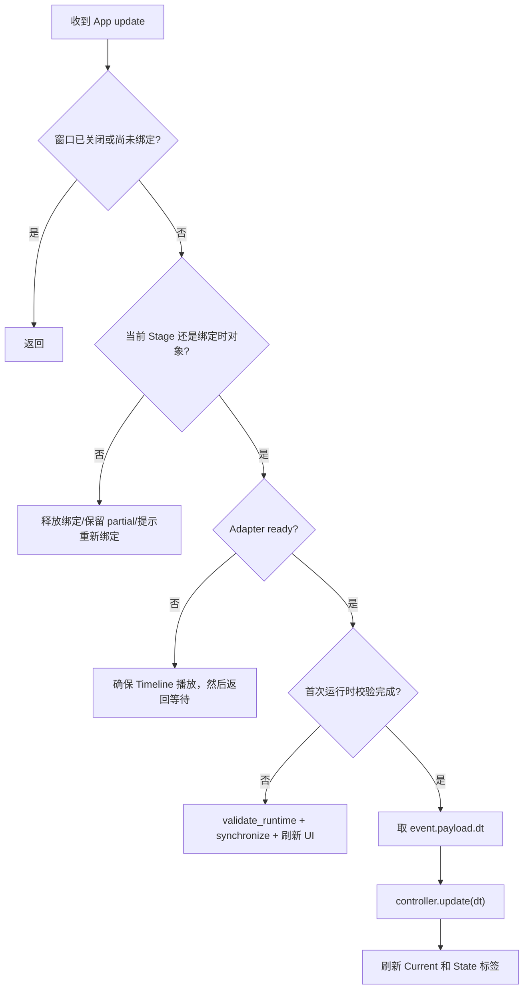

# 05 Isaac 适配层与 GUI 生命周期

## 1. 为什么需要单独的 Adapter

业务层希望使用：

```text
逻辑关节顺序 + 角度制 tuple
```

Isaac Articulation API 面对的是：

```text
运行时 DOF 索引 + 弧度制张量/数组
```

`IsaacArticulationAdapter` 就是二者之间的防腐层。它集中解决：

- Articulation wrapper 创建；
- DOF 名称到索引映射；
- physics tensor 是否可用；
- 度和弧度转换；
- Python tuple 与 NumPy 数组形状转换；
- Isaac 异常向项目异常的包装。

如果把这些代码散在 GUI 和 Controller 中，纯逻辑就无法脱离 Isaac 测试，单位错误也更难定位。

## 2. Adapter 的构造参数

```python
IsaacArticulationAdapter(
    articulation_root_path,
    ordered_dof_names,
)
```

两个参数都来自 `StageValidationReport`：

```python
ordered_dof_names = tuple(
    report.dof_names[joint.logical_name]
    for joint in config.joints
)
```

这里再次按 Profile 的四关节顺序取值，因此后续 tuple 的位置稳定表示：

```text
索引 0 = cab
索引 1 = boom
索引 2 = small_arm
索引 3 = bucket
```

构造时只检查根路径非空、DOF 名列表非空且唯一；此时还没有访问 PhysX 运行时。

## 3. `bind()`：不能猜 DOF 索引

核心流程：

```python
from isaacsim.core.experimental.prims import Articulation

articulation = Articulation(root_path)
检查每个 ordered_dof_name 都在 articulation.dof_names 中
indices = articulation.get_dof_indices(list(ordered_dof_names)).numpy()
保存扁平化后的整数索引
```

为什么不直接使用 `(0, 1, 2, 3)`？

- USD Prim 的文本排列不保证等于 PhysX 运行时 DOF 顺序；
- 场景编辑或导入器可能改变内部顺序；
- 按名称解析能在顺序变化时仍保持正确语义；
- 名称缺失会明确报错，而不是悄悄控制错误关节。

这是一条重要的机器人软件原则：**外部稳定标识映射到运行时索引，索引只在适配层内部使用。**

## 4. `bound`、`ready` 和 `validate_runtime()` 的差别

### 4.1 `bound`

```text
已创建 Articulation wrapper，并成功解析出非空 DOF 索引
```

它不代表 PhysX 已完成初始化。

### 4.2 `ready`

只有 bound 后，且：

```python
articulation.is_physics_tensor_entity_valid()
```

返回真，才算 ready。检查本身异常时返回 False，GUI 会继续等待，而不是马上崩溃。

### 4.3 `validate_runtime()`

它会明确抛出：

- 尚未 bind；
- physics tensor 未准备好；
- 整个 Articulation 的 `num_dofs` 不等于预期名称数量。

最后一项意味着当前项目不仅要“找到四个目标 DOF”，还要求 Articulation **总共正好四个 DOF**。如果 Stage 上额外连接了第五个可动关节，Stage 静态校验可能通过选定的四关节，但运行时会被这里拒绝。

## 5. 读取位置：弧度转度

```python
values = articulation.get_dof_positions(
    dof_indices=list(self._dof_indices)
).numpy()
flattened = values.reshape(-1)
degrees = tuple(math.degrees(float(v)) for v in flattened.tolist())
```

读取后还会检查扁平数组的元素数是否正好等于四个索引，避免把异常形状误当成有效状态。

单位边界如下：

```text
Isaac API 输出 radians
→ Adapter math.degrees
→ Controller / GUI / CSV 全部使用 degrees
```

## 6. 写入位置：一次提交四 DOF

`set_positions_degrees()` 先检查：

- Adapter 已 ready；
- 输入数量与 DOF 索引数相同；
- 每个值都是有限数。

然后创建数组：

```python
radians = np.asarray(
    [[math.radians(value) for value in positions]],
    dtype=np.float32,
)
zeros = np.zeros_like(radians)
```

为什么是双层列表 `[[...]]`？因为 Articulation API 的第一个维度代表一个或多个 articulation 实例；当前只控制一个实例，因此形状是 `[1, 4]`。

随后：

```python
articulation.set_dof_positions(radians, dof_indices=indices)
articulation.set_dof_velocities(zeros, dof_indices=indices)
```

位置和速度分别调用，但每次都覆盖选中的四个 DOF。速度被清零是直接状态控制语义的一部分，避免保留先前运动速度。

`float32` 转换和弧度/度往返可能引入极小误差，所以测试和 smoke test 使用近似比较，而不是要求二进制完全相同。

## 7. `hold_current_position()` 与 `shutdown()`

`hold_current_position()`：

```text
读当前度数 → 原值写回 → 清零速度 → 返回当前度数
```

Controller 的 Stop 使用它。

`shutdown()` 则清掉 wrapper 和索引，不修改 Stage，也不关闭 Timeline。窗口释放绑定时调用它，防止旧 Adapter 继续被误用。

## 8. GUI 为什么采用延迟导入

`gui.py` 文件顶层没有导入 `omni.ui`。相关导入位于窗口构造函数中：

```python
import omni.kit.app
import omni.timeline
import omni.ui as ui
import omni.usd
```

类似地，`stage_validator.py` 在函数内部导入 `pxr.UsdPhysics`，Adapter 在方法内部导入 Isaac Articulation 和 NumPy。

这样普通 Python 可以导入包中的大多数对象并运行纯测试，不会仅因为机器没有 `omni` 就在模块加载阶段失败。真正调用 Isaac 功能时仍必须处于 Isaac Sim 环境。

## 9. GUI 对象持有哪些运行时资源

`JointPositionRecorderWindow` 保存：

| 成员 | 作用 |
|---|---|
| `_usd_context` | 获取当前 Stage、检测 Stage 是否被替换 |
| `_timeline` | 启动物理 Timeline |
| `_app` | 订阅 Kit update 事件 |
| `_stage` | 绑定时的 Stage 对象，用身份比较检测变化 |
| `_report` | Stage 路径、DOF 名和安全限位 |
| `_adapter` | Isaac 运行时读写边界 |
| `_controller` | 运动与记录状态机 |
| `_runtime_validated` | 是否已完成 physics tensor 校验和同步 |
| `_update_subscription` | 每帧回调订阅的生命周期句柄 |
| `_target_models` / `_speed_models` | 每关节输入模型 |
| `_current_labels` / `_joint_status_labels` | 每关节只读显示 |

## 10. 面板的构建

窗口标题：

```text
Articulation Joint Position Recorder
```

默认大小 `850 × 660`。每个关节一行，包含：

```text
Joint | Current (deg) | Target (deg) | Speed (deg/s) | State
```

Target 和 Speed 使用 `ui.SimpleFloatModel`；输入控件是 `ui.FloatDrag`。速度控件的 UI 最小值是 `0.001`，Controller 还会再次校验速度为有限正数。

CSV 目录和文件名使用 `SimpleStringModel`。当前实现没有文件选择器，也没有在关节行显示安全限位；目标超限时由 Controller 抛出包含范围的错误文本。

## 11. 自动绑定的完整生命周期

构造窗口后立即：

1. 创建 App update 订阅。
2. 调用 `bind_current_stage()`。
3. 先 `_release_binding(abort_recording=True)`，确保旧资源清掉。
4. 从 USD context 获取 Stage。
5. 调用 `validate_stage()`，错误一次性拼到状态文本。
6. 按逻辑顺序构建实际 DOF 名 tuple。
7. 创建并 bind Adapter。
8. 创建 Controller，把安全限位交给它。
9. 若 Timeline 没播放，调用 `play()` 和 `commit()`。
10. 状态显示等待 physics tensor。

此时 `_controller` 已存在，但 `_runtime_validated` 仍是 False，按钮通过 `_require_controller()` 会拒绝过早操作。

## 12. 每帧 `_on_update()` 做什么



如果首次 `synchronize()` 成功，GUI 会把四个 Target 输入框改为实际当前角，状态显示 `Ready`。这避免默认 Home 值导致意外运动。

## 13. GUI 如何显示每关节状态

- 整体 `MOVING` 时：每个关节根据 `joint_reached` 显示 `Moving` 或 `Reached`。
- 整体 `ERROR` 时：全部显示 `Error`。
- 其他状态：显示 `Idle`、`Reached` 或 `Unbound` 的标题形式。

已先到达的关节可以显示 `Reached`，而整体仍是 `MOVING`，直到最后一个关节到达。

## 14. Stage 变化、异常与记录保护

### 14.1 Stage 被替换

每帧使用对象身份检查：

```python
self._usd_context.get_stage() is not self._stage
```

若变化：

- 中止当前记录并保留 partial；
- shutdown Adapter；
- 清空 Controller、Report 和 Stage 引用；
- 提示重新点击 Bind。

### 14.2 更新异常

`_on_update()` 捕获异常后：

1. 调用 `controller.fail()`；
2. 状态变为 `ERROR`；
3. 中止记录；
4. GUI 状态文本显示异常。

按钮回调也会捕获异常并显示 `ERROR:`，但当前实现只有更新回调显式调用 `fail()`。例如目标超限通常只是命令被拒绝，Controller 原状态可能仍保持不变。

### 14.3 窗口关闭

窗口不可见时调用 `shutdown()`：

- 用 `_closed` 防止重复执行；
- 中止记录；
- 关闭 Adapter 绑定；
- 把 update subscription 引用设为 None，让旧订阅释放。

## 15. 为什么重复运行入口不会叠加控制器

模块级变量：

```python
_ACTIVE_WINDOW: JointPositionRecorderWindow | None = None
```

`show_recorder_window()` 创建新窗口前先 shutdown 旧实例，然后替换全局引用。这防止在同一个模块实例中重复执行入口时，多个面板更新回调同时写同一个 Articulation。

它仍是 Script Editor 脚本式面板，不是完整 Isaac Extension。若将来做成可安装 Extension，还需要把 startup/shutdown 生命周期接到扩展框架中。

## 16. 常见运行时错误从哪里来

| 错误文本片段 | 来源 | 含义 |
|---|---|---|
| `Missing DOFs ... available DOFs=...` | `bind()` | Stage 静态关节名与运行时 Articulation 名不一致 |
| `physics tensor is not ready` | `validate_runtime()` | Timeline/物理帧尚未初始化或 Articulation 无效 |
| `Expected 4 DOFs, got ...` | `validate_runtime()` | Articulation 有额外或缺失自由度 |
| `Expected 4 DOF values, got shape ...` | 读取 | Isaac 返回数组形状不符合预期 |
| `Cannot set DOF positions` | 写入 | 运行时失效、索引/API/数组兼容等底层错误 |
| `Articulation is not ready` | GUI | 在首次运行时同步完成前点击了按钮 |

所有底层异常会被包装为 `ArticulationAdapterError` 并保留原异常文本，调试时既有项目语义也有 Isaac 原因。

## 17. 下一步

运动更新的最后一步是记录。下一章解释为什么开始记录时看见 `.partial.csv`、为什么必须至少两个样本、正式 CSV 和 metadata 如何发布，以及记录时间与真实时间的差别。
