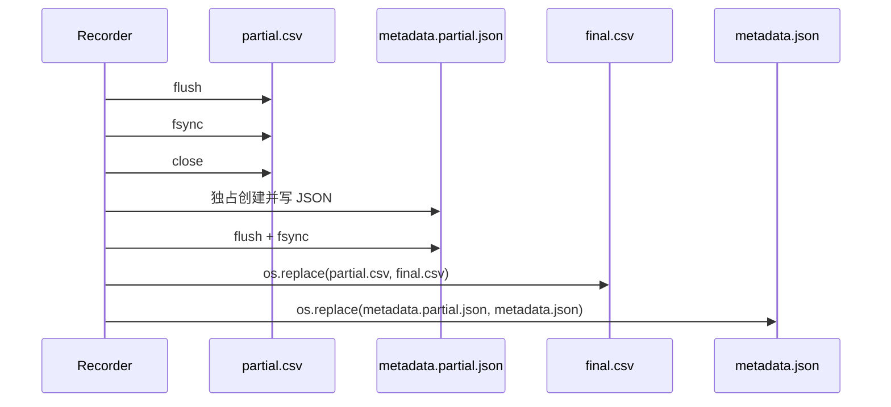

# 06 轨迹记录器与数据格式

## 1. 记录器要保证什么

一个轨迹文件不仅要“能写”，还要尽量避免：

- 覆盖已有数据；
- 程序异常时留下看似完整的正式 CSV；
- 关节列顺序不稳定；
- 时间倒退或重复；
- NaN/Infinity 混入数据；
- CSV 已发布但没有任何有效时间跨度。

`ActualAngleRecorder` 因此采用了 partial 文件和显式生命周期。

## 2. 文件命名

假设输出为：

```text
angles.csv
```

构造函数自动派生：

```text
angles.partial.csv
angles.metadata.json
angles.metadata.partial.json
```

| 文件 | 何时存在 | 含义 |
|---|---|---|
| `angles.partial.csv` | 记录进行中或异常中止后 | 尚未正式发布的数据 |
| `angles.csv` | 正常停止后 | 完成的轨迹 |
| `angles.metadata.partial.json` | stop 发布过程中的短暂中间态 | 尚未正式发布的元数据 |
| `angles.metadata.json` | 正常停止后 | 完成轨迹的上下文和统计 |

## 3. 路径安全检查

### 3.1 GUI 输入路径解析

`resolve_csv_path(directory, filename)` 要求：

- filename 去除空白后非空；
- `Path(name).name == name`，即不能带目录部分；
- 后缀必须是 `.csv`，大小写不敏感。

所以这些会被拒绝：

```text
../angles.csv
subdir/angles.csv
angles.txt
```

目录字段本身可以是相对或绝对路径，并通过 `expanduser().resolve()` 解析。当前函数允许用户把输出目录指向项目外部；它只阻止借 filename 做路径穿越，不限制目录必须位于项目内。

### 3.2 Recorder 构造校验

`ActualAngleRecorder(output_path, joint_names)` 还要求：

- 关节名序列非空且唯一；
- output path 以 `.csv` 结尾。

Controller 始终传入 Profile 中稳定顺序：

```text
cab, boom, small_arm, bucket
```

## 4. 开始记录 `start()`

流程：

1. 拒绝 Recorder 已经 active 的重复 start。
2. 检查正式 CSV、partial CSV、正式 metadata、partial metadata 四个路径都不存在。
3. 创建输出父目录。
4. 用文件模式 `"x"` 独占创建 partial CSV；即使检查后发生竞争，也不会静默覆盖。
5. 创建 CSV writer，固定使用 `\n` 行结束符。
6. 写表头。
7. 保存初始 metadata。
8. 自动调用 `record(0.0, initial_positions)` 写第一条样本。

表头固定为：

```csv
time,cab,boom,small_arm,bucket
```

开始记录时 Controller 会先从 Adapter 回读当前角，再把它作为 `t=0` 样本，因此轨迹有明确起点。

## 5. 每条样本 `record()`

输入：

```python
record(elapsed_seconds, positions_degrees)
```

校验规则：

- Recorder 必须 active；
- 位置数量等于关节列数；
- 时间有限且非负；
- 所有位置有限；
- 除第一条外，时间必须严格大于上一条。

输出精度统一为小数点后 9 位：

```csv
0.020000000,1.000000000,2.000000000,3.000000000,4.000000000
```

CSV writer 会处理标准 CSV 转义，虽然当前列都是数值和简单名称。

## 6. Controller 记录的到底是哪一个值

运动帧中的顺序是：

```text
Planner 生成 next position
→ Adapter 写入
→ Adapter 回读
→ Controller 更新 _current
→ Recorder 写 _current
```

所以记录的是 Adapter 回读值，而不是：

- GUI Target；
- Planner 尚未应用的计算结果；
- Angular Drive targetPosition。

在最后到达帧，Controller 会明确写入精确目标并再次回读，然后再记录，因此正常情况下最后一条运动样本可以包含精确最终目标。

## 7. 记录时间的真实含义

Controller 内部维护：

```python
self._record_elapsed += dt_value
```

这里的 `dt_value`：

- 来自 Kit App update 事件 payload；
- 必须为有限正数；
- 会被截断到 `max_update_dt`，默认最多 0.05 秒。

因此 CSV 的 `time` 是**累计控制更新时间**，不是：

- `time.time()` 的墙钟时间；
- USD Timeline 的绝对时间码；
- 未截断的所有 App 卡顿时长。

例如真实卡顿 1 秒，但事件 `dt=1.0` 被截成 0.05，运动只推进 0.05 秒，记录时间也只增加 0.05 秒。这让轨迹的时间轴与实际使用的规划步长保持一致。

当 Controller 处于 IDLE 或 REACHED 时，只要记录 active 且 `dt` 有效，仍会每帧回读并写静止样本。

## 8. 正常停止与发布

`stop()` 要求至少两条样本：

```text
t = 0 的初始样本 + 至少一个正时间样本
```

如果点击 Start 后立刻 Stop，尚未发生有效 update，`sample_count < 2` 会报错。此时 Recorder 仍处于 active，可等待一帧后再次 Stop，或通过关闭窗口/异常路径 abort。

正常发布步骤：



`os.replace` 对单个文件的替换通常是原子操作，因此正式文件不会经历“逐行写到一半”的可见状态。

严谨地说，CSV 和 metadata 是先后两次 replace，二者作为一对并非事务原子：如果系统恰好在两次 replace 之间崩溃，可能短暂留下正式 CSV 和 partial metadata。恢复流程应检查这四个派生路径，而不只检查 CSV。

## 9. 元数据内容

GUI 开始记录时传入：

```json
{
  "profile": "four_joint_fixed_base_excavator",
  "control_mode": "articulation_direct_position",
  "angle_unit": "degree",
  "speed_unit": "degree_per_second",
  "articulation_root": "...",
  "joint_paths": {},
  "dof_names": {},
  "stage": "..."
}
```

GUI 停止时补充：

```json
{
  "final_motion_state": "REACHED",
  "final_targets_degrees": {},
  "commanded_speeds_degrees_per_second": {}
}
```

Recorder 最终强制补充统计：

```json
{
  "csv": "输出 CSV 的绝对路径",
  "joint_order": ["cab", "boom", "small_arm", "bucket"],
  "sample_count": 123,
  "duration_seconds": 2.033333333,
  "completed": true
}
```

若同名键重复，更新顺序是：开始 metadata → 停止 metadata → Recorder 强制统计。因此 `completed`、样本数等最终统计不会被调用者的旧值覆盖。

JSON 使用 UTF-8、保留非 ASCII 字符、两空格缩进，并按键名排序，方便版本比较和人工阅读。

## 10. 异常中止 `abort()`

abort 会：

- flush 并关闭仍打开的 CSV stream；
- 不发布正式 CSV；
- 不生成 completed metadata；
- 返回 partial CSV 路径（如果存在）。

触发 abort 的典型情况：

- Stage 被切换；
- GUI 更新发生异常并调用 Controller `fail()`；
- 重新绑定 Stage；
- 窗口关闭；
- 新面板替换旧面板。

保留 partial 比自动删除更适合数据采集：它既表明记录不完整，又给排查或人工恢复留下原始数据。

## 11. 为什么拒绝覆盖所有派生文件

开始前会检查：

```text
final CSV
partial CSV
final metadata
partial metadata
```

任何一个存在都会拒绝。这样避免：

- 覆盖一次完成采集；
- 把上次中止的 partial 混入新任务；
- 新 CSV 与旧 metadata 错配；
- 上次发布中断的残留被忽视。

重新记录时应使用新文件名，或在确认备份和数据归属后人工处理旧文件。项目不会自动删数据。

## 12. 用 Python 快速检查轨迹

下面的脚本只用标准库，能检查时间严格递增、列数和每关节大致速度：

```python
import csv
from pathlib import Path

path = Path("trajectories/excavator_actual_angles.csv")

with path.open(encoding="utf-8", newline="") as stream:
    rows = list(csv.DictReader(stream))

times = [float(row["time"]) for row in rows]
assert all(b > a for a, b in zip(times, times[1:]))

joint_names = ("cab", "boom", "small_arm", "bucket")
for name in joint_names:
    values = [float(row[name]) for row in rows]
    segment_speeds = [
        (q1 - q0) / (t1 - t0)
        for q0, q1, t0, t1 in zip(values, values[1:], times, times[1:])
        if t1 > t0
    ]
    print(name, "samples=", len(values), "first speeds=", segment_speeds[:5])
```

到达目标后的片段速度会是 0；最后一个不足完整步长的采样区间，其平均速度绝对值也可能小于命令速度。这不是超调，而是目标吸附的自然结果。

## 13. 当前记录器的边界

- 活跃记录期间没有每一行都 `flush/fsync`，突然断电时内存缓冲中的最后若干行可能丢失；正常 stop 会完整 flush/fsync。
- `abort()` 会 flush，但没有调用 fsync；它主要保证进程级异常保留 partial，不承诺断电级持久性。
- CSV 时间没有保存墙钟时间和帧编号。
- 不记录每帧目标命令、原始未截断 `dt` 或 DOF velocity。
- 正式 CSV 和 metadata 分别原子替换，但二者不是一个跨文件事务。

这些不是理解错误，而是当前实现明确的工程取舍。若采集任务对断电恢复或可审计性要求更高，可以增加周期 flush、帧号、wall-clock 字段或采集会话清单。

## 14. 下一步

到这里，主代码的数据流已经完整。下一章将把单元测试和 Isaac smoke test 对应到各模块，并按错误来源给出系统化排查方法，同时列出源码与设计文档之间仍存在的边界。
