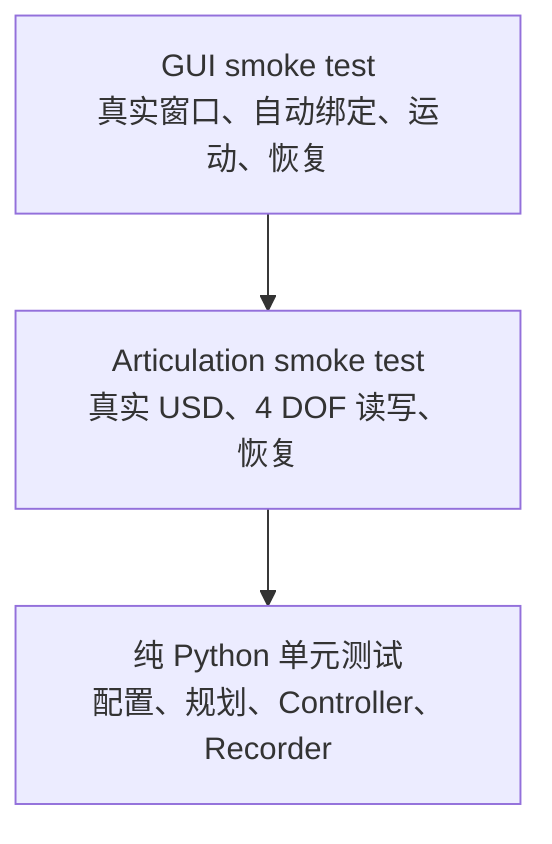

# 07 测试、调试与常见问题

## 1. 这个项目的测试分层



越往上越接近真实使用，启动更慢、环境依赖更多；越往下反馈更快、错误定位更精确。理想验证顺序是先通过底层，再进入上层。

## 2. 纯 Python 测试基线

在仓库根目录：

```powershell
python -m pytest scripts/260720_01JointPositionRecorder/tests -q
```

本笔记核对时共有 17 个测试用例通过。两个 `isaac_*_smoke_test.py` 文件名不以 `test_` 开头，所以普通 pytest 默认不会把它们当测试收集；这正好避免普通 Python 误启动 Isaac 集成测试。

### 2.1 只跑某个模块

```powershell
python -m pytest scripts/260720_01JointPositionRecorder/tests/test_motion_planner.py -q
python -m pytest scripts/260720_01JointPositionRecorder/tests/test_controller.py -q
python -m pytest scripts/260720_01JointPositionRecorder/tests/test_trajectory_recorder.py -q
```

### 2.2 显示测试名和详细失败

```powershell
python -m pytest scripts/260720_01JointPositionRecorder/tests -vv
```

### 2.3 只跑包含关键词的测试

```powershell
python -m pytest scripts/260720_01JointPositionRecorder/tests -k "clamp or overwrite" -vv
```

## 3. 每组单元测试证明了什么

### 3.1 `test_config.py`

| 测试 | 证明 |
|---|---|
| 默认 Profile 契约 | 逻辑顺序是 cab、boom、small_arm、bucket；默认速度是 8/5/5/5；要求固定基座 |
| 正好四关节 | 只给三个关节会抛 `ConfigurationError` |
| 正速度 | 默认速度为 0 会被拒绝 |

这组测试没有覆盖所有配置错误分支，例如重复逻辑名、非法 CSV 名和非有限数；阅读 `validate()` 时应知道测试覆盖不等于完整规格。

### 3.2 `test_motion_planner.py`

| 测试 | 证明 |
|---|---|
| 正反两个方向 | `math.copysign` 方向正确 |
| 最后一帧吸附 | 不越过目标，`all_reached` 正确 |
| 预计总时长 | 取最晚到达关节的最大值 |
| 非法 `dt` 参数化 | 0、负数和 NaN 都被拒绝 |

参数化的三个非法 `dt` 会计作三个测试，因此该文件实际贡献 6 个通过项。

### 3.3 `test_controller.py`

测试使用内存 `FakeAdapter`。它的写入立即变成下一次回读，所以模拟的是直接状态接口，而不是动力学跟踪。

| 测试 | 证明 |
|---|---|
| 四关节独立移动 | 不同速度和方向能在同一 Controller 中推进并最终到达 |
| 大 `dt` 截断 | 1 秒输入只按 0.05 秒推进，Cab 8°/s 得到 0.4° |
| Stop 保持回读位置 | 目标同步为当前值，状态回到 IDLE |
| 安全限位 | Cab 179° 在默认安全范围外会被拒绝 |
| 记录 Adapter 回读 | CSV 最后一行来自 FakeAdapter 实际值，不是目标 |

### 3.4 `test_trajectory_recorder.py`

| 测试 | 证明 |
|---|---|
| 正常发布 | partial 最终变正式 CSV，metadata 完整，列和精度正确 |
| 拒绝覆盖 | 已有正式文件时不会覆盖 |
| abort 保留 partial | 异常中止后没有正式 CSV，partial 仍在 |

## 4. 单元测试没有证明什么

17 个通过不代表：

- 目标 USD 能被解析和绑定；
- Isaac Sim 版本仍提供相同 experimental Articulation API；
- GPU、驱动和 PhysX 正常；
- `omni.ui` 控件签名没有变化；
- physics tensor 能成功初始化；
- 真实 Articulation 回读与命令在容差内；
- GUI 更新事件中的 payload 一定含预期 `dt`。

这些需要集成 smoke test 和人工 GUI 验证。

## 5. Articulation smoke test

脚本：`tests/isaac_articulation_smoke_test.py`

典型命令：

```bash
./python.sh /absolute/path/to/260720_01JointPositionRecorder/tests/isaac_articulation_smoke_test.py \
  --usd /absolute/path/to/Sim_Fangshan_07.usda
```

可选参数：

```text
--headless / --no-headless    默认 headless
--offset-degrees 0.25         临时关节偏移量
```

执行流程：

1. 首先创建 `SimulationApp`，再导入 `omni.*`。
2. 打开传入的 USD，更新 10 次等待加载。
3. 加载 Profile 并执行 Stage 静态校验。
4. 按名称构建 Adapter。
5. 启动 Timeline，最多等待 240 次 update 让 tensor ready。
6. 保存初始角。
7. 将每关节尝试增加 offset，并夹在安全范围内。
8. 一次性写入，更新一帧，回读误差要求不超过 0.05°。
9. 恢复初始角并更新一帧。
10. 无论成功失败，`finally` 都关闭 SimulationApp。

成功输出包括：

```text
PASS: validated 4-DOF articulation, wrote and restored joint positions
root=...
dofs=...
```

虽然脚本尽力恢复初始角，但若在写入后进程被强制终止，恢复步骤可能来不及执行。因此不要在其他控制器同时工作时运行。

## 6. GUI smoke test

脚本：`tests/isaac_gui_smoke_test.py`

```bash
./python.sh /absolute/path/to/260720_01JointPositionRecorder/tests/isaac_gui_smoke_test.py \
  --usd /absolute/path/to/Sim_Fangshan_07.usda
```

它额外验证：

- `show_panel.py` 能创建真实 window；
- 全局 `_ACTIVE_WINDOW` 被正确设置；
- 自动绑定最终进入 `IDLE`；
- GUI model 写入目标/速度后，`move_all()` 能到达；
- 四关节回读与命令误差不超过 0.05°；
- 能通过 GUI 再移动回初始角；
- `shutdown()` 正常释放资源。

它直接访问 `_controller`、`_report`、`_target_models` 等私有成员，这是测试为了观察真实窗口内部状态而做的白盒验证，不是普通业务代码推荐的公共 API 用法。

## 7. 推荐的排错分层

不要看到 GUI 一个 `ERROR` 就立即修改所有模块。按下面顺序缩小范围：

```text
Python 环境
→ Profile 能否加载
→ Stage 静态校验
→ Articulation bind/ready/runtime 校验
→ Controller 命令校验
→ 每帧更新
→ Recorder 文件系统
→ GUI 显示与生命周期
```

## 8. 环境和导入问题

### 8.1 `ModuleNotFoundError: omni` 或 `No module named isaacsim`

原因通常是用普通系统 Python 运行了 Isaac 集成脚本。

处理：

- GUI 入口放到 Isaac Sim Script Editor；或
- 用 Isaac Sim 的 `python.sh`/对应平台启动器运行 smoke test；
- 纯 Python 测试不要调用 Stage/Adapter/GUI 方法。

### 8.2 `No module named joint_position_recorder`

检查：

- 是否通过完整 `entrypoints/show_panel.py` 启动；它会插入 `src`；
- 测试是否从正确项目运行，`conftest.py` 是否被加载；
- 手工脚本是否需要 `pip install -e <project>` 或插入 `<project>/src`。

### 8.3 Profile 中文或 JSON 读取错误

Profile 必须是 UTF-8 且根为 JSON object。布尔值应写 JSON 真布尔：

```json
"require_fixed_base": false
```

不要写字符串 `"false"`。当前代码对该字段使用 Python `bool(value)`，非空字符串反而会变成 True。

## 9. Stage 校验问题

### 9.1 `NO_STAGE`

先在 Isaac Sim 打开目标 USD，再运行或重新 Bind。不要把“磁盘上有文件”和“USD Context 当前已有 Stage”混为一谈。

### 9.2 `AMBIGUOUS_ROOT`

Stage 有多个 Articulation。把目标根完整路径写入 Profile 的 `articulation_root_path`。

### 9.3 `MISSING_JOINT` / `AMBIGUOUS_JOINT`

检查目标 Prim：

- 类型是否真的是 PhysicsRevoluteJoint；
- Prim 名大小写和下划线是否一致；
- candidate path 是否是当前 Stage 的绝对路径；
- 是否有两个同名关节被 candidate name 同时命中。

遇到同名关节时优先用唯一 `candidate_paths`，并从 `candidate_names` 移除过宽候选。

### 9.4 `DRIVE_CONFLICT`

目标 RevoluteJoint 仍应用 Angular Drive。应确认控制方案；若要使用本项目直接位置模式，就移除目标关节的 `PhysicsDriveAPI:angular`，不要绕过校验让两套控制器竞争。

### 9.5 `BROKEN_CHAIN`

逐关节检查：

```text
第一关节 body0 = 根 body
下一关节 body0 = 上一关节 body1
```

Profile 中 `joints` 的排列也必须与真实运动链一致。关节都存在但顺序错了，同样会断链。

### 9.6 `KINEMATIC_BODY`

当前设计要求五个 link 全部非 kinematic；底盘通过 FixedJoint 固定。不要同时用 kinematic 底盘替代这个固定根契约。

### 9.7 `INVALID_MASS` / `INVALID_INERTIA`

给相应 link 应用 MassAPI，并填写正的有限质量与三个正的对角惯量。项目设计文档中的 `(1, 1, 1)` 和质量 1 只是保证数值有效的占位，不代表真实动力学标定。

完整错误码表见第 3 章。

## 10. 一直停在“waiting for physics tensor”

按顺序检查：

1. Timeline 是否真的处于播放状态。
2. Stage 是否有 PhysicsScene（当前校验器不会替你检查这一项）。
3. Console 是否有 PhysX articulation、质量、拓扑错误。
4. 根 API 是否应用在正确 Prim 上。
5. 链中的关节和刚体是否 enabled。
6. 是否有不受 Profile 检查的额外拓扑问题。
7. 用 articulation smoke test 获取比 GUI 更集中的失败堆栈。

GUI 在 Adapter 不 ready 时会尝试重新播放 Timeline，但若物理对象本身无法初始化，仅等待不会解决结构问题。

## 11. 运行时 DOF 问题

### 11.1 `Missing DOFs`

Stage 校验得到的是 RevoluteJoint Prim 名，而运行时 `articulation.dof_names` 中没有同名项。打印错误中的 available DOFs，与 Profile/Stage 名逐个对照。

### 11.2 `Expected 4 DOFs, got 5`

当前 Adapter 要求整个 Articulation 正好四个 DOF。第五个 DOF 即使不在 Profile 中也会失败。要么修正 Stage 拓扑，要么明确扩展项目的“正好四关节”契约；只从运行时校验中删掉检查可能导致未审计 DOF 留在系统里。

### 11.3 写入后回读误差大

检查：

- 是否还有其他脚本、Drive 或控制器写同一 Articulation；
- DOF 名到索引是否正确；
- Timeline 更新顺序是否变化；
- 当前 Isaac Sim 版本 experimental API 的数组形状要求；
- Console 是否有物理错误；
- 先把 offset 减小到 0.25° 做最小实验。

## 12. 命令和状态问题

### 12.1 修改 Target 后不运动

这是预期行为。必须点击 `Move all`；输入框修改不自动触发。

### 12.2 `outside safe range`

错误文本会带当前 Stage 派生的安全上下限。目标不是按 USD 原始限位判断，而是两端扣掉 Profile 的 safety margin。

当前 GUI 行内没有显示范围；可从错误文本、Report 或 USD + Profile 计算。README 中“显示的安全限位”并未在当前 GUI 实现。

### 12.3 输入负速度

速度表示大小，必须为正。反向由 `target - current` 的符号自动决定。

### 12.4 卡顿后运动比墙钟时间慢

这是 `max_update_dt` 的预期效果。每次最多推进 0.05 秒，避免一帧大跳；不会补偿全部卡顿时长。

### 12.5 某些关节先显示 Reached

四关节独立速度、独立到达。整体状态仍为 MOVING，直到所有关节 reached。

## 13. 记录问题

### 13.1 `Refusing to overwrite existing output`

检查正式/partial 的 CSV 和 metadata 四个派生路径。项目故意不覆盖。推荐换新文件名或先人工归档旧数据。

### 13.2 立即 Stop 报 `At least two samples`

Start 已写 `t=0`，但还需要至少一个正时间更新样本。等待一个有效 update 后再次 Stop。

### 13.3 只留下 `.partial.csv`

说明记录被 abort，常见原因是 Stage 变化、窗口关闭、重新绑定或更新异常。它不是完整轨迹。结合 Console 中 `[joint-position-recorder]` 前缀日志查中止前原因。

### 13.4 时间间隔不是固定 1/60 秒

记录取 App update 的实际正 `dt` 并限制上界，没有把频率硬编码为 60 Hz。帧间隔可变是正常的。

## 14. 日志与最小诊断信息

GUI 所有状态都会同时打印：

```text
[joint-position-recorder] ...
```

报告问题时至少保存：

- Isaac Sim 版本和操作系统；
- 目标 USD 绝对路径；
- Profile 内容；
- 完整 `ERROR:` 文本和 Console 堆栈；
- Articulation smoke test 输出；
- `articulation.dof_names` 和 `num_dofs`；
- 是否有其他控制器/Drive；
- 出错时 Timeline 是否播放；
- 若涉及记录，四个派生文件分别是否存在。

## 15. 当前测试覆盖的空白

当前没有普通单元测试直接覆盖：

- `stage_validator.py` 的各错误分支；
- `articulation_adapter.py` 的 API 包装和异常分支；
- GUI 按钮错误路径与 Stage 切换；
- Recorder 在两个 `os.replace` 之间失败的恢复；
- Profile 的所有边界字段；
- 多个 Articulation Root 和同名关节场景。

Smoke test 覆盖了快乐路径，但不是所有错误路径。后续改动这些模块时，应考虑用 pxr 构造最小内存 Stage 或为 Isaac API 加可注入 wrapper，扩充自动测试。

## 16. 当前源码与设计文档的差异提醒

`docs/Sim_Fangshan_07_Articulation_Design.md` 是设计目标，当前源码尚未完整实现其中所有检查或信息：

- 未静态校验 PhysicsScene、Z up、metersPerUnit、关节轴；
- 未比对运行时限位和 USD 限位；
- 未显式查询运行时 DOF 类型；
- GUI 未显示每个关节安全限位；
- CSV metadata 没有设计示例中的 `physics_dt`，时间来自 App update；
- 当前记录器没有保存逐帧目标命令和速度。

学习和验收时必须以“源码实际行为”为准，再把设计文档当作扩展方向，不能把未实现项误写成已经由程序保证。

## 17. 下一步

最后一章给出一条由易到难的源码重读路线、可以在普通 Python 中亲手完成的小实验，以及适合作为下一阶段的功能练习。
