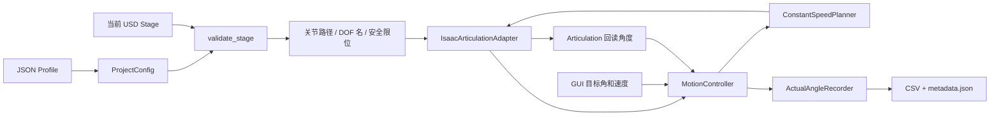

# 260720_01JointPositionRecorder 从零学习笔记

> 项目位置：`scripts/260720_01JointPositionRecorder`  
> 适用读者：会一点 Python，但刚接触 USD、Isaac Sim、Articulation 或机器人关节控制的学习者。  
> 本笔记依据当前仓库源码编写；最后核对日期为 2026-07-20。

## 1. 一句话理解这个项目

这个项目给 Isaac Sim 中的一台固定基座、四旋转关节挖掘机增加了一个 GUI 面板：用户输入每个关节的目标角度和角速度，程序每帧算出下一小步，将四个 DOF 的位置直接写入 Articulation，再把回读到的关节角度记录为 CSV。

最重要的三个关键词是：

- **直接位置控制**：不使用 Angular Drive，不计算力矩，而是直接设置关节状态。
- **逐帧恒速规划**：每一帧最多前进 `speed × dt`，所以看起来是连续运动而不是瞬移。
- **回读记录**：CSV 记录的是写入后从 Articulation 读回的角度，不是 GUI 里的目标输入值。

## 2. 推荐学习顺序

| 顺序 | 笔记 | 学习目标 |
|---:|---|---|
| 1 | [01_项目全景与核心概念.md](01_项目全景与核心概念.md) | 先建立 USD、Articulation、DOF 和整体架构概念 |
| 2 | [02_环境准备与第一次运行.md](02_环境准备与第一次运行.md) | 跑通纯 Python 测试，并学会在 Isaac Sim GUI 中启动面板 |
| 3 | [03_配置系统与USD校验.md](03_配置系统与USD校验.md) | 看懂 JSON Profile 如何映射到具体 USD 关节，以及 Stage 为什么会被拒绝 |
| 4 | [04_运动规划器与控制状态机.md](04_运动规划器与控制状态机.md) | 掌握 `speed × dt` 算法、状态机和每帧更新流程 |
| 5 | [05_Isaac适配层与GUI生命周期.md](05_Isaac适配层与GUI生命周期.md) | 理解度/弧度转换、DOF 索引、Timeline 初始化和 GUI 事件订阅 |
| 6 | [06_轨迹记录器与数据格式.md](06_轨迹记录器与数据格式.md) | 理解 partial 文件、CSV/元数据发布和时间含义 |
| 7 | [07_测试调试与常见问题.md](07_测试调试与常见问题.md) | 学会验证、定位 Stage/运行时/记录错误，并认识当前边界 |
| 8 | [08_源码阅读路线与进阶练习.md](08_源码阅读路线与进阶练习.md) | 按难度重读源码，用练习把理解变成自己的能力 |

建议不要一开始就钻进 `gui.py`。先学习配置、规划器和记录器，再读控制器；最后进入依赖 Isaac Sim 的 Stage 校验、适配层和 GUI，会顺畅很多。

## 3. 项目模块地图

```text
260720_01JointPositionRecorder/
├─ entrypoints/
│  └─ show_panel.py                  # Script Editor 启动入口
├─ profiles/
│  └─ excavator_four_joint_default.json
│                                     # 关节名、速度、Home、安全边距等
├─ src/joint_position_recorder/
│  ├─ config.py                       # JSON → 强类型配置并校验
│  ├─ stage_validator.py              # 只读检查 USD/Articulation 结构
│  ├─ articulation_adapter.py         # Isaac API 与“度”之间的边界
│  ├─ motion_planner.py               # 纯数学恒角速度规划器
│  ├─ controller.py                   # 状态机、运动和记录协调
│  ├─ trajectory_recorder.py          # 防覆盖的 CSV/JSON 记录器
│  ├─ gui.py                          # omni.ui 面板和更新事件
│  └─ __init__.py                     # 包的公开接口
├─ tests/
│  ├─ test_*.py                       # 不依赖 Isaac Sim 的单元测试
│  ├─ isaac_articulation_smoke_test.py
│  └─ isaac_gui_smoke_test.py         # 必须用 Isaac Sim Python 运行
├─ docs/
│  └─ Sim_Fangshan_07_Articulation_Design.md
├─ pyproject.toml
└─ README.md
```

## 4. 学习时要始终抓住的主线



配置告诉程序“想找谁”；Stage 校验器确认“USD 里确实有且结构正确”；适配层解决“Isaac API 怎么读写”；规划器解决“下一帧到哪里”；控制器解决“现在处于什么状态、是否记录”；GUI 只负责把这些能力交给用户操作。

## 5. 当前可复现的测试基线

在项目仓库根目录执行：

```powershell
python -m pytest scripts/260720_01JointPositionRecorder/tests -q
```

本笔记编写时的结果是：

```text
.................                                                        [100%]
17 passed
```

这 17 个测试只证明配置、规划、控制协调和文件记录等纯 Python 逻辑通过；它们不证明本机的 Isaac Sim、目标 USD、GPU/驱动或 `omni.ui` API 一定可用。Isaac 集成需要另外运行两个 smoke test，详见第 2、7 章。

## 6. 读笔记时的符号约定

| 符号 | 含义 | 单位 |
|---|---|---|
| `q` / `current` | 当前关节角 | 度 |
| `q_target` / `target` | 目标关节角 | 度 |
| `v` / `speed` | 用户指定的正角速度大小 | 度/秒 |
| `dt` | 本次更新使用的时间步长 | 秒 |
| `DOF` | Degree of Freedom，自由度 | 本项目中一个旋转关节对应一个 DOF |

除 `articulation_adapter.py` 内部之外，项目中的关节角统一使用“度”。适配层进入 Isaac API 时转成弧度，读出后再转回度。

## 7. 学完应能回答的问题

- 为什么删掉 Angular Drive 后关节仍然可以运动？
- 为什么不能假设 Articulation 的 DOF 索引就是 JSON 中的顺序？
- `max_update_dt = 0.05` 如何影响卡顿帧后的运动？
- `Stop` 与 `Targets = current` 有何区别？
- CSV 中的“实际角度”为什么不等于真实机械系统中的传感器实测角度？
- 为什么记录先写 `.partial.csv`，正常结束后才出现正式 `.csv`？
- Stage 有四个正确关节，为什么仍可能在运行时因 `num_dofs` 失败？

如果这些问题都能用自己的话解释，这个项目的主要设计就已经掌握了。
