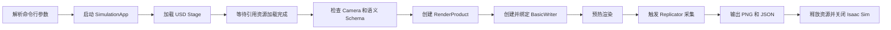

# Isaac Sim 语义相机极简脚本学习文档

本文档对应同目录下的 [`semantic_capture_minimal.py`](./semantic_capture_minimal.py)。脚本使用 Isaac Sim Standalone Python 方式加载已有 USD 场景，通过 Replicator 输出 RGB 图、彩色语义分割图和颜色到类别的映射文件。

## 1. 当前文件结构

```text
test_semantic/
├── semantic_capture_minimal.py
├── README.md
└── output_semantic_stage1_test/
    ├── metadata.txt
    ├── rgb_0000.png
    ├── semantic_segmentation_0000.png
    └── semantic_segmentation_labels_0000.json
```

远端脚本位置：

```text
/root/Desktop/wyb/semantic_capture_minimal.py
```

远端默认输入场景：

```text
/root/Desktop/wyb/Semantic_260709_01.usda
```

## 2. 脚本最终完成了什么

脚本执行一次时，会完成下面的流程：



这个脚本不会重新给场景物体添加标签。它复用 USDA 文件中已经由 Semantic Schema Editor 保存的 `SemanticsLabelsAPI` 标签，只负责在运行时创建采集链路。

## 3. 几个基础概念

| 概念 | 含义 |
|---|---|
| USD | Universal Scene Description，用于描述场景、物体、材质、相机和层级关系 |
| Stage | 当前加载的完整 USD 场景 |
| Prim | Stage 中的一个场景节点，例如 `/World`、`/Camera` 或某个 Mesh |
| Prim Path | Prim 在场景树中的路径，例如 `/Camera` |
| Schema | 附加在 Prim 上的一组标准属性或能力，例如 Camera、SemanticsLabelsAPI |
| Camera Prim | USD 场景中的相机节点，保存焦距、裁剪范围和位姿等参数 |
| RenderProduct | 指定相机和分辨率后建立的渲染输出目标 |
| Annotator | 从渲染结果中提取 RGB、深度、语义分割等数据的组件 |
| Writer | 将一个或多个 Annotator 的数据写入磁盘的组件 |
| Replicator | Isaac Sim 中用于合成数据生成、随机化和数据写出的系统 |

可以把当前采集关系简化为：

```text
/Camera + 1280x720
        ↓
RenderProduct
        ↓
RGB Annotator + Semantic Segmentation Annotator
        ↓
BasicWriter
        ↓
PNG + JSON
```

## 4. 与普通 Python 脚本的区别

普通 Python 脚本通常是：

```text
Python 解释器 → 导入 Python 包 → 执行业务代码 → 退出
```

Isaac Sim Standalone 脚本则是：

```text
Isaac Sim 的 python.sh
        ↓
配置 PYTHONPATH、动态库和插件路径
        ↓
Python 创建 SimulationApp
        ↓
启动 Omniverse Kit、USD、RTX 渲染器和扩展系统
        ↓
执行场景与采集代码
        ↓
显式关闭 SimulationApp
```

因此不要在远端直接运行：

```bash
python /root/Desktop/wyb/semantic_capture_minimal.py
```

普通 Python 环境通常无法正确找到 `isaacsim`、`omni`、`carb`、`pxr` 及其底层动态库。应使用 Isaac Sim 自带的启动脚本：

```bash
/root/isaacsim/python.sh /root/Desktop/wyb/semantic_capture_minimal.py
```

另外，这份代码是 Standalone 脚本，不适合原样粘贴进已经启动的 Isaac Sim Script Editor。GUI 已经存在 `SimulationApp`，此时不应再次创建和关闭它。

## 5. 第一块：普通 Python 模块

```python
import argparse
import os
import sys
import traceback
```

- `argparse`：读取命令行参数。
- `os`：检查 USD 文件、创建输出目录。
- `sys`：设置程序退出码并访问标准错误输出。
- `traceback`：发生异常时打印完整调用链，便于定位错误。

这几个模块不依赖 Isaac Sim，所以可以在 `SimulationApp` 创建前导入。

## 6. 第二块：命令行参数

```python
parser = argparse.ArgumentParser(description="Minimal Isaac Sim semantic capture")
parser.add_argument("--camera", default="/Camera", help="USD camera prim path")
parser.add_argument("--width", type=int, default=1280)
parser.add_argument("--height", type=int, default=720)
parser.add_argument("--frames", type=int, default=1)
parser.add_argument("--warmup", type=int, default=10)
```

`--camera /Camera` 中的 `/Camera` 不是操作系统文件路径，而是 USD Stage 中的 Prim Path。

`type=int` 表示参数必须转换成整数。例如：

```bash
--frames 10
```

如果写成 `--frames abc`，`argparse` 会在 Isaac Sim 启动前直接报告参数类型错误。

```python
parser.add_argument(
    "--headless",
    action=argparse.BooleanOptionalAction,
    default=True,
)
```

`BooleanOptionalAction` 自动提供两个相反选项：

```text
--headless       使用无界面模式
--no-headless    显示 Isaac Sim 界面
```

默认值是 `True`，所以在远端不写这个参数时也会使用无界面模式。

```python
args, _ = parser.parse_known_args()
```

这里使用 `parse_known_args()`，而不是更常见的 `parse_args()`。原因是 Isaac Sim/Kit 也可能向进程传递自己的参数。这个方法读取本脚本认识的参数，并允许其他参数继续存在。

## 7. 第三块：启动 SimulationApp

```python
from isaacsim import SimulationApp

simulation_app = SimulationApp(
    launch_config={
        "headless": args.headless,
        "renderer": "RaytracedLighting",
        "sync_loads": True,
    }
)
```

创建 `SimulationApp` 会启动 Omniverse Kit 应用环境，而不只是创建一个普通 Python 对象。启动过程中会初始化：

- USD Stage 上下文；
- RTX/Vulkan 渲染器；
- GPU 和材质系统；
- OmniGraph；
- Replicator 与 Synthetic Data 扩展；
- Kit 事件循环。

三个启动参数分别表示：

| 参数 | 作用 |
|---|---|
| `headless` | 是否隐藏 GUI |
| `renderer` | 使用 `RaytracedLighting` 实时 RTX 渲染 |
| `sync_loads` | 尽可能同步加载渲染资源和材质 |

## 8. 第四块：为什么部分 import 必须放在后面

```python
import omni.replicator.core as rep
import omni.usd
from isaacsim.core.experimental.utils.stage import is_stage_loading
from pxr import UsdGeom
```

这些模块依赖 Kit 插件和扩展系统。Standalone 脚本通常应先创建 `SimulationApp`，再导入 `omni.*` 和具体 Isaac Sim 扩展。

- `omni.replicator.core`：创建 RenderProduct、Writer，并触发采集。
- `omni.usd`：打开和访问 USD Stage。
- `is_stage_loading`：判断 Stage 引用资源是否仍在加载。
- `UsdGeom`：访问和验证 USD 几何类型，例如 Camera。

## 9. 第五块：资源变量和退出码

```python
render_product = None
writer = None
exit_code = 0
```

先设置为 `None`，是为了保证即使中途加载失败，`finally` 也能判断哪些资源已经创建，避免清理一个不存在的对象。

退出码约定：

```text
0 = 成功
1 = 失败
```

Linux 中可以在脚本结束后执行以下命令查看退出码：

```bash
echo $?
```

## 10. 第六块：输入参数检查

```python
if not os.path.isfile(args.usd):
    raise FileNotFoundError(f"USD file not found: {args.usd}")

if args.width <= 0 or args.height <= 0 or args.frames <= 0 or args.warmup < 0:
    raise ValueError(...)
```

这部分在启动采集前排除明显错误：

- USDA 文件必须存在；
- 图像宽高必须大于 0；
- 采集帧数必须大于 0；
- 预热帧数不能小于 0。

## 11. 第七块：打开并等待 USD Stage

```python
if not omni.usd.get_context().open_stage(args.usd):
    raise RuntimeError(f"Failed to open USD stage: {args.usd}")
```

`omni.usd.get_context()` 返回当前 Kit 应用的 USD 上下文。`open_stage()` 发起 Stage 加载。

```python
simulation_app.update()
simulation_app.update()
while is_stage_loading():
    simulation_app.update()
```

USD 加载通常不是一个纯同步操作。场景可能包含：

- Reference；
- Payload；
- 外部材质；
- 纹理；
- 其他 USD Layer。

`simulation_app.update()` 执行一次 Kit 主循环更新，使资源加载、渲染器、OmniGraph 和事件系统继续工作。前两次更新让 Stage 进入正式加载状态，循环则等待资源加载完成。

普通 Python 脚本一般不需要手动驱动应用主循环，这是 Isaac Sim 脚本的关键区别之一。

## 12. 第八块：验证相机

```python
stage = omni.usd.get_context().get_stage()
camera_prim = stage.GetPrimAtPath(args.camera)

if not camera_prim.IsValid() or not camera_prim.IsA(UsdGeom.Camera):
    raise RuntimeError(...)
```

`GetPrimAtPath("/Camera")` 从 Stage 场景树中查找相机节点。

这里进行两层检查：

- `IsValid()`：这个 Prim Path 是否真实存在；
- `IsA(UsdGeom.Camera)`：该 Prim 是否确实是 USD Camera，而不是同名的 Xform、Mesh 或其他节点。

脚本明确使用 `/Camera`，不依赖 GUI Viewport 的 `/OmniverseKit_Persp`。这样无界面运行时相机来源仍然稳定。

## 13. 第九块：检查语义 Schema

```python
semantic_prim_count = sum(
    any(
        str(schema).startswith("SemanticsLabelsAPI")
        for schema in prim.GetAppliedSchemas()
    )
    for prim in stage.Traverse()
)
```

`stage.Traverse()` 遍历 Stage 中的 Prim。`GetAppliedSchemas()` 返回每个 Prim 已应用的 Schema，代码检查其中是否存在 `SemanticsLabelsAPI`。

当前测试场景检测到 166 个语义 Prim。这个数字不是：

- 语义类别数量；
- 当前画面可见对象数量；
- 语义图中的颜色数量。

它只表示 Stage 中有多少 Prim 应用了语义 Schema。

## 14. 第十块：输出目录与手动采集模式

```python
os.makedirs(args.output, exist_ok=True)
rep.orchestrator.set_capture_on_play(False)
```

`os.makedirs()` 创建输出目录。`exist_ok=True` 表示目录已经存在时不报错，但不会主动清空旧文件。

`set_capture_on_play(False)` 关闭“时间轴播放时每帧自动采集”。后续只在代码显式调用 `rep.orchestrator.step()` 时采集。

## 15. 第十一块：创建 RenderProduct

```python
render_product = rep.create.render_product(
    args.camera,
    resolution=(args.width, args.height),
    name="SemanticCapture",
)
```

RenderProduct 将相机和输出分辨率组合为一个渲染目标：

```text
相机 Prim：/Camera
分辨率：1280 × 720
输出目标名称：SemanticCapture
```

Writer 和 Annotator 不直接读取 Camera Prim，而是连接到这个 RenderProduct。

## 16. 第十二块：创建 BasicWriter

```python
backend = rep.backends.get("DiskBackend")
backend.initialize(output_dir=args.output)
```

`DiskBackend` 负责把数据写入本地磁盘。

```python
writer = rep.WriterRegistry.get("BasicWriter")
writer.initialize(
    backend=backend,
    rgb=True,
    semantic_segmentation=True,
    colorize_semantic_segmentation=True,
)
writer.attach(render_product)
```

配置含义：

| 配置 | 输出 |
|---|---|
| `rgb=True` | RGBA PNG 图像 |
| `semantic_segmentation=True` | 语义分割数据 |
| `colorize_semantic_segmentation=True` | 将语义 ID 转换成便于查看的彩色 PNG |

`attach(render_product)` 把 Writer 连接到相机对应的渲染输出。

## 17. 第十三块：预热渲染

```python
for _ in range(args.warmup):
    simulation_app.update()
```

预热帧不会保存图像，主要用于等待：

- RTX 渲染管线建立；
- 材质和纹理上传 GPU；
- Synthetic Data 节点初始化；
- RenderProduct 开始产生有效画面。

如果加载较复杂的场景后出现第一帧黑图、空图或材质不完整，可以适当提高 `--warmup`。

## 18. 第十四块：触发正式采集

```python
for _ in range(args.frames):
    rep.orchestrator.step(rt_subframes=4, delta_time=0.0)
```

每次 `step()` 触发一次 Replicator 采集和 Writer 写出。

- `rt_subframes=4`：在一次输出内执行 4 个渲染子帧，帮助 RTX 渲染稳定。
- `delta_time=0.0`：不推进仿真时间。

由于当前场景和相机都是静态的，采集多帧时画面通常基本相同。以后加入相机轨迹、物体运动或随机化时，可以在每次 `step()` 前修改场景状态。

## 19. 第十五块：等待写盘

```python
rep.orchestrator.wait_until_complete()
```

Replicator Writer 可能异步编码和写入文件。如果程序立即关闭，最后一帧可能还未完整写入。这个调用会等待所有写入任务结束。

## 20. 第十六块：异常处理与资源清理

```python
except Exception as exc:
    exit_code = 1
    print(f"[semantic-capture] ERROR: {exc}", file=sys.stderr)
    traceback.print_exc()
```

发生异常时，脚本设置失败退出码，并打印错误信息与完整调用栈。

```python
finally:
    if writer is not None:
        writer.detach()
    if render_product is not None:
        render_product.destroy()
    simulation_app.close()
```

`finally` 无论成功还是失败都会执行，负责：

- 将 Writer 从 RenderProduct 解除；
- 销毁运行时创建的 RenderProduct；
- 关闭 Isaac Sim 和 Kit；
- 释放 GPU、渲染器和扩展资源。

## 21. 命令行参数总表

| 参数 | 默认值 | 说明 |
|---|---|---|
| `--usd` | `/root/Desktop/wyb/Semantic_260709_01.usda` | 输入 USD/USDA 场景 |
| `--camera` | `/Camera` | Camera Prim Path |
| `--output` | `/root/Desktop/wyb/output_semantic_stage1` | 输出目录 |
| `--width` | `1280` | 输出图像宽度 |
| `--height` | `720` | 输出图像高度 |
| `--frames` | `1` | 采集帧数 |
| `--warmup` | `10` | 正式采集前的预热帧数 |
| `--headless` | 默认启用 | 不显示 Isaac Sim GUI |
| `--no-headless` | 默认关闭 | 显示 Isaac Sim GUI |

## 22. 如何运行

### 22.1 使用默认参数

```bash
/root/isaacsim/python.sh /root/Desktop/wyb/semantic_capture_minimal.py
```

### 22.2 查看帮助

```bash
/root/isaacsim/python.sh /root/Desktop/wyb/semantic_capture_minimal.py --help
```

### 22.3 指定全部主要参数

```bash
/root/isaacsim/python.sh /root/Desktop/wyb/semantic_capture_minimal.py \
  --usd /root/Desktop/wyb/Semantic_260709_01.usda \
  --camera /Camera \
  --output /root/Desktop/wyb/output_semantic_run01 \
  --width 1280 \
  --height 720 \
  --frames 10 \
  --warmup 20
```

### 22.4 显示 GUI

```bash
/root/isaacsim/python.sh /root/Desktop/wyb/semantic_capture_minimal.py --no-headless
```

在纯 SSH 环境中使用 GUI 可能需要远程桌面或正确配置图形显示环境。一般服务器批量采集应继续使用默认的 headless 模式。

### 22.5 SSH 断开后继续运行

```bash
nohup /root/isaacsim/python.sh \
  /root/Desktop/wyb/semantic_capture_minimal.py \
  --output /root/Desktop/wyb/output_semantic_run01 \
  > /root/Desktop/wyb/semantic_capture_run01.log 2>&1 &
```

查看日志：

```bash
tail -f /root/Desktop/wyb/semantic_capture_run01.log
```

查找进程：

```bash
ps -ef | grep semantic_capture_minimal.py
```

## 23. 输出文件说明

一次单帧测试会生成：

```text
rgb_0000.png
semantic_segmentation_0000.png
semantic_segmentation_labels_0000.json
metadata.txt
```

- `rgb_0000.png`：相机输出的 RGB/RGBA 图像。
- `semantic_segmentation_0000.png`：彩色语义分割预览图。
- `semantic_segmentation_labels_0000.json`：颜色到语义类别的映射。
- `metadata.txt`：BasicWriter 本次输出的元数据。

标签 JSON 中可能出现类似结构：

```json
{
  "(215, 62, 21, 255)": {
    "class": "world,forkliftliftb,forkliftbriggedcm,lift"
  }
}
```

键是语义图中的 RGBA 颜色，值是该颜色对应的语义标签。多个逗号分隔的标签来自 Prim 层级上的多个语义标记。

## 24. 当前极简版本需要注意的限制

1. 彩色语义图主要用于人工查看，不应把某个固定颜色永久当作固定类别。不同场景或运行环境中的颜色分配可能变化，应结合标签 JSON 使用。
2. 当前 Writer 输出的是彩色语义图和标签映射，没有额外保存原始 `uint32` 语义 ID 矩阵。
3. `delta_time=0.0` 不推进仿真时间，因此多帧静态采集的内容基本相同。
4. 输出目录不会自动清空。重复使用同一个目录时，应注意 `0000` 等同名文件可能被覆盖。
5. Stage 加载循环当前没有超时机制。如果远端资源长期无法加载，程序可能持续等待。
6. 当前 USD 中叉车整体和子部件都有语义标签，因此结果是较细粒度的零部件语义，而不只是单一的 `forklift` 类。
7. 运行时可能看到已有 `SDGPipeline` 的 cycle warning。本次测试中 PNG 和 JSON 均正常生成，但如果以后出现缺帧，应进一步清理或隔离 USD 中保存的旧 SDG Pipeline。

## 25. 推荐的学习和扩展顺序

完成当前脚本理解后，可以按下面的顺序继续扩展：

1. 使用 Semantic Annotator 直接读取像素 ID 数组和 `idToLabels`。
2. 将原始 ID 矩阵保存为 `.npy`，彩色 PNG 只作为预览。
3. 在帧循环中修改 `/Camera` 的位姿，实现相机轨迹。
4. 推进仿真时间，实现运动物体的连续采集。
5. 统一场景标签规则，将零部件标签映射为业务所需的大类别。
6. 增加深度图、实例分割、二维包围框等 Annotator。
7. 将命令行参数迁移到 JSON/YAML 配置文件，支持批量任务。

## 26. 快速检查清单

运行前确认：

- USD 文件存在；
- `/Camera` 是有效 Camera Prim；
- Stage 中存在 `SemanticsLabelsAPI`；
- GPU 和 Isaac Sim 能正常启动；
- 输出目录具有写入权限；
- 正式任务使用独立输出目录。

运行后确认：

- 进程退出码为 0；
- RGB 和语义 PNG 分辨率一致；
- 语义图不是全背景；
- 标签 JSON 不为空；
- RGB 与语义图视角和轮廓对齐。

## 27. 疑问要点

### 27.1 `parser`、`argparse` 与 `ArgumentParser` 分别是什么

问题代码：

```python
parser = argparse.ArgumentParser(description="Minimal Isaac Sim semantic capture")
```

这行代码可以拆成三部分理解：

- `argparse`：Python 标准库中的一个**模块**，专门用于声明和解析命令行参数，通常通过 `import argparse` 导入。
- `ArgumentParser`：`argparse` 模块中定义的一个**类**，负责添加、解析和校验命令行参数。
- `parser`：调用 `ArgumentParser(...)` 后创建的**实例对象**，数据类型是 `argparse.ArgumentParser`。

等价关系如下：

```python
import argparse

# ArgumentParser 是类
ParserClass = argparse.ArgumentParser

# parser 是这个类创建出来的对象
parser = ParserClass(description="Minimal Isaac Sim semantic capture")
```

可以使用 `type()` 确认它们的类型：

```python
print(type(argparse))
# <class 'module'>

print(type(argparse.ArgumentParser))
# <class 'type'>

print(type(parser))
# <class 'argparse.ArgumentParser'>
```

其中，`description` 是传给 `ArgumentParser` 构造函数的字符串参数，用于描述当前命令行程序。执行下面的命令时，它会显示在帮助信息中：

```bash
python semantic_capture.py --help
```

后续通常通过 `parser` 添加和解析参数：

```python
parser.add_argument("--usd-path")
args = parser.parse_args()
```

它们之间的关系可以概括为：

```text
argparse（模块）
└── ArgumentParser（类）
    └── parser（实例对象）
```

### 27.2 `SimulationApp` 的作用、内部组件与执行顺序

问题代码：

```python
from isaacsim import SimulationApp

simulation_app = SimulationApp(
    launch_config={
        "headless": args.headless,
        "renderer": "RaytracedLighting",
        "sync_loads": True,
    }
)
```

这段代码的总体作用是：**启动一个独立的 Isaac Sim / Omniverse Kit 应用实例，并按照配置初始化窗口模式、RTX 渲染器和资源加载行为。**

需要先区分一个概念：`SimulationApp` 是一个类，不是普通函数；`SimulationApp(...)` 表示创建这个类的实例，并在创建过程中执行它的初始化逻辑。

#### 27.2.1 导入 `SimulationApp`

```python
from isaacsim import SimulationApp
```

可以拆成：

- `isaacsim`：Isaac Sim 提供的 Python 包。
- `SimulationApp`：该包对外提供的应用启动和生命周期管理类。
- `from ... import ...`：将这个类绑定到当前 Python 文件中的名字 `SimulationApp`。

此时只是导入了类，还没有真正启动 Isaac Sim。可以近似理解为：

```python
import isaacsim

SimulationApp = isaacsim.SimulationApp
```

`SimulationApp` 的主要职责包括：

- 启动底层 Carbonite 框架；
- 加载 Omniverse Kit 核心插件；
- 加载 Isaac Sim Experience 配置；
- 初始化 USD、RTX、扩展系统和应用事件循环；
- 提供逐帧更新接口；
- 在程序结束时关闭 Kit 并释放资源。

官方文档：<https://docs.isaacsim.omniverse.nvidia.com/latest/py/source/extensions/isaacsim.simulation_app/docs/index.html>

#### 27.2.2 Python 语句本身的执行顺序

Python 执行这条赋值语句时，顺序如下。

第一步，计算：

```python
args.headless
```

`args` 通常是 `parser.parse_args()` 返回的 `argparse.Namespace` 实例，`args.headless` 一般是布尔值 `True` 或 `False`。如果 `args` 中没有 `headless` 属性，此时会直接抛出 `AttributeError`，`SimulationApp` 还不会被创建。

第二步，创建配置字典：

```python
{
    "headless": True,
    "renderer": "RaytracedLighting",
    "sync_loads": True,
}
```

这个配置对象的数据类型是 `dict`。

第三步，将配置字典作为关键字参数传给 `SimulationApp`：

```python
config = {
    "headless": args.headless,
    "renderer": "RaytracedLighting",
    "sync_loads": True,
}

simulation_app = SimulationApp(launch_config=config)
```

从 Python 类实例化的角度，可以近似理解为：

```text
SimulationApp.__new__()
        ↓
SimulationApp.__init__(launch_config=config)
        ↓
返回初始化完成的 SimulationApp 实例
```

第四步，只有 Isaac Sim 初始化成功后，返回的对象才会赋值给 `simulation_app`。它的类型为：

```python
isaacsim.simulation_app.SimulationApp
```

可以使用下面的代码确认：

```python
print(type(simulation_app))
```

#### 27.2.3 `launch_config` 如何工作

`launch_config` 是一个启动配置字典。`SimulationApp` 内部已经定义了默认配置，例如：

```python
{
    "headless": True,
    "renderer": "RealTimePathTracing",
    "sync_loads": True,
    "width": 1280,
    "height": 720,
    "create_new_stage": True,
    "physics_gpu": 0,
    "multi_gpu": True,
}
```

传入的配置会覆盖同名默认值，没有传入的项目继续使用默认值。概念上近似于：

```python
final_config = DEFAULT_LAUNCHER_CONFIG.copy()
final_config.update(launch_config)
```

这两行只用于解释配置合并思想，不代表内部源码一定完全这样实现。

当前代码明确设置了三个参数，分辨率、GPU 和是否创建空 Stage 等未指定项目继续使用默认配置。

#### 27.2.4 `headless` 参数

```python
"headless": args.headless
```

该参数控制是否运行在无界面模式。

当值为 `True` 时：

- 不创建普通桌面窗口；
- 不显示 Isaac Sim 编辑器界面；
- 仍然会初始化 RTX 渲染系统；
- 仍然可以使用 GPU；
- 仍然可以创建相机和 Render Product；
- 仍然可以输出 RGB、语义分割和深度图；
- 适合 SSH、服务器和批量数据生成。

因此需要注意：

```text
headless = 无窗口
headless ≠ 不渲染
headless ≠ 不使用 GPU
```

当值为 `False` 时，Isaac Sim 会尝试创建窗口并显示 UI 和 Viewport，适合人工检查场景，但运行环境必须提供可用的图形显示能力。

#### 27.2.5 `renderer` 参数

```python
"renderer": "RaytracedLighting"
```

该参数指定启动时使用的渲染模式。官方列出的模式包括：

- `RaytracedLighting`；
- `PathTracing`；
- `RealTimePathTracing`；
- `MinimalRendering`。

当前配置选择实时 RTX 渲染管线。该渲染系统会参与初始化：

- GPU 渲染设备；
- Hydra 渲染代理；
- RTX 渲染设置；
- 材质、纹理和光照系统；
- 相机和 Render Product；
- Synthetic Data 所需的渲染缓冲区。

语义分割不是根据最终 RGB 颜色推断类别，而是渲染管线根据 USD Prim 上的语义标记生成对应的语义缓冲区。不过，语义缓冲区的生成仍然依赖已经启动的渲染系统。

#### 27.2.6 `sync_loads` 参数

```python
"sync_loads": True
```

启用后，渲染会等待相关场景资源完成加载。它主要涉及：

- USD Reference；
- USD Payload；
- Mesh；
- 材质；
- 纹理；
- Shader；
- 本地或远程资产。

这个选项可以减少刚打开场景就采集时出现的空图、模型缺失、灰色材质或纹理不完整等问题。

但 `sync_loads=True` 不应理解为“后续打开 USD 的全部异步工作一定已经结束”。复杂 USD 打开后通常仍然需要：

- 检查 Stage 加载状态；
- 调用若干次 `simulation_app.update()`；
- 执行一定数量的渲染预热帧。

#### 27.2.7 `SimulationApp(...)` 的内部启动顺序

其内部过程可以按下面的顺序理解：

```text
准备 Isaac Sim Python 环境
        ↓
合并默认配置与 launch_config
        ↓
确定 Experience 配置文件
        ↓
加载 Carbonite 框架
        ↓
加载 Omniverse Kit 核心插件
        ↓
组装 Kit 启动参数
        ↓
启动 Kit Application
        ↓
加载 Experience 及其扩展依赖
        ↓
初始化 USD、RTX、窗口和事件循环
        ↓
应用渲染及其他启动配置
        ↓
返回 SimulationApp 实例
```

##### 1. 准备 Python 环境

脚本通常通过 Isaac Sim 自带的 Python 启动：

```bash
/root/isaacsim/python.sh semantic_capture.py
```

`python.sh` 会准备 `ISAAC_PATH`、`EXP_PATH`、`PYTHONPATH`、`LD_LIBRARY_PATH` 和 `CARB_APP_PATH` 等环境变量，用于定位 Isaac Sim、Python 扩展、原生动态库、Experience 文件和 Kit 核心程序。

官方说明：<https://docs.isaacsim.omniverse.nvidia.com/latest/python_scripting/manual_standalone_python.html>

##### 2. 合并启动配置

`SimulationApp` 读取默认配置，然后使用当前传入的三个参数覆盖对应默认值。

##### 3. 选择 Experience

Experience 是一个 `.kit` 应用配置文件，可以理解为“本次启动需要组合哪些 Omniverse 扩展”。它会声明 USD、RTX、Timeline、Physics、Replicator、Python 接口和 UI 等依赖。

当前代码没有显式传入 `experience`，因此 `SimulationApp` 会按照安装环境中的默认优先级查找，例如：

```text
omni.isaac.sim.python.kit
isaacsim.exp.base.python.kit
isaacsim.exp.base.kit
```

##### 4. 加载 Carbonite

Carbonite 是 Omniverse Kit 的底层框架，主要负责插件、接口、设置、日志、任务和事件系统。其基础过程可以近似理解为：

```python
framework = carb.get_framework()
framework.load_plugins(...)
```

##### 5. 启动 Omniverse Kit

Carbonite 加载 Kit 核心插件后，获得底层 `omni.kit.app.IApp` 应用对象，然后启动 Kit。概念上近似于：

```python
app = omni.kit.app.get_app()
app.startup(...)
```

##### 6. 加载扩展

Kit 的扩展管理器根据 Experience 中的依赖关系加载扩展。这些扩展提供后续使用的运行时模块，例如：

```python
import omni.usd
import omni.replicator.core as rep
from pxr import Usd, UsdGeom
```

因此，在 Standalone 脚本中，Omniverse 运行时模块通常要在 `SimulationApp` 实例创建完成后再导入：

```python
from isaacsim import SimulationApp

simulation_app = SimulationApp(...)

# Kit 启动后再导入运行时模块
import omni.usd
import omni.replicator.core as rep
```

如果提前导入，相关插件及其 Python 接口可能还没有加载，可能出现导入失败或接口尚未初始化的问题。

##### 7. 初始化 RTX 渲染系统

根据 `renderer` 参数启动对应渲染管线，并配置 GPU、Hydra、RTX、材质、纹理、Viewport、Render Product 和 Synthetic Data 渲染输出。

##### 8. 初始化 USD Context

启动完成后，可以通过：

```python
simulation_app.context
```

访问当前 USD Context。它负责管理当前 Stage、Stage 打开和关闭、Prim、Layer 以及资源加载状态。

这段 `SimulationApp` 代码本身没有打开目标 USDA。因为没有设置 `open_usd`，程序通常先创建默认空 Stage，后面仍需要显式打开场景，例如：

```python
omni.usd.get_context().open_stage(usd_path)
```

##### 9. 返回应用实例

必要初始化完成后，构造过程返回 `simulation_app`。这个对象不是 USD 场景，也不是物理世界，而是整个 Kit 应用的生命周期控制对象。

#### 27.2.8 `SimulationApp` 调动的主要部分

各部分职责可以概括为：

```text
SimulationApp
├── Carbonite
│   └── 插件、设置、任务、日志和事件系统
├── Omniverse Kit
│   └── 主循环、扩展管理和应用生命周期
├── USD Context
│   └── Stage、Prim、Layer、Reference 和 Payload
├── RTX Renderer
│   └── 相机、材质、光照和渲染缓冲区
└── 扩展系统
    ├── Physics
    ├── Replicator
    ├── Synthetic Data
    └── UI 或 Headless 相关扩展
```

几个常见对象的职责需要区分：

- `SimulationApp`：管理整个 Isaac Sim / Kit 应用进程。
- `UsdContext`：管理当前 USD Stage。
- `World` 或 `SimulationContext`：管理物理仿真、时间步和场景对象。
- `Replicator`：管理合成数据采集流程。
- `RenderProduct`：连接相机和渲染输出。
- `Annotator` 或 `Writer`：读取或保存 RGB、语义分割等数据。

`SimulationApp` 负责把运行环境启动起来，但不会自动完成场景加载、相机选择和语义数据采集。

#### 27.2.9 后续代码的推荐调用顺序

完整的语义采集脚本通常遵循以下顺序：

```text
1. 解析命令行参数
2. 导入 SimulationApp
3. 创建 SimulationApp 实例
4. 导入 omni.usd、Replicator 等运行时模块
5. 打开目标 USD
6. 等待 Stage 和相关资源加载
7. 检查 Camera Prim
8. 创建 Render Product
9. 创建并连接 Writer 或 Annotator
10. 调用 update() 或 rep.orchestrator.step()
11. 等待数据写入完成
12. 解除 Writer 或 Annotator 连接
13. 销毁 Render Product
14. 调用 simulation_app.close()
```

其中：

```python
simulation_app.update()
```

会让 Kit 应用主循环前进一帧，处理扩展更新、异步任务、USD 事件和渲染。

程序结束时必须调用：

```python
simulation_app.close()
```

它负责等待必要的 Replicator 工作、关闭 Kit 并释放插件和 GPU 等资源。

最终可以将 `SimulationApp` 的职责概括为：

> `SimulationApp(...)` 不是创建一个具体仿真场景，而是启动并持有一个能够运行 USD、RTX、Physics 和 Replicator 的完整 Isaac Sim / Omniverse Kit 应用环境。
