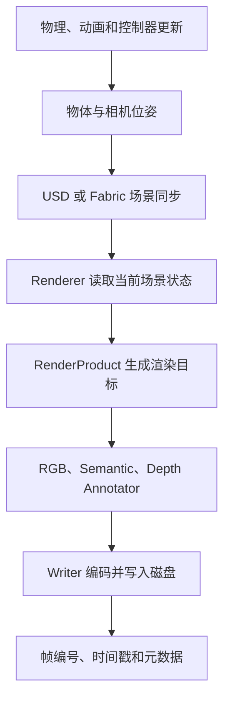
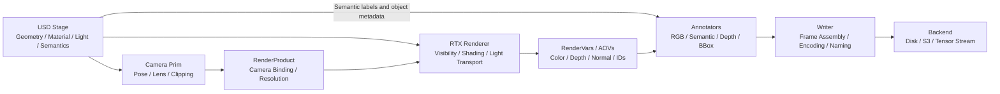

# Semantic Key Points v01

本文档用于记录 Isaac Sim 语义相机、Synthetic Data、Replicator 和渲染管线中的关键知识点。后续内容可以继续按照“第二部分”“第三部分”的形式追加。

## 第一部分：SimulationApp 的 Renderer 配置

### 1.1 问题

请详细讲解：

```python
simulation_app = SimulationApp(
    launch_config={
        "headless": args.headless,
        "renderer": "RaytracedLighting",
        "sync_loads": True,
    }
)
```

在 `SimulationApp` 类中，`launch_config` 中的 renderer 种类有哪些？Renderer 承担哪些功能？不同 Renderer 分别有什么作用和区别？

说明：正确的参数名是 `launch_config`，不是 `luanch_config`。

### 1.2 Renderer 种类总览

远端实际安装的 Isaac Sim 6.0.1 中，`SimulationApp.launch_config["renderer"]` 明确支持以下四种渲染模式：

| 配置值 | 对应渲染模式 | 主要用途 |
|---|---|---|
| `RealTimePathTracing` | RTX Real-Time 2.0 | 实时性和画质平衡，当前默认模式 |
| `PathTracing` | RTX Interactive Path Tracing | 高精度、离线或静态高质量 RGB |
| `RaytracedLighting` | RTX Real-Time Legacy | 兼容旧版实时 RTX 工作流 |
| `MinimalRendering` | RTX Minimal | 极高吞吐、训练、只采集分割或深度 |
| `Minimal` | `MinimalRendering` 的别名 | 与 `MinimalRendering` 相同 |

这些值来自远端实际安装的 `SimulationApp` 源码，也与 [Isaac Sim 6.0 SimulationApp API](https://docs.isaacsim.omniverse.nvidia.com/6.0.0/py/source/extensions/isaacsim.simulation_app/docs/index.html) 一致。

### 1.3 launch_config 是什么

```python
simulation_app = SimulationApp(
    launch_config={
        "headless": args.headless,
        "renderer": "RaytracedLighting",
        "sync_loads": True,
    }
)
```

`launch_config` 是启动 Omniverse Kit 和 Isaac Sim 时使用的配置字典。

它会与 Isaac Sim 内置的 `DEFAULT_LAUNCHER_CONFIG` 合并：

```text
Isaac Sim 默认配置
        +
用户提供的 launch_config
        ↓
最终启动配置
```

用户指定的键会覆盖默认值，没有指定的键继续使用默认值。

在当前 Isaac Sim 6.0.1 中，默认 renderer 是：

```python
"renderer": "RealTimePathTracing"
```

当前语义采集脚本显式写了：

```python
"renderer": "RaytracedLighting"
```

因此，脚本要求 Isaac Sim 启动时先使用旧版实时 RTX 模式。

### 1.4 Renderer 承担什么功能

Renderer 可以理解为“把 USD 场景转换成相机图像和渲染数据的计算系统”。

它主要负责：

1. 读取相机可见范围内的 Mesh、材质、灯光、纹理和环境。
2. 在 GPU 上建立用于光线查询的场景加速结构。
3. 计算光线与物体的相交、遮挡、阴影、反射和折射。
4. 计算直接光照、间接光照和全局光照。
5. 计算 MDL、UsdPreviewSurface 等材质的最终外观。
6. 生成颜色、深度、法线、运动向量等 RenderVar 或 AOV。
7. 执行抗锯齿、降噪、DLSS、色调映射等后处理。
8. 为 RenderProduct、Camera Sensor 和 Synthetic Data 提供底层渲染结果。

需要区分下面几个组件的职责：

```text
Camera          决定从哪里看、朝哪里看
RenderProduct   决定使用哪个相机、输出分辨率和渲染目标
Renderer        决定如何计算可见物体、光线、材质和图像
Annotator       决定从渲染结果中提取什么数据
Writer          决定如何把数据保存到磁盘
```

语义标签来自 USD 的 `SemanticsLabelsAPI`，不是 Renderer 根据 RGB 颜色推断出来的。但语义分割仍通过渲染和 Synthetic Data 管线生成，所以物体可见性、遮挡、透明表面、相机裁剪等仍与 Renderer 有关。

### 1.5 RealTimePathTracing

使用方式：

```python
simulation_app = SimulationApp({
    "renderer": "RealTimePathTracing"
})
```

它对应 **RTX Real-Time 2.0**，也是 Isaac Sim 6.0.1 当前的默认模式。

它同样基于物理路径追踪，但会使用缓存、低采样、时序信息、降噪和 DLSS 等技术，把性能控制在实时范围。相比旧版 `RaytracedLighting`，它对玻璃、反射和复杂间接光照的处理通常更完整。

[NVIDIA 将 RTX Real-Time 2.0 描述为实时的物理路径追踪模式](https://docs.omniverse.nvidia.com/materials-and-rendering/latest/rtx-renderer_overview.html)。

当前 `SimulationApp` 为它设置的默认值包括：

```python
{
    "max_bounces": 3,
    "max_specular_transmission_bounces": 3,
    "max_volume_bounces": 15,
}
```

参数含义：

- `max_bounces`：普通光线路径的最大反弹次数。
- `max_specular_transmission_bounces`：镜面反射和透明折射的最大反弹次数。
- `max_volume_bounces`：雾、烟等体积材质中的最大反弹次数。

适合场景：

- 机器人仿真实时观察；
- RGB 相机实时输出；
- 语义图、深度图和 RGB 同步采集；
- 动态场景和相机运动；
- 大部分合成数据生成任务。

对于当前“RGB + 语义分割”的脚本，这是更推荐的模式：

```python
"renderer": "RealTimePathTracing"
```

### 1.6 RaytracedLighting

使用方式：

```python
simulation_app = SimulationApp({
    "renderer": "RaytracedLighting"
})
```

它对应 **RTX Real-Time Legacy**，也就是旧版 RTX 实时渲染器。[Isaac Sim 官方渲染模式页面将其标记为 Legacy](https://docs.isaacsim.omniverse.nvidia.com/latest/reference_material/rendering_modes.html)。

它主要使用实时光线追踪、缓存、降噪和近似算法获得较高帧率。名称虽然是 `RaytracedLighting`，但它并不只是“开启灯光”，而是一整套旧版实时 RTX 渲染管线。

主要特点：

- 延迟较低，适合交互式仿真；
- 对旧 USD、旧项目和旧渲染效果兼容性较好；
- 间接光照、玻璃和复杂反射通常比 Path Tracing 更近似；
- 在新版本中已经不是默认和首选模式。

适合场景：

- 需要复现旧版 Isaac Sim 的 RGB 外观；
- 已有数据集使用旧版 Real-Time 模式生成；
- 新渲染模式改变了旧资产外观，需要保持兼容。

当前脚本使用它并不是错误，语义图也已经成功输出。但如果没有旧版兼容需求，建议改成 `RealTimePathTracing`。

### 1.7 PathTracing

使用方式：

```python
simulation_app = SimulationApp({
    "renderer": "PathTracing",
    "samples_per_pixel_per_frame": 64,
    "denoiser": True,
    "max_bounces": 4,
})
```

它对应 **RTX Interactive Path Tracing**，目标是更准确地模拟真实光线传播。

它会对每个像素发射多条采样光线，并让光线在场景中多次反弹。采样越多，噪点越少，但计算时间越长。

关键参数：

```python
"samples_per_pixel_per_frame": 64
```

它表示每像素、每帧的采样数量。数值越大：

```text
图像更稳定、噪点更少、速度更慢
```

```python
"denoiser": True
```

该参数启用 OptiX AI Denoiser，可以用较少采样获得更干净的结果。

当前默认反弹参数为：

```python
{
    "max_bounces": 4,
    "max_specular_transmission_bounces": 6,
    "max_volume_bounces": 64,
}
```

适合场景：

- 高质量离线 RGB 数据集；
- 材质、玻璃、镜面和复杂光照验证；
- 静态产品图或参考图；
- 对 RGB 光照真实性要求较高的视觉模型训练数据。

不太适合：

- 高频率机器人控制；
- 大量动态帧实时采集；
- 只需要语义分割而不重视 RGB 的任务。

语义类别本身不会因为 Path Tracing 变得“更准确”。Path Tracing 提升的主要是 RGB 光照质量，以及透明、反射表面的视觉真实性。

### 1.8 MinimalRendering

使用方式：

```python
simulation_app = SimulationApp({
    "renderer": "MinimalRendering",
    "minimal_shading_mode": 2,
})
```

它对应 **RTX Minimal**，设计目标是最低延迟和最高吞吐量。该模式关闭完整的间接光传输，只使用非常简化的照明和材质计算，适合训练循环与非彩色 AOV 采集。

[RTX Minimal 官方说明](https://docs.omniverse.nvidia.com/materials-and-rendering/latest/rtx-renderer_minimal.html)。

`minimal_shading_mode` 有五种值：

| 数值 | 模式 | 效果 |
|---:|---|---|
| `0` | Real-Time 2.0 Reference | 显示 RT2 完整结果，用于对照 |
| `1` | Diffuse/Glossy/Emission | 保留简化漫反射、光泽和自发光 |
| `2` | Textured Diffuse | 保留纹理颜色，不计算复杂反射 |
| `3` | Constant Diffuse | 所有物体使用统一漫反射颜色 |
| `4` | No Rendering | RGB 为黑色，只计算其他 AOV |

例如，只采集语义分割和深度：

```python
simulation_app = SimulationApp({
    "headless": True,
    "renderer": "MinimalRendering",
    "minimal_shading_mode": 4,
})
```

模式 4 不计算有意义的 RGB，但官方建议它用于深度、法线、实例分割、语义分割等非颜色 AOV。

需要注意：`MinimalRendering` 默认的 `minimal_shading_mode=0` 是 RT2 参考输出，并不是最节省计算的模式。真正追求速度时，应明确使用 `1` 到 `4`。

### 1.9 四种模式对比

| 模式 | 相对速度 | RGB 质量 | 间接光照 | 动态场景 | 语义采集建议 |
|---|---:|---:|---:|---:|---|
| `RealTimePathTracing` | 快 | 高 | 有，使用缓存和近似 | 很适合 | RGB 与语义同步采集首选 |
| `RaytracedLighting` | 快 | 中到高 | 旧版近似方案 | 适合 | 旧项目兼容 |
| `PathTracing` | 慢 | 最高 | 高精度 | 计算成本较高 | 高质量 RGB 数据集 |
| `MinimalRendering` | 最快 | 低或无 | 基本关闭 | 很适合 | 只采集分割或深度时首选 |

### 1.10 headless 不等于不渲染

```python
"headless": True
```

它只表示不创建可见窗口和编辑器 UI，不表示关闭 Renderer。

即使使用 headless，下面的链路仍会在 GPU 上执行：

```text
Camera → Renderer → RenderProduct → Annotator → Writer
```

如果完全不渲染，就无法生成 RGB、深度和语义分割图。

### 1.11 sync_loads 不是 Renderer 类型

```python
"sync_loads": True
```

它控制资源加载时机。启用后，Renderer 会等待 USD、材质和纹理等资源加载，避免场景尚未加载完整就开始输出。

优点：

- 第一帧更可靠；
- 减少缺材质、缺纹理和临时黑图；
- 适合合成数据生成。

代价：

- Stage 启动时间更长；
- 网络资源不可用时可能等待较久。

### 1.12 当前脚本的一个重要细节

当前 USDA 本身保存了 `RealTimePathTracing` RenderSettings，但脚本启动时指定了 `RaytracedLighting`。打开新 Stage 后，Stage 中的 RenderSettings 可能重新影响最终生效的渲染模式。

如果希望严格保证脚本中的模式最终生效，应在 Stage 加载完成后执行：

```python
simulation_app.reset_render_settings()
```

官方也建议打开新 Stage 后调用该方法，重新应用启动配置。[Isaac Sim Rendering Modes](https://docs.isaacsim.omniverse.nvidia.com/latest/reference_material/rendering_modes.html)

对于当前项目，推荐配置为：

```python
simulation_app = SimulationApp(
    launch_config={
        "headless": args.headless,
        "renderer": "RealTimePathTracing",
        "sync_loads": True,
        "max_bounces": 3,
        "max_specular_transmission_bounces": 3,
    }
)
```

如果以后完全不需要 RGB，只需要语义图和深度，则可以测试：

```python
simulation_app = SimulationApp(
    launch_config={
        "headless": True,
        "renderer": "MinimalRendering",
        "minimal_shading_mode": 4,
        "sync_loads": True,
    }
)
```

### 1.13 针对当前语义相机任务的选择建议

如果任务目标是同时保存可用 RGB 和语义分割图，优先选择：

```python
"renderer": "RealTimePathTracing"
```

如果任务目标是追求高质量、接近离线渲染的 RGB，选择：

```python
"renderer": "PathTracing"
```

如果只需要语义分割、实例分割、深度或法线，并且更关注采集吞吐量，可以选择：

```python
"renderer": "MinimalRendering",
"minimal_shading_mode": 4
```

只有需要复现旧版 RTX Real-Time 外观或兼容旧项目时，才优先选择：

```python
"renderer": "RaytracedLighting"
```

### 1.14 官方参考资料

- [Isaac Sim 6.0 SimulationApp API](https://docs.isaacsim.omniverse.nvidia.com/6.0.0/py/source/extensions/isaacsim.simulation_app/docs/index.html)
- [Isaac Sim Rendering Modes](https://docs.isaacsim.omniverse.nvidia.com/latest/reference_material/rendering_modes.html)
- [Omniverse RTX Renderer Overview](https://docs.omniverse.nvidia.com/materials-and-rendering/latest/rtx-renderer_overview.html)
- [RTX Minimal](https://docs.omniverse.nvidia.com/materials-and-rendering/latest/rtx-renderer_minimal.html)

## 第二部分：不透明动态场景中的 Renderer、时间同步与数据质量

### 2.1 问题

如果是不透明动态场景，Renderer 的选择会对图片造成影响吗？除了 Renderer，还有哪些因素和组成部分会影响 RGB、Semantic 和 Depth 数据？

### 2.2 核心结论

对于不透明动态场景，Renderer 仍然会造成影响，但必须分数据类型理解：

- **RGB：Renderer 影响明显。** 光照、阴影、反射、时序缓存、降噪、DLSS 和运动模糊都会改变 RGB。
- **Semantic：Renderer 的直接影响通常较小。** 标签来自 USD 语义 Schema，但采集时刻、遮挡关系、轮廓像素和场景同步会改变最终分割结果。
- **Depth：Renderer 的直接影响通常也较小。** 深度主要由相机和几何距离决定，但采样时刻、相机运动、裁剪范围和 Depth Annotator 定义会影响数值。

在动态场景里，最重要的问题往往不是“使用了哪种光照算法”，而是：

```text
这一帧到底在什么仿真时刻采集？
RGB、Semantic 和 Depth 是否对应同一个场景状态？
```

如果物体在运动，即使只相差一个物理步，轮廓、遮挡和深度都可能发生变化。

### 2.3 三种数据对 Renderer 的敏感程度

| 数据类型 | Renderer 直接影响 | 动态场景主要风险 |
|---|---|---|
| RGB | 高 | 光照变化、噪声、拖尾、运动模糊、时序降噪、反射滞后 |
| Semantic | 低到中 | 采样时刻不同、轮廓错位、遮挡变化、透明度规则、标签层级 |
| Depth | 低到中 | 采样时刻不同、相机运动、深度定义不同、裁剪、无效值 |

因此，可以说“Renderer 主要影响 RGB”，但不能进一步推导为“所有 Renderer 生成的 Semantic 和 Depth 一定逐像素相同”。

### 2.4 动态数据生成的完整链路

动态场景中的数据不是 Camera 直接写入磁盘，而是经过多层系统：



任意一层的更新顺序、频率或配置不同，都可能让输出发生变化。

各组件的基本职责为：

```text
Physics / Animation  决定物体在当前时刻处于什么状态
Camera               决定观察位置、方向和成像模型
USD / Fabric         保存或缓存当前场景状态
Renderer             计算可见性、光线、材质和渲染数据
RenderProduct        绑定相机与输出分辨率
Annotator            定义要读取的 RGB、Semantic 或 Depth 数据
Writer               负责命名、编码和写入文件
Orchestrator         控制何时触发一次数据采集
```

### 2.5 不同 Renderer 在动态场景中的表现

| Renderer | RGB 表现 | Semantic/Depth 表现 | 动态场景建议 |
|---|---|---|---|
| `RealTimePathTracing` | 高质量实时 RGB，可能使用时序缓存和降噪 | 通常稳定 | RGB 与标签同步采集的首选 |
| `RaytracedLighting` | 旧版实时 RTX 外观 | 通常稳定 | 需要兼容旧项目时使用 |
| `PathTracing` | 移动时容易重新积累和出现噪声 | 不会因采样数增加而明显提高 | 不适合高频动态采集 |
| `MinimalRendering` | 简化 RGB 或不输出有效 RGB | 适合 Semantic 和 Depth | 只采集非颜色数据时优先测试 |

#### RealTimePathTracing

`RealTimePathTracing` 会使用缓存、时序信息、运动向量、降噪和 DLSS 等技术，在动态场景中保持较高帧率和较好画质。

快速运动时，RGB 可能出现：

- 物体边缘的短暂残影；
- 时序降噪拖尾；
- 反射或阴影短暂滞后；
- 细小物体在高速运动时轮廓不稳定；
- 低分辨率下 DLSS 重建带来的细节变化。

Semantic 和原始 Depth 通常不依赖 RGB 色彩后处理，因此受这些效果的影响较小。但它们仍然依赖当前帧的几何位置和遮挡关系。

#### RaytracedLighting

`RaytracedLighting` 是旧版实时 RTX 模式。它适合复现旧版 Isaac Sim 项目或旧数据集的视觉外观。

它在动态场景中仍能保持较低延迟，但与 `RealTimePathTracing` 相比，复杂间接光照、玻璃、反射和材质表现可能不同。

对于不透明物体的 Semantic 和 Depth，这种光照差异通常不会直接改变类别和几何距离。

#### PathTracing

`PathTracing` 依靠多个样本逐渐积累稳定图像。动态物体或相机一旦移动，原有积累通常需要重新开始。

动态 RGB 可能出现：

- 每帧采样不足导致明显噪点；
- 相机持续运动时难以收敛；
- 移动物体和静态背景的收敛程度不同；
- 增加采样后帧率显著下降。

提高 Path Tracing 的采样数主要提升 RGB，不会让 Semantic 标签或几何 Depth 本身变得更准确。

#### MinimalRendering

如果任务只需要 Semantic、Instance、Depth 或 Normal，可以考虑：

```python
{
    "renderer": "MinimalRendering",
    "minimal_shading_mode": 4,
}
```

`minimal_shading_mode=4` 不生成有意义的彩色 RGB，但可以减少完整材质和光照计算，适用于非颜色 AOV 的高吞吐采集。

使用前仍应在目标 Isaac Sim 版本中验证所需 Annotator 是否正常输出，并比较轮廓、无效像素和帧耗时。

### 2.6 仿真时间步对动态数据的影响

假设物理仿真频率为：

```text
physics_dt = 1 / 60 秒
physics_fps = 60 Hz
```

如果每三个物理步采集一帧，那么有效采集频率为：

```text
capture_fps = 60 / 3 = 20 FPS
```

这意味着中间两个物理状态不会被相机保存。

如果程序根据墙上时钟实时运行，Renderer 越慢，单位时间内能够生成的帧越少。不同 Renderer 可能因此采到不同的场景状态，而不是只产生不同画质。

为了保证可重复性，推荐使用固定步长和显式采集：

```text
推进固定物理时间
→ 更新相机和物体
→ 同步场景状态
→ 冻结当前仿真时刻
→ 触发一次采集
→ 再推进下一物理步
```

### 2.7 当前脚本中 delta_time 的意义

当前极简脚本使用：

```python
rep.orchestrator.step(
    rt_subframes=4,
    delta_time=0.0,
)
```

`delta_time=0.0` 表示本次 Replicator 采集不主动推进仿真时间。

它带来的结果是：

- 静态场景可以稳定采集；
- 动态场景必须在采集前由其他代码推进 Physics、Timeline 或动画；
- 如果没有其他代码推进时间，多次采集仍然会得到同一个姿态；
- Renderer 可以在同一仿真时刻生成当前场景的快照。

对于严格同步的动态数据集，推荐把“推进仿真”和“采集图像”拆成两个明确步骤。

### 2.8 rt_subframes 的作用

```python
rt_subframes=4
```

它表示一次采集过程中执行额外的渲染子帧，以帮助 RTX 渲染管线、材质和时序效果稳定。

在 `delta_time=0.0` 的情况下，可以近似理解为：

```text
物体保持在同一个仿真姿态
→ Renderer 更新多个子帧
→ 输出当前时刻的稳定快照
```

它不会自动生成四张不同时刻的 Semantic 或 Depth 图。

如果目标是模拟真实曝光期间的运动，需要单独设计运动模糊、快门和时间采样，而不能只依赖 `rt_subframes`。

### 2.9 Motion Blur 与标签对齐

运动模糊会把一段曝光时间内的运动积分到 RGB：

```text
RGB = 一段时间区间内的运动结果
Semantic / Depth = 通常对应某个离散场景状态
```

这可能造成：

- RGB 中物体边缘被拉长；
- Semantic 仍然是清晰的离散轮廓；
- RGB、Semantic 和 Depth 在运动边缘不能逐像素对齐。

如果数据用于监督学习并要求严格像素对齐，建议：

```text
关闭 Motion Blur
采用全局快门
显式固定采集时刻
RGB、Semantic 和 Depth 使用同一个 RenderProduct
```

只有当研究目标本身包含运动模糊、滚动快门或真实相机曝光时，才应保留这些效果，并同步设计标签生成方法。

### 2.10 相机运动与更新顺序

动态场景不仅包括物体运动，也包括相机运动。

下面两个顺序会产生相差一帧的结果：

```text
顺序 A：采集图像 → 更新相机
顺序 B：更新相机 → 采集图像
```

为了避免歧义，每帧应明确执行：

```text
确定 frame_index
→ 推进仿真
→ 更新相机位姿
→ 同步 Stage/Fabric
→ 采集全部 Annotator
→ 保存图像和元数据
```

建议为每一帧记录：

- `frame_index`；
- 仿真时间；
- Timeline time code；
- 相机世界坐标；
- 相机世界旋转；
- 相机内参；
- Camera clipping range；
- 当前 Renderer；
- 对应 RGB、Semantic 和 Depth 文件名。

### 2.11 Physics、Render 和 Capture 频率

三个系统可能运行在不同频率：

```text
Physics：60 Hz
Render：30 Hz
Capture：10 Hz
```

它们的含义不同：

- Physics 频率决定物体状态更新的细粒度；
- Render 频率决定画面更新频率；
- Capture 频率决定保存多少帧数据。

如果没有明确同步，某些物理状态可能从未被相机采集。Renderer 速度变化还可能改变实际 Render 和 Capture 频率。

正式数据生成时，不应依赖“机器能跑多快”决定采集时刻，而应由固定的仿真步和帧编号决定。

### 2.12 USD、Fabric 与 Renderer 同步

动态物体的位置可能先在物理系统中更新，再同步到 Fabric 或 USD，最后才被 Renderer 读取。

可能出现的问题：

```text
物理状态已经更新
但 Renderer 仍读取上一帧场景状态
```

常见原因包括：

- 更新物体后立即读取 Annotator，没有执行必要的 Kit 更新；
- USD 属性和 Fabric 缓存尚未同步；
- Camera 在采集之后才更新；
- OmniGraph 节点执行顺序不符合预期。

因此，动态采集循环应为场景同步预留明确的更新步骤，并通过已知运动轨迹验证是否存在一帧延迟。

### 2.13 Camera 参数对结果的影响

以下 Camera 参数会影响 RGB、Semantic 和 Depth：

| 参数 | RGB | Semantic | Depth |
|---|---|---|---|
| 相机位置和旋转 | 高 | 高 | 高 |
| 焦距和视场角 | 高 | 高 | 高 |
| 输出分辨率 | 高 | 高 | 高 |
| Near/Far Clipping | 中 | 中 | 高 |
| 镜头畸变 | 高 | 高 | 高 |
| Motion Blur | 高 | 可能导致错位 | 可能导致错位 |
| 曝光和色调映射 | 高 | 通常无 | 通常无 |
| 更新时刻 | 高 | 高 | 高 |

其中 Near/Far Clipping 会直接决定某些几何表面是否参与输出。超过远裁剪面的物体可能得到背景、无穷远或其他无效 Depth 值。

### 2.14 Depth Annotator 的定义比 Renderer 更重要

常见的两种 Depth 定义并不相同。

#### distance_to_camera

```text
表面点到相机光心的欧氏距离
```

可以把它理解为从相机中心向表面点连线的实际长度。

#### distance_to_image_plane

```text
表面点沿相机前向轴到成像平面的 Z-depth
```

两者在图像中心附近比较接近，但越靠近图像边缘，差异通常越明显。

动态物体横向穿过画面时，即使物体与相机的真实距离基本不变，`distance_to_image_plane` 和 `distance_to_camera` 的变化趋势也可能不同。

因此，Depth 数据集必须明确记录 Annotator 名称和单位，不能只写“深度图”。

### 2.15 Semantic Annotator 的配置因素

语义类数据可能包括：

- Class Semantic Segmentation；
- Instance Segmentation；
- Instance ID Segmentation；
- Semantic ID；
- Colorized Semantic Preview。

影响结果的因素包括：

- `semanticTypes` 过滤范围；
- 父 Prim 和子 Prim 的标签继承；
- 同一 Prim 上的多个语义 Schema；
- 物体是否可见或被遮挡；
- 是否输出原始 ID 或彩色预览；
- ID 到 Label 的映射是否随帧保存；
- 动态创建和删除 Prim 后 ID 是否重新分配。

当前叉车场景中，整体和零部件都具有标签，因此一个可见像素可能对应层级化或逗号分隔的类别描述。Renderer 不决定这些类别名称，但会参与决定当前像素看到哪个 Prim。

### 2.16 其他会影响动态数据的因素

| 层级 | 主要因素 |
|---|---|
| Physics | 固定时间步、子步数、求解器、初始状态、GPU/CPU 物理、随机种子 |
| Animation | TimeCode、关键帧插值、骨骼动画、变形网格 |
| Scene | Payload、Reference、LOD、细分、可见性、动态创建和删除 |
| Camera | 位姿、焦距、畸变、裁剪范围、快门和更新时间 |
| Renderer | 模式、DLSS、抗锯齿、降噪、缓存、运动模糊、采样数 |
| RenderProduct | 相机绑定、分辨率、更新调度 |
| Annotator | 数据类型、Semantic 类型、Depth 定义、Colorize 配置 |
| Orchestrator | `delta_time`、`rt_subframes`、Capture on Play、触发顺序 |
| Writer | 异步写入、文件编号、输出格式、元数据完整性 |
| Randomization | 随机种子、随机化触发时机、每帧或每场景随机化 |

### 2.17 推荐的动态采集循环

下面是推荐的逻辑结构。它是教学伪代码，具体 Physics API 需要根据项目采用的 Isaac Sim 接口实现。

```python
for frame_index in range(frame_count):
    # 1. 使用固定 dt 推进物理或动画
    advance_simulation(fixed_dt)

    # 2. 更新相机、机器人或其他控制对象
    update_camera_and_scene(frame_index)

    # 3. 让 Physics、USD/Fabric、OmniGraph 和 Renderer 同步
    synchronize_scene()

    # 4. 冻结当前仿真时刻，同时采集所有数据
    rep.orchestrator.step(
        rt_subframes=render_subframes,
        delta_time=0.0,
    )

    # 5. 保存这一帧的时间戳、相机参数和文件对应关系
    save_frame_metadata(frame_index)
```

关键原则是：

```text
推进仿真和采集图像分开执行
一次采集中的所有 Annotator 使用同一场景状态
```

### 2.18 RGB、Semantic 和 Depth 对齐建议

为了获得严格对齐的数据：

1. 三种 Annotator 连接到同一个 RenderProduct。
2. 同一次 `rep.orchestrator.step()` 触发全部数据。
3. 关闭 Motion Blur，除非任务明确需要。
4. 使用固定 Physics timestep。
5. 采集时使用 `delta_time=0.0` 冻结当前状态。
6. 在采集前完成相机和物体位姿更新。
7. 每帧保存同一个 frame index 和 simulation timestamp。
8. 不要分别运行三次脚本生成 RGB、Semantic 和 Depth。

如果分别运行，很难保证随机化、物理状态和相机位置完全相同。

### 2.19 针对当前任务的 Renderer 建议

#### 同时需要 RGB、Semantic 和 Depth

推荐：

```python
simulation_app = SimulationApp(
    launch_config={
        "headless": True,
        "renderer": "RealTimePathTracing",
        "sync_loads": True,
    }
)
```

同时建议关闭 Motion Blur，并使用固定时间步和显式采集。

#### 只需要 Semantic 和 Depth

可以测试：

```python
simulation_app = SimulationApp(
    launch_config={
        "headless": True,
        "renderer": "MinimalRendering",
        "minimal_shading_mode": 4,
        "sync_loads": True,
    }
)
```

测试时必须确认：

- Semantic 图不是全背景；
- Depth 没有大面积异常值；
- 动态物体轮廓与预期一致；
- 当前 Isaac Sim 版本支持所需 AOV；
- 相比 `RealTimePathTracing` 确实获得吞吐量收益。

#### 需要高质量动态 RGB

一般仍优先使用 `RealTimePathTracing`。`PathTracing` 更适合静态高质量图像，持续运动时很难充分积累。

### 2.20 如何验证不同 Renderer 的影响

不要只凭肉眼判断，建议建立固定测试序列：

```text
固定 USD
固定相机轨迹
固定物体轨迹
固定 Physics timestep
固定随机种子
固定分辨率
分别使用不同 Renderer 采集
```

然后比较：

- 每帧耗时和总吞吐量；
- RGB 的 PSNR、SSIM 或肉眼效果；
- Semantic 像素一致率和边界差异；
- Depth 的平均绝对误差、最大误差和无效像素比例；
- RGB 与标签轮廓是否存在一帧延迟；
- 快速运动时是否出现拖尾或时间错位。

Semantic 对比时应忽略颜色值本身，优先比较颜色映射后的类别或原始语义 ID。不同运行中的颜色分配可能发生变化。

### 2.21 动态采集检查清单

采集前确认：

- Physics timestep 已固定；
- Capture timestep 已明确；
- Camera 更新发生在采集之前；
- Motion Blur 是否符合任务要求；
- RGB、Semantic 和 Depth 使用同一 RenderProduct；
- Depth Annotator 类型和单位已确定；
- Renderer 和相关参数已记录；
- Stage、Payload、材质和语义 Schema 已加载完成。

采集后确认：

- RGB、Semantic 和 Depth 帧数一致；
- 三种数据文件使用同一个 frame index；
- 快速运动物体没有一帧错位；
- Semantic 轮廓与 RGB 几何轮廓对齐；
- Depth 轮廓与 RGB/Semantic 对齐；
- Depth 中的无效值比例合理；
- 每帧时间戳单调递增；
- Writer 已完成异步写入后再关闭程序。

### 2.22 第二部分总结

对于不透明动态场景，Renderer 对 Semantic 和 Depth 的直接影响通常小于对 RGB 的影响。但是 Renderer 会改变帧耗时、时序算法、缓存行为和采集吞吐量，从而间接改变脚本采集到的物体姿态和遮挡关系。

动态数据生成最重要的原则是：

```text
固定仿真步长
明确更新顺序
冻结采集时刻
统一 RenderProduct
同步触发所有 Annotator
逐帧保存时间和相机元数据
```

只有先保证时间同步，比较不同 Renderer 的画质和性能才有意义。

## 第三部分：Camera、RenderProduct、Renderer、Annotator 与 Writer

### 3.1 本部分目标

Isaac Sim 的相机数据采集不是由一个“Camera 对象”独立完成的，而是由多个职责不同的组件共同完成：

```text
Camera
    ↓
RenderProduct
    ↓
Renderer
    ↓
RenderVar / AOV / GPU Buffer
    ↓
Annotator
    ↓
NumPy / Warp Array + Metadata
    ↓
Writer
    ↓
DiskBackend / S3 / Tensor Consumer
```

这五个组件分别解决五个不同的问题：

| 组件 | 它回答的问题 |
|---|---|
| Camera | 从哪里观察，使用什么镜头和投影模型？ |
| RenderProduct | 哪个相机以什么分辨率产生哪一路渲染输出？ |
| Renderer | 如何把三维场景计算成像素和中间渲染缓冲区？ |
| Annotator | 从渲染缓冲区和场景信息中提取哪一种机器学习数据？ |
| Writer | 如何组织、编码、命名并保存这些数据？ |

官方 Camera 文档也采用同样的分层：Camera 是 USD Prim；运行时 CameraSensor 会创建 RenderProduct、挂载 RGB、深度、语义分割等 Annotator，并通过 `get_data()` 返回 NumPy 或 Warp 数据。[Isaac Sim 6.0 Camera Sensors](https://docs.isaacsim.omniverse.nvidia.com/6.0.0/sensors/isaacsim_sensors_camera.html)

### 3.2 完整架构关系



这里有两条同时存在的数据来源：

1. Renderer 提供像素级渲染缓冲区，例如颜色、深度、法线和几何 ID。
2. USD Stage 提供对象级信息，例如 Prim Path、语义标签、实例关系和相机参数。

Annotator 会把这两类数据组合成最终标注。例如语义分割不仅需要知道“这个像素命中了哪个 Prim”，还需要读取该 Prim 上的 `SemanticsLabelsAPI`，才能将像素映射成 `forklift`、`wall` 等语义类别。

### 3.3 Camera：定义观察模型

#### 3.3.1 Camera 的核心职责

Camera 决定三维世界如何投影到二维成像平面。它主要保存以下信息：

- 相机在世界中的位置和朝向；
- 透视投影或其他投影模型；
- 焦距 `focalLength`；
- 水平和垂直光圈；
- 近裁剪面和远裁剪面 `clippingRange`；
- 焦点距离、光圈值等景深参数；
- 可能附加的镜头畸变或传感器 Schema；
- 动画或时间采样的相机位姿。

在 USD 场景树中，Camera 首先是一个 `UsdGeom.Camera` Prim，例如：

```text
/Camera
/World/Sensors/FrontCamera
/World/Robot/Head/RgbCamera
```

当前脚本通过下面的代码取得相机：

```python
camera_prim = stage.GetPrimAtPath(args.camera)
```

并验证它确实是 Camera：

```python
camera_prim.IsA(UsdGeom.Camera)
```

#### 3.3.2 Camera 不负责什么

Camera 本身通常不负责：

- 决定最终输出图像的像素分辨率；
- 执行 RTX 光线追踪；
- 生成语义类别；
- 把图像编码为 PNG；
- 把数据写入硬盘。

USD Camera 可以定义镜头宽高比相关参数，但真正的像素宽度和高度通常由 RenderProduct 决定。因此，同一个 `/Camera` 可以同时产生 `640×480` 和 `1920×1080` 两路输出。

#### 3.3.3 Camera 向下游传输的数据

Camera 传递给 RenderProduct 和 Renderer 的不是一张图，而是一组“观察参数”：

```text
Camera Prim Path
World Transform
View Matrix
Projection Matrix
Focal Length
Aperture
Clipping Range
Lens/Sensor Model
Time-sampled Pose
```

这些参数最终决定：

- 哪些物体位于视野内；
- 物体投影到图像中的位置和大小；
- 哪些物体被近远裁剪面裁掉；
- 深度图使用的相机坐标关系；
- 三维点如何投影成二维像素。

#### 3.3.4 USD Camera 与运行时 Camera Sensor

在 Isaac Sim 6.0 中应区分：

```text
USD Camera / RtxCamera
    负责创建或描述相机 Prim

CameraSensor
    负责运行时创建 RenderProduct、挂载 Annotator 并读取帧
```

当前极简脚本没有使用 `CameraSensor` 封装，而是直接把已有 `/Camera` Prim Path 传给 Replicator。这种方式更直接，也更适合理解底层数据链路。

### 3.4 RenderProduct：连接 Camera 与渲染输出

#### 3.4.1 RenderProduct 的核心职责

RenderProduct 可以理解为“一路具体的相机渲染任务”或“离屏渲染目标”。它至少绑定：

```text
一个 Camera Prim
一个输出分辨率
一个 RenderProduct 标识或路径
一组下游需要的 RenderVars
```

当前脚本创建 RenderProduct：

```python
render_product = rep.create.render_product(
    args.camera,
    resolution=(args.width, args.height),
    name="SemanticCapture",
)
```

这里形成的关系是：

```text
/Camera + 1280×720 → SemanticCapture RenderProduct
```

官方 `IsaacCreateRenderProduct` 节点的输入同样包括 Camera Prim、Width、Height，输出是 Render Product Path。[Isaac Create Render Product API](https://docs.isaacsim.omniverse.nvidia.com/latest/py/source/extensions/isaacsim.core.nodes/docs/ogn/OgnIsaacCreateRenderProduct.html)

#### 3.4.2 RenderProduct 为什么必须存在

如果只有 Camera，Renderer 仍不知道：

- 要不要渲染这个 Camera；
- 输出多少像素；
- 输出到哪个 Hydra Texture；
- 哪些 Annotator 正在订阅这一路结果；
- 何时启用或停止更新。

RenderProduct 将一个抽象的 Camera Prim 变成一个可调度、可订阅的渲染输出。

#### 3.4.3 RenderProduct 传输的数据

RenderProduct 向 Renderer 提供：

```text
Camera 绑定关系
Width × Height
RenderProduct Path
更新启用状态
被请求的 RenderVars/AOVs
```

Renderer 完成一帧后，结果通常先存在 GPU 纹理或 Hydra Render Buffer 中。RenderProduct 是这些缓冲区与 Annotator 之间的路由入口，不等同于已经复制到 Python 的 NumPy 数组。

#### 3.4.4 一对多关系

一个 Camera 可以创建多个 RenderProduct：

```python
rp_low = rep.create.render_product("/Camera", (640, 480))
rp_high = rep.create.render_product("/Camera", (1920, 1080))
```

二者观察姿态相同，但会分别调度不同分辨率的渲染。官方 Synthetic Data Recorder 也允许同一个 Camera Path 出现多次，每个条目使用不同分辨率。[Synthetic Data Recorder](https://docs.isaacsim.omniverse.nvidia.com/6.0.0/replicator_tutorials/tutorial_replicator_recorder.html)

反过来，一个 RenderProduct 在同一时刻通常绑定一个 Camera，但可以在运行时切换绑定的 Camera。

### 3.5 Renderer：执行场景成像计算

#### 3.5.1 Renderer 的核心职责

Renderer 接收 USD/Fabric 中的场景状态，并按照 RenderProduct 指定的 Camera 和分辨率执行渲染。它负责：

- 同步 Mesh、曲线、实例等几何数据；
- 同步材质、纹理和灯光；
- 建立或更新 GPU 光线追踪加速结构；
- 判断像素可见性和物体遮挡；
- 计算阴影、反射、折射和间接光照；
- 计算运动向量和时序渲染信息；
- 产生颜色、深度、法线、几何 ID 等 RenderVars；
- 执行 DLSS、抗锯齿、降噪和色调映射等后处理。

Renderer 是应用级共享系统，不是“每个 Camera 各创建一个 Renderer”。多个 RenderProduct 通常共享同一个 RTX Renderer，但每个 RenderProduct 都会带来独立的相机视角、分辨率和缓冲区计算成本。

#### 3.5.2 Renderer 的输入

Renderer 的主要输入可整理为：

| 输入来源 | 数据内容 |
|---|---|
| USD Stage / Fabric | 几何、变换、可见性、材质、灯光、动画状态 |
| Camera | View/Projection、镜头、裁剪范围、相机位姿 |
| RenderProduct | 分辨率、渲染目标、需要的 RenderVars |
| Simulation/Timeline | 当前时间、物体姿态、运动状态 |
| Render Settings | Renderer 模式、采样、反弹次数、降噪、DLSS |

#### 3.5.3 Renderer 的输出

Renderer 不会直接生成最终数据集目录。它主要输出 GPU 侧的 RenderVars 或 AOV，例如：

```text
LdrColor / HdrColor
Depth / Z Buffer
World or Camera-space Normals
Motion Vectors
Primitive / Instance Identification Buffers
Opacity / Visibility Information
Other renderer-specific AOVs
```

这些中间结果随后由 Annotator 转换成 RGB、距离、语义分割、实例分割、二维框等用户数据。

#### 3.5.4 Renderer 对不同 Annotator 的影响程度

Renderer 对 RGB 的影响最明显，因为 RGB 直接依赖材质、灯光、反射、折射和后处理。

Renderer 对 Semantic、Instance 和 Depth 的类别含义影响较小，因为类别来自 USD 标签，距离来自几何。但它仍可能影响：

- 透明物体是否参与可见性；
- Cutout Opacity 边界；
- 镜头和裁剪行为；
- 动态场景的帧同步；
- 渲染完成时间和帧吞吐；
- Motion Blur 或时序缓存造成的边缘表现。

### 3.6 RenderVar 与 AOV：Renderer 和 Annotator 之间的中间层

RenderVar 可以理解为 Renderer 输出的一种特定图像通道或缓冲区。AOV 是 Arbitrary Output Variable 的缩写。

典型关系是：

```text
rgb Annotator
    ← LdrColor RenderVar

distance/depth Annotator
    ← Depth/Z Buffer + Camera Parameters

normals Annotator
    ← Normal RenderVar

semantic_segmentation Annotator
    ← Pixel/Prim IDs + USD Semantic Mapping

bounding_box Annotator
    ← Object IDs + Visibility + Camera Projection + Semantic Mapping
```

Annotator 挂载后，Synthetic Data 系统会根据 Annotator 的依赖关系启用所需 RenderVars 和处理节点。用户通常不需要手工创建每一个 RenderVar，但理解这一层有助于解释为什么“启用更多 Annotator 会降低吞吐量”。

### 3.7 Annotator：把渲染缓冲区转换成机器学习数据

#### 3.7.1 Annotator 的核心职责

Annotator 是“数据解释与转换层”。它从 RenderProduct 对应的渲染缓冲区和 USD 场景元数据中提取一种特定输出。

直接使用 Annotator 的典型代码是：

```python
semantic_annotator = rep.AnnotatorRegistry.get_annotator(
    "semantic_segmentation",
    init_params={"colorize": True},
)
semantic_annotator.attach(render_product)

rep.orchestrator.step()
semantic_data = semantic_annotator.get_data()
```

Annotator 的关键动作：

1. 通过 Registry 按名字取得或创建 Annotator。
2. 使用 `initialize` 或 `init_params` 配置输出方式。
3. 使用 `attach()` 订阅一个或多个 RenderProduct。
4. 在新渲染帧产生后执行 Synthetic Data/OmniGraph 节点。
5. 使用 `get_data()` 把结果交给 Python，或者交给 Writer。

#### 3.7.2 常见 Annotator 与典型数据

| Annotator | 典型数据内容 | 典型形态 |
|---|---|---|
| `rgb` | RGBA 颜色 | `H × W × 4` 数组 |
| `semantic_segmentation` | 每像素语义 ID 或彩色语义图 | 数组，以及 `idToLabels` 等映射信息 |
| `instance_segmentation` | 每像素实例 ID | 数组，以及实例到 Prim/标签的映射 |
| `distance_to_camera` | 像素到相机光心的欧氏距离 | `H × W` 浮点数组 |
| `distance_to_image_plane` | 沿相机光轴到像平面的距离 | `H × W` 浮点数组 |
| `normals` | 表面法线 | `H × W × 3/4` 浮点数组 |
| `motion_vectors` | 像素运动向量 | 图像型浮点数组 |
| `bounding_box_2d_tight` | 可见像素的紧致二维框 | 结构化数组 + 标签信息 |
| `bounding_box_2d_loose` | 三维框投影得到的二维框 | 结构化数组 + 标签信息 |
| `bounding_box_3d` | 三维包围框、姿态和尺寸 | 结构化数组 + 标签信息 |
| `camera_params` | 内参、外参、视图和投影信息 | 字典或结构化元数据 |

实际数组类型会随 Annotator、是否 colorize、CPU/CUDA 设备和 Isaac Sim 版本变化。Isaac Sim 6.0 的 CameraSensor 可以返回 NumPy 或 Warp 数组，因此消费端应以当前 Annotator 的 `get_data()` 结构为准，而不是假定所有输出都是 PNG。

#### 3.7.3 Semantic Annotator 的两类输入

语义分割需要同时使用：

```text
像素命中的 Prim/Instance ID
        +
Prim 上的 SemanticsLabelsAPI
        ↓
每像素 Semantic ID + ID-to-Label Mapping
```

如果场景没有语义 Schema，Renderer 仍然可以输出正常 RGB，但 Semantic Annotator 只能产生背景、未标注类别或空映射。官方 Replicator 文档也明确指出，Semantic Segmentation 和 Bounding Box 等 Annotator 要输出语义信息，Prim 必须具有语义标签。[Replicator Overview](https://docs.isaacsim.omniverse.nvidia.com/6.0.0/replicator_tutorials/tutorial_replicator_overview.html)

#### 3.7.4 Annotator 不负责什么

Annotator 通常不负责：

- 创建相机视角；
- 决定 RenderProduct 分辨率；
- 执行完整光线追踪；
- 长期管理文件命名和目录；
- 自动保证用户修改场景后已经渲染到最新帧。

它只保证“针对自己收到的那一帧渲染结果进行数据提取”。时序一致性仍由调用者和 Orchestrator 控制。

### 3.8 Writer：组织、编码并输出数据

#### 3.8.1 Writer 的核心职责

Writer 是数据落地和格式组织层。它通常负责：

- 声明需要启用哪些 Annotator；
- 接收每个 RenderProduct 的 Annotator 数据；
- 为数据分配统一 frame index；
- 把数组编码为 PNG、JSON、NPY、EXR 等格式；
- 建立文件夹和文件命名规则；
- 保存标签映射、相机参数和其他元数据；
- 把任务交给 DiskBackend、S3 Backend 或自定义数据消费者；
- 处理异步写入和批量输出。

当前脚本使用：

```python
writer = rep.WriterRegistry.get("BasicWriter")
writer.initialize(
    backend=backend,
    rgb=True,
    semantic_segmentation=True,
    colorize_semantic_segmentation=True,
)
writer.attach(render_product)
```

这里的布尔参数实际上是在告诉 BasicWriter：

```text
启用 rgb Annotator
启用 semantic_segmentation Annotator
把 Semantic 数据转换成彩色预览图
```

Synthetic Data Recorder 的 GUI 默认也是使用 BasicWriter，并通过复选框选择要启用的 Annotator。[Synthetic Data Recorder](https://docs.isaacsim.omniverse.nvidia.com/latest/replicator_tutorials/tutorial_replicator_recorder.html)

#### 3.8.2 Writer 接收的数据

Writer 接收到的通常不是单张图片，而是一个按 Annotator 和 RenderProduct 组织的帧数据集合，概念上类似：

```python
{
    "rgb-SemanticCapture": rgb_array,
    "semantic_segmentation-SemanticCapture": {
        "data": semantic_array,
        "info": {
            "idToLabels": {...}
        }
    },
}
```

具体键名和嵌套结构取决于 Writer 和 Replicator 版本，但核心关系始终是：

```text
Frame
  ├── RenderProduct A
  │     ├── RGB
  │     ├── Semantic
  │     └── Depth
  └── RenderProduct B
        ├── RGB
        ├── Semantic
        └── Depth
```

#### 3.8.3 Backend 与 Writer 的区别

Writer 和 Backend 也不能混为一谈：

```text
Writer
    决定写什么、怎样组织、如何编码

Backend
    决定写到哪里、怎样执行底层 I/O
```

当前脚本中：

```python
backend = rep.backends.get("DiskBackend")
backend.initialize(output_dir=args.output)
```

DiskBackend 将 Writer 生成的数据写入本地目录。其他 Writer 还可以把数据写入 S3，或通过 PytorchWriter/PytorchListener 直接提供张量而不落盘。Isaac Sim Writer 扩展的官方说明也强调 Writer 可以面向本地文件、S3 和 PyTorch Tensor 等不同输出方式。[Isaac Sim Replicator Writers](https://docs.isaacsim.omniverse.nvidia.com/latest/py/source/extensions/isaacsim.replicator.writers/docs/index.html)

#### 3.8.4 不使用 Writer 是否可以

可以。对于调试、在线推理或需要自定义数据格式的情况，可以直接读取 Annotator：

```python
rgb = rgb_annotator.get_data()
semantic = semantic_annotator.get_data()
```

然后由用户代码自行：

- 转换 NumPy/Warp 数据；
- 发送给神经网络；
- 写入数据库或消息队列；
- 自定义图片、标签和元数据格式。

因此：

```text
Annotator 是数据生产接口
Writer 是可选的数据消费和持久化接口
```

### 3.9 五个组件之间传输的数据

| 数据发送方 | 数据接收方 | 传输或共享的数据 |
|---|---|---|
| USD Stage | Camera | 相机 Prim、Transform、时间采样属性 |
| Camera | RenderProduct | Camera Prim Path、观察和投影参数关联 |
| USD/Fabric | Renderer | 几何、材质、灯光、语义关联对象、当前姿态 |
| RenderProduct | Renderer | Camera 绑定、分辨率、Render Target、RenderVar 请求 |
| Renderer | RenderProduct/RenderVars | GPU 纹理、颜色、深度、法线、ID、运动向量 |
| USD Semantics | Annotator | Prim/Instance 到语义标签的映射 |
| RenderVars | Annotator | 像素级 GPU/CPU 缓冲区 |
| Annotator | Python/Writer | NumPy/Warp Array、结构化数组、`data` 和 `info` 字典 |
| Writer | Backend | 已组织的帧、编码任务、文件名、Metadata |
| Backend | Storage | PNG、JSON、NPY、EXR 或其他字节流 |

其中最重要的边界是：

```text
Renderer 输出“渲染缓冲区”
Annotator 输出“有业务含义的数据”
Writer 输出“可长期保存或消费的数据集格式”
```

### 3.10 一次采集的控制流程

当前脚本执行：

```python
rep.orchestrator.step(rt_subframes=4, delta_time=0.0)
```

一次同步采集可以按下面的顺序理解：

1. Orchestrator 发出一帧采集请求。
2. 根据 `delta_time` 决定是否推进 Timeline/Simulation。
3. Camera 的最新位姿和镜头参数同步到渲染场景。
4. RenderProduct 请求对应 Camera 和分辨率的新帧。
5. Renderer 计算该 RenderProduct 所需的 RenderVars。
6. `rt_subframes=4` 在不推进仿真姿态的情况下额外渲染子帧。
7. Synthetic Data/OmniGraph 执行各 Annotator 节点。
8. Annotator 产生数组和标签元数据。
9. Writer 收集同一 frame index 下的数据。
10. Backend 异步编码并写入磁盘。
11. `step()` 在默认同步模式下等待所需渲染完成后返回。

官方文档说明，`rep.orchestrator.step()` 默认等待渲染完成；如果使用 `wait_for_render=False`，Annotator 和 Writer 可能读到上一帧，而不是刚触发的帧。[Replicator Getting Started](https://docs.isaacsim.omniverse.nvidia.com/6.0.0/replicator_tutorials/tutorial_replicator_getting_started.html)

### 3.11 rt_subframes 在链路中的位置

`rt_subframes` 属于 Renderer 采样和时序稳定策略，不是仿真子步数，也不是最终输出帧数。

```text
一个 Simulation Pose
        ↓
rt_subframes = 4
        ↓
同一姿态额外渲染 4 个子帧
        ↓
Annotator 和 Writer 最终输出 1 帧
```

它常用于：

- 物体刚被瞬移后的时序缓存稳定；
- 降低快速运动造成的 ghosting；
- 弱光条件下改善实时渲染结果；
- 等待材质和渲染状态收敛。

它不会自动产生 4 张数据集图片，也不会让 Physics 前进 4 次。

### 3.12 多相机、多 RenderProduct 与多 Annotator

#### 3.12.1 多相机

通常每个 Camera 创建一个 RenderProduct：

```text
FrontCamera → FrontRenderProduct
LeftCamera  → LeftRenderProduct
RightCamera → RightRenderProduct
```

同一个 Writer 可以挂载多个 RenderProduct：

```python
writer.attach([front_rp, left_rp, right_rp])
```

Writer 会为每帧收集三路相机的数据，并通过 RenderProduct 名称或路径区分来源。

#### 3.12.2 一个相机多分辨率

```text
/Camera → RP_640x480
/Camera → RP_1920x1080
```

视角相同，但 GPU 渲染成本、输出尺寸和文件大小不同。

#### 3.12.3 一个 RenderProduct 多 Annotator

```text
RenderProduct
  ├── RGB Annotator
  ├── Semantic Annotator
  ├── Instance Annotator
  ├── Depth Annotator
  └── Camera Params Annotator
```

这是获得严格像素对齐数据的推荐方式，因为所有图像型 Annotator 使用同一 Camera、同一分辨率和同一次渲染请求。

#### 3.12.4 性能关系

大致成本关系可以理解为：

```text
RenderProduct 数量增加
    → 需要渲染的相机视角增加
    → GPU 成本明显增加

分辨率增加
    → 像素和光线数量增加
    → GPU、显存和写盘成本增加

Annotator 数量增加
    → RenderVar 和后处理节点增加
    → GPU/CPU 处理和数据传输成本增加

Writer 输出增加
    → 编码和磁盘 I/O 增加
```

Isaac Sim 官方 Benchmark 也建议禁用不需要的 Annotator，并指出磁盘写入可能成为吞吐瓶颈。[Isaac Sim Benchmarks](https://docs.isaacsim.omniverse.nvidia.com/6.0.0/reference_material/benchmarks.html)

### 3.13 结合当前极简脚本逐行理解

第一步，指定 Camera：

```python
args.camera == "/Camera"
```

它提供相机 Prim Path 和光学参数来源。

第二步，创建 RenderProduct：

```python
render_product = rep.create.render_product(
    args.camera,
    resolution=(args.width, args.height),
)
```

它把 `/Camera` 转换成一条具有固定分辨率的渲染输出。

第三步，选择 Renderer：

```python
SimulationApp({"renderer": "RaytracedLighting"})
```

它决定场景如何在 GPU 上产生颜色、可见性和中间缓冲区。

第四步，通过 BasicWriter 间接启用 Annotator：

```python
writer.initialize(
    rgb=True,
    semantic_segmentation=True,
    colorize_semantic_segmentation=True,
)
```

BasicWriter 根据这些选项启用 RGB 和 Semantic Annotator。

第五步，连接数据链：

```python
writer.attach(render_product)
```

可以理解为：

```text
请 Writer 订阅 SemanticCapture RenderProduct，
并在每次触发时保存该 RenderProduct 的 RGB 和 Semantic 数据。
```

第六步，触发一帧：

```python
rep.orchestrator.step(rt_subframes=4, delta_time=0.0)
```

Renderer、Annotator 和 Writer 在这一调用中依次完成一帧的数据生产。

第七步，等待落盘：

```python
rep.orchestrator.wait_until_complete()
```

它等待 Writer/Backend 的异步任务完成，防止程序关闭时文件仍未写完。

第八步，解除和销毁：

```python
writer.detach()
render_product.destroy()
simulation_app.close()
```

这分别释放 Writer 订阅关系、RenderProduct/Hydra 资源和整个 Isaac Sim 应用。

### 3.14 五个组件的生命周期

推荐创建顺序：

```text
SimulationApp
    → Open Stage
    → Camera exists/created
    → RenderProduct created
    → Annotator/Writer created
    → Attach
    → Warmup
    → Capture
```

推荐销毁顺序：

```text
Wait writer complete
    → Annotator/Writer detach
    → RenderProduct destroy
    → SimulationApp close
```

错误的销毁顺序可能导致：

- 最后一帧文件不完整；
- Annotator 仍引用已销毁 RenderProduct；
- Hydra Texture 或 OmniGraph 节点残留；
- Isaac Sim 关闭时出现插件或任务警告。

### 3.15 常见误区

#### 误区一：Camera 本身会输出图片

Camera 只定义观察模型。必须经过 RenderProduct 和 Renderer，才会得到像素缓冲区。

#### 误区二：RenderProduct 就是 Renderer

RenderProduct 是一条渲染任务和输出目标；Renderer 是执行所有渲染计算的系统。

#### 误区三：Semantic Annotator 根据 RGB 颜色分类

Semantic Annotator 使用像素命中的对象 ID 和 USD 语义 Schema，不是对 RGB 做图像识别。

#### 误区四：Writer 负责产生语义标签

Writer 主要负责选择/组织 Annotator 并保存结果。真正的语义数据由 Semantic Annotator 和 Stage 标签共同产生。

#### 误区五：headless=True 表示不运行 Renderer

Headless 只是不显示窗口。只要需要 Camera、RenderProduct 和 Annotator，RTX Renderer 仍然在 GPU 上运行。

#### 误区六：启用更多 Annotator 没有性能成本

不同 Annotator 会启用不同 RenderVars、GPU 到 CPU 拷贝和后处理节点。只启用任务真正需要的数据类型。

#### 误区七：同一个 frame index 一定表示同一仿真时刻

只有在统一触发、等待渲染完成、避免异步读到上一帧的条件下，frame index 才能代表严格同步的数据。

### 3.16 针对语义相机的推荐结构

对于当前项目，推荐把 RGB、Semantic、Depth 都挂到同一个 RenderProduct：

```text
/Camera
    ↓
SemanticCapture RenderProduct 1280×720
    ├── RGB Annotator
    ├── Semantic Segmentation Annotator
    ├── Distance-to-Camera Annotator
    └── Camera Params Annotator
```

这样可以保证：

- 相机位姿一致；
- 分辨率一致；
- 像素坐标一致；
- 遮挡关系一致；
- 同一 `orchestrator.step()` 中触发；
- Writer 可以使用统一 frame index 保存。

推荐同时保存：

```text
RGB PNG
Raw Semantic ID Array
Colorized Semantic Preview
ID-to-Label Mapping
Depth Float Array
Camera Intrinsics
Camera Extrinsics
Frame ID
Simulation Time
Renderer Configuration
```

彩色 Semantic PNG 适合人工检查，但训练和长期数据管理应优先使用原始 Semantic ID 与标签映射，因为颜色分配可能随运行或版本变化。

### 3.17 第三部分总结

五个组件可以用下面五句话概括：

```text
Camera 定义“怎么看”。
RenderProduct 定义“从哪个相机以什么尺寸产生哪一路输出”。
Renderer 定义“如何把三维场景计算成渲染缓冲区”。
Annotator 定义“如何把缓冲区解释成 RGB、Semantic、Depth 等数据”。
Writer 定义“如何把这些数据组织、编码并保存或传给下游”。
```

最关键的数据边界是：

```text
USD/Camera Parameters
        ↓
RenderProduct Binding
        ↓
GPU RenderVars
        ↓
Annotation Arrays + Metadata
        ↓
Dataset Files / Tensors
```

设计数据采集脚本时，应先确定 Camera 和 RenderProduct，再选择必要的 Annotator，最后决定是否使用 Writer 以及保存格式。Renderer 则作为整个链路共享的底层成像引擎，决定画面质量、渲染吞吐和一部分可见性行为。

### 3.18 官方参考资料

- [Isaac Sim 6.0 Camera Sensors](https://docs.isaacsim.omniverse.nvidia.com/6.0.0/sensors/isaacsim_sensors_camera.html)
- [Isaac Create Render Product API](https://docs.isaacsim.omniverse.nvidia.com/latest/py/source/extensions/isaacsim.core.nodes/docs/ogn/OgnIsaacCreateRenderProduct.html)
- [Isaac Sim Core Rendering Manager](https://docs.isaacsim.omniverse.nvidia.com/6.0.0/py/source/extensions/isaacsim.core.rendering_manager/docs/index.html)
- [Replicator Overview](https://docs.isaacsim.omniverse.nvidia.com/6.0.0/replicator_tutorials/tutorial_replicator_overview.html)
- [Replicator Getting Started](https://docs.isaacsim.omniverse.nvidia.com/6.0.0/replicator_tutorials/tutorial_replicator_getting_started.html)
- [Synthetic Data Recorder](https://docs.isaacsim.omniverse.nvidia.com/6.0.0/replicator_tutorials/tutorial_replicator_recorder.html)
- [Isaac Sim Replicator Writers](https://docs.isaacsim.omniverse.nvidia.com/latest/py/source/extensions/isaacsim.replicator.writers/docs/index.html)
- [Isaac Sim Benchmarks](https://docs.isaacsim.omniverse.nvidia.com/6.0.0/reference_material/benchmarks.html)
