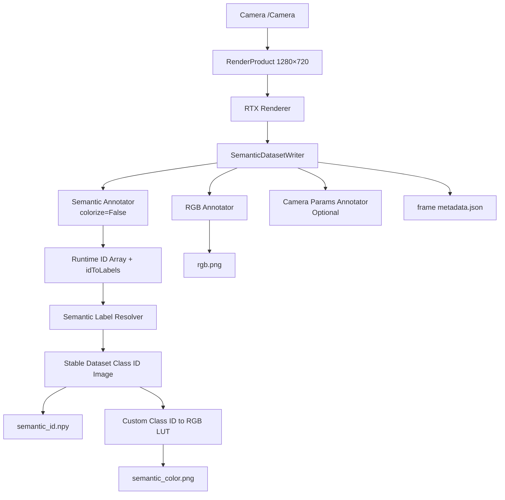

# Custom Semantic Writer 实现方案

## 1. 文档信息

| 项目 | 内容 |
|---|---|
| 文档名称 | Custom Semantic Writer 实现方案 |
| 方案版本 | v0.1 |
| 编写日期 | 2026-07-13 |
| 目标环境 | Isaac Sim 6.0.1 |
| 目标场景 | `/root/Desktop/wyb/Semantic_260709_01.usda` |
| 默认相机 | `/Camera` |
| 默认分辨率 | `1280 × 720` |
| 当前脚本 | `semantic_capture_minimal.py` |

本文档只描述实现方案和接口设计，不包含已经完成的代码实现，也不修改现有语义采集脚本。

## 2. 改造目标

当前脚本使用 Replicator `BasicWriter` 输出：

```text
rgb_0000.png
semantic_segmentation_0000.png
semantic_segmentation_labels_0000.json
```

其中 Semantic PNG 使用 Isaac Sim 自动分配的颜色。目标是改为统一的自定义 Writer，并输出：

```text
RGB PNG
稳定 Dataset Class ID NPY
自定义颜色 Semantic PNG
本帧语义映射和统计 JSON
可选 Isaac Runtime ID NPY
可选 Camera Parameters JSON
```

核心原则：

```text
NPY 是正式语义数据。
PNG 是由 NPY 和自定义颜色表派生的可视化结果。
Isaac Runtime ID 不作为跨运行稳定的 Dataset Class ID。
```

## 3. 当前链路与目标链路

### 3.1 当前链路

```text
Camera
    ↓
RenderProduct
    ↓
RTX Renderer
    ↓
BasicWriter
    ├── RGB Annotator
    └── Semantic Annotator(colorize=True)
            ↓
      Isaac 默认彩色 Semantic PNG
```

### 3.2 目标链路



目标方案由一个 Writer 统一接管所有输出，从而保证：

- 所有文件使用同一个 frame ID；
- RGB 和 Semantic 来自同一个 RenderProduct；
- Semantic NPY 和 PNG 使用同一张稳定 Class ID 图；
- 标签解析、颜色映射和异常策略集中管理；
- 后续能够扩展到多相机和其他 Annotator。

## 4. 改造边界

| 组件 | 是否修改 | 方案 |
|---|---:|---|
| USD Stage 加载 | 否 | 继续加载已有 USDA |
| Camera | 否 | 继续使用 `/Camera` |
| RenderProduct | 否 | 继续指定相机与分辨率 |
| Renderer | 原则上否 | 继续负责渲染和可见性缓冲区 |
| Semantic Schema | 可能规范化 | USD 标签继续作为源语义 |
| BasicWriter | 是 | 由 `SemanticDatasetWriter` 替代 |
| Semantic Annotator | 是 | 改为 `colorize=False` 原始 ID 输出 |
| RGB Annotator | 保留 | 由 Custom Writer 内部注册 |
| Camera Params Annotator | 新增，可选 | 保存相机内外参 |
| Semantic 后处理 | 新增 | Runtime ID → Label → Dataset ID → RGB |
| 输出目录结构 | 修改 | 按数据类型分目录 |

## 5. Custom Writer 类设计

### 5.1 类名

建议类名：

```text
SemanticDatasetWriter
```

它继承 Replicator 的 `Writer` 基类。

### 5.2 核心职责

`SemanticDatasetWriter` 负责：

1. 注册所需 Annotator。
2. 加载自定义 Semantic Schema。
3. 验证 Class ID、颜色和别名配置。
4. 接收每个 RenderProduct 的逐帧数据。
5. 解析 Isaac Runtime ID 对应的语义标签。
6. 将源标签映射为稳定 Dataset Class ID。
7. 生成并保存 Class ID NPY。
8. 根据自定义颜色表生成 PNG。
9. 保存 RGB、Camera Parameters 和帧级 Metadata。
10. 统一管理帧号、路径和异步写盘任务。

### 5.3 不应承担的职责

Custom Writer 不应负责：

- 启动或关闭 `SimulationApp`；
- 打开 USD Stage；
- 创建或移动 Camera；
- 推进 Physics；
- 决定 Renderer 类型；
- 创建业务场景资产；
- 修改 USD 中已有语义标签。

这些职责继续保留在主采集脚本或场景构建模块中。

## 6. Writer 初始化接口

建议 Writer 接收以下配置：

| 参数 | 类型 | 默认建议 | 作用 |
|---|---|---|---|
| `backend` | Replicator Backend | 必填 | DiskBackend 或 S3Backend |
| `semantic_schema` | 路径或字典 | 必填 | 自定义类别、ID 和颜色映射 |
| `rgb` | bool | `True` | 是否保存 RGB |
| `semantic_segmentation` | bool | `True` | 是否保存 Semantic |
| `camera_params` | bool | `True` | 是否保存相机参数 |
| `save_runtime_ids` | bool | `False` | 是否额外保存 Isaac Runtime ID |
| `save_colorized` | bool | `True` | 是否保存自定义 Semantic PNG |
| `semantic_dtype` | string | `uint8` | Dataset ID 数组类型 |
| `unknown_policy` | string | `error` | 未知标签处理策略 |
| `unknown_class_id` | int | Schema 定义 | 未知类别 ID |
| `strict_mapping` | bool | `True` | 未映射标签是否终止 |
| `semantic_types` | list | `["class"]` | 读取的语义 taxonomy |
| `image_output_format` | string | `png` | RGB/预览图格式 |
| `start_frame_id` | int | `0` | 起始帧号 |
| `overwrite` | bool | `False` | 是否允许覆盖已有文件 |

使用 Synthetic Data Recorder GUI 时，Writer 应接受 Recorder 传入的 `backend`，而不是绕过 Recorder 再创建一套独立输出路径。

## 7. Writer 内部状态

建议维护以下状态：

```text
_backend
_frame_id
_schema_version
_label_to_class_id
_class_id_to_color
_alias_to_label
_label_priority
_unknown_policy
_semantic_dtype
_save_runtime_ids
_render_product_names
_schema_written
```

如果后续需要多相机，建议设置：

```text
data_structure = "renderProduct"
```

这样 `write(data)` 可以从 RenderProduct 视角组织 RGB、Semantic 和 Camera Parameters。

## 8. Writer 内部 Annotator

### 8.1 RGB Annotator

```text
Annotator：rgb
输出：H × W × 4 RGBA
用途：保存相机 RGB PNG
```

如果任务只需要语义和深度，可通过参数关闭 RGB，减少 GPU 到 CPU 数据传输和磁盘写入。

### 8.2 Raw Semantic Annotator

```text
Annotator：semantic_segmentation
init：colorize=False
semanticTypes：["class"]
```

典型返回：

```text
data
    H × W 或 H × W × 1
    dtype 通常为 uint32
    每个像素是 Isaac Runtime Semantic ID

info["idToLabels"]
    Runtime ID 到源语义标签的映射
```

Custom Writer 必须使用原始 ID 输出，不能再请求 Isaac 默认彩色化结果。

### 8.3 Camera Params Annotator

建议可选启用：

```text
Annotator：camera_params
```

用于保存：

- 相机内参；
- 相机外参；
- View Matrix；
- Projection Matrix；
- Camera Prim Path；
- 分辨率和投影模型。

## 9. 自定义 Semantic Schema

### 9.1 Schema 目标

Schema 负责定义跨运行稳定的：

```text
Semantic Label
Dataset Class ID
RGB Color
Alias
Priority
Unknown Policy
```

建议将 Schema 保存为独立 JSON 或 YAML，而不是硬编码在 Writer 中。

### 9.2 建议结构

下面是配置结构示意，不是最终实现代码：

```yaml
schema_version: 1

classes:
  BACKGROUND:
    id: 0
    color: [0, 0, 0]

  forklift:
    id: 1
    color: [220, 40, 40]
    aliases:
      - forkliftbriggedcm
      - forkliftbodyb
      - lift
      - body

  wall:
    id: 2
    color: [120, 120, 120]

  floor:
    id: 3
    color: [60, 180, 75]

  UNLABELLED:
    id: 255
    color: [255, 0, 255]

priority:
  - forklift
  - table
  - wall
  - floor
  - world

unknown:
  policy: error
  id: 255
```

### 9.3 Schema 初始化检查

Writer 初始化时必须验证：

- Class ID 是否唯一；
- Class ID 是否符合所选 dtype；
- Label 名称是否唯一；
- Alias 是否映射到多个类别；
- RGB 是否包含三个 `0～255` 整数；
- 是否定义 `BACKGROUND`；
- 是否定义 `UNLABELLED` 或 Unknown 策略；
- Priority 中是否引用不存在的类别；
- Schema Version 是否存在。

颜色最好保持唯一，便于人工检查，但训练数据的真实类别仍以 Class ID 为准。

## 10. 标签规范化与解析

当前场景可能返回组合标签：

```text
world,forkliftbodyb,forkliftbriggedcm,body
```

不能直接对完整字符串做一次精确匹配。建议解析流程为：

```text
读取 idToLabels
    ↓
选择 class taxonomy
    ↓
按逗号或列表拆分标签
    ↓
去除空格并统一大小写
    ↓
应用 Alias
    ↓
按照 Priority 选择业务类别
    ↓
得到唯一 Dataset Class
```

例如：

```text
world,forkliftbodyb,forkliftbriggedcm,body
    ↓
[world, forkliftbodyb, forkliftbriggedcm, body]
    ↓
[world, forklift, forklift, forklift]
    ↓
forklift
    ↓
Dataset Class ID = 1
```

## 11. Writer 内部逻辑模块

建议按以下职责划分内部函数：

```text
SemanticDatasetWriter
├── load_schema()
├── validate_schema()
├── normalize_annotator_data()
├── normalize_source_labels()
├── resolve_dataset_class()
├── build_runtime_id_lut()
├── remap_runtime_ids()
├── colorize_dataset_ids()
├── build_frame_metadata()
├── serialize_npy()
├── schedule_image_write()
├── schedule_blob_write()
└── write()
```

职责说明：

| 模块 | 作用 |
|---|---|
| `load_schema` | 读取 JSON/YAML 配置 |
| `validate_schema` | 检查 ID、颜色和 Alias 冲突 |
| `normalize_annotator_data` | 将 `H×W×1` 统一为 `H×W` |
| `normalize_source_labels` | 处理大小写、空格和多标签 |
| `resolve_dataset_class` | 按 Alias 与 Priority 选择类别 |
| `build_runtime_id_lut` | Runtime ID → Dataset ID |
| `remap_runtime_ids` | 生成稳定 Dataset ID 图 |
| `colorize_dataset_ids` | Dataset ID → RGB 图 |
| `build_frame_metadata` | 生成本帧映射和统计信息 |
| `serialize_npy` | 把 NumPy 数组序列化为标准 NPY 字节流 |
| `schedule_*_write` | 将写入任务交给 Replicator Backend |
| `write` | 组织单帧完整处理流程 |

## 12. write(data) 的逐帧流程

Replicator 每触发一次采集，就调用一次 Writer 的 `write(data)`。

推荐执行顺序：

1. 读取当前 frame ID。
2. 确认当前 RenderProduct 数据存在。
3. 读取 RGB 数据，可选。
4. 读取 Raw Semantic 的 `data`。
5. 读取 `info["idToLabels"]`。
6. 检查 Semantic 数组不为空。
7. 将 Semantic 数组规范为 `H×W`。
8. 检查 RGB 与 Semantic 尺寸一致。
9. 提取本帧出现的 Runtime ID。
10. 解析每个 Runtime ID 对应的源 Label。
11. 将源 Label 解析成唯一 Dataset Class。
12. 建立 Runtime ID → Dataset ID LUT。
13. 向量化生成 Dataset ID 图。
14. 检查未知标签和未知像素比例。
15. 根据 Dataset ID → RGB LUT 生成彩色图。
16. 序列化 Dataset ID NPY。
17. 可选序列化 Runtime ID NPY。
18. 生成本帧 Metadata。
19. 将 RGB、NPY、PNG、JSON 写入任务提交给 Backend。
20. 所有任务提交成功后递增 frame ID。

## 13. Dataset ID NPY

### 13.1 正式 NPY 内容

推荐保存：

```text
shape：H × W
dtype：uint8 / uint16 / uint32
value：稳定 Dataset Class ID
```

类别数量建议：

| 类别范围 | dtype |
|---:|---|
| 0～255 | `uint8` |
| 0～65535 | `uint16` |
| 更大范围 | `uint32` |

### 13.2 可选 Runtime ID NPY

调试模式可以额外保存：

```text
semantic_runtime_id/000000.npy
```

该数据用于复现 `idToLabels` 的解析过程，不应直接作为跨运行稳定的训练标签。

### 13.3 NPY 写入 Backend

推荐流程：

```text
NumPy Dataset ID Array
    ↓
序列化为标准 .npy 字节流
    ↓
Backend write_blob / schedule
    ↓
semantic_id/000000.npy
```

不要让 Writer 的每一种文件都绕过 Backend 直接同步写盘。使用 Backend 可以复用 Replicator 的异步队列、多线程写盘和完成等待机制。

## 14. 自定义 Semantic PNG

### 14.1 颜色查找表

Writer 初始化时根据 Schema 构造：

```text
Class ID → [R, G, B]
```

如果最大 Class ID 是 255，可以建立：

```text
color_lut.shape = 256 × 3
color_lut.dtype = uint8
```

### 14.2 PNG 生成关系

```text
semantic_dataset_ids: H × W
    ↓ color_lut[semantic_dataset_ids]
semantic_rgb: H × W × 3 uint8
    ↓
semantic_color/000000.png
```

必须保证：

```text
semantic_id.npy + semantic_schema.json
    可以完整重新生成
semantic_color.png
```

PNG 使用明确的 RGB 通道顺序。若以后使用 OpenCV，应额外注意 OpenCV 默认采用 BGR。

## 15. Frame Metadata

建议每帧输出：

```text
metadata/000000.json
```

内容至少包括：

```text
frame_id
render_product_name
camera_prim_path
resolution
semantic_schema_version
runtime_id_to_source_labels
runtime_id_to_dataset_id
observed_dataset_classes
unknown_labels
unknown_pixel_count
unknown_pixel_ratio
semantic_dtype
simulation_time
renderer
```

它用于回答：

```text
这一帧中的每个 Dataset Class ID 是如何从 Isaac Runtime ID 得到的？
```

## 16. 输出目录设计

### 16.1 单相机第一版

```text
output/
├── rgb/
│   └── 000000.png
├── semantic_id/
│   └── 000000.npy
├── semantic_color/
│   └── 000000.png
├── semantic_runtime_id/
│   └── 000000.npy
├── metadata/
│   └── 000000.json
├── camera/
│   └── 000000.json
├── semantic_schema.json
└── run_config.json
```

`semantic_runtime_id` 和 `camera` 可通过配置关闭。

### 16.2 多相机扩展

```text
output/
├── FrontCamera/
│   ├── rgb/
│   ├── semantic_id/
│   ├── semantic_color/
│   └── metadata/
└── RearCamera/
    ├── rgb/
    ├── semantic_id/
    ├── semantic_color/
    └── metadata/
```

多相机目录应使用稳定的 RenderProduct 名称，而不是依赖可能变化的内部 Hydra 路径。

## 17. Backend 设计

### 17.1 第一版

使用：

```text
DiskBackend
```

主脚本负责创建和初始化 Backend，然后传给 Custom Writer。

### 17.2 Writer 与 Backend 的职责边界

```text
Writer
    决定写什么、怎样映射、怎样命名、怎样编码

Backend
    决定写到哪里、怎样执行底层 I/O
```

### 17.3 异步写入

RGB 和 Semantic PNG 可以通过 Backend 调度图像编码。NPY 先序列化为字节流，再通过 Blob 写入任务交给 Backend。

采集结束时继续调用：

```text
rep.orchestrator.wait_until_complete()
```

确保所有异步编码和写盘任务完成后再销毁 RenderProduct 和关闭 Isaac Sim。

## 18. 当前主脚本的接入方案

### 18.1 保持不变

以下流程保持不变：

```text
解析命令行
创建 SimulationApp
打开 USD Stage
等待 Stage 加载
检查 Camera
检查 Semantic Schema
创建 RenderProduct
Warmup
orchestrator.step()
wait_until_complete()
detach
destroy RenderProduct
close SimulationApp
```

### 18.2 需要替换

当前：

```text
获取 BasicWriter
初始化 RGB + Colorized Semantic
BasicWriter.attach(RenderProduct)
```

替换为：

```text
加载 Custom Semantic Schema
创建 DiskBackend
创建 SemanticDatasetWriter
将 Backend 与 Schema 传给 Writer
SemanticDatasetWriter.attach(RenderProduct)
```

### 18.3 主脚本不再直接处理 Semantic

使用 Custom Writer 后，主脚本不需要：

- 显式调用 Semantic Annotator 的 `get_data()`；
- 手动执行 Runtime ID 重映射；
- 手动保存 NPY；
- 手动生成彩色 PNG；
- 手动管理每种输出的 frame ID。

这些全部封装在 `SemanticDatasetWriter.write(data)` 内。

## 19. 建议新增命令行参数

| 参数 | 作用 |
|---|---|
| `--semantic-schema` | 自定义 JSON/YAML Schema 路径 |
| `--semantic-dtype` | Dataset ID dtype |
| `--unknown-policy` | `error`、`warn` 或 `fallback` |
| `--save-runtime-ids` | 保存 Isaac Runtime ID NPY |
| `--save-semantic-color` | 保存自定义彩色 PNG |
| `--save-camera-params` | 保存相机内外参 |
| `--strict-semantic-map` | 未知标签是否终止任务 |
| `--overwrite` | 是否允许覆盖已有输出 |

命令行参数应覆盖 Schema 中相应的运行级配置，但不应动态改变已经发布的 Class ID 定义。

## 20. 未知标签策略

建议支持三种策略：

| 策略 | 行为 | 使用阶段 |
|---|---|---|
| `error` | 发现未知标签立即失败 | 正式数据生产 |
| `warn` | 映射到 Unknown 并记录警告 | 集成测试 |
| `fallback` | 静默映射到指定类别并统计 | 探索性采集 |

正式数据集推荐：

```text
strict_mapping = True
unknown_policy = error
```

这样可以防止新资产或新标签被错误地混入已有类别。

## 21. 异常和校验设计

Writer 应检查：

- Semantic 数据是否为空；
- `idToLabels` 是否存在；
- Semantic 数据尺寸是否正确；
- RGB 与 Semantic 分辨率是否一致；
- Runtime ID 是否能够在 `idToLabels` 中找到；
- 一个标签是否同时匹配多个 Dataset Class；
- Dataset ID 是否超出 dtype 范围；
- Class ID 和颜色是否重复；
- 未知像素比例是否超过阈值；
- 输出文件是否已存在；
- Backend 是否接受写入任务；
- Frame ID 是否连续递增。

如果一帧处理失败，默认不应只写出该帧的一部分文件。可以在 Metadata 中记录失败，也可以直接终止整个正式数据生成任务。

## 22. 生命周期

推荐创建顺序：

```text
SimulationApp
    → Open Stage
    → Validate Camera/Semantics
    → Create RenderProduct
    → Create Backend
    → Create SemanticDatasetWriter
    → Attach Writer
    → Warmup
    → Capture
```

推荐销毁顺序：

```text
Stop capture
    → Wait until complete
    → Writer detach
    → RenderProduct destroy
    → SimulationApp close
```

## 23. 多 RenderProduct 数据组织

第一版只需要支持单 RenderProduct，但内部设计应避免阻止以后扩展。

多 RenderProduct 时，`write(data)` 应按 RenderProduct 分组：

```text
Frame 000000
  ├── FrontRenderProduct
  │     ├── RGB
  │     ├── Semantic
  │     └── Camera Params
  └── RearRenderProduct
        ├── RGB
        ├── Semantic
        └── Camera Params
```

同一次 `write(data)` 中的不同 RenderProduct 应共享全局 frame ID，但输出到各自的稳定子目录。

## 24. 性能考虑

### 24.1 标签映射

不要逐像素执行 Python 字符串判断。正确方式是：

1. 获取当前帧实际出现的唯一 Runtime ID；
2. 每个 Runtime ID 只解析一次标签；
3. 构造 Runtime ID → Dataset ID LUT；
4. 使用 NumPy 向量化生成整张 Dataset ID 图。

### 24.2 颜色映射

使用数组查表：

```text
semantic_rgb = color_lut[semantic_dataset_ids]
```

不要逐像素循环填充颜色。

### 24.3 I/O

- 只启用必要 Annotator；
- NPY 不使用额外压缩时写入速度更稳定；
- PNG 编码可能成为 CPU 瓶颈；
- 使用 Replicator Backend 异步写入；
- 监控 Backend 队列和磁盘吞吐；
- 多相机时优先使用高速数据盘。

## 25. 推荐实施阶段

### 阶段 A：Schema 和纯映射函数

目标：在不启动 Isaac Sim 的情况下验证：

- Schema 加载；
- Alias 解析；
- Priority 决策；
- Runtime ID → Dataset ID；
- Dataset ID → RGB；
- NPY 与 PNG 可逆验证。

### 阶段 B：单相机 Custom Writer

目标：

- 一个 RenderProduct；
- 一帧 RGB；
- 一帧 Dataset ID NPY；
- 一帧自定义 Semantic PNG；
- 一份 Metadata。

### 阶段 C：多帧和严格校验

目标：

- 连续 frame ID；
- 多帧不覆盖；
- 未知标签策略；
- Writer 异步写入完成；
- 重复运行使用新输出目录。

### 阶段 D：多相机

目标：

- 多 RenderProduct；
- 每个 Camera 独立子目录；
- 同一 frame ID 的多相机同步；
- Camera Parameters 输出。

### 阶段 E：Synthetic Data Recorder 集成

目标：

- 注册到 WriterRegistry；
- GUI 能选择 Custom Writer；
- Recorder 参数 JSON 能传入 Schema 和输出选项；
- DiskBackend/S3Backend 均可替换。

## 26. 测试计划

### 26.1 单元测试

- 相同 Label 永远得到相同 Dataset ID；
- 相同 Dataset ID 永远得到相同 RGB；
- Alias 正确归一；
- Priority 冲突按预期解决；
- Unknown 策略正确；
- dtype 容量检查正确；
- NPY 重新加载后数组完全一致；
- 由 NPY 重建的 PNG 与 Writer 输出逐像素一致。

### 26.2 集成测试

- RGB 和 Semantic 分辨率一致；
- RGB 与 Semantic 轮廓对齐；
- 输出帧数符合 `--frames`；
- Metadata 中 frame ID 连续；
- 未映射像素统计正确；
- 相同场景重复运行时 Dataset ID 和颜色保持一致；
- `wait_until_complete()` 后所有文件可正常打开。

### 26.3 回归测试

- 与当前 BasicWriter RGB 输出比较；
- 检查替换 Writer 后 Camera 视角未改变；
- 检查 Renderer 和 RenderProduct 未被意外修改；
- 检查 Semantic PNG 不再依赖 Isaac 默认颜色。

## 27. 验收标准

Custom Writer 完成后必须满足：

1. 不再输出 Isaac 默认颜色的 Semantic PNG。
2. 每帧产生稳定 Dataset Class ID NPY。
3. NPY shape 等于 RenderProduct 的 `height × width`。
4. NPY dtype 与 Schema 配置一致。
5. NPY 中所有 ID 都在 Schema 中定义。
6. Semantic PNG 只能由 NPY 和 Schema 生成。
7. 相同 Label 跨运行保持相同 ID 和颜色。
8. RGB、NPY、PNG 和 Metadata 使用同一 frame ID。
9. 未知标签有明确策略和统计记录。
10. 输出文件不会被静默覆盖。
11. Writer 能完成异步写盘并正确释放资源。
12. 当前 Camera、RenderProduct 和 Renderer 行为不发生意外变化。

## 28. 最终生产链路

```text
USD SemanticsLabelsAPI
        ↓
Camera /Camera
        ↓
RenderProduct 1280×720
        ↓
RTX Renderer
        ↓
SemanticDatasetWriter
        ├── RGB Annotator
        ├── Semantic Annotator(colorize=False)
        └── Camera Params Annotator
                    ↓
         Runtime ID + idToLabels
                    ↓
        Label Normalize + Alias
                    ↓
             Priority Resolver
                    ↓
          Stable Dataset Class ID
             ├───────────────┐
             ↓               ↓
       NPY Serializer     Color LUT
             ↓               ↓
     semantic_id.npy  semantic_color.png
             └───────┬───────┘
                     ↓
          Frame Metadata + Camera Data
                     ↓
             Replicator Backend
                     ↓
              Dataset Directory
```

## 29. 官方参考资料

- [Create a Custom Writer](https://docs.omniverse.nvidia.com/extensions/latest/ext_replicator/custom_writer.html)
- [Replicator Writer Examples](https://docs.omniverse.nvidia.com/extensions/latest/ext_replicator/writer_examples.html)
- [Replicator I/O Optimization Guide](https://docs.omniverse.nvidia.com/extensions/latest/ext_replicator/io_guidelines.html)
- [Isaac Sim Synthetic Data Recorder](https://docs.isaacsim.omniverse.nvidia.com/6.0.0/replicator_tutorials/tutorial_replicator_recorder.html)
- [Isaac Sim Replicator Getting Started](https://docs.isaacsim.omniverse.nvidia.com/6.0.0/replicator_tutorials/tutorial_replicator_getting_started.html)
- [Isaac Sim Replicator Writers](https://docs.isaacsim.omniverse.nvidia.com/latest/py/source/extensions/isaacsim.replicator.writers/docs/index.html)
