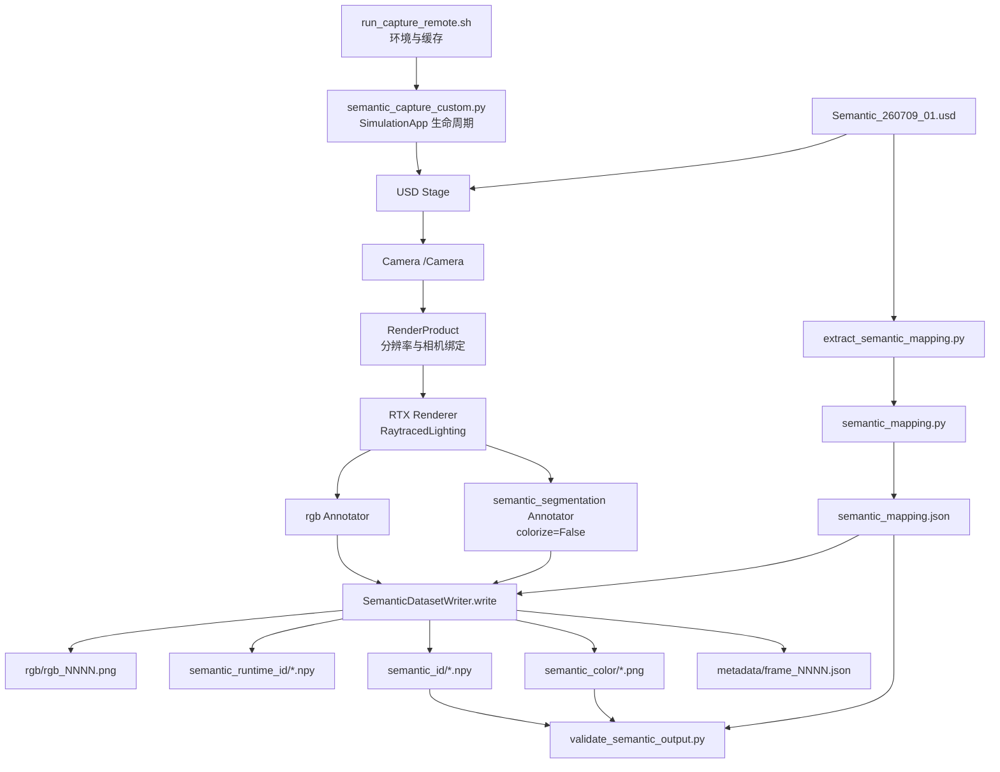
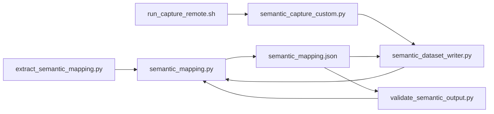
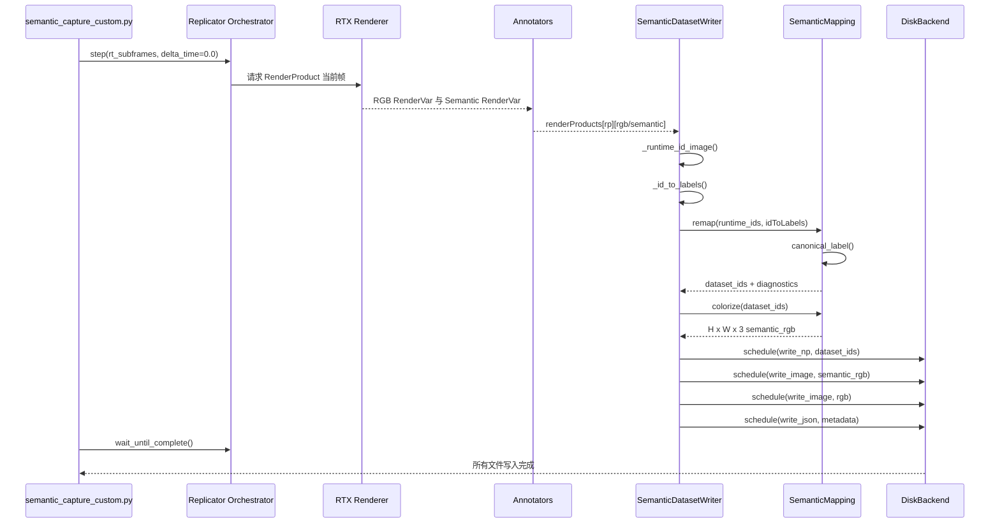

# Custom Semantic Writer 项目架构、算法与执行流程

## 1. 文档目的

本文档面向当前目录中的 Custom Semantic Writer 实现，详细解释以下内容：

1. 项目要解决的核心问题，以及算法为什么这样构造。
2. 项目的层次架构、功能模块和文件职责。
3. USD、Camera、RenderProduct、Renderer、Annotator、Writer 之间的数据传递关系。
4. mapping 配置生成阶段和逐帧采集阶段的计算顺序。
5. 每个函数块的输入、输出、关键语句和调用者。
6. 项目从命令行启动到 Isaac Sim 关闭的完整执行顺序。
7. 输出 NPY、PNG、JSON 之间的约束关系和验证方法。

本文档描述的是已经在 Isaac Sim 6.0.1 远端环境中完成实际运行和校验的版本。

当前主要路径如下：

| 项目 | 路径 |
|---|---|
| 远端 USD | `/root/gpufree-data/wyb/Semantic_260709_01.usd` |
| 远端项目 | `/root/gpufree-data/wyb/test_semantic_CustomWriter_260713_01` |
| 默认相机 | `/Camera` |
| 本地项目 | `D:\learning\IntelligentDepartment\CodesSet\Self\260707IsaacSIm\scripts\test_semantic_CustomWriter_260713_01` |

## 2. 项目目标

Isaac Sim 的 `BasicWriter` 可以直接输出彩色语义图，但默认颜色通常由 Isaac Sim 在当前运行中自动分配。这样的 PNG 适合观察，却不适合作为跨运行、跨数据集稳定的正式标签数据。

本项目把语义输出调整为以下形式：

```text
正式数据：稳定 Dataset Class ID 的 uint16 NPY
可视化：由 NPY 和自定义 mapping 派生的 RGB PNG
追溯数据：Isaac Runtime ID NPY 和逐帧 runtime ID 映射 JSON
辅助数据：同帧 RGB PNG
配置数据：由 USD 语义标签生成的 semantic_mapping.json
```

项目的核心原则是：

> NPY 是正式语义数据，PNG 是由 NPY 和颜色查找表确定性生成的可视化结果。

因此，PNG 不再直接采用 Isaac Sim 默认的 semantic color mapping，而是遵守项目自己的：

```text
Semantic Label -> Dataset Class ID -> RGB Color
```

## 3. 核心问题与算法构造思想

### 3.1 为什么不能直接把 Isaac Runtime ID 当作 Dataset ID

`semantic_segmentation(colorize=False)` 返回的每个像素值是 Isaac 当前运行中的 Runtime Semantic ID。这个 ID 是渲染和 Synthetic Data 管线在运行时建立的索引，不应被假设为跨场景、跨进程或跨版本稳定。

例如，某次运行中：

```text
Runtime ID 15 -> simpleroom,towelroom01wallside
```

另一次运行中，同一个语义类别不一定仍然使用 Runtime ID 15。

所以本项目不直接保存 Runtime ID 作为正式训练标签，而是执行：

```text
Runtime ID
  -> idToLabels
  -> 最终 Semantic Label
  -> semantic_mapping.json
  -> 稳定 Dataset Class ID
```

Runtime ID NPY 仍然可以保存，但只用于调试和追溯。

### 3.2 多级继承标签为什么只取最后一个

USD 场景中父 prim 和子 prim 都可能带有 `class` 标签。Isaac 的运行时语义结果可能将继承链合并为逗号分隔字符串，例如：

```json
{"class": "simpleroom,towelroom01wallside"}
```

本项目规定：

```text
按逗号切分
-> 去除空白和空字符串
-> 取最后一个非空标签
```

因此：

```text
simpleroom,towelroom01wallside
-> [simpleroom, towelroom01wallside]
-> towelroom01wallside
```

最后一个标签通常代表层级中最具体的语义，因此比父级的 `simpleroom` 更适合作为当前 mesh 的标签。

这条规则同时用于：

1. 从 USD 生成 mapping。
2. Writer 逐帧解析 `idToLabels`。

两处共用同一个 `canonical_label()`，避免离线配置阶段和在线采集阶段使用不同解释规则。

### 3.3 稳定语义数据的数学关系

设：

```text
R(x, y) = 像素 (x, y) 的 Isaac Runtime ID
M(r)    = idToLabels 中 Runtime ID r 对应的标签信息
C(v)    = canonical_label，将复合标签 v 规范化为最终标签
D(l)    = semantic_mapping.json 中标签 l 对应的 Dataset ID
L(i)    = Dataset ID i 对应的 RGB 颜色
```

则正式语义 ID 图为：

```text
S(x, y) = D(C(M(R(x, y))))
```

自定义彩色语义图为：

```text
P(x, y) = L(S(x, y))
```

这说明 PNG `P` 完全由 NPY `S` 和 mapping 中的颜色查找表 `L` 决定。

## 4. 总体层次架构

项目分为七个层次：

| 层次 | 功能 | 主要文件 |
|---|---|---|
| L0 环境启动层 | 设置远端缓存、临时目录并调用 Isaac Python | `run_capture_remote.sh` |
| L1 配置生成层 | 从 USD 提取标签并生成稳定 mapping | `extract_semantic_mapping.py` |
| L2 语义算法层 | 标签规范化、ID 映射、颜色分配、Schema 校验 | `semantic_mapping.py` |
| L3 Isaac 生命周期层 | 启动 SimulationApp、加载 Stage、检查 Camera | `semantic_capture_custom.py` |
| L4 渲染采集层 | 创建 RenderProduct、Renderer 输出和 Annotator 数据 | `semantic_capture_custom.py`、Isaac Sim |
| L5 Writer 输出层 | Runtime ID 重映射、NPY/PNG/RGB/JSON 写出 | `semantic_dataset_writer.py` |
| L6 独立验证层 | 根据 mapping 重建 PNG 并逐像素比较 | `validate_semantic_output.py` |

### 4.1 架构图



### 4.2 两条相互独立但共享算法的流程

项目不是一条单一流程，而是两条流程。

第一条是低频执行的配置生成流程：

```text
USD
-> 遍历语义属性
-> canonical_label
-> 稳定排序和 ID 分配
-> 自定义颜色分配
-> semantic_mapping.json
```

第二条是每次采集执行的逐帧流程：

```text
Camera
-> RenderProduct
-> Renderer
-> Raw Semantic Annotator
-> Runtime ID + idToLabels
-> canonical_label
-> Dataset ID NPY
-> 自定义颜色 LUT
-> Semantic PNG
```

两条流程通过以下内容保持一致：

```text
semantic_mapping.py
semantic_mapping.json
canonical_label()
SemanticMapping
```

## 5. 项目文件与职责

### 5.1 文件总表

| 文件 | 类型 | 主要职责 | 是否需要 Isaac Sim 环境 |
|---|---|---|---:|
| `run_capture_remote.sh` | Shell 入口 | 配置远端运行环境并调用 Isaac Python | 是 |
| `extract_semantic_mapping.py` | Python 入口 | 打开 USD 并生成 mapping JSON | 是 |
| `semantic_mapping.py` | 算法模块 | 标签规范化、Schema、ID 重映射、颜色 LUT | 生成阶段需要；纯映射逻辑可独立运行 |
| `semantic_mapping.json` | 配置产物 | 固定标签、Dataset ID、颜色和来源 prim | 否 |
| `semantic_dataset_writer.py` | Writer 模块 | 接收 Annotator 数据并统一写出 | 是 |
| `semantic_capture_custom.py` | 主采集入口 | 启动 Isaac、创建采集链路、推进帧 | 是 |
| `validate_semantic_output.py` | 校验入口 | 校验 NPY、PNG 和 mapping 一致性 | 否，只需 Python、NumPy、Pillow |
| `README.md` | 使用说明 | 提供简明命令和输出结构 | 否 |

### 5.2 模块依赖关系



## 6. mapping 配置生成算法

### 6.1 入口文件：`extract_semantic_mapping.py`

该文件是一次性或场景标签变化后执行的 mapping 生成入口。

主要执行顺序为：

```text
解析命令行参数
-> 启动 SimulationApp
-> 导入 pxr.Usd
-> Usd.Stage.Open
-> build_schema_from_stage
-> 临时文件写 JSON
-> 原子替换正式 JSON
-> 关闭 SimulationApp
```

#### 6.1.1 为什么先启动 SimulationApp，再导入 `pxr`

核心语句：

```python
from isaacsim import SimulationApp

simulation_app = SimulationApp(
    launch_config={"headless": True, "sync_loads": True}
)

from pxr import Usd
```

普通 Python 解释器启动后，Isaac/Kit 扩展、USD 插件和相关动态库不一定已经完成注册。`SimulationApp` 负责启动 Kit 应用和扩展环境，因此 Isaac 相关模块通常应在它创建后导入。

命令行参数必须在 `SimulationApp` 创建前解析，因为 `headless`、USD 路径等启动配置在应用启动前就需要确定。

#### 6.1.2 打开 USD

核心语句：

```python
stage = Usd.Stage.Open(args.usd)
```

这里获得的是 `pxr.Usd.Stage`。之后 `build_schema_from_stage()` 会遍历 Stage 中组合后的 prim，并读取：

```text
semantics:labels:class
```

#### 6.1.3 原子写入 mapping

核心语句：

```python
temporary_path = output_path.with_suffix(output_path.suffix + ".tmp")
json.dump(schema, stream, indent=2, ensure_ascii=False)
temporary_path.replace(output_path)
```

先写 `.tmp`，成功后再替换正式文件，可以避免程序中断时留下半个 JSON 文件。

### 6.2 核心文件：`semantic_mapping.py`

该文件同时服务于配置生成、逐帧 Writer 和离线校验，是项目最核心的算法模块。

#### 6.2.1 常量设计

```python
SCHEMA_VERSION = 1
BACKGROUND_ID = 0
BACKGROUND_LABEL = "BACKGROUND"
UNKNOWN_ID = 65535
UNKNOWN_LABEL = "UNLABELLED"
```

设计含义：

| 常量 | 作用 |
|---|---|
| `BACKGROUND_ID = 0` | 固定背景类别 |
| `UNKNOWN_ID = 65535` | `uint16` 最大值，保留给未知标签 |
| `SCHEMA_VERSION = 1` | 防止未来不同 Schema 结构被错误混用 |

正式 Dataset ID 使用 `uint16`，可表示 `0~65535`。当前场景只有 69 个真实类别，但预留 `65535` 作为未知类别后，后续扩展不会影响 dtype。

#### 6.2.2 `canonical_label()`：统一标签规范化

所在文件：`semantic_mapping.py`

当前代码位置：约第 23 行。

函数签名：

```python
def canonical_label(value: Any, semantic_type: str = "class") -> str | None:
```

输入可能是：

```text
None
Python dict
Python list/tuple
pxr.Vt.TokenArray
普通字符串
逗号分隔的继承标签字符串
```

处理顺序如下：

1. `None` 返回 `None`。
2. 如果是字典，优先提取 `value[semantic_type]`。
3. 如果是序列，递归处理每个元素并取最后一个有效值。
4. 如果是非标准可迭代对象，例如 `Vt.TokenArray`，先执行 `list(value)`。
5. 最终转换为字符串，按逗号切分并取最后一个非空标签。

核心语句：

```python
if isinstance(value, Mapping):
    if semantic_type in value:
        return canonical_label(value[semantic_type], semantic_type)
```

这段处理运行时 `idToLabels` 的结构：

```json
{"class": "simpleroom,towelroom01wallside"}
```

通用可迭代处理：

```python
items = list(value)
labels = [canonical_label(item, semantic_type) for item in items]
```

这段主要解决 USD 属性返回 `pxr.Vt.TokenArray`，但它不一定被 Python 的 `Sequence` 抽象识别的问题。

最后标签提取：

```python
labels = [item.strip() for item in text.split(",") if item.strip()]
return labels[-1] if labels else None
```

示例：

| 输入 | 输出 |
|---|---|
| `{"class": "simpleroom,towelroom01wallside"}` | `towelroom01wallside` |
| `{"class": "world,forkliftbodyb,body,forkliftbriggedcm"}` | `forkliftbriggedcm` |
| `Vt.TokenArray(["TowelRoom01wallside"])` | `TowelRoom01wallside` |
| `None` | `None` |

#### 6.2.3 `_jsonable_semantic_value()`：USD 类型转 JSON 类型

所在文件：`semantic_mapping.py`

作用是将字典、Sequence、Vt 数组等对象递归转换为 JSON 可以序列化的 Python 基本类型。

它不参与 Dataset ID 计算，而是服务于：

```text
mapping 中的 source_values
逐帧 metadata 中的 source
```

这样可以追溯某个规范化标签最初来自什么 USD 或运行时值。

#### 6.2.4 `_unique_color()`：确定性自定义颜色

所在文件：`semantic_mapping.py`

当前代码位置：约第 75 行。

颜色不是随机生成，而是由标签字符串确定性生成：

```python
digest = hashlib.sha256(f"{label}:{salt}".encode("utf-8")).digest()
```

计算顺序：

1. 对 `label:salt` 求 SHA-256。
2. 使用摘要前两个字节计算 HSV 的 Hue。
3. 使用后续字节限制 Saturation 和 Value 的范围。
4. 将 HSV 转换为 RGB。
5. 检查颜色是否重复或等于保留色。
6. 如果冲突，增加 `salt` 后重新计算。

关键 HSV 范围：

```python
saturation = 0.58 + ... * 0.28
value = 0.72 + ... * 0.25
```

这样可以避免大量颜色过灰或过暗，提高语义图的可辨识度。

以下颜色被保留：

```text
[0, 0, 0]       -> BACKGROUND
[255, 0, 255]   -> UNLABELLED / UNKNOWN
```

颜色由标签本身决定，因此只要标签不变，重新生成时其颜色通常保持不变。

#### 6.2.5 `build_schema_from_stage()`：从 USD 构造 mapping

所在文件：`semantic_mapping.py`

当前代码位置：约第 89 行。

第一步，确定属性名：

```python
attribute_name = f"semantics:labels:{semantic_type}"
```

默认得到：

```text
semantics:labels:class
```

第二步，遍历所有 prim：

```python
for prim in stage.Traverse():
    attribute = prim.GetAttribute(attribute_name)
```

第三步，只接受有效且明确写入过值的属性：

```python
if not attribute or not attribute.IsValid() or not attribute.HasAuthoredValueOpinion():
    continue
```

第四步，读取原始标签并规范化：

```python
raw_value = attribute.Get()
label = canonical_label(raw_value, semantic_type)
```

第五步，按最终标签聚合来源 prim：

```python
entry["prim_paths"].append(str(prim.GetPath()))
```

一个标签可以对应多个 prim，因此 Schema 中同时保存：

```text
prim_count
source_values
prim_paths
```

第六步，稳定排序并分配 Dataset ID：

```python
sorted(occurrences, key=lambda item: (item.casefold(), item))
enumerate(..., start=1)
```

真实类别从 ID 1 开始，ID 0 留给背景。

需要特别注意：

> ID 的稳定性依赖于生成后的 `semantic_mapping.json` 被固定使用。如果向 USD 新增一个排序位置更靠前的标签后重新生成 mapping，后续标签的自动 ID 可能发生移动。

因此，正式数据集开始采集后，应将 mapping 作为版本化配置冻结。修改 USD taxonomy 时，应生成新的 Schema 版本或显式维护原有 ID，而不是无条件覆盖旧 mapping。

#### 6.2.6 `load_schema()` 和 `validate_schema()`：配置加载与防错

`load_schema()` 支持两种输入：

```text
JSON 文件路径
已经加载的 Python Mapping
```

加载后立即调用：

```python
validate_schema(schema)
```

校验项目包括：

1. `schema_version` 必须等于当前版本。
2. `dataset_dtype` 必须为 `uint16`。
3. ID 必须为合法 `uint16`。
4. ID 不允许重复。
5. 标签不允许重复。
6. 标签忽略大小写后仍不允许重复。
7. RGB 必须是三个 `0~255` 整数。
8. RGB 不允许重复。
9. 背景 ID 必须是 0。
10. Unknown policy 只能是 `error` 或 `use_unknown`。

忽略大小写重复检查很重要，因为运行时标签可能为小写：

```text
mapping: TowelRoom01wallside
runtime: towelroom01wallside
```

如果 Schema 同时允许两个仅大小写不同的标签，运行时 fallback 会产生歧义。

## 7. `SemanticMapping` 运行时映射算法

### 7.1 `SemanticMapping.__init__()`

所在文件：`semantic_mapping.py`

当前代码位置：约第 210 行。

构造时执行：

```text
加载并校验 Schema
-> 建立 label_to_id
-> 建立 folded_label_to_id
-> 建立 id_to_label
-> 建立 65536 x 3 的颜色 LUT
```

核心查找表：

```python
self.label_to_id = {entry["label"]: entry["id"] for entry in entries}
self.folded_label_to_id = {
    entry["label"].casefold(): entry["id"] for entry in entries
}
self.id_to_label = {entry["id"]: entry["label"] for entry in entries}
```

大小写折叠表用于兼容：

```text
TowelRoom01wallside
towelroom01wallside
```

颜色 LUT 的构造：

```python
self.color_lut = np.zeros((65536, 3), dtype=np.uint8)
self.color_lut[entry["id"]] = entry["color"]
```

这个 LUT 大约占用：

```text
65536 * 3 * 1 byte = 196608 bytes
```

空间开销很小，但可以让整幅图使用 NumPy 索引一次完成着色。

### 7.2 `resolve_dataset_id()`

所在文件：`semantic_mapping.py`

当前代码位置：约第 224 行。

调用顺序：

```text
label_info
-> canonical_label
-> 背景别名判断
-> 精确标签查找
-> casefold 标签查找
-> UNKNOWN_ID
```

背景别名包括：

```python
{"", "background", "unlabelled", "unlabeled", "none"}
```

因此明确的无标签或背景值会被视为 Dataset ID 0。真正无法识别的非背景标签才会返回 ID 65535。

### 7.3 `remap()`：逐帧 Runtime ID 转 Dataset ID

所在文件：`semantic_mapping.py`

当前代码位置：约第 235 行。

输入：

```text
runtime_ids: H x W 的 uint32 Runtime ID 图
id_to_labels: Runtime ID -> 标签信息
strict: 是否在发现未知标签时抛出异常
```

输出：

```text
dataset_ids: H x W 的 uint16 Dataset ID 图
diagnostics: 当前帧映射、像素统计和未知标签
```

#### 7.3.1 统一输入格式

```python
runtime_ids = np.asarray(runtime_ids, dtype=np.uint32)
normalized_labels = {int(key): value for key, value in id_to_labels.items()}
```

`idToLabels` 的键可能是字符串或整数，因此统一转为整数。

#### 7.3.2 使用未知 ID 初始化整幅图

```python
dataset_ids = np.full(
    runtime_ids.shape,
    self.unknown_id,
    dtype=np.uint16,
)
```

先填充 UNKNOWN 可以避免任何漏写像素被误认为背景。

#### 7.3.3 只遍历当前帧实际出现的 Runtime ID

```python
for runtime_id_value in np.unique(runtime_ids):
```

图像可能有几十万像素，但实际出现的类别数量通常很小。算法先获得唯一 Runtime ID 集合，再逐类别处理。

#### 7.3.4 Runtime ID 到 Dataset ID

```python
label_info = normalized_labels.get(runtime_id)
dataset_id, label = self.resolve_dataset_id(label_info)
dataset_ids[runtime_ids == runtime_id] = dataset_id
```

这里的布尔掩码：

```python
runtime_ids == runtime_id
```

选中当前 Runtime ID 的所有像素，再一次性写入 Dataset ID。

#### 7.3.5 严格模式

```python
if unknown_labels and strict:
    raise KeyError(...)
```

当前实现中，运行时是否报错由 Writer 参数 `strict_mapping` 控制：

```text
--strict-mapping      未知标签直接终止采集
--no-strict-mapping   未知标签保留为 65535
```

Schema 中的 `unknown.policy` 会被结构校验，但当前 `remap()` 的实际分支由 `strict` 参数决定。这一点在后续扩展配置驱动策略时可以进一步统一。

#### 7.3.6 逐帧诊断数据

`diagnostics` 包含：

```text
runtime_id_mapping
dataset_pixel_counts
unknown_labels
```

例如：

```json
{
  "source": {"class": "simpleroom,towelroom01wallside"},
  "resolved_label": "towelroom01wallside",
  "dataset_id": 63,
  "dataset_label": "TowelRoom01wallside"
}
```

#### 7.3.7 计算复杂度

设像素数量为 `N = H * W`，当前帧出现 `K` 个 Runtime ID。

主要计算为：

```text
np.unique(runtime_ids)
K 次布尔掩码 runtime_ids == runtime_id
```

可近似理解为 `O(KN)` 的掩码写入。语义类别数量较少时，这种实现简单、清晰且足够高效。如果未来 `K` 很大，可以改为稠密 Runtime ID LUT 或排序映射，减少多次全图比较。

### 7.4 `colorize()`：Dataset ID 到 RGB

所在文件：`semantic_mapping.py`

当前代码位置：约第 282 行。

核心语句：

```python
return self.color_lut[dataset_ids.astype(np.uint16, copy=False)]
```

如果 `dataset_ids` 的形状是：

```text
H x W
```

则高级索引结果自动变为：

```text
H x W x 3
```

这个过程没有 Python 像素循环，着色由 NumPy 在底层批量完成。

## 8. Isaac Sim 主采集流程

### 8.1 入口文件：`semantic_capture_custom.py`

该文件负责应用生命周期和采集链路编排，不负责具体的标签算法。

它的职责边界是：

```text
解析参数
启动 SimulationApp
加载 USD
检查 Camera 和语义标签
创建 RenderProduct
创建 Backend 和 Writer
推进采集帧
等待写盘
释放资源
```

### 8.2 命令行参数

| 参数 | 默认值 | 作用 |
|---|---|---|
| `--usd` | `/root/gpufree-data/wyb/Semantic_260709_01.usd` | 输入 Stage |
| `--mapping` | 脚本同目录 `semantic_mapping.json` | Dataset ID 与颜色配置 |
| `--camera` | `/Camera` | Camera prim 路径 |
| `--output` | 项目下 `output` | 输出目录 |
| `--width` | `1280` | RenderProduct 宽度 |
| `--height` | `720` | RenderProduct 高度 |
| `--frames` | `1` | 采集帧数 |
| `--warmup` | `10` | 正式采集前 update 次数 |
| `--rt-subframes` | `4` | 每次 orchestrator step 的 RTX 子帧数 |
| `--headless` | `True` | 是否无 GUI |
| `--save-runtime-ids` | `True` | 是否额外保存 Runtime ID NPY |
| `--strict-mapping` | `True` | 未知标签是否报错 |
| `--overwrite` | `False` | 是否允许已有非空目录 |

`parse_known_args()` 而不是 `parse_args()` 的原因是 Isaac/Kit 本身可能向 Python 进程传递其他命令行参数。保留未知参数可以减少和 Kit 参数解析之间的冲突。

### 8.3 启动 `SimulationApp`

核心语句：

```python
simulation_app = SimulationApp(
    launch_config={
        "headless": args.headless,
        "renderer": "RaytracedLighting",
        "sync_loads": True,
    }
)
```

配置作用：

| 配置 | 含义 |
|---|---|
| `headless` | 不创建可操作 GUI 窗口，适合服务器采集 |
| `renderer` | 使用 RTX `RaytracedLighting` 渲染路径 |
| `sync_loads` | 尽量同步加载渲染材质和相关资源 |

Isaac 相关导入放在 `SimulationApp` 之后：

```python
import omni.replicator.core as rep
import omni.usd
from pxr import UsdGeom
```

这是 Isaac 脚本与普通 Python 脚本最重要的区别之一。普通 Python 直接由解释器提供运行时；Isaac 脚本还必须先启动 Kit 应用、插件系统、USD 环境、Renderer 和扩展。

### 8.4 输入检查和覆盖保护

脚本检查：

```text
USD 文件是否存在
mapping 文件是否存在
宽、高、帧数是否为正数
warmup 是否非负
rt-subframes 是否为正数
输出目录是否已经包含文件
```

核心覆盖保护：

```python
if output_path.exists() and any(output_path.iterdir()) and not args.overwrite:
    raise FileExistsError(...)
```

这可以防止默认运行无意间覆盖已有数据。

### 8.5 打开 Stage 并等待加载

核心语句：

```python
omni.usd.get_context().open_stage(args.usd)

simulation_app.update()
simulation_app.update()
while is_stage_loading():
    simulation_app.update()
```

`open_stage()` 发起加载后，资源组合、引用解析和扩展更新可能跨多个 Kit update 完成。只有等待 `is_stage_loading()` 为假，后续 Camera 和 prim 检查才可靠。

### 8.6 Camera 检查

```python
camera_prim = stage.GetPrimAtPath(args.camera)
if not camera_prim.IsValid() or not camera_prim.IsA(UsdGeom.Camera):
    raise RuntimeError(...)
```

这里同时检查：

```text
路径存在
prim 有效
prim 类型确实是 UsdGeom.Camera
```

### 8.7 语义 prim 检查

```python
semantic_prim_count = sum(
    any(
        str(schema).startswith("SemanticsLabelsAPI")
        for schema in prim.GetAppliedSchemas()
    )
    for prim in stage.Traverse()
)
```

如果计数为 0，说明当前 Stage 没有可供 Semantic Annotator 使用的语义标签，脚本直接终止。

当前目标 USD 的实测结果为：

```text
semantic prims = 166
```

### 8.8 创建 RenderProduct

核心语句：

```python
render_product = rep.create.render_product(
    args.camera,
    resolution=(args.width, args.height),
    name="SemanticCapture",
)
```

RenderProduct 把以下内容绑定在一起：

```text
相机
输出分辨率
渲染输出目标
后续 Annotator 的数据来源
```

Camera 定义观察位置和投影，RenderProduct 定义从该 Camera 产生哪一种尺寸的渲染结果。

### 8.9 创建 Backend 和 Writer

```python
backend = DiskBackend(output_dir=str(output_path), overwrite=True)

writer = SemanticDatasetWriter(
    backend=backend,
    semantic_schema=args.mapping,
    rgb=True,
    save_runtime_ids=args.save_runtime_ids,
    strict_mapping=args.strict_mapping,
)

writer.attach(render_product)
```

职责分配：

| 对象 | 责任 |
|---|---|
| `DiskBackend` | 管理磁盘根目录和异步写任务 |
| `SemanticDatasetWriter` | 定义需要的 Annotator 和逐帧处理算法 |
| `attach()` | 把 Writer/Annotator 图连接到 RenderProduct |

### 8.10 Warmup 和正式采集

Warmup：

```python
for _ in range(args.warmup):
    simulation_app.update()
```

Warmup 不主动触发 Writer 采集，主要用于让场景、Renderer、材质和渲染管线进入稳定状态。

正式采集：

```python
for _ in range(args.frames):
    rep.orchestrator.step(
        rt_subframes=args.rt_subframes,
        delta_time=0.0,
    )
```

`set_capture_on_play(False)` 表示不依赖 Timeline 自动采集，而由脚本手动调用 `step()`。

`delta_time=0.0` 表示采集时不主动推进仿真时间。当前静态场景多帧采集时，除非有其他随机化或状态修改，场景状态可以保持不变。

### 8.11 等待异步写盘

```python
rep.orchestrator.wait_until_complete()
```

Writer 使用 Backend 的 `schedule()` 提交写盘任务。`step()` 返回时，不应假设所有文件已经写完。必须在关闭应用前调用 `wait_until_complete()`。

### 8.12 异常和资源释放

```python
finally:
    if writer is not None:
        writer.detach()
    if render_product is not None:
        render_product.destroy()
    simulation_app.close()
```

无论采集成功还是发生异常，都执行：

```text
Writer detach
RenderProduct destroy
SimulationApp close
```

这可以释放 OmniGraph、渲染资源和 Kit 应用。

## 9. Custom Writer 的功能块

### 9.1 文件：`semantic_dataset_writer.py`

核心类：

```python
class SemanticDatasetWriter(Writer):
```

它继承 Replicator 的 `Writer`，由 Replicator 在每个采集帧自动调用 `write(data)`。

### 9.2 `__init__()`：声明 Writer 能力

当前代码位置：约第 21 行。

#### 9.2.1 使用 RenderProduct 视角的数据结构

```python
self.data_structure = "renderProduct"
```

因此 `write()` 接收到的数据组织为：

```python
data = {
    "renderProducts": {
        "RenderProductName": {
            "rgb": {...},
            "semantic_segmentation": {...}
        }
    }
}
```

这种结构便于后续扩展多相机，因为同一帧不同 RenderProduct 的 RGB 和 Semantic 数据天然分组。

#### 9.2.2 加载 mapping

```python
self.mapping = SemanticMapping(semantic_schema)
```

这一步会立即校验 JSON，并建立标签表和颜色 LUT。如果 mapping 有重复 ID、重复颜色或 dtype 错误，Writer 在 attach 前就会失败。

#### 9.2.3 注册 RGB Annotator

```python
self.annotators.append(
    AnnotatorRegistry.get_annotator("rgb")
)
```

RGB Annotator 典型返回：

```text
H x W x 4 uint8 RGBA
```

写 PNG 时由 Replicator 的 `write_image` 处理。

#### 9.2.4 注册 Raw Semantic Annotator

```python
AnnotatorRegistry.get_annotator(
    "semantic_segmentation",
    init_params={
        "colorize": False,
        "semanticFilter": "class:*",
    },
)
```

参数含义：

| 参数 | 作用 |
|---|---|
| `colorize=False` | 返回原始 Runtime ID，不使用 Isaac 默认颜色 |
| `semanticFilter="class:*"` | 只采集 `class` taxonomy 下的标签 |

这是从默认语义彩色 PNG 转向自定义 NPY/PNG 的关键修改点。

#### 9.2.5 将 mapping 快照写入输出目录

```python
self.backend.schedule(
    F.write_json,
    data=self.mapping.schema,
    path="semantic_mapping.json",
)
```

每个采集输出目录都携带一份实际使用的 mapping，避免数据和外部配置分离后无法确认 ID 含义。

### 9.3 `_find_annotator_entry()`

作用：从某个 RenderProduct 的数据字典中查找指定 Annotator。

它先精确匹配：

```python
if annotator_name in render_product_data:
```

再使用前缀匹配：

```python
if key.startswith(annotator_name):
```

前缀匹配用于兼容 Replicator 可能在 Annotator 名称后附加标识的情况。

### 9.4 `_entry_data()`

Annotator 输出有时直接是数组，有时是：

```python
{"data": array, ...}
```

该函数统一返回 NumPy 数组：

```python
if isinstance(entry, dict) and "data" in entry:
    return np.asarray(entry["data"])
return np.asarray(entry)
```

### 9.5 `_runtime_id_image()`

作用：把 Semantic Annotator 数据统一为：

```text
H x W uint32
```

支持三类输入：

1. 已经是 `uint32`，直接 reshape。
2. 是 `H x W x 4 uint8`，将四个字节 view 为一个 `uint32`。
3. 其他整数形式，转换为 `uint32`。

关键语句：

```python
np.ascontiguousarray(data).view(np.uint32).reshape(height, width)
```

`ascontiguousarray()` 保证内存连续，才能安全地按 4 字节重新解释为 `uint32`。

### 9.6 `_id_to_labels()`

Replicator 版本或数据结构不同，映射可能位于：

```text
entry["idToLabels"]
entry["info"]["idToLabels"]
```

该函数兼容两种位置。如果都不存在，就抛出异常，因为没有 `idToLabels` 就无法把 Runtime ID 解释为稳定语义。

### 9.7 `_safe_render_product_name()` 和 `_path()`

`_safe_render_product_name()` 将多 RenderProduct 名称中的特殊字符替换为下划线，防止产生不安全目录名。

`_path()` 使用 `PurePosixPath` 构造 Backend 相对路径。远端运行环境为 Linux，因此输出路径统一为 POSIX 风格。

### 9.8 `write()`：逐帧核心调用

当前代码位置：约第 97 行。

这是整个在线采集算法的核心函数，由 Replicator 自动调用，不由主脚本直接调用。

#### 9.8.1 取得 RenderProduct 数据

```python
render_products = data.get("renderProducts")
```

如果为空，说明 Writer 配置或 Replicator 数据结构不符合预期，立即报错。

#### 9.8.2 统一帧号

```python
frame_name = f"{self._frame_id:0{self._frame_padding}d}"
```

默认 `frame_padding=4`，产生：

```text
0000
0001
0002
```

同一 `write()` 中的 RGB、NPY、PNG 和 metadata 使用同一个帧号。

#### 9.8.3 找到 Semantic Annotator 输出

```python
semantic_entry = self._find_annotator_entry(
    render_product_data,
    "semantic_segmentation",
)
```

#### 9.8.4 提取 Runtime ID 和标签表

```python
runtime_ids = self._runtime_id_image(semantic_entry)
id_to_labels = self._id_to_labels(semantic_entry)
```

此时数据为：

```text
runtime_ids: H x W uint32
id_to_labels: Runtime ID -> class 标签信息
```

#### 9.8.5 计算稳定 Dataset ID 图

```python
dataset_ids, diagnostics = self.mapping.remap(
    runtime_ids,
    id_to_labels,
    strict=self._strict_mapping,
)
```

输出：

```text
dataset_ids: H x W uint16
```

#### 9.8.6 从 Dataset ID 图生成自定义 PNG 数据

```python
semantic_rgb = self.mapping.colorize(dataset_ids)
```

输出：

```text
semantic_rgb: H x W x 3 uint8
```

#### 9.8.7 调度 NPY 和 PNG 写盘

```python
self.backend.schedule(
    F.write_np,
    data=dataset_ids,
    path="semantic_id/semantic_id_0000.npy",
)
```

```python
self.backend.schedule(
    F.write_image,
    data=semantic_rgb,
    path="semantic_color/semantic_color_0000.png",
)
```

`write_np` 负责保存带 shape 和 dtype 信息的标准 NPY。`write_image` 负责 PNG 编码。

#### 9.8.8 可选保存 Runtime ID

```python
if self._save_runtime_ids:
    self.backend.schedule(F.write_np, data=runtime_ids, ...)
```

正式训练应读取 `semantic_id`，而不是 `semantic_runtime_id`。

#### 9.8.9 保存同帧 RGB

```python
rgb_entry = self._find_annotator_entry(render_product_data, "rgb")
self.backend.schedule(
    F.write_image,
    data=self._entry_data(rgb_entry),
    path="rgb/rgb_0000.png",
)
```

RGB 和 Semantic 都来自同一个 RenderProduct，并在同一次 Writer `write()` 中写出，因此帧号和空间分辨率对应。

#### 9.8.10 保存 metadata

逐帧 metadata 包括：

```python
metadata = {
    "frame_id": self._frame_id,
    "render_product": render_product_name,
    "resolution": [width, height],
    "runtime_id_mapping": ...,
    "dataset_pixel_counts": ...,
    "unknown_labels": ...,
}
```

它用于回答：

```text
本帧有哪些 Runtime ID？
它们分别解析成什么最终标签？
对应哪个 Dataset ID？
每个 Dataset ID 有多少像素？
是否出现 mapping 未定义标签？
```

#### 9.8.11 帧号递增

```python
self._frame_id += 1
```

只有当前 `write()` 的所有 RenderProduct 都完成调度后，帧号才递增。

## 10. Camera、RenderProduct、Renderer、Annotator、Writer 的数据关系

### 10.1 Camera

Camera 提供：

```text
观察位置和方向
投影模型
焦距、光圈等相机参数
```

它不直接生成 PNG 或 NPY。

### 10.2 RenderProduct

RenderProduct 将 Camera 和输出分辨率绑定，并成为 Annotator 的数据源。

```text
Camera + Resolution -> RenderProduct
```

### 10.3 Renderer

RTX Renderer 根据 Stage、Camera、材质、光照和几何可见性生成渲染结果及 Synthetic Data 所需的 RenderVar。

Renderer 负责“看见哪些像素属于哪些可见表面”，但不负责本项目的稳定 Dataset ID 设计。

### 10.4 Annotator

Annotator 从 RenderProduct/Renderer 管线提取特定数据。

本项目使用：

```text
rgb
semantic_segmentation(colorize=False)
```

Semantic Annotator 返回两个关键部分：

```text
data         -> 每像素 Runtime ID
idToLabels   -> Runtime ID 的语义解释
```

### 10.5 Writer

Writer 负责把多个 Annotator 的同帧数据组合、计算和写出。

本项目 Writer 承担：

```text
Runtime ID 解码
最终标签解析
Dataset ID 重映射
自定义颜色化
RGB/NPY/PNG/JSON 同帧编号
异步写盘调度
```

### 10.6 逐对象传递的数据

| 上游 | 下游 | 传递内容 |
|---|---|---|
| USD Stage | Renderer | 几何、材质、语义属性、相机、灯光 |
| Camera | RenderProduct | 视角和投影来源 |
| RenderProduct | Renderer/Annotator | 分辨率和渲染目标 |
| Renderer | RGB Annotator | 颜色 RenderVar |
| Renderer/Synthetic Data | Semantic Annotator | 每像素语义 Runtime ID 和标签映射 |
| Annotator | Writer | 当前帧 NumPy 数组和 metadata |
| mapping JSON | Writer | Label、Dataset ID、RGB |
| Writer | DiskBackend | 待写数组、字典、路径 |

## 11. 完整执行顺序

### 11.1 第一次使用或 USD 标签变化后

```text
1. 运行 extract_semantic_mapping.py
2. 启动 SimulationApp
3. 打开 USD Stage
4. 遍历 semantics:labels:class
5. canonical_label 规范化
6. 聚合标签和 prim 路径
7. 标签排序
8. 分配 Dataset ID
9. 为每个标签计算 RGB
10. 构造完整 Schema 字典
11. 写 semantic_mapping.json.tmp
12. 原子替换 semantic_mapping.json
13. 关闭 SimulationApp
```

生成入口当前负责按构造规则产生配置；之后 Writer 或校验器通过 `load_schema()` 读取该文件时，会立即调用 `validate_schema()` 完成完整结构校验。

### 11.2 每次正式采集

```text
1. run_capture_remote.sh 设置环境变量
2. /root/isaacsim/python.sh 启动主脚本
3. 主脚本解析参数
4. 创建 SimulationApp
5. 导入 omni、replicator、pxr 模块
6. 检查 USD、mapping、参数和输出目录
7. 打开 Stage 并等待完成
8. 检查 /Camera
9. 检查 SemanticsLabelsAPI
10. 创建 RenderProduct
11. 创建 DiskBackend
12. 创建 SemanticDatasetWriter
13. Writer 加载 mapping 并注册 Annotator
14. Writer attach RenderProduct
15. 执行 warmup updates
16. orchestrator.step 触发渲染和采集
17. Replicator 自动调用 Writer.write
18. Writer 计算 Dataset ID NPY
19. Writer 用 LUT 生成 Semantic PNG
20. Writer 调度 RGB、NPY、PNG、JSON 写盘
21. wait_until_complete 等待全部文件完成
22. detach Writer
23. destroy RenderProduct
24. close SimulationApp
```

### 11.3 单帧时序图



## 12. 远端启动包装器

### 12.1 文件：`run_capture_remote.sh`

远端根分区曾经没有可用空间，因此 Isaac 的临时文件、CUDA Cache 和 OptiX Cache 必须定向到数据盘。

核心目录：

```bash
RUNTIME_DIR="/root/gpufree-data/wyb/.semantic_custom_writer_runtime"
```

核心环境变量：

```bash
export HOME="${RUNTIME_DIR}/home"
export TMPDIR="${RUNTIME_DIR}/tmp"
export XDG_CACHE_HOME="${RUNTIME_DIR}/cache"
export XDG_CONFIG_HOME="${RUNTIME_DIR}/config"
export CUDA_CACHE_PATH="${RUNTIME_DIR}/cuda_cache"
export OPTIX_CACHE_PATH="${RUNTIME_DIR}/optix_cache"
```

最后使用 Isaac 自带 Python 启动：

```bash
exec /root/isaacsim/python.sh \
  "${PROJECT_DIR}/semantic_capture_custom.py" "$@"
```

必须使用 `/root/isaacsim/python.sh`，不能简单替换为系统 `python`，因为系统 Python 通常没有完整的 Isaac Sim Kit、Omni、Replicator 和 USD 插件环境。

`"$@"` 会把用户传给 shell 脚本的所有参数继续传给 `semantic_capture_custom.py`。

## 13. 输出目录和数据格式

单 RenderProduct 的典型输出：

```text
output/run_01/
├── metadata.txt
├── semantic_mapping.json
├── rgb/
│   └── rgb_0000.png
├── semantic_id/
│   └── semantic_id_0000.npy
├── semantic_color/
│   └── semantic_color_0000.png
├── semantic_runtime_id/
│   └── semantic_runtime_id_0000.npy
└── metadata/
    └── frame_0000.json
```

### 13.1 `semantic_id/*.npy`

```text
shape: H x W
dtype: uint16
像素值: 稳定 Dataset Class ID
```

这是正式语义标签文件。

### 13.2 `semantic_color/*.png`

```text
shape: H x W x 3
dtype: uint8
像素值: mapping[Dataset ID].color
```

它是 NPY 的可视化派生数据。

### 13.3 `semantic_runtime_id/*.npy`

```text
shape: H x W
dtype: uint32
像素值: 当前 Isaac 运行的 Runtime ID
```

只用于调试，不应用作跨运行稳定标签。

### 13.4 `metadata/frame_*.json`

保存当前帧：

```text
帧号
RenderProduct 名称
分辨率
Runtime ID 到 Dataset ID 的解释
各 Dataset ID 像素计数
未知标签列表
```

### 13.5 多 RenderProduct 情况

当 `len(render_products) > 1` 时，Writer 会使用清理后的 RenderProduct 名称作为输出根目录，避免多个相机写入同名文件。

## 14. 校验流程

### 14.1 文件：`validate_semantic_output.py`

该脚本不需要启动 SimulationApp。它只需要 Python、NumPy 和 Pillow。

执行顺序：

```text
加载 mapping
-> 搜索 semantic_id_*.npy
-> 找到对应 semantic_color_*.png
-> 检查 NPY shape 和 uint16 dtype
-> 检查所有 ID 都在 mapping 中
-> mapping.colorize(NPY)
-> 读取实际 PNG
-> 逐像素比较
```

#### 14.1.1 安全加载 NPY

```python
dataset_ids = np.load(npy_path, allow_pickle=False)
```

语义 ID 数据不需要 Python pickle 对象，因此显式禁止 pickle。

#### 14.1.2 ID 合法性

```python
present_ids = {int(value) for value in np.unique(dataset_ids)}
if not present_ids.issubset(valid_ids):
    raise ValueError(...)
```

保证 NPY 中不存在 mapping 未定义 Dataset ID。

#### 14.1.3 逐像素重建

```python
expected_rgb = mapping.colorize(dataset_ids)
actual_rgb = np.asarray(Image.open(png_path).convert("RGB"))
```

比较：

```python
np.array_equal(expected_rgb, actual_rgb)
```

只有 shape、每个像素和每个 RGB 通道完全相同才通过。

如果失败，还会计算错误像素数：

```python
mismatch_count = int(
    np.any(expected_rgb != actual_rgb, axis=2).sum()
)
```

## 15. 实测结果

当前目标 USD 的 mapping 提取结果：

```text
Semantic prim 数量: 166
Dataset class 数量: 69
BACKGROUND ID: 0
UNKNOWN ID: 65535
```

迁移后 smoke test：

```text
分辨率: 640 x 360
semantic_id shape: (360, 640)
semantic_id dtype: uint16
unknown_labels: []
```

当前测试帧出现的 Dataset ID：

```text
[13, 41, 48, 51, 53, 56, 58, 62, 63, 68]
```

多标签实测：

```text
source:
  {"class": "simpleroom,towelroom01wallside"}

resolved_label:
  towelroom01wallside

dataset_id:
  63

dataset_label:
  TowelRoom01wallside
```

校验结果：

```text
NPY dtype/shape 合法
NPY 中所有 ID 均由 mapping 定义
mapping(NPY) 与实际 PNG 逐像素完全一致
```

## 16. 命令行执行方法

### 16.1 生成 mapping

```bash
cd /root/gpufree-data/wyb/test_semantic_CustomWriter_260713_01

export HOME=/root/gpufree-data/wyb/.semantic_custom_writer_runtime/home
export TMPDIR=/root/gpufree-data/wyb/.semantic_custom_writer_runtime/tmp
export XDG_CACHE_HOME=/root/gpufree-data/wyb/.semantic_custom_writer_runtime/cache
export XDG_CONFIG_HOME=/root/gpufree-data/wyb/.semantic_custom_writer_runtime/config

/root/isaacsim/python.sh extract_semantic_mapping.py \
  --usd /root/gpufree-data/wyb/Semantic_260709_01.usd \
  --output semantic_mapping.json
```

只有 USD 标签发生变化或需要重建 taxonomy 时才需要重新生成。

### 16.2 单帧采集

```bash
cd /root/gpufree-data/wyb/test_semantic_CustomWriter_260713_01

bash run_capture_remote.sh \
  --output /root/gpufree-data/wyb/test_semantic_CustomWriter_260713_01/output/run_01 \
  --frames 1
```

USD 和 mapping 已有默认值，因此通常只需要指定一个新的输出目录。

### 16.3 指定分辨率和帧数

```bash
bash run_capture_remote.sh \
  --output /root/gpufree-data/wyb/test_semantic_CustomWriter_260713_01/output/run_02 \
  --width 1280 \
  --height 720 \
  --frames 10 \
  --warmup 10 \
  --rt-subframes 4
```

### 16.4 校验输出

```bash
/root/isaacsim/python.sh validate_semantic_output.py \
  --output /root/gpufree-data/wyb/test_semantic_CustomWriter_260713_01/output/run_01 \
  --mapping /root/gpufree-data/wyb/test_semantic_CustomWriter_260713_01/semantic_mapping.json
```

## 17. 功能块调用索引

| 调用顺序 | 调用者 | 被调用功能块 | 所在文件 | 主要输出 |
|---:|---|---|---|---|
| 1 | Shell | 环境变量与 Isaac Python | `run_capture_remote.sh` | Isaac Python 进程 |
| 2 | Python 顶层 | `SimulationApp(...)` | `semantic_capture_custom.py` | Kit/Isaac 运行时 |
| 3 | 主脚本 | `open_stage()` | `semantic_capture_custom.py` | USD Stage |
| 4 | 主脚本 | `create.render_product()` | `semantic_capture_custom.py` | RenderProduct |
| 5 | 主脚本 | `SemanticDatasetWriter(...)` | `semantic_dataset_writer.py` | Writer 与 Annotators |
| 6 | Writer 构造 | `SemanticMapping(...)` | `semantic_mapping.py` | ID 表与颜色 LUT |
| 7 | 主脚本 | `writer.attach()` | Replicator Writer API | OmniGraph 采集连接 |
| 8 | 主脚本 | `orchestrator.step()` | Replicator | 当前渲染帧 |
| 9 | Replicator | `writer.write(data)` | `semantic_dataset_writer.py` | 同帧 RGB/Semantic 数据处理 |
| 10 | Writer | `_runtime_id_image()` | `semantic_dataset_writer.py` | `uint32 H x W` |
| 11 | Writer | `_id_to_labels()` | `semantic_dataset_writer.py` | Runtime ID 标签表 |
| 12 | Writer | `mapping.remap()` | `semantic_mapping.py` | `uint16 H x W` |
| 13 | `remap()` | `resolve_dataset_id()` | `semantic_mapping.py` | 单类 Dataset ID |
| 14 | `resolve_dataset_id()` | `canonical_label()` | `semantic_mapping.py` | 最终标签 |
| 15 | Writer | `mapping.colorize()` | `semantic_mapping.py` | `uint8 H x W x 3` |
| 16 | Writer | `backend.schedule()` | Replicator Backend | 异步写盘任务 |
| 17 | 主脚本 | `wait_until_complete()` | Replicator | 写盘完成屏障 |
| 18 | 主脚本 | `detach/destroy/close` | 主脚本与 Isaac API | 资源释放 |

## 18. 一致性保证与边界

### 18.1 当前实现已经保证

1. RGB、Semantic NPY 和 Semantic PNG 来自同一个 RenderProduct。
2. 同一帧输出使用相同帧号。
3. Dataset ID NPY 使用 `uint16`。
4. PNG 只由 Dataset ID NPY 和 mapping LUT 生成。
5. mapping 中 ID、标签和颜色不重复。
6. 未知标签在严格模式下阻止数据写成错误类别。
7. 输出目录携带 mapping 快照。
8. 应用关闭前等待异步写盘完成。
9. 独立校验器可以逐像素证明 PNG 与 NPY 一致。

### 18.2 当前实现的边界

1. 当前主入口只创建一个 Camera RenderProduct，但 Writer 已按 `renderProduct` 数据结构组织，可继续扩展多相机。
2. 当前没有保存相机内参与外参；后续可增加 `camera_params` Annotator。
3. 自动生成 Dataset ID 依赖标签排序，正式数据集必须冻结 mapping。
4. 当前验证器重点验证 NPY/PNG/mapping，不检查 RGB 与 Semantic 的几何标定参数。
5. `--overwrite` 允许覆盖同名帧，但不会主动清理目录中多余的旧文件。正式采集更推荐使用新的 run 目录。
6. Runtime ID 只对当前运行有解释意义，不能替代 Dataset ID。

## 19. 推荐代码阅读顺序

为了理解项目，建议按以下顺序阅读：

```text
1. semantic_mapping.json
   先理解最终配置长什么样

2. semantic_mapping.py: canonical_label
   理解多标签如何取最后一个

3. semantic_mapping.py: SemanticMapping.remap
   理解 Runtime ID 如何变成 Dataset ID

4. semantic_mapping.py: colorize
   理解 NPY 如何派生 PNG

5. semantic_dataset_writer.py: __init__
   理解 Writer 注册了哪些 Annotator

6. semantic_dataset_writer.py: write
   理解逐帧计算和写盘顺序

7. semantic_capture_custom.py
   理解 SimulationApp 和 Replicator 生命周期

8. extract_semantic_mapping.py
   理解配置如何从 USD 生成

9. validate_semantic_output.py
   理解如何证明输出一致

10. run_capture_remote.sh
    理解远端环境为什么可以稳定运行
```

## 20. 项目核心总结

本项目不是简单地把 Isaac 默认 Semantic PNG 换一个颜色，而是把语义采集重新分成三层：

```text
语义来源层：USD Semantic Label
稳定数据层：Dataset Class ID NPY
可视化层：Custom Label-to-Color PNG
```

最关键的计算链路是：

```text
Isaac Runtime ID
-> idToLabels
-> canonical_label 取最后一个继承标签
-> semantic_mapping.json 查稳定 Dataset ID
-> uint16 semantic_id.npy
-> 自定义 RGB LUT
-> semantic_color.png
```

这条链路将 Isaac 运行时内部表示与正式数据集表示分离，使 NPY 具备明确、可验证、可版本化的类别含义，同时保留 PNG 作为直观可视化结果。
