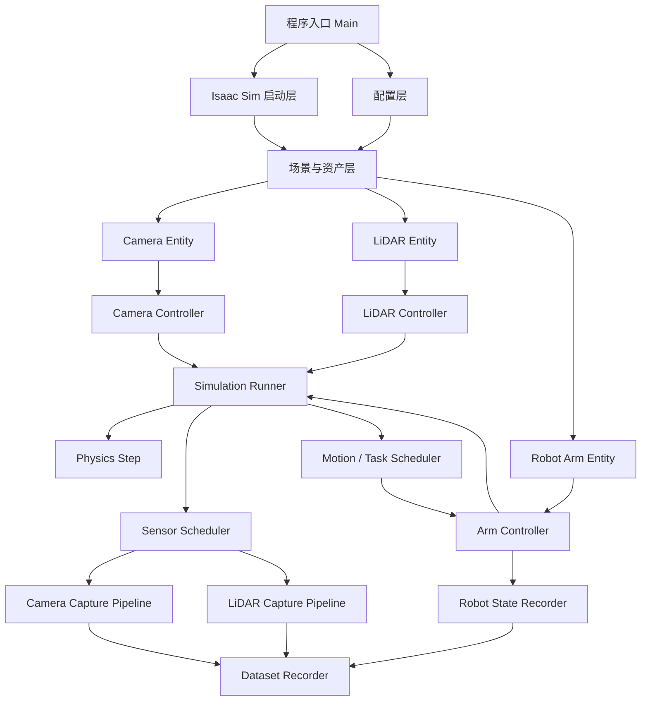
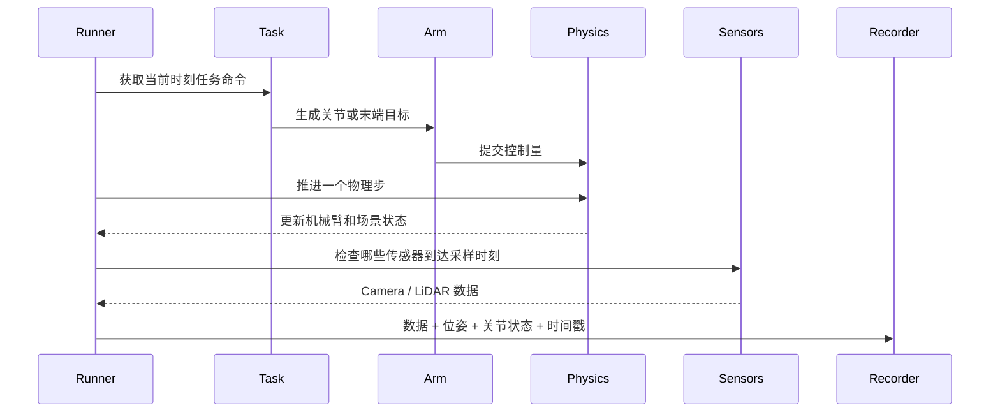

# 相机、激光雷达与机械臂联合仿真项目架构方案

## 1. 文档目标

本文讨论如何在现有相机控制与语义数据采集脚本的基础上，继续加入：

- 激光雷达采集；
- 机械臂运动控制；
- 机械臂状态记录；
- 相机、激光雷达和机械臂之间的时间同步；
- 可继续扩展到深度相机、IMU、移动底盘和抓取任务的工程结构。

本文只设计逻辑架构和实施方案，不包含具体代码。

## 2. 为什么需要调整当前脚本层级

当前脚本主要面向：

```text
单相机
+ 静态场景
+ 单次或少量帧采集
+ Camera RenderProduct
+ Semantic Annotator
+ Custom Writer
```

这种线性脚本可以简化为：

```text
启动 Isaac Sim
  -> 加载 USD
  -> 创建 RenderProduct
  -> 创建 Writer
  -> 采集图像
  -> 写出文件
  -> 关闭 Isaac Sim
```

加入机械臂和激光雷达后，系统将同时存在：

- 物理仿真步进；
- 机械臂控制频率；
- 相机渲染和采集频率；
- 激光雷达扫描频率；
- 多种输出数据；
- 多设备时间戳；
- 任务状态切换。

因此，后续不能只在当前主脚本中继续追加逻辑。核心变化应是引入统一的仿真时钟、运动调度器、多传感器调度器和数据记录层。

## 3. 总体架构



总体原则是：

```text
Controller 负责改变场景状态；
Sensor Capture 负责产生传感器数据；
Writer 负责保存数据；
SimulationRunner 独占仿真时间推进和执行顺序。
```

## 4. 项目逻辑分层

### 4.1 启动层

启动层负责：

- 解析命令行参数；
- 创建 `SimulationApp`；
- 设置 headless、renderer、GPU 和同步加载参数；
- 初始化全局日志；
- 在程序结束时统一关闭 Isaac Sim。

启动层必须处于最外层，因为大部分 `omni`、Replicator 和 Isaac Sim API 需要在创建 `SimulationApp` 后才能导入。

启动层不负责：

- 控制相机；
- 控制机械臂；
- 读取传感器；
- 写出数据；
- 决定任务流程；
- 在多个模块中分散推进仿真。

### 4.2 配置层

后续应将容易变化的参数从 Python 业务代码中分离出来。

建议配置拆分为：

```text
应用配置
场景配置
相机配置
激光雷达配置
机械臂配置
时间与采样配置
数据输出配置
任务流程配置
```

典型配置参数包括：

```text
scene.usd_path
scene.camera_prim
scene.lidar_prim
scene.robot_prim

simulation.physics_hz
simulation.render_hz
simulation.duration
simulation.warmup_steps

camera.capture_hz
camera.resolution
camera.semantic_mapping

lidar.capture_hz
lidar.sensor_type
lidar.output_coordinate_system

robot.control_hz
robot.initial_joint_positions
robot.trajectory_file

output.root
output.save_rgb
output.save_semantic
output.save_lidar
output.save_robot_state
```

语义 mapping 应继续保持为独立配置，不应与机械臂轨迹或 LiDAR 参数混合。

### 4.3 场景与实体层

场景层负责：

- 加载 USD；
- 等待引用资产加载完成；
- 校验关键 prim path；
- 创建或查找相机、LiDAR 和机械臂实体；
- 建立传感器与机器人 link 的安装关系；
- 提供统一的坐标系和场景对象注册表。

建议将实际对象包装为：

```text
CameraEntity
LidarEntity
RobotArmEntity
```

Entity 表示场景对象及其当前状态，但不决定运动策略。

例如 `RobotArmEntity` 可以统一管理：

- Robot prim path；
- Articulation；
- 关节名称和关节顺序；
- 关节上下限；
- 当前关节位置、速度和力矩；
- 末端执行器 prim path；
- 机器人基座和末端执行器的世界坐标变换。

相机也应拆分成：

```text
CameraEntity
CameraController
CameraCapture
```

三者分别表示相机对象、相机运动策略和相机数据采集链路。

## 5. 控制层设计

### 5.1 CameraController

`CameraController` 负责：

- 设置相机世界位姿；
- 执行预设相机轨迹；
- 跟随指定目标；
- 固定在机器人某个 link 上；
- 输出当前相机位姿和控制状态。

它不负责：

- 创建 RenderProduct；
- 调用 Semantic Annotator；
- 保存 RGB 或语义图；
- 自行推进仿真时间。

### 5.2 LidarController

LiDAR 通常不需要像相机一样频繁调整参数，但仍建议保留控制器接口，负责：

- 启用或停用传感器；
- 设置旋转频率和扫描模式；
- 控制独立移动式 LiDAR 的位姿；
- 获取当前传感器外参；
- 判断当前仿真时刻是否应该采样。

如果 LiDAR 固定在机器人上，推荐在 USD 中建立父子关系：

```text
Robot Link
  -> LidarMount
       -> Lidar Sensor
```

此时不应每帧手动计算 LiDAR 位姿，而应让 LiDAR 继承机器人 link 的变换。数据记录时再读取它的世界位姿和相对安装外参。

### 5.3 ArmController

机械臂控制建议进一步拆成三个层次：

```text
任务命令层
  -> 轨迹层
       -> 底层关节控制层
```

任务命令层表达高层动作：

```text
移动到初始位置
移动末端到目标位姿
执行抓取
保持当前位置
返回 Home
```

轨迹层负责：

- 关节轨迹插值；
- 速度和加速度限制；
- 笛卡尔轨迹到关节轨迹的转换；
- 判断轨迹是否完成；
- 输出当前轨迹进度。

底层控制层负责：

- 将关节目标提交给 Articulation Controller；
- 读取关节反馈；
- 检查关节限位；
- 检查控制跟踪误差；
- 输出执行状态和故障信息。

Writer 不应该控制机械臂。机械臂控制和数据写出必须解耦。

## 6. 统一仿真调度层

加入机械臂运动后，必须由一个 `SimulationRunner` 独占仿真步进权。

相机、LiDAR、机械臂控制器和 Writer 都不能各自独立调用仿真推进 API，否则容易出现：

- 物理时间重复推进；
- 相机与 LiDAR 数据错帧；
- 机械臂状态和图像不对应；
- 一个业务循环中仿真时间前进两次；
- 不同传感器时间戳无法比较；
- Replicator 渲染步与物理步相互覆盖。

统一执行顺序建议如下：



每个物理 tick 的推荐步骤是：

1. 读取当前仿真时间；
2. 更新任务状态机；
3. 计算机械臂控制命令；
4. 应用机械臂控制命令；
5. 推进一个物理步；
6. 更新或读取相机、LiDAR 的安装位姿；
7. 判断相机是否到达采样时刻；
8. 判断 LiDAR 是否到达采样时刻；
9. 执行到期传感器采集；
10. 读取机械臂状态；
11. 将传感器数据、机器人状态和时间戳交给 Recorder；
12. 更新统一 physics step 和各传感器 sample ID。

当前静态语义采集使用的 `delta_time=0.0` 不适合机械臂运动。后续必须明确由哪个 API 推进物理时间，并避免 Replicator 采集成为第二个时间推进源。

## 7. 多频率调度

三类设备通常运行在不同频率，例如：

```text
Physics             120 Hz
Robot control       120 Hz
Camera               30 Hz
LiDAR                 10 Hz
Dataset metadata     120 Hz 或 30 Hz
```

不建议强行让所有设备在每个物理步都采集。

如果物理频率为 120 Hz，可以采用：

```text
物理每 1 tick 更新一次
机械臂控制每 1 tick 更新一次
相机每 4 tick 采集一次
LiDAR 每 12 tick 采集一次
```

每份数据建议包含：

```text
episode_id
frame_id
physics_step
simulation_time
sensor_timestamp
sensor_name
sensor_prim_path
world_pose
parent_link_pose
```

需要区分：

```text
physics_step：全局物理步编号；
sample_id：某个传感器自身的采样编号。
```

例如，相机第 30 帧和 LiDAR 第 10 帧可以共同指向 `simulation_time=1.0`，但它们的传感器 sample ID 不同。

## 8. 数据采集与 Writer 层

当前 Custom Writer 适合继续负责相机输出：

```text
RGB
Semantic Dataset ID NPY
Custom Semantic PNG
Runtime Semantic ID NPY
Camera metadata
```

不建议把 LiDAR 和机械臂状态直接塞进现有 `SemanticDatasetWriter`。

建议拆分为：

```text
CameraDatasetWriter
LidarDatasetWriter
RobotStateWriter
RunManifestWriter
```

再由更高层的 `DatasetRecorder` 协调它们。

### 8.1 CameraDatasetWriter

继续处理：

```text
RenderProduct
RGB Annotator
Semantic Annotator
Runtime ID -> 最终标签 -> Dataset ID
Semantic ID NPY
Custom Semantic PNG
Camera frame metadata
```

### 8.2 LidarDatasetWriter

根据 LiDAR 类型保存：

```text
Point XYZ
Intensity
Range
Azimuth
Elevation
Object ID
Semantic ID
Sensor timestamp
Sensor pose
```

点云建议保留原始数值数据：

```text
lidar_points_000001.npy
lidar_intensity_000001.npy
lidar_semantic_id_000001.npy
```

PNG 适合作为相机语义图的可视化格式，不适合作为 LiDAR 的正式数据格式。

### 8.3 RobotStateWriter

机械臂状态建议保存：

```text
joint_positions
joint_velocities
joint_efforts
commanded_joint_positions
end_effector_pose
base_pose
controller_state
trajectory_progress
```

这部分不是 RenderProduct 或 Annotator 数据，而是物理仿真状态快照。

### 8.4 DatasetRecorder

`DatasetRecorder` 是各类 Writer 上方的协调层，负责：

- 为同一批数据分配 episode ID；
- 管理统一时间戳；
- 建立相机、LiDAR 和机器人状态之间的索引关系；
- 控制数据写出和 flush；
- 生成 run manifest；
- 在结束前等待所有异步写盘任务完成。

## 9. 建议输出目录

```text
output/
├── run_manifest.json
├── semantic_mapping.json
├── calibration/
│   ├── camera.json
│   ├── lidar.json
│   └── sensor_extrinsics.json
├── camera/
│   ├── rgb/
│   ├── semantic_id/
│   ├── semantic_color/
│   ├── semantic_runtime_id/
│   └── metadata/
├── lidar/
│   ├── points/
│   ├── intensity/
│   ├── semantic_id/
│   └── metadata/
├── robot/
│   ├── joint_state/
│   ├── commands/
│   └── end_effector_pose/
└── timeline/
    └── samples.jsonl
```

`timeline/samples.jsonl` 用于建立跨模态关联：

```text
simulation_time
physics_step
camera_sample_id
lidar_sample_id
robot_state_id
```

即使相机和 LiDAR 采样频率不同，也可以通过 timeline 找到同一仿真时刻对应的数据。

## 10. 任务状态机

机械臂加入后，建议引入明确的任务状态机：

```text
INITIALIZE
  -> WARMUP
  -> ROBOT_HOMING
  -> MOVE_TO_START
  -> CAPTURE
  -> MOVE_TO_TARGET
  -> FINAL_CAPTURE
  -> FLUSH
  -> SHUTDOWN
```

每个状态应定义：

- 进入条件；
- 执行动作；
- 退出条件；
- 是否采集相机；
- 是否采集 LiDAR；
- 超时策略；
- 失败策略；
- 是否允许进入下一个状态。

这样后续加入抓取、搬运或多目标轨迹时，不需要将大量条件判断直接写进主仿真循环。

## 11. 建议项目结构

```text
semantic_robot_dataset/
├── main.py
├── config/
│   ├── scene.json
│   ├── sensors.json
│   ├── robot.json
│   └── semantic_mapping.json
├── runtime/
│   ├── app_context.py
│   ├── simulation_runner.py
│   ├── simulation_clock.py
│   └── sensor_scheduler.py
├── scene/
│   ├── stage_loader.py
│   └── entity_registry.py
├── sensors/
│   ├── camera_entity.py
│   ├── camera_controller.py
│   ├── camera_capture.py
│   ├── lidar_entity.py
│   ├── lidar_controller.py
│   └── lidar_capture.py
├── robots/
│   ├── arm_entity.py
│   ├── arm_controller.py
│   ├── trajectory_controller.py
│   └── robot_state.py
├── tasks/
│   ├── task_state_machine.py
│   └── trajectories.py
├── recording/
│   ├── dataset_recorder.py
│   ├── camera_writer.py
│   ├── lidar_writer.py
│   ├── robot_state_writer.py
│   └── manifest_writer.py
└── validation/
    ├── validate_camera.py
    ├── validate_lidar.py
    └── validate_timeline.py
```

依赖方向应保持从上到下：

```text
main
  -> runtime / tasks
       -> scene / sensors / robots
            -> recording
```

底层 Writer 不应反向调用控制器，Entity 也不应直接控制主循环。

## 12. 推荐实施顺序

### 12.1 第一阶段：只重构，不改变现有行为

- 将当前相机脚本拆分为启动、场景、相机采集、Writer 和 Runner；
- 保持当前 RGB、语义 NPY 和语义 PNG 输出结果不变；
- 建立统一 `simulation_time`、`physics_step` 和 `frame_id`；
- 确认重构前后语义输出逐像素一致。

### 12.2 第二阶段：加入机械臂状态，但暂不移动

- 加载机械臂 Articulation；
- 读取关节位置、速度和末端位姿；
- 将机械臂状态与相机帧一起保存；
- 验证每一张图像都能找到对应的机械臂状态。

### 12.3 第三阶段：加入简单机械臂运动

- 先实现关节空间预设轨迹；
- 引入固定 physics Hz 和 control Hz；
- 由 SimulationRunner 统一推进时间；
- 验证机械臂运动过程中图像、语义图和关节状态同步。

### 12.4 第四阶段：加入静态 LiDAR

- 先固定 LiDAR，不让它跟随机械臂移动；
- 保存点云、强度、时间戳和传感器位姿；
- 验证点云坐标系和外参；
- 检查 LiDAR 数据与相机视角中的场景状态是否一致。

### 12.5 第五阶段：完成多传感器同步

- 相机与 LiDAR 使用不同采样频率；
- 建立统一 timeline；
- 保存传感器采样时间和机械臂状态索引；
- 验证跨模态数据可以按仿真时间对齐。

### 12.6 第六阶段：加入移动安装关系

- 将 LiDAR 或相机挂载到机械臂 link；
- 通过 USD 父子关系继承传感器位姿；
- 验证世界坐标、机器人坐标和传感器坐标之间的转换；
- 保存静态安装外参和每帧动态世界位姿。

## 13. 主要风险与约束

### 13.1 仿真被重复推进

如果 Camera、LiDAR 或 Replicator 模块自行推进仿真，会导致数据错帧。所有仿真步进必须收口到 `SimulationRunner`。

### 13.2 相机和 LiDAR 被错误地强制同频

应采用多频率调度和统一时间戳，不应为了文件编号一致而强制所有传感器以同一频率运行。

### 13.3 机械臂命令和实际状态混淆

数据集中必须同时区分：

```text
commanded_joint_positions
actual_joint_positions
```

否则无法判断控制误差和机械臂实际运动状态。

### 13.4 传感器坐标系不清晰

LiDAR 点云必须明确保存在哪个坐标系：

```text
LiDAR local frame
Robot base frame
World frame
```

推荐正式数据保留 LiDAR local frame，并额外保存该帧的世界变换矩阵。

### 13.5 Writer 职责膨胀

相机 Writer、LiDAR Writer 和 Robot State Writer 应保持独立，由 DatasetRecorder 负责统一编号与关联，避免形成一个包含控制、采集、映射和写盘的超大 Writer。

## 14. 最终架构结论

从当前相机脚本扩展到相机、LiDAR 和机械臂联合仿真时，最重要的不是增加几个 API 调用，而是改变项目的职责划分：

```text
启动层负责 Isaac Sim 生命周期；
场景层负责 USD 和实体；
Controller 负责改变对象状态；
SimulationRunner 负责时间和执行顺序；
Sensor Capture 负责获取数据；
Writer 负责单类数据落盘；
DatasetRecorder 负责跨设备同步和数据集组织；
Task State Machine 负责业务流程。
```

只要坚持“控制、仿真推进、传感器采集、数据写出”四类职责相互分离，后续加入深度相机、IMU、移动底盘、抓取器或复杂任务时，就不需要再次重写整个主流程。
