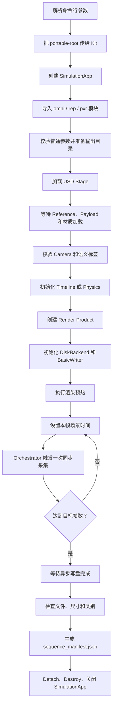

# `semantic_capture_multiframe.py` 逐块讲解

本文讲解同目录下的 `semantic_capture_multiframe.py`。该脚本在 Isaac Sim 6.0.1 中加载一个已经带有语义标签的 USD 场景，通过同一个相机、同一个 Render Product 和同一次 Replicator Capture，同步输出多帧 RGB 图、Semantic Segmentation 图以及标签映射 JSON。

本文从 Python 基础、Isaac Sim 模块、执行顺序、单帧版本对比和命令行调用五个角度展开。

## 1. 脚本解决的问题

脚本的主要输入是：

- 一个 USD 场景文件；
- 一个 USD Camera Prim 路径；
- 图像分辨率；
- 采集帧数；
- 场景时间推进方式；
- 仿真频率和采集频率；
- 输出目录。

脚本的主要输出是：

```text
output_directory/
├── rgb_0000.png
├── semantic_segmentation_0000.png
├── semantic_segmentation_labels_0000.json
├── rgb_0001.png
├── semantic_segmentation_0001.png
├── semantic_segmentation_labels_0001.json
├── metadata.txt
└── sequence_manifest.json
```

每个帧编号都对应一组数据：

```text
RGB 图 + Semantic 图 + Semantic 标签映射
```

其中：

- RGB 图表示相机看到的普通渲染结果；
- Semantic 图的每种颜色代表一种或一组语义类别；
- Labels JSON 记录颜色和语义类别之间的关系；
- Manifest 记录本次采集的场景、相机、时间、帧率和文件信息。

## 2. 八个主要功能模块

从整体设计看，脚本可以分成八个模块。

| 模块 | 对应代码 | 主要作用 |
|---|---|---|
| 参数模块 | `parse_args()`、`validate_args()` | 接收并检查命令行参数 |
| 输出目录模块 | `prepare_output()` | 防止误覆盖，准备输出目录 |
| Stage 模块 | `load_stage()`、`validate_stage()` | 加载 USD，检查相机和语义标签 |
| Isaac Sim 生命周期模块 | `SimulationApp(...)` | 启动和关闭 Kit、RTX 和 Isaac Sim |
| 时间推进模块 | Timeline、`SimulationManager` | 控制每一帧对应的场景时间 |
| 采集模块 | Render Product、BasicWriter、Orchestrator | 同步采集 RGB 和 Semantic 数据 |
| 校验模块 | `read_png_size()`、`validate_outputs()` | 检查输出数量、尺寸和语义类别 |
| 元数据与清理模块 | `write_manifest()`、`finally` | 保存 Manifest 并释放资源 |

## 3. 完整执行流程



一个非常重要的约束是：

```text
先创建 SimulationApp，再导入 omni.replicator.core 等 Isaac Sim 模块。
```

因为 `SimulationApp` 负责启动 Kit 插件系统。很多 `omni.*` 模块只有在 Kit 初始化之后才能安全使用。

---

# 4. 按代码顺序逐块讲解

## 4.1 标准库导入

脚本首先导入 Python 标准库：

```python
import argparse
import json
import math
import os
import random
import shutil
import struct
import sys
import time
import traceback
from datetime import datetime, timezone
from pathlib import Path
```

这些模块都不依赖 Isaac Sim，所以可以在 `SimulationApp` 启动前导入。

| 模块 | 用途 |
|---|---|
| `argparse` | 解析命令行参数 |
| `json` | 读取 Labels JSON，写入 Manifest |
| `math` | 使用 `math.isclose()` 比较浮点数 |
| `os` | 检查 USD 文件、处理系统路径 |
| `random` | 设置 Python 随机种子 |
| `shutil` | 在明确启用覆盖时删除旧输出目录 |
| `struct` | 从 PNG 二进制头读取宽度和高度 |
| `sys` | 处理 `sys.argv` 和程序退出码 |
| `time` | Stage 加载超时计时 |
| `traceback` | 出错时输出完整调用栈 |
| `datetime` | 在 Manifest 中记录 UTC 创建时间 |
| `Path` | 更安全地操作文件和目录路径 |

## 4.2 `parse_args()`：定义命令行接口

`parse_args()` 使用 `argparse.ArgumentParser` 定义脚本允许接收的参数。

```python
parser = argparse.ArgumentParser(
    description="Capture paired RGB and semantic image sequences in Isaac Sim"
)
```

当用户执行：

```bash
python script.py --frames 100 --width 1280
```

`argparse` 会把字符串参数转换成 Python 对象：

```python
args.frames == 100
args.width == 1280
```

脚本使用：

```python
args, _ = parser.parse_known_args()
```

而不是直接调用 `parse_args()`，原因是 Isaac Sim/Kit 自身也有命令行参数，例如 `--portable-root`、`--no-window`。`parse_known_args()` 会解析脚本认识的参数，同时保留未知参数给 Kit 处理。

### BooleanOptionalAction

以下参数使用 `argparse.BooleanOptionalAction`：

```python
--headless / --no-headless
--overwrite / --no-overwrite
--fail-on-empty-semantic / --no-fail-on-empty-semantic
```

例如：

```bash
--headless
```

表示无界面运行；而：

```bash
--no-headless
```

表示允许显示 GUI。

### 完整输入参数

| 参数 | 默认值 | 含义 |
|---|---:|---|
| `--usd` | `/root/Desktop/wyb/Semantic_260709_01.usd` | 输入 USD 文件 |
| `--camera` | `/Camera` | 相机 Prim 路径 |
| `--output` | `/root/Desktop/wyb/output_semantic_multiframe` | 输出目录 |
| `--width` | `1280` | 图像宽度 |
| `--height` | `720` | 图像高度 |
| `--frames` | `100` | 输出帧数 |
| `--advance-mode` | `timeline` | 时间推进模式 |
| `--capture-fps` | `10.0` | 采集帧率 |
| `--simulation-fps` | `60.0` | 仿真或 Timeline 基准帧率 |
| `--start-time` | `0.0` | 起始时间，单位为秒 |
| `--warmup` | `10` | 正式采集前的预热更新次数 |
| `--rt-subframes` | `4` | 每次 Capture 的 RTX 子帧数 |
| `--start-index` | `0` | 输出文件起始编号 |
| `--frame-padding` | `4` | 文件编号补零位数 |
| `--stage-timeout` | `120.0` | Stage 加载超时秒数 |
| `--flush-interval` | `10` | 每多少帧等待一次写盘 |
| `--log-interval` | `10` | 每多少帧打印一次进度 |
| `--seed` | `0` | Python 和 Replicator 随机种子 |
| `--portable-root` | `/tmp/isaacsim_semantic_multiframe_portable` | Kit 独立缓存目录 |
| `--headless` | `true` | 是否无界面运行 |
| `--overwrite` | `false` | 是否替换非空输出目录 |
| `--fail-on-empty-semantic` | `true` | 没有前景语义时是否失败 |

## 4.3 `validate_args()`：检查参数是否合法

命令行解析只能完成类型转换，不能保证参数在业务上合理。因此脚本单独实现 `validate_args()`。

### 检查 USD 是否存在

```python
if not os.path.isfile(args.usd):
    raise FileNotFoundError(...)
```

如果输入文件不存在，脚本立即失败，而不是启动渲染后才给出难以定位的错误。

### 检查正数参数

分辨率、帧数、FPS、RTX 子帧、超时时间等必须大于零。

例如以下命令会失败：

```bash
--frames 0
--width -1
--capture-fps 0
```

### 计算每次采集对应的仿真步数

脚本计算：

```python
steps_per_capture = simulation_fps / capture_fps
```

例如：

```text
simulation_fps = 60
capture_fps = 10
steps_per_capture = 6
```

在 Physics 模式下，表示每次保存图像之前推进 6 个物理步。

对于非 Static 模式，脚本要求该比值是整数。`math.isclose()` 用于避免浮点数计算中的微小误差。

## 4.4 `prepare_output()`：安全准备输出目录

该函数负责：

1. 把输出路径转换成绝对路径；
2. 防止误删除根目录、用户主目录或 USD 所在目录；
3. 检查输出目录是否非空；
4. 根据 `--overwrite` 决定失败还是替换旧目录；
5. 创建新的输出目录。

默认情况下，如果输出目录中已经有文件，脚本会拒绝运行：

```text
Output directory is not empty
```

这是为了避免新旧帧混在一起，也避免 BasicWriter 覆盖旧数据。

只有显式加入：

```bash
--overwrite
```

脚本才会删除旧输出目录并重新创建。

## 4.5 `load_stage()`：加载 USD 场景

核心调用是：

```python
omni.usd.get_context().open_stage(usd_path)
```

`omni.usd.get_context()` 返回当前 Kit 的 USD Context。Context 负责打开、关闭和访问 Stage。

打开 USD 并不代表所有资源已经完成加载。场景可能包含：

- Reference；
- Payload；
- 远端材质；
- 纹理；
- Isaac Sim Asset Server 上的其他 USD。

因此脚本先执行两次：

```python
simulation_app.update()
```

让 Kit 开始处理加载任务，然后循环检查：

```python
while is_stage_loading():
    simulation_app.update()
```

`stage-timeout` 防止远程资源不可用时无限等待。

## 4.6 `validate_stage()`：检查相机和语义标签

### 检查 Camera Prim

```python
camera_prim = stage.GetPrimAtPath(camera_path)
```

首先检查 Prim 是否存在，然后检查它是否属于 `UsdGeom.Camera`：

```python
camera_prim.IsA(UsdGeom.Camera)
```

这样可以防止用户传入一个普通 Xform 或不存在的路径。

### 统计语义 Prim

脚本遍历 Stage：

```python
for prim in stage.Traverse()
```

并检查 Prim 的 Applied Schema 是否以：

```text
SemanticsLabelsAPI
```

开头。

这些标签正是之前通过 Semantic Schema Editor 写入 USD 的内容。脚本本身不重新标注，而是复用场景中已有的语义 Schema。

测试场景中检测到 166 个带语义 Schema 的 Prim。

## 4.7 `read_png_size()`：直接读取 PNG 尺寸

PNG 文件开头包含固定签名和 IHDR 数据。脚本读取前 24 个字节：

```python
header = stream.read(24)
```

并检查 PNG 签名：

```python
b"\x89PNG\r\n\x1a\n"
```

宽度和高度位于头部的第 16～24 字节，使用大端整数解析：

```python
struct.unpack(">II", header[16:24])
```

这样不需要额外安装 Pillow 或 OpenCV，也能确认输出分辨率是否正确。

## 4.8 `validate_outputs()`：逐帧检查输出

该函数按照每个帧编号构造预期文件名：

```text
rgb_0000.png
semantic_segmentation_0000.png
semantic_segmentation_labels_0000.json
```

然后执行四类检查。

### 检查 1：文件是否存在

RGB、Semantic 或 Labels 任意一个缺失，整次任务都会失败。

### 检查 2：分辨率是否匹配

RGB 和 Semantic 都必须等于命令行指定的：

```text
(width, height)
```

### 检查 3：Labels JSON 是否有效

脚本读取：

```python
semantic_segmentation_labels_N.json
```

并提取其中的 `class` 字段。

### 检查 4：是否存在前景语义

以下两个类别不算有效前景：

```text
BACKGROUND
UNLABELLED
```

如果启用了 `--fail-on-empty-semantic`，且一帧中只存在这两个类别，脚本会失败。

函数最后生成每帧记录，供 Manifest 使用。

## 4.9 `write_manifest()`：生成序列说明文件

`sequence_manifest.json` 是脚本在 BasicWriter 输出之外额外生成的文件。

它保存：

- 执行状态；
- UTC 创建时间；
- Isaac Sim 版本；
- USD 路径；
- Camera 路径；
- 输出目录；
- 分辨率；
- 时间推进模式；
- 帧数和起始编号；
- Capture FPS 和 Simulation FPS；
- 每次采集对应的物理步数；
- 起始时间；
- 预热帧数；
- RTX 子帧数；
- 随机种子；
- portable root；
- 语义 Prim 数量；
- 每一帧的时间、文件名和类别列表。

Manifest 的价值是让数据集具有可追溯性。仅看 PNG 文件，无法知道它来自哪个 USD、哪个相机或哪个采集频率。

## 4.10 在启动 Isaac Sim 前处理 `portable-root`

代码先执行：

```python
args = parse_args()
```

然后检查 `sys.argv` 中是否已经有 `--portable-root`。如果没有，就加入默认路径。

```python
if "--portable-root" not in sys.argv:
    sys.argv.extend(["--portable-root", args.portable_root])
```

原因是 `SimulationApp` 会再次解析 `sys.argv`，并把 `--portable-root` 传给 Kit。

portable root 保存 Kit 的：

- 日志；
- 缓存；
- Derived Data；
- RTX Shader Cache；
- 临时运行数据。

使用独立目录可以减少 GUI Isaac Sim 和 Headless Isaac Sim 同时运行时的缓存冲突。

首次使用一个新的 portable root 时，RTX Shader 编译可能耗时数分钟。后续复用同一目录会明显加快。

## 4.11 创建 `SimulationApp`

```python
simulation_app = SimulationApp(
    launch_config={
        "headless": args.headless,
        "renderer": "RaytracedLighting",
        "sync_loads": True,
        "width": args.width,
        "height": args.height,
    }
)
```

各参数含义如下。

| 参数 | 作用 |
|---|---|
| `headless` | 是否隐藏窗口 |
| `renderer` | 使用 RTX Ray Traced Lighting |
| `sync_loads` | 让 RTX 材质和 USD 加载更可控 |
| `width` | 应用渲染宽度 |
| `height` | 应用渲染高度 |

`SimulationApp` 是整个脚本最重要的生命周期对象。关闭它会终止 Kit、RTX、插件系统和渲染线程。

## 4.12 初始化资源句柄

```python
render_product = None
writer = None
timeline = None
exit_code = 0
```

这些变量先设为 `None`，是为了保证即使中途失败，`finally` 仍然能安全判断哪些资源已经创建。

例如，如果 USD 加载时失败，Writer 尚未创建，清理代码就不会调用 `writer.detach()`。

## 4.13 在 `try` 中导入 Isaac Sim 模块

在 `SimulationApp` 创建后，脚本导入：

```python
import carb.settings
import omni.replicator.core as rep
import omni.timeline
import omni.usd
from isaacsim.core.experimental.utils.stage import is_stage_loading
from isaacsim.core.simulation_manager import SimulationManager
from isaacsim.core.version import get_version
from pxr import UsdGeom
```

各模块作用如下。

| 模块 | 作用 |
|---|---|
| `carb.settings` | 修改 Kit/RTX 的运行设置 |
| `omni.replicator.core` | 创建 Render Product、Writer、Orchestrator |
| `omni.timeline` | 控制 USD 时间轴 |
| `omni.usd` | 加载和访问 Stage |
| `is_stage_loading` | 查询异步加载状态 |
| `SimulationManager` | 初始化和推进物理仿真 |
| `get_version` | 获取 Isaac Sim 版本 |
| `UsdGeom` | 检查 Camera 类型 |

## 4.14 初始化参数、输出目录和随机种子

```python
steps_per_capture = validate_args(args)
output_path = prepare_output(...)
random.seed(args.seed)
rep.set_global_seed(args.seed)
rep.orchestrator.set_capture_on_play(False)
```

这里有两个随机种子：

- `random.seed()` 控制 Python 标准库随机数；
- `rep.set_global_seed()` 控制 Replicator 随机化。

当前脚本还没有做场景随机化，但提前固定种子，方便以后加入灯光、材质、相机和物体随机化。

`set_capture_on_play(False)` 非常重要。它表示 Timeline 播放时不要自动保存每一帧，所有数据都由脚本显式调用 `orchestrator.step()` 触发。

## 4.15 加载并验证 Stage

```python
stage = load_stage(...)
semantic_prim_count = validate_stage(...)
```

这一步结束后，脚本已经确认：

- USD 文件成功打开；
- 外部资源完成加载；
- Camera Prim 有效；
- 场景至少包含一个语义 Prim。

只有通过这些检查，脚本才会创建 RTX Render Product。

## 4.16 初始化 Timeline

```python
timeline = omni.timeline.get_timeline_interface()
timeline.set_looping(False)
timeline.set_current_time(args.start_time)
timeline.set_end_time(...)
timeline.set_time_codes_per_second(args.simulation_fps)
timeline.commit()
```

### `set_looping(False)`

禁用时间轴循环，防止到达末尾后自动回到起点。

### `set_current_time()`

设置初始时间，单位为秒。

### `set_end_time()`

确保 Timeline 结束时间覆盖整个采集区间。

### `set_time_codes_per_second()`

设置 Timeline 每秒时间码数量。这里使用 `simulation_fps`。

### `commit()`

把 Timeline 参数提交给 Kit。

## 4.17 根据模式初始化时间推进模块

### Timeline 模式

```python
carb.settings.get_settings().set(
    "/app/player/useFixedTimeStepping", True
)
```

开启固定时间步设置，使 Timeline 行为不依赖真实墙钟时间。

### Physics 模式

```python
SimulationManager.set_physics_dt(1.0 / simulation_fps)
SimulationManager.initialize_physics()
```

例如 `simulation_fps=60` 时：

```text
physics_dt = 1 / 60 秒
```

Physics 模式只有在场景中存在刚体、关节、机器人或其他物理对象时才会产生视觉变化。

## 4.18 创建 Render Product

```python
render_product = rep.create.render_product(
    args.camera,
    resolution=(args.width, args.height),
    name="SemanticMultiframeCapture",
)
```

Render Product 可以理解为：

```text
一个相机 + 一个输出分辨率 + 一个渲染数据入口
```

它决定 Synthetic Data 从哪个相机、以什么尺寸读取数据。

脚本显式使用 `/Camera`，而不是 GUI Viewport 的 `/OmniverseKit_Persp`。这样 Headless 运行不依赖编辑器视口状态。

## 4.19 初始化 DiskBackend 和 BasicWriter

### DiskBackend

```python
backend = rep.backends.get("DiskBackend")
backend.initialize(output_dir=str(output_path))
```

DiskBackend 负责把 Writer 产生的数据写到本地文件系统。

### BasicWriter

```python
writer = rep.WriterRegistry.get("BasicWriter")
writer.initialize(
    backend=backend,
    rgb=True,
    semantic_segmentation=True,
    colorize_semantic_segmentation=True,
    frame_padding=args.frame_padding,
)
```

关键配置：

| 配置 | 作用 |
|---|---|
| `rgb=True` | 启用 RGB Annotator |
| `semantic_segmentation=True` | 启用 Semantic Annotator |
| `colorize_semantic_segmentation=True` | 输出便于观察的彩色语义 PNG |
| `frame_padding` | 控制编号补零位数 |

Writer 绑定 Render Product：

```python
writer.attach(render_product)
```

从这一刻起，Writer 知道应该从哪个相机渲染源读取 RGB 和 Semantic 数据。

### `start-index`

BasicWriter 6.0.1 没有公开的起始编号参数，因此脚本在非零起始编号时设置其内部 `_frame_id`。

这是一个版本相关的内部属性，所以脚本先使用 `hasattr()` 检查。如果未来 Isaac Sim 更改 BasicWriter 实现，脚本会明确报错，而不是静默输出错误编号。

## 4.20 渲染预热

```python
for _ in range(args.warmup):
    simulation_app.update()
```

预热阶段让以下内容准备完成：

- RTX Shader；
- 材质和纹理；
- Hydra Render Product；
- Synthetic Data Graph；
- Annotator；
- GPU 缓冲区。

预热结束后暂时关闭 Render Product 更新：

```python
render_product.hydra_texture.set_updates_enabled(False)
```

这样场景推进但不采集时，可以减少不必要的渲染开销。

## 4.21 多帧采集循环

采集循环是整个脚本的核心：

```python
for frame_offset in range(args.frames):
    ...
```

每次循环产生一组 RGB、Semantic 和 Labels。

### Timeline 模式

目标时间通过下面的公式计算：

```python
target_time = start_time + frame_offset / capture_fps
```

例如：

```text
start_time = 0
capture_fps = 10

frame 0 -> 0.0 秒
frame 1 -> 0.1 秒
frame 2 -> 0.2 秒
frame 3 -> 0.3 秒
```

脚本不会让 Timeline 自由播放，而是逐帧显式设置时间：

```python
timeline.pause()
timeline.set_current_time(target_time)
timeline.commit()
simulation_app.update()
```

这种方式可以保证：

- Writer flush 不会让时间轴回退；
- 每帧时间完全可预测；
- USD Camera Animation 和其他时间采样属性在目标时刻求值；
- Manifest 中记录的时间严格递增。

脚本还会检查实际时间是否到达目标值。

### Physics 模式

从第二帧开始执行：

```python
SimulationManager.step(steps=steps_per_capture)
```

例如仿真 60 FPS、采集 10 FPS 时，每次采集前推进 6 个物理步。

### Static 模式

Static 模式不推进时间：

```python
capture_time = start_time
```

因此所有帧对应相同场景状态。该模式主要用于测试 Writer、渲染噪声或重复采集稳定性。

## 4.22 触发一次同步采集

在本帧场景状态准备好后，脚本启用 Render Product：

```python
render_product.hydra_texture.set_updates_enabled(True)
```

然后调用：

```python
rep.orchestrator.step(
    delta_time=0.0,
    pause_timeline=True,
    rt_subframes=args.rt_subframes,
)
```

参数含义：

| 参数 | 含义 |
|---|---|
| `delta_time=0.0` | Capture 本身不额外推进场景时间 |
| `pause_timeline=True` | 采集时保持 Timeline 暂停 |
| `rt_subframes` | 本次 RTX Capture 使用的子帧数量 |

同一次 Orchestrator Step 会同时更新 BasicWriter 中的 RGB Annotator 和 Semantic Annotator，因此两张图对应同一个相机状态和同一个场景时刻。

采集完成后重新关闭 Render Product 更新。

## 4.23 Flush 和进度日志

Writer 的磁盘写入可能是异步的。脚本按照 `flush-interval` 定期调用：

```python
rep.orchestrator.wait_until_complete()
```

它会等待已提交的写盘任务完成。

`log-interval` 只控制进度日志频率，不影响采集频率。

如果参数设为 0，对应的定期操作会关闭，但任务结束前仍会执行一次最终 `wait_until_complete()`。

## 4.24 最终校验和 Manifest

循环完成后，脚本：

1. 等待全部文件写盘；
2. 暂停 Timeline；
3. 检查每帧三个文件；
4. 检查 PNG 分辨率；
5. 检查前景语义类别；
6. 获取 Isaac Sim 版本；
7. 写入 `sequence_manifest.json`。

只有这些步骤全部成功，Manifest 中才会写入：

```json
"status": "complete"
```

## 4.25 异常处理

所有主要逻辑都放在 `try` 中。

任何错误都会进入：

```python
except Exception as exc:
```

脚本会：

- 设置退出码为 1；
- 在标准错误中打印简要错误；
- 使用 `traceback.print_exc()` 打印完整调用栈。

这比只打印一句“运行失败”更容易定位具体函数和代码行。

## 4.26 `finally`：无论成功失败都释放资源

`finally` 一定会执行。

清理顺序是：

1. 暂停 Timeline；
2. Detach Writer；
3. Destroy Render Product；
4. 关闭 SimulationApp。

```python
writer.detach()
render_product.destroy()
simulation_app.close()
```

这个顺序可以避免 Writer 仍引用 Render Product 时先销毁渲染资源。

最后：

```python
sys.exit(exit_code)
```

成功返回 0，失败返回 1，便于 Shell、CI 或批处理程序判断结果。

---

# 5. 三种时间推进模式对比

| 模式 | 时间如何变化 | 是否需要场景动画/物理 | 典型用途 |
|---|---|---|---|
| `static` | 不变化 | 不需要 | 验证 Writer、渲染稳定性 |
| `timeline` | 每帧显式设置目标时间 | USD 中需要动画才会产生几何变化 | Camera Animation、USD 动画 |
| `physics` | 每次采集前推进固定物理步数 | 需要物理对象 | 机器人、车辆、刚体运动 |

当前 `Semantic_260709_01.usd` 场景在测试区间内没有明显运动，所以四帧 Semantic 图相同。这不代表多帧循环失败，而是场景在 `0.0、0.1、0.2、0.3` 秒的语义几何状态相同。

如果希望相邻 Semantic 图发生变化，需要至少满足一个条件：

- Camera 在 Timeline 上有动画；
- 目标物体有 USD Animation；
- 使用 Physics 模式并让刚体或机器人运动；
- 在采集循环中通过脚本修改 Camera 或物体位姿。

---

# 6. 与单帧脚本的区别

单帧脚本是 `test_semantic/semantic_capture_minimal.py`，多帧脚本是在其基础上的扩展。

## 6.1 相同部分

两个脚本都执行：

- 创建 `SimulationApp`；
- 打开 USD；
- 等待 Stage 加载；
- 检查 `/Camera`；
- 检查 `SemanticsLabelsAPI`；
- 创建 Render Product；
- 使用 DiskBackend；
- 使用 BasicWriter；
- 同时启用 RGB 和 Semantic Segmentation；
- 使用 `rep.orchestrator.step()` 触发采集；
- 最后 Detach、Destroy 和关闭应用。

因此两者的核心 Synthetic Data 链路相同：

```text
Camera
  -> Render Product
  -> RGB/Semantic Annotator
  -> BasicWriter
  -> DiskBackend
```

## 6.2 关键区别

| 能力 | 单帧脚本 | 多帧脚本 |
|---|---|---|
| 默认帧数 | 1 | 100 |
| 时间推进 | 不推进，始终 `delta_time=0` | Static、Timeline、Physics |
| 帧时间 | 不记录 | 每帧写入 Manifest |
| 输出目录保护 | 直接 `exist_ok=True` | 非空目录默认拒绝，支持显式覆盖 |
| Stage 超时 | 无 | 有 |
| FPS 控制 | 无 | Capture FPS + Simulation FPS |
| 起始编号 | 固定从 0 开始 | 可配置 |
| RTX 子帧 | 固定 4 | 可配置 |
| 定期 Flush | 无 | 可配置 |
| 输出校验 | 只依赖 Writer | 检查文件、尺寸和类别 |
| Manifest | 无 | 有 |
| Isaac 版本记录 | 无 | 有 |
| portable root | 默认共享 | 使用独立目录 |
| 随机种子 | 无 | Python + Replicator |
| 错误信息 | 基本异常输出 | 参数、Stage、文件和时间专项检查 |

## 6.3 为什么不能只把单帧脚本的 `--frames` 调大

单帧脚本中的循环本质上是：

```python
for _ in range(args.frames):
    rep.orchestrator.step(delta_time=0.0)
```

它确实可以产生多个编号文件，但 `delta_time=0.0` 且没有其他时间推进逻辑，所以每次看到的是同一个场景状态。

多帧脚本增加了一个关键步骤：

```text
先确定本帧时间或推进物理，再触发 Capture。
```

因此它输出的是具有明确时间含义的数据序列，而不仅是重复调用 Writer。

---

# 7. 如何通过命令行调用

## 7.1 查看帮助

```bash
/root/isaacsim/python.sh \
  /root/Desktop/wyb/semantic_capture_multiframe.py \
  --help
```

## 7.2 使用默认参数

```bash
/root/isaacsim/python.sh \
  /root/Desktop/wyb/semantic_capture_multiframe.py
```

默认会采集 100 帧、`1280×720`、Timeline 模式、10 FPS，并输出到：

```text
/root/Desktop/wyb/output_semantic_multiframe
```

输出目录必须不存在或为空。

## 7.3 推荐的正式 Timeline 采集命令

```bash
/root/isaacsim/python.sh \
  /root/Desktop/wyb/semantic_capture_multiframe.py \
  --usd /root/Desktop/wyb/Semantic_260709_01.usd \
  --camera /Camera \
  --output /root/Desktop/wyb/output_semantic_sequence \
  --frames 100 \
  --width 1280 \
  --height 720 \
  --advance-mode timeline \
  --capture-fps 10 \
  --simulation-fps 60 \
  --warmup 10 \
  --rt-subframes 4
```

这表示：

- 从 0 秒开始；
- 每隔 0.1 秒采集一帧；
- 总共采集 100 帧；
- 序列时间范围约为 0～9.9 秒。

## 7.4 从指定时间开始

```bash
/root/isaacsim/python.sh \
  /root/Desktop/wyb/semantic_capture_multiframe.py \
  --start-time 5.0 \
  --frames 20 \
  --capture-fps 10 \
  --output /root/Desktop/wyb/output_from_5_seconds
```

对应时间是：

```text
5.0, 5.1, 5.2, ..., 6.9 秒
```

## 7.5 Static 模式

```bash
/root/isaacsim/python.sh \
  /root/Desktop/wyb/semantic_capture_multiframe.py \
  --advance-mode static \
  --frames 10 \
  --output /root/Desktop/wyb/output_static_test
```

所有帧对应相同场景时间，适合检查渲染噪声和 Writer 稳定性。

## 7.6 Physics 模式

```bash
/root/isaacsim/python.sh \
  /root/Desktop/wyb/semantic_capture_multiframe.py \
  --advance-mode physics \
  --simulation-fps 60 \
  --capture-fps 10 \
  --frames 100 \
  --output /root/Desktop/wyb/output_physics_sequence
```

每次采集前推进 6 个物理步。

## 7.7 指定文件起始编号

```bash
/root/isaacsim/python.sh \
  /root/Desktop/wyb/semantic_capture_multiframe.py \
  --start-index 1000 \
  --frames 10 \
  --output /root/Desktop/wyb/output_index_1000
```

输出编号从：

```text
rgb_1000.png
semantic_segmentation_1000.png
```

开始。

## 7.8 覆盖旧输出目录

```bash
/root/isaacsim/python.sh \
  /root/Desktop/wyb/semantic_capture_multiframe.py \
  --output /root/Desktop/wyb/output_semantic_sequence \
  --overwrite
```

该参数会删除指定输出目录中的已有内容，应谨慎使用。

## 7.9 打开 GUI 运行

```bash
/root/isaacsim/python.sh \
  /root/Desktop/wyb/semantic_capture_multiframe.py \
  --no-headless \
  --frames 10 \
  --output /root/Desktop/wyb/output_gui_test
```

脚本仍然使用 `/Camera` 和独立 Render Product，不依赖当前 Viewport 相机。

## 7.10 在非交互 SSH 或自动化环境中运行

远端机器的登录 Shell 会在 `.bashrc` 中配置 Isaac Sim、ROS 和动态库路径。通过自动化工具执行时，推荐显式使用登录 Shell：

```bash
bash -ilc '/root/isaacsim/python.sh \
  /root/Desktop/wyb/semantic_capture_multiframe.py \
  --usd /root/Desktop/wyb/Semantic_260709_01.usd \
  --output /root/Desktop/wyb/output_automation \
  --frames 100'
```

这里的 `-i` 和 `-l` 表示交互式登录 Shell，可加载远端环境设置。之前的远端测试已经验证：缺少登录环境中的动态库路径时，Kit 可能在扩展启动阶段崩溃。

---

# 8. 如何判断运行是否成功

## 8.1 查看退出码

运行结束后执行：

```bash
echo $?
```

结果：

```text
0
```

表示成功；`1` 表示失败。

## 8.2 检查文件数量

如果采集 100 帧，正常情况下应该有：

- 100 个 `rgb_*.png`；
- 100 个 `semantic_segmentation_*.png`；
- 100 个 `semantic_segmentation_labels_*.json`；
- 1 个 `metadata.txt`；
- 1 个 `sequence_manifest.json`。

## 8.3 检查 Manifest

重点关注：

```json
{
  "status": "complete",
  "frame_count": 100,
  "advance_mode": "timeline"
}
```

以及 `frames` 数组中的：

```json
"capture_time_seconds"
```

Timeline 模式下，这些时间应该严格递增。

## 8.4 检查 RGB 和 Semantic 是否配对

相同编号表示同一次 Capture：

```text
rgb_0042.png
semantic_segmentation_0042.png
semantic_segmentation_labels_0042.json
```

不要单独移动或重新编号其中一种文件，否则会破坏配对关系。

---

# 9. 常见问题

## 9.1 多帧 Semantic 图完全相同

首先检查场景在采集时间内是否真的发生运动。Timeline 在变化不等于几何或相机一定变化。

对于静态场景，相同 Semantic 图是正确结果。

## 9.2 RGB 不同但 Semantic 相同

RGB 受 RTX 采样、材质、阴影和噪声影响；Semantic 主要取决于可见物体类别和像素覆盖。因此静态场景中可能出现 RGB 哈希不同、Semantic 哈希相同。

## 9.3 输出目录非空

换一个新目录，或者确认旧数据不再需要后使用 `--overwrite`。

## 9.4 首次运行非常慢

新的 portable root 会触发 RTX Shader 和 Derived Data 编译。首次可能耗时数分钟，复用同一个 `--portable-root` 后会明显加快。

## 9.5 只有 BACKGROUND 或 UNLABELLED

检查：

- 场景中是否有 `SemanticsLabelsAPI`；
- 相机是否朝向已标注物体；
- 标注的 Prim 是否处于激活和可见状态；
- 是否误用了 GUI Viewport Camera；
- Payload 是否完成加载。

## 9.6 `simulation-fps` 不是 `capture-fps` 的整数倍

脚本会拒绝运行。例如 60/7 不是整数。

可以改成：

```text
60/10 = 6
60/15 = 4
60/20 = 3
```

## 9.7 Isaac Sim 在启动阶段崩溃

先确认：

- 是否使用 `/root/isaacsim/python.sh`；
- 自动化调用是否通过 `bash -ilc` 加载登录环境；
- 是否复用了有效的 portable root；
- 是否有其他 Isaac Sim 进程占用同一运行环境；
- GPU 驱动和 Vulkan 是否可用。

---

# 10. 后续扩展方向

当前脚本已经完成稳定的多帧成对采集。后续可以沿以下顺序扩展：

1. 给 `/Camera` 添加脚本轨迹或 USD Camera Animation；
2. 输出相机内参和每帧外参；
3. 加入深度图、Instance Segmentation 和 Bounding Box；
4. 加入物体、材质、灯光和相机随机化；
5. 支持多个 Render Product 和多相机同步采集；
6. 把单文件拆分成配置、Stage、时间控制、采集和 Writer 模块；
7. 增加断点续采和数据集完整性索引。

其中最适合下一步实现的是“相机轨迹 + 每帧相机位姿记录”。这样 Timeline 中的多帧数据会产生真正不同的 RGB 和 Semantic 视角。
