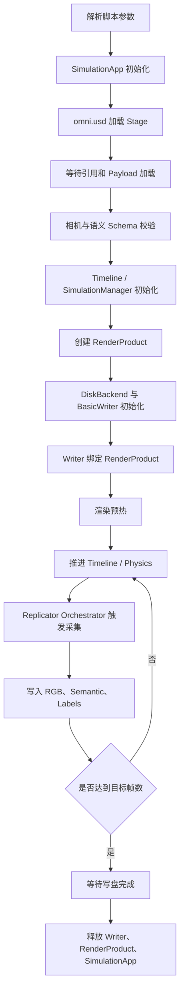

# 多帧 RGB 与 Semantic 成对采集实现方案

下一步应把脚本升级为“**时间驱动的 RGB/语义成对采集器**”。当前脚本虽然已有 `--frames`，但每次使用 `delta_time=0.0`，且场景和相机不运动，因此连续输出很可能是相同画面。

核心目标是保证：

```text
推进场景到时刻 T
    ↓
同一相机、同一 RenderProduct、同一次 Capture
    ↓
rgb_N.png + semantic_N.png + labels_N.json
```

## 推荐运行模式

建议支持三种帧推进模式，第一版优先实现 `timeline`：

| 模式 | 作用 | 适用场景 |
|---|---|---|
| `static` | 不推进时间，重复采集 | 测试写盘稳定性 |
| `timeline` | 按固定时间间隔推进 USD Timeline | USD 动画、相机动画 |
| `physics` | 按固定物理步长推进仿真 | 车辆、刚体、机器人运动 |

需要注意：当前场景如果没有 USD 动画、物理运动或相机运动，即使进入多帧循环，结果仍然几乎完全相同。

## 模块运行关系



## Isaac Sim 模块及作用

| 模块 | 初始化时机 | 作用 |
|---|---|---|
| `isaacsim.SimulationApp` | 最先初始化 | 启动 Kit、RTX 渲染器和无界面运行环境 |
| `omni.usd` | SimulationApp 之后 | 打开 USD，访问 Stage 和 Prim |
| `is_stage_loading` | USD 打开之后 | 等待引用资产、Payload 和材质加载完成 |
| `pxr.UsdGeom` | Stage 加载完成后 | 校验 `/Camera` 是否为有效 Camera Prim |
| `SemanticsLabelsAPI` | 已保存在 USD 中 | 为 Synthetic Data 提供类别标签 |
| `omni.timeline` | Stage 校验后 | 控制 USD 动画的播放、暂停和当前时间 |
| `SimulationManager` | 仅物理模式需要 | 初始化物理场景并执行固定步长仿真 |
| `rep.create.render_product` | 相机确定之后 | 把相机和输出分辨率绑定为渲染数据源 |
| `rep.backends.DiskBackend` | RenderProduct 创建后 | 管理本地文件写入目录 |
| `BasicWriter` | Backend 之后 | 同步保存 RGB、Semantic 和标签 JSON |
| `rep.orchestrator` | Writer 绑定之后 | 控制每一次精确的数据采集事件 |

## 严格初始化顺序

1. 解析命令行参数。
2. 创建 `SimulationApp`。
3. 导入 `omni`、`replicator`、`pxr` 等 Isaac Sim 模块。
4. 设置 `rep.orchestrator.set_capture_on_play(False)`。
5. 打开 USD。
6. 更新两帧并等待 `is_stage_loading()` 结束。
7. 校验相机和语义标签。
8. 配置 Timeline 起始时间及帧率。
9. 若启用物理，初始化 `SimulationManager`。
10. 创建 RenderProduct。
11. 初始化 DiskBackend 和 BasicWriter。
12. Writer 绑定 RenderProduct。
13. 执行预热帧，但不保存。
14. 启动 Timeline。
15. 进入“推进场景、触发采集”的循环。
16. 等待异步写盘完成。
17. 停止 Timeline。
18. Detach Writer，销毁 RenderProduct。
19. 关闭 SimulationApp。

`SimulationApp` 必须先于 `omni.replicator.core` 等模块初始化，这是 Isaac Sim 独立脚本的重要约束。

## 每帧运行顺序

推荐把“仿真推进”和“数据采集”分开：

```text
执行 simulation_steps_per_capture 个仿真步
    ↓
场景到达目标时间
    ↓
orchestrator.step(delta_time=0.0)
    ↓
Writer 在当前状态采集一次
```

这样可以避免 Timeline 被仿真循环和 Replicator 同时推进，导致时间步重复。

例如：

```text
simulation_fps = 60
capture_fps = 10
simulation_steps_per_capture = 6
```

即仿真每运行 6 步，保存一组 RGB 和 Semantic。

## 需要自定义的参数

### 场景参数

| 参数 | 默认值 | 说明 |
|---|---:|---|
| `usd` | 当前 USDA 路径 | 输入场景 |
| `camera` | `/Camera` | 采集相机 |
| `output` | `output_semantic_sequence` | 输出目录 |
| `headless` | `true` | 是否无界面运行 |

### 图像参数

| 参数 | 默认值 | 说明 |
|---|---:|---|
| `width` | `1280` | 图像宽度 |
| `height` | `720` | 图像高度 |
| `capture_rgb` | `true` | 保存 RGB |
| `capture_semantic` | `true` | 保存语义图 |
| `colorize_semantic` | `true` | 保存彩色语义图 |
| `rt_subframes` | `4` | 每次采集使用的 RTX 子帧数 |

### 序列参数

| 参数 | 默认值 | 说明 |
|---|---:|---|
| `frames` | `100` | 输出帧数 |
| `advance_mode` | `timeline` | `static/timeline/physics` |
| `capture_fps` | `10` | 输出数据帧率 |
| `simulation_fps` | `60` | 仿真更新频率 |
| `start_time` | `0.0` | Timeline 起始时间 |
| `warmup_frames` | `10` | 正式采集前的预热次数 |
| `start_index` | `0` | 输出文件起始编号 |
| `seed` | `0` | 后续随机化使用的随机种子 |

建议要求 `simulation_fps / capture_fps` 为整数。否则需要使用时间累加器决定何时采集，容易产生不均匀间隔。

### 输出控制参数

| 参数 | 默认值 | 说明 |
|---|---:|---|
| `overwrite` | `false` | 是否允许写入非空目录 |
| `save_manifest` | `true` | 保存完整序列元数据 |
| `fail_on_empty_semantic` | `true` | 语义图只有背景时终止 |
| `flush_interval` | `10` | 每多少帧等待一次写盘 |
| `log_interval` | `10` | 每多少帧打印一次进度 |

## 输出结构

BasicWriter 默认输出可以继续保持：

```text
output_semantic_sequence/
├── rgb_0000.png
├── semantic_segmentation_0000.png
├── semantic_segmentation_labels_0000.json
├── rgb_0001.png
├── semantic_segmentation_0001.png
├── semantic_segmentation_labels_0001.json
└── sequence_manifest.json
```

建议新增 `sequence_manifest.json`，记录：

- 输入 USD 和相机路径
- 分辨率与渲染器
- 总帧数
- 仿真帧率和采集帧率
- 每张图对应的 Timeline 时间
- Isaac Sim 版本
- 参数和随机种子

## 实施分层

第一步先完成固定相机、多帧时间推进和成对写盘。第二步加入相机轨迹或读取 USD Camera Animation。第三步再加入物体运动、物理仿真和场景随机化。

第一步的验收标准是：

- 每个编号都有 RGB、Semantic 和 Labels 三个对应文件
- RGB 与 Semantic 数量和分辨率完全一致
- 帧编号连续
- Manifest 中时间单调递增
- 非静态场景下相邻帧确实发生变化
- 写盘结束前不会关闭 Isaac Sim
- 重复运行不会无意覆盖已有数据
