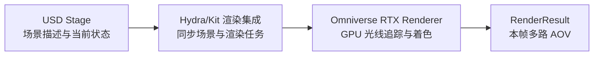
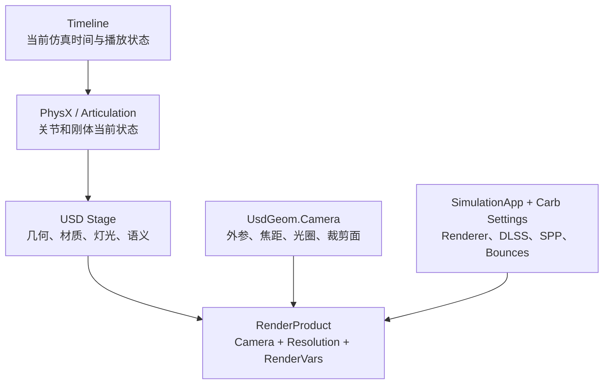
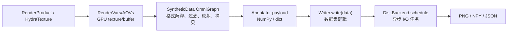
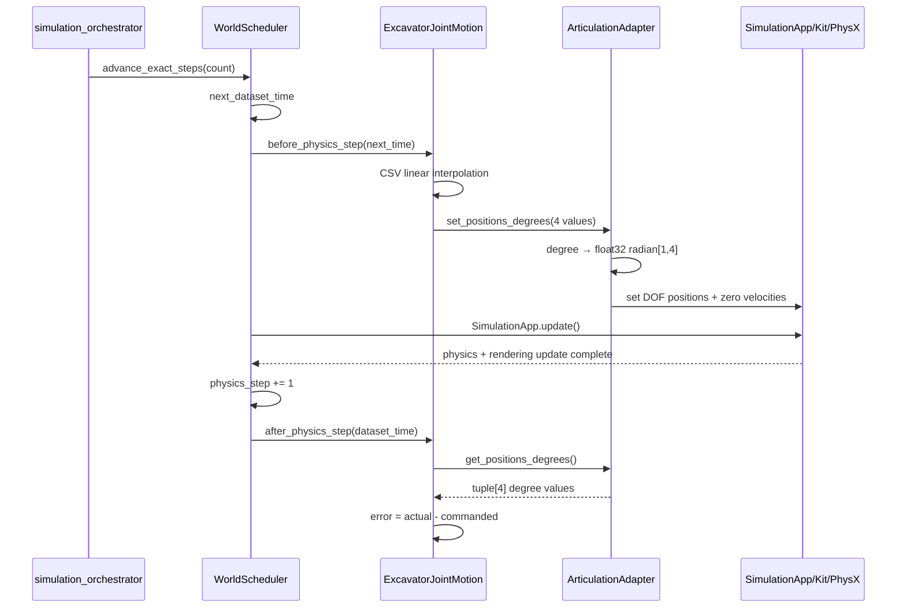
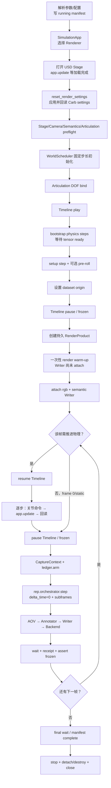

# Keypoints 01：Isaac Sim 渲染链路、RTX/DLSS/AOV、两种路径追踪与本项目逐帧采集流程

> 编写日期：2026-07-22  
> 对应工程：`scripts/260714_01semantic_worldModule`  
> 目标：把“物理世界如何变成一张 RGB 图和一张语义 ID 图”的完整链路讲清楚，并把每个概念落实到当前项目的代码、数据结构和调用顺序。

---

## 0. 阅读前先记住四句话

1. **Renderer（渲染器）是执行计算的系统**：它读取场景、相机、材质、灯光和渲染设置，在 GPU 上计算颜色、深度、法线、语义 ID 等结果。
2. **RenderProduct（渲染产品）是一次相机输出的合同**：它指定相机、分辨率以及这一路输出关联的 RenderVars，并持有可持续更新的 HydraTexture/渲染结果入口。
3. **RenderVar 是渲染器输出的一种逐像素变量，也叫 AOV**：例如 `LdrColor`、`Depth`、`SemanticSegmentation`。RenderVar 最初是 GPU texture/buffer，不是 PNG。
4. **Annotator、Writer、Backend 才负责把 RenderVar 变成训练文件**：Annotator 解释原始缓冲，Writer 组织数据集语义，Backend 执行 PNG/NPY/JSON 落盘。

当前项目中最关键的一条真实链路是：

```text
USD Stage + Camera + RTX 设置
        ↓
Omniverse RTX Renderer
        ↓
RenderProduct: SemanticCapture（1280×720）
        ↓
LdrColor / SemanticSegmentation RenderVars（GPU）
        ↓
rgb / semantic_segmentation Annotators（CPU NumPy/Python dict）
        ↓
SemanticDatasetWriter（运行时 ID → 稳定数据集 ID）
        ↓
DiskBackend
        ↓
rgb/*.png + semantic_id/*.npy + semantic_color/*.png + metadata/*.json
```

官方参考：

- [Isaac Sim Rendering Modes](https://docs.isaacsim.omniverse.nvidia.com/latest/reference_material/rendering_modes.html)
- [Omni Replicator Python API](https://docs.omniverse.nvidia.com/kit/docs/omni_replicator/1.13.30/source/extensions/omni.replicator.core/docs/API.html)
- [OpenUSD RenderVar](https://openusd.org/dev/user_guides/schemas/usdRender/RenderVar.html)
- [SyntheticData：SdRenderVarToRawArray](https://docs.omniverse.nvidia.com/kit/docs/omni.syntheticdata/0.6.13/GeneratedNodeDocumentation/OgnSdRenderVarToRawArray.html)

> 版本提醒：上面的在线链接指向编写本文时的最新文档。当前项目的 `run_config.json` 会记录 Python、平台和有效 RTX 设置，却还没有记录 Isaac Sim、Kit、Replicator 和 RTX Renderer 的完整版本号。不同版本可能改变默认 RenderVars、DLSS 行为和 Carb 设置，因此生产数据应补充版本记录，不能只依据“latest”文档推断远端运行时。

---

# 第一部分：Renderer、RenderProduct、RenderVar 的关系

## 1. Renderer：真正执行渲染计算的系统

Renderer 不是一张图片，也不是一个 Python 对象容器。它是把三维场景变成二维观测结果的一整套执行系统。

在本工程里，Renderer 的上游输入主要包括：

| 输入 | 工程中的来源 | 典型数据 |
|---|---|---|
| 几何和层级 | USD Stage | Mesh、Xform、Prim path、实例关系 |
| 材质和纹理 | USD/MDL/纹理资产 | 材质参数、纹理采样、透明度 |
| 灯光和环境 | USD Light/DomeLight | 位置、方向、颜色、强度、HDR 环境图 |
| 相机外参 | `UsdGeom.Camera` 所在 Prim 的世界变换 | 4×4 浮点矩阵 |
| 相机内参 | `focalLength`、aperture、clipping range 等 | 浮点标量/向量 |
| 世界状态 | PhysX、Articulation、Timeline | 刚体姿态、关节角、动画时间 |
| 渲染模式 | `SimulationApp` 与 `/rtx/rendermode` | `RealTimePathTracing` 或 `PathTracing` |
| 质量参数 | Carb settings/render profile | SPP、bounce、DLSS mode、denoiser |
| 输出合同 | RenderProduct/RenderVars | 相机、分辨率、所需 AOV |

Renderer 的下游不是只有最终彩色图。它可以为同一次相机观测生成多张空间完全对齐的逐像素缓冲：

```text
同一个像素 (x, y)
├── LdrColor[x, y]              RGBA 颜色
├── Depth[x, y]                 深度
├── WorldPosition[x, y]         可见表面的世界坐标
├── WorldNormals[x, y]          可见表面的世界法线
├── SemanticSegmentation[x, y]  语义 ID
├── InstanceSegmentation[x, y]  实例 ID
└── MotionVectors[x, y]         相邻帧运动信息
```

这些结果共享相机和分辨率，因此可以逐像素联合使用。例如先用语义 ID 找出斗齿像素，再从相同像素位置读取 RGB、深度和世界坐标。

### 1.1 USD、Hydra、RTX 的职责边界

可以把 Isaac Sim 渲染侧粗略分成三层：



- **USD Stage** 负责描述“世界是什么”：有哪些 Prim、网格、相机、灯光、材质、变换和语义标签。
- **Hydra/Kit 渲染集成** 负责把 USD 场景变化同步到渲染系统，并组织 RenderProduct、渲染任务和输出纹理。
- **RTX Renderer** 负责实际的 GPU 可见性、光线求交、材质着色、光照采样、降噪和后处理。
- **RenderResult** 是某个渲染帧产生的一组结果，其中包含多个 AOV/RenderVar。

`SimulationApp.update()` 会推进一次 Kit application update。官方说明它会更新系统并执行一帧渲染；Kit 的 loop runner 会派发 pre-update、update、post-update 等事件。Timeline 播放时，物理和动画也会响应；Timeline 暂停时，Kit 和渲染仍可更新，但时间驱动的物理不会照常前进。[SimulationApp API](https://docs.isaacsim.omniverse.nvidia.com/latest/py/source/extensions/isaacsim.simulation_app/docs/index.html) / [Kit IApp update loop](https://docs.omniverse.nvidia.com/kit/docs/kit-manual/latest/guide/kit_core_iapp_interface.html)

---

## 2. RenderProduct：相机输出合同，不是已保存图片

OpenUSD 的渲染架构是：

```text
RenderSettings
    └── RenderProduct（可以有多个）
            └── orderedVars → RenderVar（可以有多个）
```

一个 RenderProduct 主要回答三个问题：

1. 从哪一个 Camera 看？
2. 输出分辨率是多少？
3. 这一相机输出需要哪些 RenderVars/AOV？

概念上的 USD 声明类似：

```usda
def RenderProduct "SemanticCapture"
{
    rel camera = </root/Xform/operator_cab_mesh/Camera_01>
    uniform int2 resolution = (1280, 720)
    rel orderedVars = [
        </Render/Vars/LdrColor>,
        </Render/Vars/SemanticSegmentation>,
        </Render/Vars/Depth>
    ]
}
```

在当前代码中，对应调用位于 [`semantic_capture_custom.py`](../../scripts/260714_01semantic_worldModule/semantic_capture_custom.py)：

```python
rep.orchestrator.set_capture_on_play(False)
self._render_product = rep.create.render_product(
    self.camera_path,
    resolution=(self._width, self._height),
    name="SemanticCapture",
)
self._render_product.hydra_texture.set_updates_enabled(True)
```

逐句解释：

### 2.1 `set_capture_on_play(False)`

关闭“Timeline 一播放就自动采集”。当前项目自己控制物理步和采集时刻，因此不能让每个 Timeline 播放更新都触发 Writer。

这带来的效果是：

```text
Timeline 播放 + SimulationApp.update()
    → 可以推进物理和更新渲染
    → 但不自动发布一张正式数据集帧

rep.orchestrator.step(...)
    → 才明确请求一次正式 Replicator 采集
```

Replicator 官方文档说明，capture-on-play 启用时，Timeline 的 Play/Stop/Pause 会联动 Replicator；本项目显式关闭这种耦合。

### 2.2 `rep.create.render_product(...)`

创建或取得一条持久的相机渲染输出。参数的语义是：

```python
camera = self.camera_path              # USD Camera Prim path: str
resolution = (width, height)           # tuple[int, int]
name = "SemanticCapture"               # RenderProduct 名称
```

Replicator 默认把它放在类似下面的 Session Layer 路径：

```text
/Render/HydraTextures/SemanticCapture
```

如果名字冲突，实际路径可能带 `_01` 等后缀。官方 API 还说明：指定 `name` 时会强制创建新的 RenderProduct；不再使用的 RenderProduct 应销毁，因为它可能占用较多显存。

### 2.3 `hydra_texture.set_updates_enabled(True)`

RenderProduct 对应的 HydraTexture 需要继续接收渲染器更新。这里显式保持更新，使同一个 RenderProduct 从预热一直存活到最后一帧，不重新创建相机输出，也不丢失其内部渲染历史。

这并不意味着“已经保存图片”，只意味着该输出目标会继续产生新 RenderResult/AOV。

---

## 3. RenderVar 与 AOV：同一个概念的两个观察角度

### 3.1 AOV 是什么

AOV 是 **Arbitrary Output Variable**，中文可以理解为“任意渲染输出变量”。它是渲染器在最终颜色之外暴露的一张具名数据缓冲。

例如：

| AOV/RenderVar | 每个像素表达的含义 | 常见用途 |
|---|---|---|
| `LdrColor` | 色调映射后的 RGBA 颜色 | 普通 RGB 图 |
| `HdrColor` | 高动态范围线性/浮点颜色 | 曝光、物理光照分析 |
| `Depth` | 相机方向深度 | 深度图、遮挡分析 |
| `WorldPosition` | 当前可见表面的世界坐标 | 点云、像素反投影 |
| `WorldNormals` | 当前可见表面的法线 | 表面朝向、着色分析 |
| `SemanticSegmentation` | 当前可见表面的语义 ID | 类别掩码 |
| `InstanceSegmentation` | 当前可见对象实例 ID | 单斗齿分离、实例框 |
| `MotionVectors` | 时序运动信息 | DLSS/TAA、运动分析 |
| `DiffuseAlbedo` | 漫反射反照率贡献 | 材质与光照解耦 |
| `DirectDiffuse` | 直接光漫反射贡献 | 光照分解 |
| `Reflections` | 反射贡献 | 反射质量分析 |

RenderVar 是 USD/Omniverse 对 AOV 声明的对象。OpenUSD RenderVar 具有以下关键字段：

```usda
def RenderVar "LdrColor"
{
    uniform token dataType = "color4f"
    uniform string sourceName = "LdrColor"
    uniform token sourceType = "raw"
}
```

- `sourceName`：向渲染器请求哪个具名 AOV。
- `sourceType`：数据来源类型，例如 `raw`、`primvar`、`lpe`。
- `dataType`：USD 层对结果类型的描述。
- RenderVar Prim 名/path：USD Stage 中这个声明对象的身份。

`orderedVars` 的顺序用于组织 RenderProduct 引用，不应理解为 RTX 严格按数组顺序执行 AOV。实际执行由渲染依赖图决定。

### 3.2 RenderVar 最初是什么格式

RenderVar 最初通常是 GPU texture 或 buffer。`SdRenderVarToRawArray` 节点接收：

```text
renderResults 指针
renderVar token/name
CUDA stream 指针
```

并输出：

```text
data: uchar[]
format: 像素格式标识
width / height
strides: 每行/每像素的字节步长
bufferSize
CUDA stream
```

因此，RenderVar 不是天然的 NumPy 数组。Annotator 必须根据 `format + width + height + strides` 正确解释原始字节，必要时执行 GPU → CPU 复制和语义后处理。

### 3.3 常见格式与显存量级

以下是典型而非所有版本都固定不变的表示方式：

| 数据 | GPU/RenderVar 格式示例 | Annotator 常见 CPU 形式 | 1280×720 单缓冲约占用 |
|---|---|---|---:|
| LDR 颜色 | RGBA8 | `uint8[720,1280,4]` | 3.52 MiB |
| HDR 颜色 | RGBA16F | 半精度浮点 4 通道 | 7.03 MiB |
| 单通道距离 | R32F | `float32[720,1280]` | 3.52 MiB |
| 三维位置 | RGB32F | `float32[720,1280,3]` | 10.55 MiB |
| 法线 | 常见 RGBA32F | `float32[720,1280,4]` | 14.06 MiB |
| 语义 ID | R32UI/等价 ID 缓冲 | `uint32[720,1280]` | 3.52 MiB |

计算例子：

```text
RGBA8:
1280 × 720 × 4 byte = 3,686,400 byte ≈ 3.52 MiB

RGBA32F:
1280 × 720 × 4 channel × 4 byte = 14,745,600 byte ≈ 14.06 MiB
```

这只是一个表面的数据量。渲染器还可能保存 G-buffer、加速结构、前后帧、降噪历史、DLSS 历史、路径追踪累积缓冲等，所以实际显存远大于表格求和。

### 3.4 “一个 RenderVar”不等于“一个数值通道”

```text
LdrColor 是一个 RenderVar
但每像素包含 R、G、B、A 四个通道

WorldPosition 是一个 RenderVar
但每像素包含 X、Y、Z 三个分量
```

因此这里的“变量”是一个逻辑输出平面，而不是一个标量。

---

## 4. RenderProduct 的完整上下游链路

### 4.1 上游：谁决定 RenderProduct 当前看到什么



RenderProduct 不控制挖掘机运动；它只观察调用时已经存在的世界状态。挖掘机姿态由 Articulation/PhysX 决定，相机因为挂在驾驶室层级下，其世界矩阵也会随上车体旋转而改变。

### 4.2 中游：Renderer 怎样产生 AOV

```text
Kit update / Replicator capture request
        ↓
Hydra 同步当前 USD/相机/材质状态
        ↓
RTX 更新场景加速结构与渲染资源
        ↓
相机主射线、可见性与材质求值
        ↓
直接光、间接光、反射、透射等贡献
        ↓
降噪 / DLSS / tone mapping（取决于模式与 AOV）
        ↓
写入 RenderResult 中的 LdrColor、Depth、Semantic... AOV
```

并非每个 AOV 都经过相同的后处理。例如：

- `LdrColor` 会受曝光、色调映射、DLSS/降噪影响。
- 原始 ID 类语义 AOV 不能用颜色插值方式重建，否则类别 ID 会被污染。
- 深度、法线、位置具有自己的格式和无效像素约定。

### 4.3 下游：Annotator、Writer、Backend



Replicator 官方 API 说明，Annotator attach 到 RenderProduct 时会创建对应 OmniGraph 节点和连接。Writer 声明所需 Annotators；Writer attach 时，Replicator 把这些 Annotators 连接到指定 RenderProduct，并在采集触发时把 payload 交给 `write()`。

当前 Writer 设置：

```python
self.data_structure = "renderProduct"
```

所以 `write(data)` 收到的逻辑结构是：

```python
data = {
    "renderProducts": {
        "SemanticCapture": {
            "rgb": np.ndarray(...),
            "semantic_segmentation": {
                "data": np.ndarray(...),
                "info": {
                    "idToLabels": {...}
                }
            }
        }
    }
}
```

名字可能附带 RenderProduct/Annotator 后缀，所以当前代码 `_find()` 同时支持精确匹配和 `startswith()`。

---

## 5. 当前工程中 RGB 和语义数据的真实格式

### 5.1 RGB 链路

Writer 注册：

```python
AnnotatorRegistry.get_annotator("rgb")
```

`rgb` 通常对应 `LdrColor`。常见 CPU 数据为：

```python
type(rgb_data)  == numpy.ndarray
rgb_data.dtype == numpy.uint8
rgb_data.shape == (height, width, 4)  # RGBA
```

也有环境返回三通道，所以当前 Writer 接受：

```python
H × W × 3
H × W × 4
```

并要求：

```python
data.dtype == np.uint8
data.shape[:2] == semantic_id.shape
```

对应代码：

```python
if data.dtype != np.uint8:
    raise ValueError(...)
if data.ndim != 3 or data.shape[2] not in {3, 4}:
    raise ValueError(...)
if data.shape[:2] != expected_shape:
    raise ValueError(...)
```

最终 Backend 接收连续内存数组并调用 `F.write_image` 写 PNG。

### 5.2 语义分割链路

Writer 注册：

```python
AnnotatorRegistry.get_annotator(
    "semantic_segmentation",
    init_params={
        "colorize": False,
        "semanticFilter": "class:*",
    },
)
```

参数含义：

- `colorize=False`：要原始 ID，不要用于显示的伪彩色图。
- `semanticFilter="class:*"`：只按 `class` 语义类型提取所有标签。

典型 payload：

```python
semantic_entry = {
    "data": np.ndarray(
        shape=(720, 1280),
        dtype=np.uint32,
    ),
    "info": {
        "idToLabels": {
            0: {},
            1: {"class": "bucket"},
            2: {"class": "bucket_tooth"},
        }
    }
}
```

兼容旧式/底层打包数据时，当前 Writer 还接受：

```python
dtype=np.uint8, shape=(H, W, 4)
```

并通过连续四字节 view 为一个 `uint32`：

```python
np.ascontiguousarray(data).view(np.uint32).reshape(height, width)
```

随后 [`semantic_mapping.py`](../../scripts/260714_01semantic_worldModule/semantic_mapping.py) 完成：

```text
runtime semantic ID: uint32[H,W]
        ↓ idToLabels
语义字符串，例如 bucket_tooth
        ↓ 项目 mapping JSON
stable dataset ID: uint16[H,W]
```

最终保存：

| 文件 | 数据 |
|---|---|
| `semantic_runtime_id_XXXX.npy` | RTX/SyntheticData 本次运行时 `uint32` ID |
| `semantic_id_XXXX.npy` | 项目稳定的 `uint16` 数据集 ID |
| `semantic_color_XXXX.png` | 根据稳定 ID 查 LUT 得到的 `uint8[H,W,3]` 伪彩色 |
| `frame_XXXX.json` | ID 映射、像素计数、相机和运动上下文 |

> 运行时 ID 不能被当成跨运行稳定类别 ID。真正稳定的是 mapping JSON 定义的 dataset ID。

---

# 第二部分：RTX、DLSS、AOV 等概念

## 6. RTX 是什么

RTX 不是某一种单独的渲染算法，而是 NVIDIA 用于实时光线追踪和神经渲染的一组软硬件能力及其渲染平台。

在本项目语境里可以拆成：

| 组成 | 主要职责 |
|---|---|
| CUDA cores | 通用并行计算、着色和大量 GPU kernel |
| RT Cores | 加速 BVH 遍历和光线-几何求交 |
| Tensor Cores | 加速 DLSS 等神经网络推理 |
| OptiX/RTX renderer software | 组织路径追踪、降噪、材质、灯光和后处理 |
| Omniverse/Kit integration | 把 USD、Hydra、RenderProduct 与 RTX 连接起来 |

关系应理解为：

```text
Ray Tracing / Path Tracing = 渲染算法思想
RTX = 加速并实现这些算法及神经渲染能力的平台
DLSS = RTX 平台中一组神经渲染技术
AOV = 渲染器暴露的具名中间/最终输出缓冲
```

---

## 7. DLSS 是什么

DLSS 是 **Deep Learning Super Sampling**。在现代 RTX 渲染链路中，它已经不只是“放大图片”，而是一组神经渲染技术。

### 7.1 Super Resolution（超分辨率）

内部以低于目标输出的分辨率完成部分渲染，再结合：

- 当前帧低分辨率颜色；
- 深度；
- Motion Vectors；
- 曝光；
- 前一帧历史；
- 抖动采样信息；

重建目标分辨率图像。

它解决的是：

```text
少算内部像素和样本
        ↓
利用时序与神经网络重建
        ↓
输出接近高分辨率的 LdrColor
```

### 7.2 Ray Reconstruction（光线重建）

稀疏光线追踪会产生噪声。Ray Reconstruction 利用神经网络和多种辅助 AOV/历史信息，重建更稳定的阴影、反射和间接光结果。

它比简单的空间模糊更复杂，因为需要判断：

- 哪些像素是同一个表面；
- 当前像素从上一帧运动到了哪里；
- 深度/法线边界是否允许共享历史；
- 亮点是有效高光还是 Monte Carlo 噪声。

最新 RTX Renderer 文档中，RTX Real-Time 的 Ray Reconstruction 已成为关键甚至在新版本中固定启用的能力。但当前项目远端版本未知，所以实际行为必须用版本号和有效设置确认，不能把最新发布说明反推为所有旧版本的事实。[RTX Renderer 106.1 Release Notes](https://docs.omniverse.nvidia.com/materials-and-rendering/latest/rtx-renderer-release-notes/106_1.html)

### 7.3 Frame Generation（帧生成）

Frame Generation 在两个真实渲染帧之间生成显示帧，目标是提高观看帧率。

它不适合作为合成数据的标注采集帧来源，因为生成帧未必对应一个真实 PhysX/Timeline 状态，也不一定与语义、深度、实例 ID 严格一致。

当前项目没有显式启用 Frame Generation，正式数据帧仍由 `rep.orchestrator.step()` 触发。

### 7.4 DLAA

DLAA 使用类似的神经抗锯齿能力，但通常以原生输出分辨率工作，重点是画质而不是通过较低内部渲染分辨率提升性能。

### 7.5 当前项目的 DLSS 配置

[`render_realtime_pathtracing_720p.json`](../../scripts/260714_01semantic_worldModule/configs/render_realtime_pathtracing_720p.json) 中：

```json
{
  "renderer": "RealTimePathTracing",
  "launch_settings": {
    "anti_aliasing": 3
  },
  "settings": {
    "/rtx/post/dlss/execMode": 2
  }
}
```

项目把 `anti_aliasing=3` 作为 DLSS 启动配置，并将 `execMode=2` 设为 Quality。Isaac Sim 官方当前给出的模式值是：

```text
0 = Performance
1 = Balanced
2 = Quality
3 = Auto
```

官方已知问题还建议 Replicator/SDG 使用 Quality，尤其低分辨率时 Performance 可能导致透明或错误边缘。[Isaac Sim Known Issues：DLSS for SDG](https://docs.isaacsim.omniverse.nvidia.com/latest/overview/known_issues.html)

### 7.6 DLSS 对当前数据集有什么影响

主要影响 RGB/LdrColor：

- 细斗齿边缘可能更平滑，也可能出现时序重建偏移；
- 极细结构、透明边缘、快速运动边缘可能出现 ghosting；
- 同一静止姿态经过若干 subframes 后，时序结果通常比第一帧稳定；
- RGB 边界可能与整数语义 ID 边界存在亚像素/抗锯齿差异。

因此训练数据质量检查不能只看全图 PSNR，还应在斗齿 mask 边界附近单独检查 RGB 梯度、颜色泄漏和语义边界对齐。

---

## 8. AOV 在 DLSS 和数据集中的双重角色

AOV 有两个不同用途：

### 8.1 渲染器内部辅助输入

DLSS、降噪器、时序重建会使用：

```text
Depth
Normals
MotionVectors
Albedo
Exposure
历史颜色/光照
```

它们帮助算法判断像素是否属于同一表面、如何跨帧重投影、哪些噪声可以合并。

### 8.2 对外数据产品

Replicator 又可以把部分 AOV 作为 Annotator 输出：

```text
Depth → 深度训练数据
WorldPosition → 点云
SemanticSegmentation → 类别掩码
InstanceSegmentation → 实例掩码
Normals → 表面方向
LdrColor → RGB 图
```

二者不能混为一谈：

> 一个 AOV 被 RTX 内部使用，不代表它已经被复制到 Python；只有挂载相应 Annotator/Writer 后，才会形成对外 payload 和落盘数据。

---

# 第三部分：RTX Interactive Path Tracing 与 RTX Real-Time 2.0

## 9. 先纠正一个容易产生的误解

在当前 Isaac Sim 命名中：

```text
SimulationApp renderer="RealTimePathTracing"
    ↔ RTX - Real-Time 2.0

SimulationApp renderer="PathTracing"
    ↔ RTX - Interactive (Path Tracing)
```

最新官方文档明确指出，RTX Real-Time 2.0 本身也是 physically based path-tracing mode，只是它依靠 DLSS、缓存、较低采样预算和重建技术达到实时性能。因此两者不是简单的“光栅化 vs 路径追踪”。[RTX Real-Time 2.0 Overview](https://docs.omniverse.nvidia.com/materials-and-rendering/latest/rtx-renderer_rt_overview.html)

两种模式的核心取舍是：

```text
Real-Time 2.0：有限样本 + 时序/空间复用 + 缓存 + 神经重建
Interactive PT：更多 Monte Carlo 样本 + 显式逐帧累积 + 可选降噪
```

---

## 10. RTX Interactive Path Tracing 的工作流

### 10.1 单个像素的一条路径

简化的路径追踪过程：

```text
从相机像素发出主射线
        ↓
与场景几何求交
        ↓
读取 MDL 材质、纹理、法线
        ↓
采样光源或下一次散射方向
        ↓
继续追踪反射/折射/漫反射路径
        ↓
多次 bounce 后命中光源、环境或终止
        ↓
得到该路径对像素辐射亮度的一次随机估计
```

一次随机路径样本通常有噪声。对同一像素累积多个独立样本：

\[
\hat{L}_N = \frac{1}{N}\sum_{i=1}^{N} L_i
\]

样本数增加时，Monte Carlo 估计通常逐渐稳定，但噪声下降速度大致与 `1/sqrt(N)` 同阶，因此把噪声减半往往需要约四倍样本。

### 10.2 逐渲染帧累积

官方设置：

```text
/rtx/pathtracing/spp
    每个 rendered frame、每像素计算多少样本

/rtx/pathtracing/totalSpp
    每像素最多累计多少样本，0 表示不设上限
```

当前 [`render_pathtracing_720p_64spp.json`](../../scripts/260714_01semantic_worldModule/configs/render_pathtracing_720p_64spp.json) 配置：

```json
{
  "samples_per_pixel_per_frame": 8,
  "capture_settings": {
    "rt_subframes": 8
  },
  "settings": {
    "/rtx/pathtracing/spp": 8,
    "/rtx/pathtracing/totalSpp": 64,
    "/rtx/pathtracing/adaptiveSampling/enabled": false,
    "/rtx/resetPtAccumOnAnimTimeChange": true
  }
}
```

项目的 `RenderProfile.sampling_summary()` 把它记录为：

```text
nominal_spp_per_output = spp × rt_subframes
                       = 8 × 8
                       = 64
```

这里必须使用“nominal（名义）”这个词。它是当前项目为配置审计建立的采样模型，不应被解释成所有 Isaac/Kit 版本中 `rt_subframes` 与有效独立样本严格一一对应的通用保证。实际应通过日志、有效设置和收敛实验验证。

### 10.3 场景变化与累积重置

如果相机、物体、Timeline 时间、灯光或重要渲染设置变化，旧样本不再属于当前状态，应重置累积。

当前配置：

```json
"/rtx/resetPtAccumOnAnimTimeChange": true
```

其工程目的就是避免把姿态 A 的光照样本混入姿态 B。

正式采集时世界已暂停，随后多个 subframes 在同一姿态上渲染，适合累积静止场景样本。

### 10.4 Denoiser

当前 Path Tracing launch 配置：

```json
"denoiser": true
```

降噪器以有限样本的 noisy radiance 和辅助缓冲为输入，估计更平滑的颜色。它可以显著降低噪声，但也可能：

- 抹掉细斗齿纹理；
- 模糊极细边缘；
- 在高反射、高亮小光源附近产生偏差；
- 让较低 SPP 图“看起来干净”，但并不等于已物理收敛。

因此评估时最好同时保存/比较不同 SPP，并明确 denoiser 是否开启。

---

## 11. RTX Real-Time 2.0 的工作流

Real-Time 2.0 仍然追踪光路，但必须在更小时间预算内输出每一帧，所以不可能像 Interactive PT 那样简单等待大量独立样本收敛。

简化流程：

```text
同步当前 USD/相机/几何状态
        ↓
少量主射线与可见性/G-buffer 信息
        ↓
采样直接光、反射、间接光等路径
        ↓
使用缓存、重要性采样、空间/时序复用
        ↓
利用 Depth / Normals / MotionVectors 等辅助 AOV
        ↓
DLSS Ray Reconstruction / denoise
        ↓
DLSS Super Resolution 或 DLAA
        ↓
tone mapping
        ↓
LdrColor
```

官方说明 Real-Time 2.0 使用高级缓存换取性能，因此与 Interactive PT 相比会有精度代价；增加 bounce 或关闭部分缓存可提高准确度，但会降低性能。[RTX Real-Time 2.0 Settings/FAQ](https://docs.omniverse.nvidia.com/materials-and-rendering/latest/rtx-renderer_rt.html)

当前工程配置：

```json
{
  "renderer": "RealTimePathTracing",
  "launch_settings": {
    "anti_aliasing": 3,
    "max_bounces": 3,
    "max_specular_transmission_bounces": 3,
    "max_volume_bounces": 15
  },
  "capture_settings": {
    "rt_subframes": 16,
    "warmup_render_frames": 16
  },
  "settings": {
    "/rtx/rendermode": "RealTimePathTracing",
    "/rtx/post/dlss/execMode": 2,
    "/rtx/pathtracing/fractionalCutoutOpacity": true
  }
}
```

注意 `/rtx/pathtracing/...` 出现在 Real-Time 2.0 配置中并不自动表示写错。当前 RTX Real-Time 2.0 与 Interactive PT 共享部分路径追踪/材质设置命名空间，例如 fractional cutout opacity。

### 11.1 `rt_subframes=16` 在实时模式中的含义

Replicator 官方定义：生成 subframes 时模拟暂停；它常用于大幅场景变化后减少渲染伪影或等待材质加载，并且对 RTX Real-Time 和 Path Tracing 都可用。

在当前项目里：

```text
同一物理姿态
同一 dataset_time
同一 Timeline time
同一相机矩阵
        ↓
执行 16 个渲染 subframes
        ↓
时序历史、材质/纹理和重建结果有机会稳定
        ↓
只发布一个正式数据集输出帧
```

它不是：

```text
16 个 PhysX step
16 个不同挖掘机姿态
16 张数据集图片
固定等价于 16 SPP
```

---

## 12. 两种模式的数据调用区别

两种模式的外部接口大部分相同：

```text
相同 USD Stage
相同 Camera
相同 RenderProduct
相同标准 RenderVars
相同 Annotator/Writer/Backend
相同 rep.orchestrator.step(...)
```

主要不同发生在 Renderer 内部和配置层：

| 对比项 | RealTimePathTracing | PathTracing |
|---|---|---|
| Isaac UI 名 | RTX Real-Time 2.0 | RTX Interactive (Path Tracing) |
| 核心目标 | 实时/高吞吐 | 高保真/静帧验证 |
| 每帧采样预算 | 较低 | 可显式提高 SPP |
| 历史依赖 | 很强，时序复用/DLSS | 逐帧 Monte Carlo 累积 |
| 缓存与近似 | 更多 | 更偏向参考路径积分 |
| DLSS | 核心组成 | 当前项目禁用 DLSS AA |
| Denoiser | 与实时神经重建深度结合 | 当前项目显式 `denoiser=true` |
| `rt_subframes` | 稳定时序历史、加载与重建 | 推动同一姿态的多帧采样累积 |
| 场景变化 | 历史失效后需重新稳定 | 累积必须重置 |
| 适合 | 大批量同步数据采集 | 少量参考帧、质量基准 |

官方 Isaac Sim 建议：Real-Time 2.0 用于交互、机器人和重视吞吐的 SDG；Interactive PT 用于高质量静帧和能够牺牲性能的验证场景。[Isaac Sim Rendering Modes](https://docs.isaacsim.omniverse.nvidia.com/latest/reference_material/rendering_modes.html)

### 12.1 AOV 可用性也可能不同

标准 RGB、深度、法线、语义/实例分割通常都可以通过 Replicator 使用，但某些 renderer-specific AOV 只在特定模式有效，例如带 `Pt` 前缀的 Path Tracing 分解 AOV。

不能因为 Annotator Registry 中存在名字，就假设当前 renderer 一定返回有效数据。正确流程是：

1. 查询当前版本已注册的 Annotator；
2. attach 到目标 RenderProduct；
3. 打印 `shape/dtype/min/max/invalid ratio`；
4. 用已知测试场景验证物理含义；
5. 再把它加入生产 Writer。

---

## 13. 怎样量化比较两种模式的图像差别

### 13.1 首先保证可比性

如果以下条件不一致，指标没有解释价值：

```text
同一 USD/依赖文件哈希
同一相机世界矩阵
同一相机焦距、aperture、clipping range
同一分辨率
同一挖掘机关节 actual readback
同一灯光、材质、纹理加载状态
同一曝光、tone mapping、DoF、motion blur
同一语义 mapping
明确的 renderer、SPP、subframes、DLSS、denoiser
```

当前 `run_config.json` 和逐帧 metadata 已记录其中大部分，但比较脚本不会自动证明两张图的 Stage 和状态相同。

### 13.2 选择参考图

建议以高 SPP Interactive Path Tracing 图作为“工程参考”，例如：

```text
512 / 1024 / 2048 total SPP
固定场景
固定曝光
明确 denoiser on/off
确认指标随 SPP 增加已经趋于稳定
```

当前项目的 64 SPP profile 是质量候选，不应未经收敛实验就称为 ground truth。

### 13.3 当前脚本已经实现的指标

[`compare_render_quality.py`](../../scripts/260714_01semantic_worldModule/compare_render_quality.py) 实现：

#### MAE

\[
MAE = \frac{1}{N}\sum |I_{rt}-I_{pt}|
\]

越低越接近，但不能区分亮度偏差、边缘偏移与噪声。

#### RMSE

\[
RMSE = \sqrt{\frac{1}{N}\sum(I_{rt}-I_{pt})^2}
\]

比 MAE 更惩罚少量大误差，例如高光/firefly 或严重边缘偏移。

#### PSNR

\[
PSNR = 20\log_{10}\left(\frac{255}{RMSE}\right)
\]

对 8-bit RGB，越高越接近参考图。它仍是逐像素指标，轻微几何错位会导致很大损失。

#### `global_ssim`

当前脚本用整幅 ROI 的均值、方差和协方差计算一个全局结构相似度代理。它不是常见实现中按局部窗口滑动后求平均的标准 SSIM，因此报告中应称为 `global_ssim`，不能直接与论文/其他工具的标准 SSIM 数值横向比较。

#### 辅助统计

```text
mean_luminance       平均亮度
near_black_fraction  亮度 < 5 的像素比例
laplacian_variance   拉普拉斯方差，作为锐度/高频能量代理
```

其中 Laplacian variance 高既可能表示细节清晰，也可能表示噪声很多，所以必须结合平坦区域噪声和边缘 ROI 一起解释。

### 13.4 建议增加的指标

#### 局部窗口 SSIM

使用标准局部窗口 SSIM，分别计算：

```text
全图
铲斗 ROI
每个斗齿 ROI
斗齿边界膨胀带 ROI
阴影/反射 ROI
```

#### LPIPS

用深度网络特征衡量感知差异。它更接近“人眼是否觉得不同”，但不适合单独作为几何/标注对齐标准。

#### 颜色差异

可把 RGB 转到 Lab，计算 Delta E。若目标是物理光照准确性，应优先比较线性 HDR/光照 AOV，而不是已经 tone-mapped 的 8-bit `LdrColor`。

#### 时序稳定性

对完全静止场景重复采集 K 次：

\[
Var(x,y)=\frac{1}{K}\sum_k(I_k(x,y)-\bar I(x,y))^2
\]

统计：

```text
全图平均时序方差
斗齿 ROI 时序方差
边界带时序方差
最大闪烁像素比例
```

它可以直接揭示 Real-Time/DLSS 的历史不稳定或 Path Tracing 样本噪声。

#### 语义/实例对齐

RGB 质量和标注正确性要分开评估：

```text
semantic exact pixel agreement
per-class IoU
per-instance IoU
boundary F-score
RGB edge 与 semantic boundary 的距离分布
```

语义 ID 图不应该用 PSNR/SSIM，因为 ID 数字之间没有连续颜色距离意义。

#### 性能指标

图像质量必须与代价一起报告：

```text
capture() 端到端毫秒数
每帧渲染毫秒数
Writer/Backend 毫秒数
峰值显存
输出吞吐 frames/minute
失败/丢帧率
```

### 13.5 推荐 A/B 实验矩阵

| 组 | Renderer | 采样/历史 | 用途 |
|---|---|---|---|
| A | PT | 64 SPP | 当前质量候选 |
| B | PT | 512+ SPP | 参考图候选 |
| C | RT 2.0 | 1 subframe | 冷启动/最低历史 |
| D | RT 2.0 | 4 subframes | 中等代价 |
| E | RT 2.0 | 16 subframes, DLSS Quality | 当前生产候选 |

每组至少覆盖：

```text
正视斗齿
小目标远距离斗齿
强遮挡
高反光金属
暗光
硬阴影边界
驾驶室转动后的第一帧
连续运动后的冻结帧
```

当前比较脚本示例：

```bash
python scripts/260714_01semantic_worldModule/compare_render_quality.py \
  --reference /path/to/pathtracing_reference.png \
  --candidate /path/to/realtime_candidate.png \
  --roi 500,100,250,300 \
  --output-report /path/to/quality_report.json
```

---

# 第四部分：当前项目从物理运动到冻结采集的完整顺序

## 14. 参与模块与各自边界

| 模块 | 当前职责 |
|---|---|
| [`simulation_orchestrator.py`](../../scripts/260714_01semantic_worldModule/simulation_orchestrator.py) | `SimulationApp` 生命周期与总流程编排 |
| [`render_profile.py`](../../scripts/260714_01semantic_worldModule/render_profile.py) | Renderer 配置、Carb settings 应用和回读 |
| [`world_scheduler.py`](../../scripts/260714_01semantic_worldModule/world_scheduler.py) | 固定步长、Timeline play/pause、物理步计数 |
| [`excavator_joint_motion.py`](../../scripts/260714_01semantic_worldModule/excavator_joint_motion.py) | CSV 插值、步前命令、步后回读 |
| [`articulation_adapter.py`](../../scripts/260714_01semantic_worldModule/articulation_adapter.py) | Isaac Articulation DOF 名称绑定及弧度/角度转换 |
| [`semantic_capture_custom.py`](../../scripts/260714_01semantic_worldModule/semantic_capture_custom.py) | Camera、RenderProduct、预热、Replicator 单帧采集 |
| [`semantic_dataset_writer.py`](../../scripts/260714_01semantic_worldModule/semantic_dataset_writer.py) | Annotators、ID 映射、PNG/NPY/JSON 写出 |
| [`capture_context.py`](../../scripts/260714_01semantic_worldModule/capture_context.py) | 冻结快照、帧身份、Writer ledger/receipt |
| [`capture_timing.py`](../../scripts/260714_01semantic_worldModule/capture_timing.py) | frame ID、物理步、dataset time 的纯数学映射 |

---

## 15. 启动与 Stage 准备阶段

### 第 1 步：解析配置并先写运行 manifest

`simulation_orchestrator.main()` 首先读取：

```text
USD path
semantic mapping JSON
trajectory CSV
joint profile JSON
render profile JSON
physics_hz / capture_fps
frames / width / height
renderer / rt_subframes / warmup frames
```

随后创建 `run_config.json`，初始状态为：

```json
{"status": "running"}
```

这是中途失败后仍能知道任务配置和失败原因的基础，但当前版本还没有从已有帧自动断点续采。

### 第 2 步：创建 `SimulationApp`

```python
simulation_app = SimulationApp(
    launch_config=profile.launch_config(args.headless)
)
```

`launch_config()` 典型返回：

```python
{
    "headless": True,
    "renderer": "RealTimePathTracing",
    "sync_loads": True,
    "anti_aliasing": 3,
    "max_bounces": 3,
    ...
}
```

数据类型是普通 Python `dict[str, Any]`。`SimulationApp` 必须先创建，之后才能导入依赖 Kit 扩展系统的 `omni.*`、Replicator 和 Isaac APIs。

### 第 3 步：打开 USD Stage 并等待 composition/依赖加载

```python
omni.usd.get_context().open_stage(args.usd)
stage = wait_for_opened_stage(simulation_app, args.usd)
```

等待循环中每次调用：

```python
simulation_app.update()
```

并检查：

```text
stage != None
root layer 与目标文件匹配
pending asset count == 0
Stage 已有 root prim
```

此阶段的 update 是 Kit/加载/渲染更新，不计入项目的 `WorldScheduler.physics_step`，因为 `WorldScheduler` 尚未启动。

### 第 4 步：重置并强制应用渲染设置

打开 Stage 可能恢复 Stage 自带的 render mode，所以代码按官方建议执行：

```python
simulation_app.reset_render_settings()
RenderProfileManager(carb.settings.get_settings()).apply_and_snapshot(profile)
```

`apply_and_snapshot()` 对每个要求的 Carb setting：

```text
读取 initial
写入 requested
再读回 effective
比较 requested == effective
不一致则终止生产采集
```

这一步比“只调用 settings.set”重要，因为配置被接受不等于最终有效。

### 第 5 步：Stage 与 Articulation preflight

检查：

```text
Camera Prim 是否有效
Camera 是否位于 cab root 下
语义标签是否存在
USD 依赖是否缺失
Articulation root 与四个 revolute DOF
质量、惯量、关节范围、刚体状态
```

这些主要是 USD schema 对象、Prim path 字符串、Python report/dataclass 和 JSON-compatible dict。

---

## 16. 固定物理时间轴与挖掘机运行时初始化

### 第 6 步：配置 `WorldScheduler`

```python
settings.set("/app/player/useFixedTimeStepping", True)
timeline.set_looping(False)
timeline.set_current_time(0.0)
timeline.set_time_codes_per_second(float(physics_hz))
timeline.set_end_time(...)
timeline.commit()
```

默认：

```text
physics_hz = 60
physics_dt = 1 / 60 = 0.0166666667 s
capture_fps = 10
steps_per_capture = 60 / 10 = 6
```

`CaptureTiming` 要求 `physics_hz % capture_fps == 0`，所以每张图之间始终是整数个物理步，不依赖浮点时间累计判断。

### 第 7 步：在 Timeline 播放前绑定 DOF 名称

`ExcavatorJointMotion.bind()` 创建 `IsaacArticulationAdapter`，按名称解析：

```text
cab
boom
small_arm
bucket
```

得到稳定的 `tuple[int, ...] dof_indices`。

此时只能建立 wrapper 和 name-to-index 映射。physics tensor 还未就绪，不能可靠读写关节。

### 第 8 步：开始 Timeline

```python
timeline.play()
timeline.commit()
```

`WorldScheduler.state` 从 `INITIALIZED` 变为 `RUNNING`。

### 第 9 步：bootstrap，等待 Articulation physics tensor

```python
world_scheduler.bootstrap_until(
    predicate=lambda: motion_scheduler.ready,
    max_steps=...,
)
```

每一步内部调用：

```python
simulation_app.update()
self._step_count += 1
```

Timeline 正在播放，因此这些 update 会驱动 PhysX/Articulation 初始化。bootstrap 步计入总 `physics_step`，但数据时间原点尚未建立，所以不会成为正式 dataset time。

### 第 10 步：初始化 runtime 并提交初始关节位置

先读取 physics tensor 中的实际关节位置，再执行一个 setup physics step：

```python
motion_scheduler.apply_initial_positions()
simulation_app.update()
motion_scheduler.after_physics_step(0.0)
```

关节命令的数据转换：

```text
CSV/插值角度：Python float，单位 degree
        ↓ math.radians
positions：np.float32，shape=(1,4)，单位 radian
velocities：np.float32 zeros，shape=(1,4)
        ↓
Articulation.set_dof_positions(...)
Articulation.set_dof_velocities(...)
```

步后回读：

```text
Articulation tensor/array，单位 radian
        ↓ flatten + math.degrees
tuple[float, float, float, float]，单位 degree
        ↓
actual - commanded
```

误差超过 joint profile 的 tolerance 时立即失败，避免图像姿态与记录目标不一致。

### 第 11 步：可选 pre-roll

若配置 `pre_roll_steps > 0`，项目保持 trajectory time 0 的初始关节目标，继续推进指定物理步，让接触、约束和刚体状态稳定。

pre-roll 同样计入总 physics step，但随后会被数据时间原点排除。

---

## 17. 数据时间原点、冻结和一次性预热

### 第 12 步：建立 dataset time 0

```python
world_scheduler.begin_data_timeline()
```

内部只记录：

```python
self._dataset_origin_step = self._step_count
```

因此：

```text
simulation_time = 总物理步 / physics_hz
dataset_time = (总物理步 - dataset_origin_step) / physics_hz
```

bootstrap、setup、pre-roll 可能让 `simulation_time > 0`，但正式数据集仍从 `dataset_time = 0` 开始。

### 第 13 步：冻结 Timeline

```python
timeline.pause()
timeline.commit()
```

并生成不可变快照：

```python
FrozenWorldSnapshot(
    physics_step: int,
    dataset_time: float,
    timeline_time: float,
)
```

### 第 14 步：创建持久 RenderProduct

`SemanticCameraScheduler.initialize()`：

```text
验证 Camera
统计应用了 SemanticsLabelsAPI 的 Prim
关闭 capture-on-play
创建 SemanticCapture RenderProduct
启用 HydraTexture updates
```

此时状态机：

```text
CREATED → RENDER_PRODUCT_READY
```

### 第 15 步：预热 N 个 render frames

```python
for _ in range(render_frame_count):
    simulation_app.update()
```

此时 Timeline 已暂停，因此按照当前项目合同：

```text
physics_step 不增加
dataset_time 不增加
timeline_time 不增加
关节姿态不改变
相机世界矩阵不改变
```

但 Kit/渲染链仍得到更新机会，用于：

```text
创建 RenderProduct/Hydra texture GPU 资源
编译/缓存 RTX shader 和 pipeline
上传纹理、材质与场景资源
更新加速结构和渲染缓存
建立 DLSS/降噪/时序历史
Path Tracing 模式下累积当前静止姿态样本
避免第一张正式图承担冷启动成本
```

重要边界：**Writer 是预热后才 attach 的。** 所以当前 warm-up 主要预热渲染链，并没有端到端预热 `rgb/semantic annotator → Writer → DiskBackend`。如果需要验证第一张正式帧的 Annotator/磁盘冷启动，应增加不发布到正式数据编号的 discard capture，而不能把现在这段 warm-up 描述成完整写出链预热。

预热完成后：

```text
RENDER_PRODUCT_READY → WARMED
```

随后代码调用 `assert_still_frozen()`，验证物理步和 Timeline time 没有偷偷变化。

### 第 16 步：挂载 Writer

```python
backend = DiskBackend(output_dir=..., overwrite=True)
writer = SemanticDatasetWriter(...)
writer.attach(render_product)
```

attach 后，Replicator 根据 Writer 的 annotator 列表建立下游 OmniGraph 连接：

```text
RenderProduct
├── rgb Annotator
└── semantic_segmentation Annotator
        ↓
SemanticDatasetWriter.write(data)
```

状态变为：

```text
WARMED → WRITER_ATTACHED
```

---

## 18. 正式采集循环：每一帧精确做什么

### 18.1 默认帧时刻

默认捕获初始帧：

```python
target_data_step(frame_id) = frame_id × steps_per_capture
```

在 60 Hz 物理、10 FPS 采集下：

| frame_id | target dataset step | dataset time |
|---:|---:|---:|
| 0 | 0 | 0.0 s |
| 1 | 6 | 0.1 s |
| 2 | 12 | 0.2 s |
| 10 | 60 | 1.0 s |

### 18.2 frame 0

frame 0 的 `steps_to_advance == 0`：

```text
不恢复 Timeline
不推进物理
再次取得当前 frozen snapshot
直接采集 dataset time 0 的姿态
```

所以第一张正式图与预热期间的世界姿态相同，但 Writer/Annotator 是刚挂载的。

### 18.3 后续帧：解除冻结

下一帧需要前进时才执行：

```python
world_scheduler.resume_after_capture()
```

内部：

```python
timeline.play()
timeline.commit()
state = RUNNING
```

注意当前代码不是“保存完立即解除冻结”，而是：

```text
保存 frame N 后仍保持 frozen
        ↓
进入 frame N+1，确认需要推进物理
        ↓
才 resume
```

最后一帧采集完成后不会再次 resume；清理阶段直接 stop/close。

### 18.4 精确推进每一个物理步

每一步顺序固定为：



因为 RenderProduct 已创建且 Hydra updates 保持启用，这些运动中的 `SimulationApp.update()` 也可能更新中间渲染帧和实时历史；但 `capture_on_play=False`，所以不会把每个物理步写成正式数据集帧。

### 18.5 到达目标姿态后再次冻结

```python
frozen_world = world_scheduler.freeze_for_capture()
```

保存：

```text
physics_step: int
dataset_time: float
timeline_time: float
```

并验证：

```python
abs(actual_dataset_time - expected_dataset_time) <= 1e-9
```

### 18.6 构造 `CaptureContext`

读取相机状态：

```text
camera_path: str
camera_world_transform: tuple/list[16] float
optics: dict[str, scalar/list]
```

读取运动状态：

```text
commanded_degrees: dict[str, float]
actual_degrees: dict[str, float]
position_error_degrees: dict[str, float]
body_world_transform: dict[str, list[16] | None]
trajectory_time: float
```

组成不可变 `CaptureContext`：

```python
CaptureContext(
    frame_id: int,
    dataset_time: float,
    timeline_time: float,
    physics_step: int,
    camera_path: str,
    camera_world_transform: tuple[float, ...],
    motion_state: Mapping[str, Any],
)
```

### 18.7 arm Writer ledger

正式渲染前：

```python
self._writer.arm_capture(context)
```

`CaptureLedger` 把 context 放进 thread-safe FIFO。这样稍后异步到达的 Writer callback 能准确知道这组像素属于哪个 `frame_id/physics_step/camera pose`。

如果 Writer 没有 context 就收到数据，或者同一 frame 重复 arm/complete，代码会直接报错。

### 18.8 调用 Replicator 单帧采集

```python
rep.orchestrator.step(
    rt_subframes=self._rt_subframes,
    delta_time=0.0,
    pause_timeline=False,
)
```

三个参数在本项目中的精确含义：

#### `rt_subframes`

在同一模拟状态上渲染多个 subframes。Replicator 明确说明 subframe 期间 simulation paused。

#### `delta_time=0.0`

Replicator 不推进 Timeline。官方定义：

```text
None  → 使用默认 timeline rate
0.0   → Timeline 不前进
> 0.0 → Timeline 按指定秒数前进
```

如果这里改成大于 0：

- Replicator step 自己会推进 Timeline；
- 可能触发动画/物理/时间相关系统；
- RGB/语义可能不再对应 `CaptureContext` 中冻结前读取的状态；
- `assert_still_frozen()` 会发现 Timeline time 或项目状态契约异常；
- 物理可能形成“WorldScheduler 没计数但外部时间已前进”的双重控制。

所以当前架构必须使用 0。

#### `pause_timeline=False`

它表示 step 完成后不额外强制暂停 Timeline。当前调用前 Timeline 已由 `WorldScheduler` 暂停，所以 `False` 不会把它自动播放起来；Timeline 仍保持暂停。是否冻结由 `WorldScheduler` 统一负责。

### 18.9 RTX → RenderVar → Annotator

subframes 期间，简化的数据流是：

```text
当前冻结的 USD/PhysX 姿态
        ↓
RTX 渲染若干 subframes
        ↓
RenderProduct RenderResult
        ├── LdrColor RGBA8
        └── SemanticSegmentation ID buffer
        ↓
SyntheticData OmniGraph
        ├── rgb → np.uint8[H,W,3/4]
        └── semantic → {data: np.uint32[H,W], info: idToLabels}
```

### 18.10 Writer remap 与 Backend schedule

`SemanticDatasetWriter.write(data)`：

```text
检查只存在一个 RenderProduct
        ↓
从 ledger.consume() 取出 CaptureContext
        ↓
读取 semantic runtime IDs
        ↓
idToLabels + mapping JSON → uint16 stable IDs
        ↓
统计 dataset_pixel_counts / unknown_labels
        ↓
验证 RGB dtype、shape 和语义分辨率一致
        ↓
DiskBackend.schedule 多个写任务
        ↓
ledger.complete(CaptureReceipt)
```

注意 `Backend.schedule()` 表示安排 I/O 工作，不等同于这一行返回时所有磁盘字节一定已经同步刷盘。

### 18.11 阻塞等待并验证完成

```python
rep.orchestrator.wait_until_complete()
receipt = writer.require_completed(frame_id)
```

当前实现选择 correctness-first：每帧阻塞等待 Replicator/Writer 完成，不做多帧异步流水。

随后再次：

```python
world_scheduler.assert_still_frozen(frozen_world)
```

验证采集过程中：

```text
physics_step 没变
Timeline time 没变
WorldScheduler 仍为 FROZEN
```

### 18.12 保存运动状态行

每帧把：

```text
CaptureContext
WorldScheduler state
Camera state
Motion state
CaptureReceipt
```

写成一行 JSON 到 `motion_state.jsonl`，并立即 `flush()`。

因此即使后面运行失败，已完成帧的运动上下文通常仍保留；但当前启动逻辑会拒绝非空输出目录（除非 `--overwrite`），且循环始终从 frame 0 开始，所以还没有实现真正断点续采。

---

## 19. 一次完整运行的时序图



---

## 20. 四条时间轴和两类帧必须分开

当前工程至少有：

| 量 | 含义 | warm-up 是否增加 | RT subframes 是否增加 |
|---|---|---:|---:|
| wall-clock time | 计算机真实耗时 | 是 | 是 |
| `timeline_time` | Kit 主时间轴 | 否，已 pause | 否，`delta_time=0` |
| `physics_step` | `WorldScheduler` 计数的物理步 | 否 | 否 |
| `dataset_time` | 正式数据原点后的物理时间 | 否 | 否 |
| render updates/subframes | 渲染器工作次数 | 是 | 是 |
| output `frame_id` | 正式数据集编号 | 否 | 每次 capture 只增加 1 |

因此：

```text
“GPU 渲染了 16 次”
不等于
“挖掘机运动了 16 个物理步”
也不等于
“保存了 16 张数据集图”
```

---

## 21. 当前流程的工程优点与仍需注意的点

### 已经做对的关键点

- RenderProduct 只创建一次，避免逐帧资源重建。
- `capture_on_play=False`，物理步与正式采集解耦。
- 固定物理步与整数 `steps_per_capture`，避免漂移。
- 关节命令在物理步前提交，实际值在步后回读。
- 先冻结再采集，`delta_time=0`。
- 采集前后检查 `physics_step/timeline_time` 不变。
- Writer ledger 把异步 callback 绑定到权威 `CaptureContext`。
- 运行时语义 ID 映射为稳定 dataset ID。
- 渲染 setting 写入后回读，并记录 requested/effective。

### 需要继续加强的点

1. manifest 应记录 Isaac Sim、Kit、Replicator、RTX Renderer、GPU/driver 版本。
2. 当前 warm-up 没有覆盖 Annotator/Writer/Backend 第一帧冷启动。
3. 当前没有真正的断点续采；`motion_state.jsonl` 可用于恢复设计，但启动逻辑尚未读取它。
4. 默认 RGB 使用 LdrColor；做物理光照比较时应考虑 HDR/线性 AOV。
5. `compare_render_quality.py` 的 `global_ssim` 不是标准局部窗口 SSIM。
6. 64 SPP 是当前质量候选，不是自动成立的无噪声真值。
7. 最新 Isaac Sim 文档提示 Timeline 停止/暂停时 async rendering 可能导致 Replicator 跳帧；实际版本若存在该问题，应结合官方建议验证 `/exts/isaacsim.core.throttling/enable_async=false`，并继续依赖 completed receipt 和输出校验，而不是只看循环次数。

---

# 第五部分：调试与验证代码

## 22. 查看 Stage 中实际 RenderProduct 与 RenderVars

可在 RenderProduct 创建后执行：

```python
import omni.usd
from pxr import UsdRender

stage = omni.usd.get_context().get_stage()

for prim in stage.Traverse():
    if not prim.IsA(UsdRender.Product):
        continue

    product = UsdRender.Product(prim)
    print("RenderProduct:", prim.GetPath())
    print("resolution:", product.GetResolutionAttr().Get())

    for target in product.GetOrderedVarsRel().GetTargets():
        var_prim = stage.GetPrimAtPath(target)
        render_var = UsdRender.Var(var_prim)
        print(
            "  ",
            target,
            "sourceName=", render_var.GetSourceNameAttr().Get(),
            "sourceType=", render_var.GetSourceTypeAttr().Get(),
            "dataType=", render_var.GetDataTypeAttr().Get(),
        )
```

这段检查的是 USD 声明，不代表每个 AOV 都已经传到 CPU Writer。

## 23. 在 Writer 中检查真实 payload

调试时可以在 `write()` 开头临时打印：

```python
def describe(value, prefix=""):
    if isinstance(value, dict):
        print(prefix, "dict keys=", list(value))
        for key, item in value.items():
            describe(item, prefix + f"/{key}")
        return

    array = np.asarray(value)
    print(
        prefix,
        "type=", type(value),
        "shape=", array.shape,
        "dtype=", array.dtype,
    )

describe(data, "writer_data")
```

生产运行不建议每帧输出完整数组或完整 `idToLabels`，否则日志会很大。

## 24. 验证冻结是否真的有效

对 capture 前后记录：

```python
before = {
    "timeline": timeline.get_current_time(),
    "physics_step": world_scheduler.get_state()["physics_step"],
    "dataset_time": world_scheduler.dataset_time,
    "camera": camera_scheduler.get_state()["world_transform"],
    "motion": motion_scheduler.get_state(),
}

receipt = camera_scheduler.capture(context)

after = {...}
```

应检查：

```text
before.timeline == after.timeline
before.physics_step == after.physics_step
before.dataset_time == after.dataset_time
before.camera matrix == after.camera matrix
before.motion.actual_degrees == after.motion.actual_degrees
```

`WorldScheduler.assert_still_frozen()` 已覆盖前三项中的核心时间检查；相机矩阵和关节状态也可以进一步加入自动断言。

---

# 结论

当前 `260714_01semantic_worldModule` 的设计本质上是一个“双阶段时钟”采集器：

```text
运动阶段：
Timeline 播放 → 关节命令 → PhysX 精确推进 → 关节回读

成像阶段：
Timeline 暂停 → 同一姿态渲染多个 subframes → RenderVars/AOVs
→ Annotators → Writer → Backend → 一个正式数据集帧
```

Renderer、RenderProduct 和 RenderVar 的关系可以最终压缩为：

```text
Renderer = 工厂和计算系统
RenderProduct = 某台相机、某个分辨率的一份输出订单
RenderVar/AOV = 订单中要求的每一种逐像素产品
Annotator = 把 GPU 产品解释成可用数据
Writer = 按数据集规则组织、校验和命名
Backend = 执行具体存储
```

RTX Real-Time 2.0 和 RTX Interactive Path Tracing 的外部数据接口可以相同，但内部求解预算不同：实时模式以缓存、时序复用和 DLSS 重建换取吞吐；Interactive PT 以更多 SPP 累积换取更接近参考光传输的结果。两者的差别必须在严格匹配的场景、相机、姿态和后处理条件下，通过像素指标、局部边界指标、时序稳定性、语义对齐和性能指标联合量化，而不能只凭肉眼或只比较一项 PSNR。
