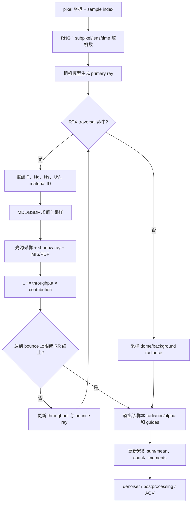
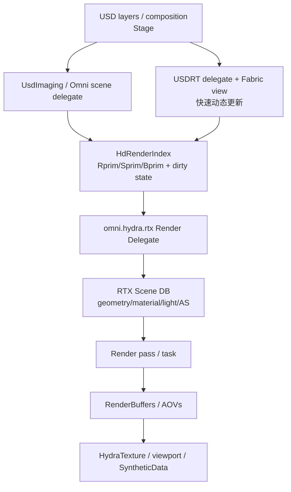
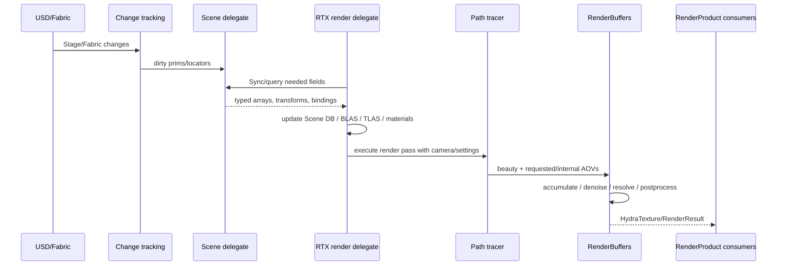
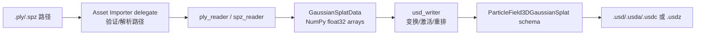
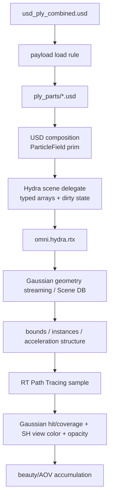

# Keypoints 02：RTX Interactive 单 SPP、Hydra 渲染框架与 3DGS PLY→外部 USD 组合链路

> 编写日期：2026-07-22  
> 远端验证环境：Isaac Sim `6.0.1-rc.7`，OpenUSD `25.11`，`omni.hydra.rtx 1.0.4`，`omni.kit.converter.gsplat 0.1.14`  
> 对应工程：远端 `260714_01semantic_worldModule` 及其 `0717_builderx_model` 资产  
> 本文是 [`keypoints01.md`](./keypoints01.md) 的进一步下钻：不再只讲“有哪些组件”，而是追踪一次 Path Tracing 样本和一个 Gaussian Splat 资产究竟携带哪些数据、由谁生产、由谁消费。

---

## 0. 先给出六个最重要的结论

1. **单次 1 SPP 不是“一条光线”**。它是每个活跃像素的一次 Monte Carlo 相机样本；一条样本路径可以产生主射线、多个反弹射线、直接光照的阴影射线、透明度/体积测试等，因此实际 ray 数是可变的。
2. **决定原始 beauty estimator 的主要数据**是相机样本、ray、hit、材质/BSDF、光源样本、PDF、路径吞吐量、累计辐亮度和样本计数。法线、反照率、深度、motion、variance 等在开启降噪、时序重投影、adaptive sampling 或数据标注后同样重要，但它们是 guide/AOV，而不是原始辐亮度积分本身。
3. **Hydra 不负责求解渲染方程**。Hydra 是场景到渲染器的协议与调度层：把 USD/Fabric 中的几何、变换、材质、相机、灯光、RenderSettings 和脏状态组织成 RTX Render Delegate 可高效消费的数据。
4. **当前远端不是抽象的“纯 Hydra 2.0 管线”**。安装包仍明确使用 `HdSceneDelegate`/`HdRenderIndex` 风格接口，同时用 `omni.hydra.usdrt_delegate` 和 Fabric 加速更新；讲工程链路时不能把最新 Hydra 2.0 文档直接当作本机实现细节。
5. **3DGS PLY 与普通 mesh PLY 只是扩展名相同，数据模型完全不同**。本资产的每个 Gaussian 有位置、log-scale、四元数、opacity logit 和 3 阶球谐系数；它没有 mesh face。导入时必须选择 Gaussian Splat importer。
6. **PLY 转换出来的 `point_cloud.usd` 本身是自包含的，不会继续引用 PLY**。当前总装文件 `usd_ply_combined.usd` 再用外部 USD 组合弧装入各部件；经远端逐层检查，这些弧准确地说是 **payload**，不是 reference。本文后半部分会严格区分二者。

本文采用以下证据标记：

| 标记 | 含义 |
|---|---|
| **已验证** | 直接读取远端配置、Python 源码、USD prim stack、schema 或数组统计得到 |
| **接口确定** | OpenUSD/NVIDIA 公开接口明确规定，但底层实现可能变化 |
| **工程推断** | 从公开算法、插件接口和二进制诊断字符串可以可靠推断职责，但 NVIDIA 未发布具体 CUDA/HLSL/C++ 实现 |

---

# 第一部分：RTX Interactive (Path Tracing) 的单次 SPP

## 1. “单次 SPP”究竟指什么

`SPP = Samples Per Pixel`。在 RTX Interactive `(Path Tracing)` 中，1 SPP 表示：

```text
对当前需要渲染的每个像素 p：
    生成一个随机化相机样本 ξ
    追踪由该样本引出的完整或截断光传输路径
    得到一次随机辐亮度估计 C(p, ξ)
    把 C 加进像素累积器
```

若分辨率是 `W × H`，一次全屏 1 SPP 名义上产生 `W × H` 个像素样本。当前项目分辨率是 `1280 × 720`，所以是：

```text
1280 × 720 = 921,600 个像素样本
```

但它绝不是固定 921,600 条 ray。某个像素可能：

- 首条 ray 直接打到环境，路径立即结束；
- 命中漫反射表面，进行一次 next-event estimation，再反弹数次；
- 穿过透明 cutout，继续追踪；
- 进入体积，产生自由程采样；
- 被 Russian roulette 提前终止；
- 为多个候选灯光产生额外可见性/阴影 ray。

因此可用下面的关系理解：

```text
SPP 数 = 像素 Monte Carlo 样本数
ray 数 = 所有样本真实执行的主 ray、bounce ray、shadow ray、volume ray…之和
ray 数通常远大于 SPP × 像素数，而且随场景与材质变化
```

NVIDIA 的 [RTX Path Tracing 文档](https://docs.omniverse.nvidia.com/materials-and-rendering/latest/rtx-renderer_pt.html) 将 `Samples Per Pixel Per Frame` 定义为每个渲染帧对每个像素执行的样本数；`Total Samples Per Pixel` 是静止视图累积的上限。两者不能混为一谈。

### 1.1 当前项目中的 8、8、64

远端实际 profile `configs/render_pathtracing_720p_64spp.json` 配置为：

```json
{
  "renderer": "PathTracing",
  "launch": {
    "samples_per_pixel_per_frame": 8,
    "denoiser": true
  },
  "capture": {
    "rt_subframes": 8,
    "warmup_updates": 16
  },
  "settings": {
    "/rtx/pathtracing/spp": 8,
    "/rtx/pathtracing/totalSpp": 64,
    "/rtx/pathtracing/adaptiveSampling/enabled": false
  }
}
```

在场景、相机和时间都不变，并且累积没有被意外 reset 的前提下，工程用：

```text
8 SPP / render subframe × 8 rt_subframes = 名义 64 SPP
```

`semantic_capture_custom.py` 调用：

```python
rep.orchestrator.step(
    rt_subframes=self._rt_subframes,
    delta_time=0.0,
    pause_timeline=False,
)
```

`delta_time=0.0` 的目的是在多个渲染子帧之间不推进仿真时间。Replicator 的 [RT subframes 说明](https://docs.omniverse.nvidia.com/extensions/latest/ext_replicator/subframes_examples.html) 也强调了它用于让渲染在静态时刻继续更新和累积。

> 这里的 64 是计划样本预算，不是数学上自动保证的“64 个独立有效样本”。相机/Stage 更新、累积重置、adaptive sampling、`totalSpp`、插件调度和错误都会影响实得结果。当前 profile 关闭 adaptive sampling，并用 `totalSpp=64` 限制累积，使名义值较容易审计。

---

## 2. 在执行 1 SPP 之前，Renderer 已经准备了什么

单 SPP 不是从 USD 文本开始临时解析。大量数据会先由 USD/Hydra/RTX Scene DB 转译、上传和缓存。

| 数据组 | 代表字段及逻辑类型 | 主要来源 | 主要消费者 | 分类 |
|---|---|---|---|---|
| 相机 | view/projection `Matrix4d`，viewport `Vec4d`，分辨率 `int2`，焦距/aperture/clipping `float` | USD Camera、RenderProduct | ray generation | 主要输入 |
| Mesh 顶点 | positions/normals/tangents/UV，多为 `float3/float2` 数组；indices 常为 `uint32/int32` | USDGeom Mesh/primvars | RTX geometry/BLAS | 主要输入 |
| 实例与变换 | world/local transform `Matrix4d`；RTX 内部可转为 position `double3`、quaternion `float4`、scale `float3` | Xform、instancing、Fabric | TLAS、命中重建 | 主要输入 |
| Gaussian 字段 | positions/scales `float3[]`，orientations `quatf[]`，opacities `float[]`，SH `float3[]` | ParticleField3DGaussianSplat | Gaussian geometry/着色 | 主要输入 |
| 材质 | MDL graph、纹理句柄、标量/向量参数 | USD Shade/MDL | material translation、BSDF | 主要输入 |
| 灯光 | position/direction/color/intensity、shape、环境纹理和 sampling table | USD Lux/RTX lights | light sampler、NEE | 主要输入 |
| 加速结构 | BLAS/TLAS、instance mask、geometry handle | RTX Scene DB/光追插件 | ray traversal | 主要输入，物理布局私有 |
| Render 设置 | max bounces、Spp、fractional cutout、denoiser、AOV 开关 | Carb settings/RenderSettings | path tracer/task graph | 控制数据 |
| RenderProduct/Vars | camera rel、resolution `int2`、orderedVars、AOV token/dataType | USD Render schema/Replicator | Hydra render pass、输出分配 | 输出合同 |

这些数组往往跨很多帧常驻 GPU。只有被标记为 dirty 的几何、变换、材质、可见性等才重新同步。否则每个 1 SPP 都重新从 USD 拷贝百万顶点或 42 万 Gaussian，性能会完全不可接受。

### 2.1 “数据类型”有三个层次，不能混写

本文表格里的类型首先是**逻辑/API 类型**。工程中还存在另外两个层次：

```text
USD authored type
    例如 point3f[]、quatf[]、color3f[]、int2
        ↓ Hydra / delegate 转译
CPU/API type
    例如 VtVec3fArray、NumPy float32、Hd buffer descriptor
        ↓ RTX 上传/压缩/重排
GPU physical format
    例如具体 texture format、AoS/SoA、FP16/FP32、alignment、寄存器布局
```

前两层可以从 schema 和源码验证。第三层大多属于 NVIDIA 原生插件实现，当前安装包没有公开对应 shader/CUDA 源码。因此：

- `RenderVar.dataType = color3f` 是 USD 输出声明，**不等于**可断言 framebuffer 一定以三个 FP32 分量存储；
- NumPy annotator 输出为 `uint8/float32/uint32`，**不等于**上游 GPU AOV 使用完全相同格式；
- ray payload/throughput 的逻辑语义可以确定，但其寄存器位宽和结构体 padding 不应凭空杜撰。

---

## 3. 一个像素的一次样本如何流动

下面是传统 path tracing 与远端接口共同支持的工程级抽象。虚线框内细节由 RTX 原生插件实现，伪代码不是 NVIDIA 源码逐行翻译。



典型估计器可以抽象为：

```text
L_pixel^(N) = (1/N) Σ C(pixel, ξ_i)
```

其中一次路径在第 `k` 个表面的更新大致是：

```text
L ← L + β × L_direct
β ← β × f_s(ω_i, ω_o) × |n·ω_o| / p(ω_o)
```

- `L`：到目前为止的累计辐亮度，通常按 RGB 三分量理解；
- `β`：path throughput，记录从相机到当前顶点的乘积权重；
- `f_s`：BSDF/相函数值；
- `p`：所采方向的概率密度；
- `L_direct`：灯光采样、可见性和 MIS 后的直接光贡献。

正是因为分母有 PDF，随机数、采样策略、BSDF 值、light PDF 不是“可有可无的调试值”，而是正确 Monte Carlo 估计的主要计算支持数据。

---

## 4. 单 SPP 期间到底计算哪些数据

### 4.1 A 类：样本身份与随机数

| 字段 | 逻辑类型 | 是否主要 | 后续作用 | 典型调用模块 |
|---|---|---:|---|---|
| pixel coordinate | `uint2`/`int2` | 是 | 决定读写哪个像素、构造 NDC | ray generation、accumulation |
| sample index | `uint32` 或等价整数 | 是 | RNG 序列、累积权重 | path tracer、adaptive sampling |
| frame/subframe index | `uint32` | 是 | 区分时序样本、重投影历史 | renderer task、denoiser |
| subpixel jitter | `float2` | 是 | 抗锯齿、像素面积采样 | camera ray generation |
| lens sample | `float2` | 条件主要 | 景深 aperture 采样；针孔相机时可忽略 | camera model |
| time sample | `float` | 条件主要 | motion blur/shutter 采样 | camera/transform sampling |
| RNG state/seed | `uint32`、`uint2` 或 64-bit 等价状态 | 是 | 产生 BSDF、light、RR 等随机量 | path tracer 原生内核 |

“主要”在此指对本次辐亮度随机变量有决定作用，不代表它必须作为 AOV 输出。

### 4.2 B 类：ray 和路径状态

| 字段 | 逻辑类型 | 是否主要 | 后续作用 | 消费者 |
|---|---|---:|---|---|
| ray origin `o` | `float3` | 是 | 光追查询起点 | RTX traversal |
| ray direction `d` | `float3` | 是 | 光追查询方向 | RTX traversal |
| `tMin/tMax` | `float` | 是 | 限定有效求交区间，避免 self-hit | RTX traversal |
| ray flags/mask/type | packed `uint`/bit flags | 是 | 区分 radiance/shadow、实例 mask、材质行为 | raytracing plugin |
| bounce/depth | `uint` 或 packed bits | 是 | 与 `maxBounces` 等上限比较 | path tracer |
| throughput `β` | `float3` 逻辑值 | 是 | 给后续所有光贡献加权 | shading/path continuation |
| accumulated radiance `L` | `float3` 逻辑值 | 是 | 保存当前样本的 beauty 估计 | accumulation |
| previous PDF/specular flag | `float` + flag | 是 | emissive hit、MIS、delta lobe 判断 | material/light integrator |
| medium/volume state | handle/ID + floats | 条件主要 | 体积自由程、吸收/散射 | volume integrator |

远端 Path Tracing 设置的 `maxBounces=4`，而 specular/transmission 可设到 6、volume 可设到 64。UI 源码还限制通用 light bounce bit count 为 6 bit，因此某些 bounce 参数最大是 63。这是设置/状态编码的约束，不表示每条路径都会走满。

### 4.3 C 类：求交结果和表面重建

| 字段 | 逻辑类型 | 是否主要 | 后续作用 | 消费者 |
|---|---|---:|---|---|
| hit distance `t` | `float` | 是 | 计算世界位置、深度、最近命中 | hit shader、Depth AOV |
| primitive/geometry ID | `uint32` | 是 | 找到三角形、Gaussian 或过程几何 | Scene DB/material lookup |
| instance ID | `uint32`/handle | 是 | 取实例变换、分割 ID | hit reconstruction、SyntheticData |
| material ID | `uint32`/handle | 是 | 调用对应 MDL/BSDF | material system |
| barycentrics | `float2` | Mesh 时是 | 插值位置、法线、UV、primvar | mesh hit shader |
| world position `P` | `float3` | 是 | 着色点、下一 ray 起点 | material/light、WorldPosition AOV |
| geometric normal `Ng` | `float3` | 是 | sidedness、offset、几何项 | integrator |
| shading normal `Ns` | `float3` | 是 | BSDF frame、denoiser guide | material、Normal AOV |
| tangent/bitangent | `float3 + float3` | 条件主要 | normal map、各向异性材质 | MDL |
| UV/primvars | `float2`/typed values | 条件主要 | 纹理、材质参数 | texture/MDL |
| front-face/inside flag | `bool`/bit | 条件主要 | 折射、法线翻转、介质边界 | BSDF/volume |

Gaussian Splat 没有三角形 barycentric。RTX 会从 ParticleField 数组构造 Gaussian 几何表示，并返回足以计算命中/覆盖和着色的内部结果；具体 intersection payload 未公开，不能把 mesh 的 barycentrics 强套给 Gaussian。

### 4.4 D 类：材质与直接光照采样

| 字段 | 逻辑类型 | 是否主要 | 后续作用 | 消费者 |
|---|---|---:|---|---|
| BSDF value `f` | `float3` | 是 | throughput 和直接光估计 | integrator |
| sampled direction | `float3` | 是 | 下一 bounce ray | ray generation |
| BSDF PDF | `float` | 是 | 无偏权重/MIS | integrator |
| event/lobe flags | bit flags | 是 | diffuse/glossy/specular/transmission 分支 | MDL/integrator |
| emitted radiance | `float3` | 是 | emissive hit 贡献 | integrator |
| light index | `uint32` | 是 | 查找被抽中的灯/mesh light | light sampler |
| light direction/distance | `float3 + float` | 是 | 几何项和 shadow ray | NEE |
| light radiance | `float3` | 是 | 直接光贡献 | integrator |
| light PDF | `float` | 是 | 采样权重/MIS | integrator |
| visibility | `bool` 或 transmittance `float/float3` | 是 | 遮挡、透明/体积衰减 | shadow traversal |
| MIS weight | `float` | 是 | 组合 light/BSDF sampling | integrator |
| RR probability/decision | `float + bool` | 条件主要 | 高 bounce 无偏终止 | integrator |

RTX PT UI 中存在 mesh light sampling、many-light sampling、fractional cutout opacity 等开关。尤其 fractional cutout 会把部分透明度当作随机“存在/不存在”采样，因此单样本命中结果也可能随随机数变化；累积后才逼近期望值。

### 4.5 E 类：每像素累积器——真正跨 SPP 保留的数据

| 字段 | 逻辑类型 | 是否主要 | 后续作用 | 消费者 |
|---|---|---:|---|---|
| noisy HDR radiance sum/mean | `float3/float4` 逻辑值 | 是 | 形成 raw path-traced beauty | accumulation、denoiser |
| sample count/weight | integer/float | 是 | 计算均值，判断 `totalSpp` | accumulation/task |
| alpha/coverage | `float` | 通常是 | 合成、背景、cutout | postprocessing |
| first/second moment | `float`/`float2` 或等价统计 | adaptive 时重要 | 方差/噪声估计 | adaptive sampling、denoiser |
| convergence/noise state | float/flags | adaptive 时重要 | 决定某像素是否继续采样 | adaptive scheduler |

若时间、相机、分辨率、影响可见结果的 Stage 属性或关键设置改变，累积历史必须 reset。远端设置 `/rtx/pathtracing/resetOnTimeChange/enabled=true` 正是为避免把不同时间的样本混在同一均值里。

### 4.6 F 类：辅助 guide 和 AOV

| 数据 | 已知对外逻辑/NumPy 类型 | 对 raw radiance 是否主要 | 接下来的作用 | 典型消费者 |
|---|---|---:|---|---|
| diffuse albedo | SyntheticData 为 `uint8[H,W,4]` | 否 | 去除纹理影响、降噪引导 | OptiX denoiser、annotator |
| world/view normal | 对外 `float32[H,W,3/4]` | 否 | 边缘保持、几何不连续性 | denoiser、normal annotator |
| depth/distance | `float32[H,W]` | 否 | 重投影/遮挡、深度标注 | temporal、depth annotator |
| motion vector | `float32[H,W,4]` | 否 | 历史重投影、时序过滤 | temporal denoiser/DLSS |
| world position | `float32[H,W,4]` | 否 | 3D 重建、调试 | SyntheticData |
| luminance/variance | float AOV/内部统计 | 否 | 噪声判断、adaptive sampling | renderer |
| direct/global illumination | color AOV | 否 | 光照分解、调试/合成 | RTX AOV consumers |
| reflection/refraction/filter | color AOV | 否 | 路径分量分解 | RTX AOV consumers |
| semantic/instance ID | `uint32[H,W]` | 否 | 数据集标签 | SyntheticData/Replicator |
| LPE/multimatte | color/ID AOV | 否 | 特定光路/对象遮罩 | compositing/debug |

这里的“否”只表示它不进入未经降噪的 Monte Carlo beauty 定义。开启 OptiX temporal denoiser 后，normal/albedo/depth/motion 可能成为最终显示结果的必需输入；请求训练标签后，semantic ID 对数据集当然是主要输出。主次取决于你讨论的是“物理积分”还是“最终产品”。

远端 `pt_widgets.py` 可见的 Path Tracing AOV 包括 noisy/denoised、background、diffuse filter、direct illumination、global illumination、motion、reflections/refractions、subsurface、self illumination、volumes、world/view normal、world position、z-depth、luminance/illuminance、LPE 与 multimatte。官方 [RTX Common AOV 文档](https://docs.omniverse.nvidia.com/materials-and-rendering/latest/rtx-renderer_common.html) 也给出这些 AOV 的用途。

---

## 5. 主要数据和次要数据的更严格判据

为了避免“RGB 就主要、其他都次要”这种过度简化，可按下列四类判断：

| 级别 | 判据 | 例子 |
|---|---|---|
| P0：场景主输入 | 没有它就无法定义当前相机下的光传输问题 | 几何、相机、材质、灯光、变换 |
| P1：估计器主状态 | 没有它就无法正确计算当前随机样本 | ray、hit、throughput、BSDF、PDF、RNG、radiance |
| P2：积累与质量控制 | 不改变单路径定义，但决定多样本如何组合/停止 | sum、count、moments、variance、convergence |
| S：辅助/派生输出 | 给降噪、时序、调试、合成或数据集使用 | albedo、normal、depth、motion、ID、LPE |

P2 和 S 并不表示“不重要”：

- `sample count` 错误会让曝光和均值错误；
- variance 错误会让 adaptive sampling 过早停止；
- motion/depth 错误会让 temporal denoiser 拖影；
- semantic ID 错误会直接破坏训练集；
- normal guide 错误可能把前景与背景抹在一起。

所以工程验收时应分别验收：

```text
raw radiance correctness
accumulation correctness
denoised/display correctness
annotation correctness
```

不能只看最后 PNG “好像挺干净”。

---

## 6. 单 SPP 数据由哪些 Isaac Sim/Kit 模块调用


### 6.1 场景同步层

- `omni.hydra.scene_delegate`：把 USD 场景适配成 Hydra 可查询数据。
- `omni.hydra.usdrt_delegate`：用 USDRT/Fabric rendering view 加速大量状态更新；接口含 `populate(stageId, FabricRenderingView*)`、`setTime`、`applyPendingUpdates`、`getFabricPrimsAdded` 等。
- 它们提供几何、primvar、transform、material、camera、light 和 dirty state，不执行 Monte Carlo 积分。

### 6.2 RTX Render Delegate 与原生插件

- `omni.hydra.rtx` 以 USD/Hydra Render Delegate 的形式暴露 RTX SceneRenderer。
- 远端扩展明确加载 `librtx.hydra.so`、`libcarb.scenerenderer-rtx.plugin.so`、`librtx.raytracing.plugin.so`、denoise、postprocessing、material database/translator、scene database 和 syntheticdata 等原生库。
- `librtx.raytracing.plugin.so` 负责 traversal/path integration 的核心原生计算；具体 GPU payload 结构不是 Python API。
- `librtx.optixdenoising.plugin.so` 等模块读取 noisy beauty 与 guides，输出 denoised AOV。
- postprocessing 将线性/HDR 结果做曝光、tone mapping 等，产生 `LdrColor`。

### 6.3 RenderProduct 与采集层

当前合成资产里的真实 RenderProduct 被检查为：

```text
/Render/...RenderProduct
├── resolution = int2(1280, 720)
├── dataWindowNDC = float4(0, 0, 1, 1)
├── camera -> /OmniverseKit_Persp
└── orderedVars -> /Render/Vars/LdrColor

/Render/Vars/LdrColor
├── dataType = token color3f
├── sourceName = string "LdrColor"
└── sourceType = token raw
```

工程运行时另建持久 `SemanticCapture` RenderProduct，并挂：

```python
rgb_annotator = rep.AnnotatorRegistry.get_annotator("rgb")
semantic_annotator = rep.AnnotatorRegistry.get_annotator(
    "semantic_segmentation",
    init_params={"colorize": False, "semanticFilter": "class:*"},
)
```

远端 `omni.syntheticdata/scripts/sensors.py` 明确给出常见 CPU 结果：

```text
RGB                 uint8  [H,W,4]
depth/distance      float32[H,W]
normals             float32[H,W,4]（API 常截取前三分量）
motion vectors      float32[H,W,4]
semantic/instance   uint32 [H,W]
```

`semantic_dataset_writer.py` 再把 runtime semantic `uint32` ID 映射成稳定 dataset ID，并在当前已有数据中以 `uint16` 保存 `.npy`，同时写彩色 PNG 和 metadata JSON。这是标签后处理，不是 Path Tracer 用 uint16 做求交。

### 6.4 当前项目实际没有请求什么

Writer 只挂了 `rgb` 和 `semantic_segmentation`。因此 world normal、depth、motion、direct illumination、reflection 等 AOV **不会因为本文列出了就自动落盘**。Renderer 为内部降噪准备的 guide 也不等于 Replicator 会把它们全部发布给 Writer。

若要新增数据产品，至少要同时检查：

1. 当前 renderer/mode 是否支持该 RenderVar；
2. Annotator 名称与 RenderVar 映射是否正确；
3. GPU→CPU 数据类型和 shape；
4. Writer 是否 attach 并保存；
5. `rt_subframes` 最后一个结果是否与 RGB 对齐。

---

## 7. 一个具体像素的“单 SPP 数据包”示例

以下是教学用逻辑结构，不是 NVIDIA 私有 C++ struct：

```cpp
struct LogicalPathSample {
    uint2 pixel;              // (x, y)
    uint32_t sampleIndex;
    RngState rng;             // 实际位宽由实现决定

    float3 rayOrigin;
    float3 rayDirection;
    float tMin, tMax;

    float3 throughput;        // β
    float3 radiance;          // L
    uint32_t bounce;
    uint32_t flags;

    // 最近一次命中
    float hitT;
    uint32_t geometryId;
    uint32_t instanceId;
    uint32_t materialId;
    float2 barycentrics;      // 仅适合 triangle hit

    // 重建后着色数据
    float3 position;
    float3 geometricNormal;
    float3 shadingNormal;
    float2 uv;

    // 当前散射/灯光样本
    float3 bsdf;
    float bsdfPdf;
    float3 lightRadiance;
    float lightPdf;
    float visibility;
};
```

样本结束后，不必把整个结构长期保留。通常只把需要跨样本/跨阶段的数据归约到逐像素缓冲：

```text
HDR accumulation
sample count / moments
albedo + normal + depth + motion guides
requested AOVs / IDs
```

这解释了为什么“计算过的数据”远多于“最终可导出的 AOV”：barycentrics、light PDF、RR decision 等是短生命周期寄存器/工作队列状态，通常不会作为 RenderVar 暴露。

---

# 第二部分：Hydra 在渲染链路里的职责

## 8. Hydra 是协议、场景适配和渲染调度框架

OpenUSD 对 Hydra 的定位可以概括为：场景前端通过 scene delegate/scene index 提供场景数据，render delegate 将统一表示翻译成具体渲染器资源，render pass/task 发起渲染。可参阅 [HdSceneDelegate API](https://openusd.org/dev/api/class_hd_scene_delegate.html)、[UsdImagingDelegate API](https://openusd.org/dev/api/class_usd_imaging_delegate.html) 和 [Hydra Getting Started](https://openusd.org/release/api/_page__hydra__getting__started__guide.html)。

在本机版本上，更准确的链路是：



Hydra 的核心价值是把“场景怎样存”和“渲染器怎样算”解耦：

- USD/Fabric 可以持续变化；
- RTX 不必理解每一种 USD authoring 细节；
- 同一个 Stage 可以交给不同 Render Delegate；
- 同一个 renderer 可以通过统一类别访问 mesh、camera、light、material、render buffer；
- 通过 dirty bits 只同步改动部分。

### 8.1 Hydra 不做的事情

Hydra 本身不负责：

- PhysX 刚体/关节求解；
- path tracing 的 BSDF 采样与辐亮度积分；
- OptiX 神经降噪的具体推理；
- PNG/NPY/JSON 编码；
- 把 3DGS PLY 解析成数组——那是 converter 的工作。

这些职责分别属于 physics、RTX renderer、denoiser、Replicator backend 和 gsplat converter。

---

## 9. Hydra 的对象模型：它组织哪些数据

经典 Hydra 将对象大致分为：

| 类别 | 含义 | 本工程示例 | RTX 侧准备结果 |
|---|---|---|---|
| Rprim | 可渲染场景 primitive | Mesh、points/particle field 等 | geometry buffer、instance、BLAS 输入 |
| Sprim | 不直接作为普通 drawable 的状态 prim | Camera、Material、Light | camera constants、material object、light records |
| Bprim | buffer/resource 类对象 | RenderBuffer、texture/resource | AOV attachment、GPU resource |
| Instancer | 实例化关系和 per-instance 数据 | 重复构件/实例 | instance transforms、TLAS records |
| RenderSettings/Product/Var | 渲染设置与输出合同 | `1280×720`、camera、`LdrColor` | render pass state、AOV allocation |
| Task/RenderPass | 调度一次或一组渲染工作 | viewport/capture pass | 发起 sync、execute、resolve |

在新 Hydra 2.0 术语中，scene index 链可过滤/组合场景。远端 OpenUSD 是 25.11，且 Omniverse 头文件仍实际暴露 `HdSceneDelegate`、`HdRenderIndex` 和 `getUsdSceneDelegate()`，所以本文以远端可验证接口为主，不假装它已完全切到未来版本接口。

### 9.1 Dirty bits：只搬发生变化的数据

Hydra change tracking 常见 dirty 类别包括：

```text
DirtyTransform
DirtyVisibility
DirtyPoints
DirtyNormals
DirtyPrimvar
DirtyTopology
DirtyMaterialId / DirtyResource
DirtyInstancer
DirtyRenderTag
```

官方 [HdChangeTracker](https://openusd.org/dev/api/class_hd_change_tracker.html) 说明了 dirty state 的作用。其工程效果是：

```text
机械臂某关节转动
    → 相关 Xform/instance transform dirty
    → delegate 提供新的矩阵
    → RTX 更新 TLAS/instance state
    → 未变化的顶点、纹理、SH 数组不必重传
```

若 mesh 点位变化，则 `DirtyPoints` 可能触发 vertex buffer 更新甚至 BLAS rebuild/refit；若只改相机，通常无需重建场景几何。

### 9.2 Fabric/USDRT 在远端的作用

`omni.hydra.usdrt_delegate` 的接口表明它可以：

- 用 `stageId` 与 `FabricRenderingView` populate；
- 设置时间和 sample index；
- `applyPendingUpdates(last, next)`；
- 读取 Fabric prim add/change；
- 控制是否从 Fabric 读取 transforms；
- 提供数组 content hash，减少相同数据的复制与重复更新。

这非常适合 Isaac Sim：物理每步可能改变大量刚体/关节变换，Fabric 是高速运行时数据层；最终仍通过 Hydra/RTX delegate 边界让 renderer 看见这些变化。

---

## 10. Hydra 在一次渲染帧里准备的数据

### 10.1 场景发现与 composition 结果

Hydra 的上游是已经 composition 完成的 USD Stage。它看到的是 payload/reference/variant/session layer 等组合后的 prim 视图，而不是只读当前 `.usd` 文件的一层文本。

准备内容包括：

- prim path、type、purpose、visibility、render tag；
- transform hierarchy 的结果；
- prototype/instance 关系；
- material binding；
- inherited primvars；
- active camera、lights；
- RenderSettings/RenderProduct/RenderVar 关系。

### 10.2 Geometry 与 primvar 同步

对 mesh，delegate 会按需提供：

```text
points / topology / normals / UV / color / custom primvars
subdivision/refine state
material ID
world transform
visibility
instancer ID
```

对 ParticleField3DGaussianSplat，则提供 schema 数组：

```text
positions / scales / orientations / opacities
sphericalHarmonics:degree
sphericalHarmonics:coefficients
extent
projectionModeHint / sortingModeHint（若 authored）
```

RTX Render Delegate 将这些逻辑数组翻译为原生 Scene DB/geometry streaming 数据和 acceleration structure 输入。

### 10.3 相机与 render-pass state

远端 `ISimpleEngine`/Hydra 接口能看到的相机/渲染状态包括：

```text
view matrix          Matrix4d
projection matrix    Matrix4d
viewport             Vec4d
render buffer size   Vec2i
frame/time           double
complexity           float
clear colors         Vec4f 等
AOV bindings         token + RenderBuffer
```

这些数据使 renderer 可以把像素坐标变成 camera ray，并把输出写到正确附件。

### 10.4 Buffer 描述与零/少复制更新

Omniverse Hydra 接口的 `BufferDesc` 含：

```cpp
void*    data;
uint32_t elementStride;
uint32_t elementSize;
size_t   count;
bool     isGPUBuffer;
bool     safeToRender;
```

这说明数据交换不局限于 Python list；可以描述 CPU/GPU buffer、元素布局和是否可安全渲染。对应接口还可直接设置 points、instance transforms/positions、world/local matrices，并用 content hash 判断数组是否改变。

### 10.5 输出资源

Hydra/Render Delegate 还需要为 RenderProduct 建立：

- RenderBuffer/AOV attachment；
- resolution/data window；
- color/depth/ID 等所需资源；
- framebuffer/texture 句柄；
- convergence/resolve 状态；
- HydraTexture 到 viewport/SyntheticData 的交接。

`omni.kit.renderer.core` 更靠近 Kit 的 framebuffer、swapchain、pre/post render frame/pass 与 graphics device 管理；它不是替代 Hydra 的 scene delegate，也不是 Path Tracer 本身。

---

## 11. Hydra 的 sync、render、resolve 时序

一次概念帧可分为：



`HdxRenderTask` 等任务对象负责把 render pass 和 task context 组织起来，见 [OpenUSD HdxRenderTask](https://openusd.org/dev/api/class_hdx_render_task.html)。实际 Omniverse RTX 还会插入其原生 task graph、denoise 和 postprocess；图中是稳定职责边界，而非声称每个插件只有一次函数调用。

### 11.1 `SimulationApp.update()` 与 Hydra

当前工程在：

- Stage 加载后多次 `update()` 等资源就绪；
- 物理运行时用 `update()` 推进 Kit/渲染状态；
- 创建持久 RenderProduct 后 warmup 16 次；
- 正式 capture 用 `orchestrator.step(rt_subframes=8)`。

warmup 的意义包括：

```text
完成 USD/Hydra population
编译/加载 MDL 与 shader
分配 RenderBuffers/HydraTexture
上传纹理、Gaussian/mesh geometry
建立或更新 AS
稳定 renderer history
```

它不是用来代替正式 64 SPP；warmup 期间是否保留到正式累积，取决于累积 reset 和 capture 时序。

---

## 12. Hydra、RTX、RenderProduct、Annotator 的职责边界表

| 问题 | 负责模块 | 不应归责给 |
|---|---|---|
| 哪些 prim 当前有效、payload 是否加载 | USD composition/load rules | Path Tracer |
| 哪些属性变脏、应重新同步 | USD notice/Fabric/Hydra tracking | Writer |
| 如何把 prim 数据交给 renderer | scene delegate / RenderIndex | PhysX |
| 如何把 Hydra prim 变成 RTX 原生资源 | `omni.hydra.rtx` render delegate | Replicator |
| ray 怎样求交、路径怎样积分 | RTX raytracing/path tracing plugin | Hydra protocol |
| noisy 图如何降噪、tone map | RTX denoise/postprocess | USD composition |
| 哪台相机、什么分辨率、要哪些 AOV | RenderProduct/RenderVars | BLAS |
| GPU RenderVar 如何成为 NumPy | SyntheticData annotator graph | gsplat converter |
| NumPy 怎样成为 PNG/NPY/JSON | Writer/Backend | Hydra delegate |

---

# 第三部分：3DGS PLY 导入、USD schema 与外部组合

## 13. 先辨认：这个 PLY 不是三角网格

远端源文件：

```text
/root/gpufree-data/0717_builderx_model/point_cloud.ply
```

已验证统计：

```text
format: binary_little_endian
vertex count: 426,315
properties: 62 个 float/vertex
file size: 约 101 MiB
```

属性组成：

| 属性 | 数量 | 源类型 | 含义 |
|---|---:|---|---|
| `x,y,z` | 3 | float32 | Gaussian center |
| `nx,ny,nz` | 3 | float32 | 训练工具常附带；该 converter 不用它写核心 Gaussian schema |
| `f_dc_0..2` | 3 | float32 | 0 阶 SH/DC 颜色 |
| `f_rest_0..44` | 45 | float32 | 其余 3 阶 SH 系数，按通道布局 |
| `opacity` | 1 | float32 | pre-sigmoid opacity logit |
| `scale_0..2` | 3 | float32 | log-scale，不是最终世界尺度 |
| `rot_0..3` | 4 | float32 | quaternion，PLY 约定为 `w,x,y,z` |

总计：

```text
3 + 3 + 3 + 45 + 1 + 3 + 4 = 62 floats
62 × 4 bytes × 426,315 = 105,726,120 bytes（仅 vertex payload）
```

同目录的 `combined/track_mesh.ply` 则有 vertex、RGBA、face、edge 等 Blender mesh PLY 字段。两者都叫 `.ply`，但一个表达椭球场，一个表达 polygon topology。

### 13.1 为什么导入器优先级是 -1

`omni.kit.converter.gsplat` 注册 `.ply/.spz` Asset Importer delegate 时 priority 为 `-1`。这是为了在普通 mesh PLY importer 同样匹配 `.ply` 时，不抢占默认行为。

因此 GUI 中应明确选择类似：

```text
3D Gaussian Splat (Particle Field)
```

若把 3DGS PLY 交给 mesh importer，可能报 topology 问题、只看见散点或完全失败；若把 mesh PLY 交给 gsplat importer，则缺失 `scale/rotation/opacity/SH`，即使 converter 用默认值兜底，也不会得到原 mesh 的面。

---

## 14. `omni.kit.converter.gsplat` 的完整模块链路

远端版本 `0.1.14` 的扩展描述是：

> Converts 3D Gaussian Splat (.ply/.spz) to USD using ParticleField3DGaussianSplat schema.

执行链：



### 14.1 文件解析

`ply_reader.py`：

1. 读取 header；
2. 识别 ASCII、binary little-endian 或 big-endian；
3. 根据 property name/type 建 NumPy structured dtype；
4. 把目标属性统一转为 `float32`；
5. 检查/补齐并生成 `GaussianSplatData`。

中间数据对象的已验证逻辑类型：

```python
positions:    np.ndarray  # shape (N, 3), float32
scales:       np.ndarray  # shape (N, 3), float32, log scale
rotations:    np.ndarray  # shape (N, 4), float32, wxyz, normalized
opacities:    np.ndarray  # shape (N,),   float32, pre-sigmoid
f_dc:         np.ndarray  # shape (N, 3), float32
f_rest:       np.ndarray  # shape (N, K), float32, optional
```

兼容处理包括：

- 缺 scale 时默认 log-scale 0；
- 缺 rotation 时默认单位四元数；
- 缺 opacity 时默认 logit 0；
- 对 quaternion 归一化；
- 如果 PLY 只有 RGB，用 `((rgb/255)-0.5)/C0` 转 SH DC，`C0≈0.28209479`；
- `f_rest_*` 按数值后缀排序，而不是字典序把 `10` 放在 `2` 前。

### 14.2 写 USD 前的数学变换

每个 Gaussian 的尺度和透明度需要激活：

```text
s = exp(scale_log)
α = sigmoid(opacity_logit) = 1 / (1 + exp(-opacity_logit))
```

旋转四元数 `q` 被归一化，椭球 3D covariance 可理解为：

```text
Σ = R(q) · diag(sx², sy², sz²) · R(q)ᵀ
```

`usd_writer.py` 还可应用用户指定 Euler rotation：它同时旋转 center positions 和 orientations，不能只转位置，否则椭球主轴会错。

颜色来自球谐函数：

```text
color(viewDirection) = Σ_lm SH_coefficient_lm × Y_lm(viewDirection)
```

0 阶预览色由：

```text
displayColor = clamp(0.5 + C0 × f_dc, 0, 1)
```

得到。`displayColor` 是兼容/预览 primvar，不等于完整 view-dependent 3 阶 SH 着色。

### 14.3 SH 数据重排

本 PLY 有 `45` 个 `f_rest`：

```text
每个颜色通道 15 个 rest 系数
+ 1 个 DC
= 16 coefficients/channel
= SH degree 3
```

PLY 常按 channel-major 存放，而 USD schema 的 coefficients 是 coefficient-major `float3[]`。writer 会重排为：

```text
[coef0.rgb, coef1.rgb, ... coef15.rgb] × N Gaussians
```

并设置：

```text
sphericalHarmonics:degree = 3
elementSize = 16
interpolation = vertex
```

支持关系为：

| SH degree | 每 Gaussian `float3` coefficient 数 | PLY `f_rest` 数 |
|---:|---:|---:|
| 0 | 1 | 0 |
| 1 | 4 | 9 |
| 2 | 9 | 24 |
| 3 | 16 | 45 |

---

## 15. 写成 `ParticleField3DGaussianSplat` USD 后有哪些数据

NVIDIA/OpenUSD 的 [ParticleField3DGaussianSplat schema](https://openusd.org/dev/user_guides/schemas/usdVol/ParticleField3DGaussianSplat.html) 用一组字段表达所有椭球。远端转换结果：

```text
/root/gpufree-data/0717_builderx_model/point_cloud.usd
default prim: /point_cloud
type: ParticleField3DGaussianSplat
```

实际数组检查：

| USD 属性 | USD 类型 | 数量 | 来源/变换 | 用途 |
|---|---|---:|---|---|
| `extent` | `float3[]` | 2 | positions 范围，writer 限制极端值 | bounds/culling |
| `positions` | `point3f[]` | 426,315 | PLY xyz | Gaussian center |
| `scales` | `float3[]` | 426,315 | `exp(scale_*)` | 椭球三轴标准差/尺度 |
| `orientations` | `quatf[]` | 426,315 | normalized rot wxyz | 椭球方向 |
| `opacities` | `float[]` | 426,315 | sigmoid(opacity) | 覆盖/密度/alpha |
| `sphericalHarmonics:degree` | `int` | 1 | 由字段数判断，值为 3 | SH 阶数 |
| `sphericalHarmonics:coefficients` | `float3[]` | 6,821,040 | `426,315 × 16` | view-dependent color |
| `displayColor` | `color3f[]` | 426,315 | DC 转换并 clamp | fallback/preview color |

schema 校验关键条件：

- positions/scales/orientations/opacities 数量相同；
- scales 为正；
- opacity 在 `[0,1]`；
- quaternion 近似单位长度；
- SH degree 在 `0..3`；
- degree 与 elementSize `1/4/9/16` 一致；
- coefficients 总量为 `N × elementSize`；
- `extent` 存在且合理。

NVIDIA 的 [Gaussian Splat geometry requirements](https://docs.omniverse.nvidia.com/kit/docs/asset-requirements/latest/capabilities/geometry/requirements/usdgeom-particle-field-gaussian-splat.html) 也列出了这些核心数组约束。

### 15.1 为什么转完还是约 101 MiB

最大头是 SH：

```text
SH: 426,315 × 16 × float3 × 4 bytes ≈ 81.9 MB（十进制）
```

再加 positions、scales、orientations、opacities、displayColor，未计 USD/crate 元数据时就接近原 PLY payload。USD 不是魔法压缩器；它的价值在于 schema、composition、随机访问、生态和 renderer 直接消费，而不是必然缩小文件。

### 15.2 源 PLY 是否仍是 USD 依赖

不是。已验证 `point_cloud.usd`：

```text
references: 无
payloads:   无
```

layer comment 中虽然记录：

```text
Converted from PLY/SPZ ... Source file: .../point_cloud.ply
```

但 comment 只是溯源文字，不是 composition arc。删除/移动 PLY 后，已转换 USD 仍可独立提供数组；若要重新转换才需要 PLY。

`.usdz` 输出则由 converter 打包 `default.usda` 等内容，是另一种封装选择。

---

## 16. “被转换为外源引用 USD”在当前工程中的准确含义

当前资产实际分两步：

```text
第 1 步：每个 3DGS PLY → 自包含 ParticleField USD
第 2 步：总装 USD → 通过外部 payload 弧组合各个 ParticleField USD
```

总装层：

```text
/root/gpufree-data/0717_builderx_model/usd_ply_combined.usd
```

已验证的五条外部弧：

| 总装 prim | 外部资产 |
|---|---|
| `/root/Xform/small_arm_mesh/small_arm` | `./ply_parts/small_arm.usd` |
| `/root/Xform/bucket_mesh/bucket` | `./ply_parts/bucket_only_full_teeth.usd` |
| `/root/Xform/track_mesh/track` | `./ply_parts/track.usd` |
| `/root/Xform/operator_cab_mesh/operator_cab` | `./ply_parts/operator_cab.usd` |
| `/root/Xform/boom_mesh/boom` | `./ply_parts/boom.usd` |

对这些 prim 读取 prim stack，可以同时看到：

```text
强层：usd_ply_combined.usd 中的装配 prim/override
弱层：对应 ply_parts/*.usd 中的 ParticleField3DGaussianSplat 定义
```

### 16.1 Payload 与 Reference 的区别

二者都属于外部 layer composition arc，所以口语都可能叫“外部引用”；但 USD 语义不同：

| 对比 | payload | reference |
|---|---|---|
| 是否属于 composition arc | 是 | 是 |
| 能否用 load rules 暂不加载 | **能** | 通常随 active prim 直接 composition |
| 适合 | 重资产、按需加载、场景装配 | 常规不可卸载组件复用 |
| 当前 `usd_ply_combined.usd` | **实际使用** | 未发现 |

因此最准确的表述是：

> 3DGS PLY 先烘焙为自包含 ParticleField USD；总装 USD 再通过相对路径的 external payload 组合这些部件。

### 16.2 为什么要分成 payload 资产

42 万 Gaussian 的数组很重。拆分后可以：

- 总装层只写摆放变换、层级、语义覆盖和其他强意见；
- 多个场景复用同一部件 USD，不复制数千万 SH 浮点数；
- 用 payload load rules 延迟/选择性加载；
- 单独重新转换某个部件；
- 用相对路径一起搬运资产目录。

### 16.3 相对路径如何解析

例如：

```usda
def ParticleField3DGaussianSplat "track" (
    prepend payload = @./ply_parts/track.usd@
)
```

`./ply_parts/track.usd` 相对于**声明这条 payload 的 layer 所在目录**解析，不相对于 Python 当前工作目录，也不相对于启动脚本目录。

若只移动 `usd_ply_combined.usd` 而不带 `ply_parts/`，payload 会 unresolved；总装 prim 可能仍存在，但核心 positions/SH 数组消失。发布资产时必须保留相对目录结构，或用 USD/Omniverse 的 collect/package 流程重写依赖。

---

## 17. 从外部 payload 到 RTX 单 SPP 的消费链



远端原生库可见的诊断/设置 token 进一步确认 RTX 路径：

```text
/rtx/geometry/gaussian/enabled
/rtx/raytracing/gaussian/maxIntersections
/rtx/raytracing/gaussian/selfShadowDistance
/rtx/rtpt/gaussian/skipTonemapping/enabled
sortingModeHint
sphericalHarmonics:degree / coefficients
Gaussian geometry requires geometry streaming to be enabled
```

这足以确认 native renderer 会：

1. 校验/接收 Gaussian arrays；
2. 通过 geometry streaming 建立 RTX 可消费的 Gaussian geometry；
3. gather instances 并参与 raytracing；
4. 使用 opacity、orientation、scale 和 SH；
5. 为 RTPT 输出/后处理 Gaussian 结果。

但不应越界声称：

- 具体用哪种 BVH primitive encoding；
- 一次 intersection 的 exact payload struct；
- 是否在某版本中严格执行某篇论文的 tile sort、ray marching 或 analytic integral；
- 中间 buffer 一定是 FP16 还是 FP32。

这些实现没有随 Python 扩展公开。可验证的是 schema、设置、错误检查、模块边界和最终行为。

### 17.1 一个 Gaussian 如何贡献到像素

工程层可以用下列数据流理解：

```text
center μ + scale s + quaternion q
    → 3D anisotropic ellipsoid/covariance

camera/view direction + SH coefficients
    → view-dependent RGB

opacity α + intersection/coverage/order
    → 当前 ray/pixel 的透射与颜色贡献

many Gaussians
    → 按 renderer 的 ray-hit/coverage 规则合成
    → path-traced/RTPT AOV
```

schema 还提供 `projectionModeHint` 和 `sortingModeHint`。远端 backport schema 中 sorting 可见 `zDepth`、`cameraDistance`、`rayHitDistance` 等 token；它们是对 renderer 的 hint，不保证所有 Render Delegate 实现相同算法。

### 17.2 Gaussian 与普通 MDL mesh 的区别

| 阶段 | Mesh | 3D Gaussian Splat |
|---|---|---|
| 几何基本元 | triangle/subdivision surface | anisotropic Gaussian field element |
| shape 数据 | points + topology | center + scale + orientation |
| 表面属性 | normals/UV/material | opacity + SH color，可能有 fallback material |
| 命中重建 | barycentrics 插值 | Gaussian 专用覆盖/命中内部数据 |
| 透明/叠加 | material opacity/BSDF | 每 Gaussian opacity 与多元素合成 |
| 相机方向颜色 | 通常由 MDL/纹理/光照 | SH 显式编码 view dependence |

远端库存在 default ParticleField Gaussian material fallback。它不意味着 3DGS 自动获得与 PBR mesh 完全相同的物理材质；其外观核心仍是 Gaussian opacity 和 SH field 数据。

---

## 18. 3DGS 数据在 Hydra dirty-update 中怎样变化

### 情况 A：只移动整个部件

```text
总装 Xform 改变
    → DirtyTransform
    → 更新 instance/world matrix、TLAS
    → 426,315 个 positions/scales/SH 不必重写
```

这是挖掘机构件运动最希望得到的路径。

### 情况 B：修改某些 Gaussian positions/scales

```text
ParticleField arrays 改变
    → DirtyPoints/primvar/resource 等相应 dirty state
    → delegate 重新提供数组/content hash
    → geometry streaming buffer 更新
    → bounds/AS 可能 refit 或 rebuild
```

### 情况 C：payload unload

```text
load rules 排除该 payload
    → composed ParticleField data 消失
    → Hydra 移除对应 render prim/resources
    → RTX 释放/延迟释放 geometry 与 AS 数据
```

### 情况 D：只改总装层语义标签

```text
stronger assembly opinion 修改 semantic API/attribute
    → SyntheticData 所需 semantic state 更新
    → Gaussian 几何数组本身不一定改变
```

这正是 USD 分层组合的价值：几何大数组、装配变换、语义 metadata 可以由不同 layer 管理，又在 composed Stage 上统一被 Hydra 消费。

---

## 19. 从源文件到数据集的一条完整链路

```mermaid
flowchart LR
    PLY["3DGS training PLY<br/>62 float/vertex"]
    CONV["omni.kit.converter.gsplat"]
    PART["ply_parts/*.usd<br/>ParticleField schema arrays"]
    ASM["usd_ply_combined.usd<br/>external payloads + Xforms"]
    STAGE["composed USD Stage"]
    HYDRA["Hydra/Fabric sync"]
    RTX["RTX PT<br/>1 SPP × subframes"]
    RV["LdrColor + semantic RenderVars"]
    ANN["SyntheticData annotators"]
    WR["SemanticDatasetWriter"]
    DISK["PNG + NPY + JSON"]

    PLY --> CONV --> PART --> ASM --> STAGE --> HYDRA --> RTX --> RV --> ANN --> WR --> DISK
```



逐段数据形态：

| 边界 | 数据形态 |
|---|---|
| PLY→converter | structured binary records，62×float32/Gaussian |
| reader→writer | NumPy `float32` arrays |
| writer→USD | `point3f[]/float3[]/quatf[]/float[]` + schema metadata |
| payload→Stage | composed prim opinions；数组仍驻留在外部 layer |
| Stage→Hydra | typed scene data、relations、dirty states |
| Hydra→RTX | geometry/material/light/camera native resources |
| RTX sample→AOV | GPU beauty/guides/IDs/accumulation |
| AOV→annotator | CPU `uint8/uint32/float32` arrays + info dict |
| Writer→disk | RGB PNG、semantic NPY/PNG、metadata JSON |

---

# 第四部分：工程排错与验证

## 20. 单 SPP/64 SPP 采集检查清单

### 设置层

- renderer 必须是 `PathTracing`，不是 `RealTimePathTracing`；
- `/rtx/pathtracing/spp=8` 与 profile launch 值一致；
- `/rtx/pathtracing/totalSpp=64`；
- adaptive sampling 是否按实验计划开关；
- denoiser、bounce、cutout、motion blur 被写入 run manifest；
- 记录 Isaac Sim/Kit/RTX 版本，而不只记录 Python 版本。

### 时序层

- RenderProduct 只创建一次并保持 updates enabled；
- Stage/材质/Gaussian geometry 已 warmup 完成；
- 正式 8 subframes 中 `delta_time=0.0`；
- 相机、Timeline、关节姿态在 subframes 内不变；
- 正式样本开始前没有非预期 reset；
- capture 后等待 orchestrator/backend 完成。

### 输出层

- RGB 实测 `dtype=uint8`、shape 为 `H×W×3/4`；
- semantic runtime ID 实测 `uint32 H×W`；
- remap 后 ID 不溢出目标 `uint16`；
- RGB/semantic 文件编号与 metadata frame 一致；
- 不把 denoised 64 SPP 当作未经验证的 ground truth。

---

## 21. Hydra/外部 USD 组合检查清单

### Stage composition

- payload 路径是否相对于声明 layer 正确解析；
- payload load state 是否为 loaded；
- composed prim type 是否为 `ParticleField3DGaussianSplat`；
- prim stack 是否同时包含 assembly layer 与 external part layer；
- 不要只检查 `prim.HasAuthoredReferences()`，当前资产实际应检查 payload。

可在 Isaac Sim Python 中使用：

```python
from pxr import Usd

stage = Usd.Stage.Open("/root/gpufree-data/0717_builderx_model/usd_ply_combined.usd")
prim = stage.GetPrimAtPath("/root/Xform/track_mesh/track")

print("valid:", prim.IsValid())
print("type:", prim.GetTypeName())
print("loaded:", prim.IsLoaded())
print("payloads:", prim.GetMetadata("payload"))
for spec in prim.GetPrimStack():
    print(spec.layer.identifier, spec.path)
```

### ParticleField arrays

```python
from pxr import Usd

stage = Usd.Stage.Open("/root/gpufree-data/0717_builderx_model/point_cloud.usd")
prim = stage.GetDefaultPrim()

for name in (
    "positions",
    "scales",
    "orientations",
    "opacities",
    "sphericalHarmonics:coefficients",
):
    attr = prim.GetAttribute(name)
    value = attr.Get()
    print(name, attr.GetTypeName(), len(value) if value is not None else None)

print("degree", prim.GetAttribute("sphericalHarmonics:degree").Get())
```

如果 positions 是 `N`，degree 3 的 coefficients 必须是 `16N`；当前实际值为：

```text
N = 426,315
16N = 6,821,040
```

### Renderer ingestion

- `/rtx/geometry/gaussian/enabled`；
- geometry streaming 已启用；
- console 中没有 array count mismatch、invalid quaternion/scale/opacity、missing SH 等错误；
- bounds 合理，没有被极端 outlier 撑到看不见；
- 相机 clipping range 和单位 `metersPerUnit=1` 合理；
- payload loaded 但不可见时，继续检查 visibility、purpose、transform 和 camera。

---

## 22. 常见误解与修正

| 误解 | 正确理解 |
|---|---|
| 1 SPP 就是每像素 1 条 ray | 1 SPP 是每像素一个路径样本，ray 数随 bounce/NEE/透明/体积变化 |
| 只有 RGB 是主要数据 | estimator 还依赖 ray、hit、throughput、BSDF、PDF、RNG、light sample；RGB 是归约输出 |
| 有 denoiser 就不需要 SPP | denoiser 用 guide 猜测/重建低噪图，不会自动让原始 estimator 收敛 |
| Hydra 负责路径追踪 | Hydra 同步/组织场景和渲染任务，RTX Render Delegate/插件执行积分 |
| RenderVar 的 `color3f` 就是 GPU 必为 RGB32F | 它是 USD 逻辑声明，物理 GPU format 属于实现细节 |
| `.ply` 都能用同一个 importer | mesh PLY 与 3DGS PLY schema 完全不同 |
| `scale_*` 可直接写 USD scales | 3DGS PLY 存 log-scale，需 `exp` |
| `opacity` 可直接写 `[0,1]` | 本 PLY 存 logit，需 sigmoid |
| USD 在运行时继续读原 PLY | converter 把数组烘焙到自包含 USD，comment 不是依赖 |
| 当前总装使用 reference | 实查为 external payload；它可受 load rules 控制 |
| Gaussian 一定按原始 3DGS rasterizer 实现 | RTX 接收同类数据，但 native intersection/compositing 细节不能从 Python 包武断推定 |

---

## 23. 对当前工程最有价值的进一步增强

1. **在 `run_config.json` 固化完整版本**：Isaac Sim、Kit build、OpenUSD、`omni.hydra.rtx`、gsplat converter、GPU/driver。
2. **记录实际累积状态**：除 nominal `spp×subframes` 外，若 API 可用，记录 renderer convergence/实际 sample count 和每次 reset 原因。
3. **保留 raw/noisy 与 denoised 对照**：评估 64 SPP 时分清 Monte Carlo 噪声和 denoiser bias/ghosting。
4. **增加 depth/normal/motion 的小规模诊断采集**：不是每次都落盘，而是在 A/B 验证中确认边缘、运动和 Gaussian 与 mesh 对齐。
5. **资产 manifest 记录 payload 依赖及哈希**：总装 layer、各 `ply_parts/*.usd`、源 PLY 的 size/hash/converter options。
6. **为 mesh PLY 与 gsplat PLY 加 schema preflight**：检测 face 元素与 `scale_*/rot_*/opacity/f_dc_*`，防止选错 importer。
7. **验证 Gaussian 部件只改 Xform 时没有重传大数组**：用 renderer/Hydra timing 或 diagnostics 观察 geometry streaming/AS 更新成本。
8. **发布时做依赖收集测试**：复制到空目录或新机器，确保相对 payload 全部 resolve，而不是依赖原远端绝对路径。

---

# 结论

RTX Interactive Path Tracing 的一次 SPP 是一整套逐像素随机路径估计：Hydra/RTX 先准备相机、几何、Gaussian、材质、灯光和加速结构；path tracer 再为每个像素生成随机相机样本，计算 ray、hit、BSDF、light/PDF、throughput 与 radiance，并把结果归约到累积器。normal、albedo、depth、motion、variance 和 ID 等属于辅助/派生数据，但会被 denoiser、adaptive sampling、时序重建和 SyntheticData 调用，因此在最终系统中仍可能是关键数据。

Hydra 位于 USD/Fabric 与 RTX 之间，主要完成 composition 后场景的发现、typed data 查询、dirty tracking、资源同步、render-pass/AOV 组织。它决定 RTX “看见哪些数据以及哪些数据改变了”，但实际求交、路径积分、降噪和 tone mapping 分别由 RTX 原生模块完成。

当前 3DGS 资产链路则是：PLY 的 62 个 float/Gaussian 被 converter 解析成 NumPy 数组；log-scale、opacity logit、quaternion 和 SH 被激活/规范化/重排后写成自包含 `ParticleField3DGaussianSplat` USD；总装 `usd_ply_combined.usd` 再以相对 external **payload** 组合各部件。USD composition 后，Hydra 才把 ParticleField 数组同步给 RTX Gaussian geometry 路径，最终在单 SPP 的求交、覆盖、SH view color 和累积中产生像素贡献。

---

## 官方参考

- [NVIDIA RTX Renderer overview](https://docs.omniverse.nvidia.com/materials-and-rendering/latest/rtx-renderer.html)
- [NVIDIA RTX Interactive Path Tracing](https://docs.omniverse.nvidia.com/materials-and-rendering/latest/rtx-renderer_pt.html)
- [Isaac Sim Rendering Modes](https://docs.isaacsim.omniverse.nvidia.com/latest/reference_material/rendering_modes.html)
- [NVIDIA RTX common settings and AOVs](https://docs.omniverse.nvidia.com/materials-and-rendering/latest/rtx-renderer_common.html)
- [OpenUSD HdSceneDelegate](https://openusd.org/dev/api/class_hd_scene_delegate.html)
- [OpenUSD UsdImagingDelegate](https://openusd.org/dev/api/class_usd_imaging_delegate.html)
- [OpenUSD HdChangeTracker](https://openusd.org/dev/api/class_hd_change_tracker.html)
- [OpenUSD ParticleField3DGaussianSplat](https://openusd.org/dev/user_guides/schemas/usdVol/ParticleField3DGaussianSplat.html)
- [NVIDIA Gaussian Splat geometry requirements](https://docs.omniverse.nvidia.com/kit/docs/asset-requirements/latest/capabilities/geometry/requirements/usdgeom-particle-field-gaussian-splat.html)
- [NVIDIA `omni.usd.schema.usd_particle_field`](https://docs.omniverse.nvidia.com/kit/docs/omni.usd.schema.usd_particle_field/latest/index.html)

## 远端实现证据索引

以下路径用于说明本文所依据的实际版本和模块；它们是远端环境路径，不是公开 API 稳定承诺：

```text
/isaac-sim/VERSION
/isaac-sim/exts/isaacsim.simulation_app/isaacsim/simulation_app/simulation_app.py
/isaac-sim/extscache/omni.hydra.rtx-*/config/extension.toml
/isaac-sim/extscache/omni.hydra.usdrt_delegate-*/include/usdrt/hydra/ISceneDelegate.h
/isaac-sim/extscache/omni.kit.converter.gsplat-*/omni/kit/converter/gsplat/ply_reader.py
/isaac-sim/extscache/omni.kit.converter.gsplat-*/omni/kit/converter/gsplat/usd_writer.py
/isaac-sim/extscache/omni.syntheticdata-*/omni/syntheticdata/scripts/sensors.py
/root/gpufree-data/repositories/260714_01semantic_worldModule/configs/render_pathtracing_720p_64spp.json
/root/gpufree-data/repositories/260714_01semantic_worldModule/semantic_capture_custom.py
/root/gpufree-data/repositories/260714_01semantic_worldModule/semantic_dataset_writer.py
/root/gpufree-data/0717_builderx_model/point_cloud.ply
/root/gpufree-data/0717_builderx_model/point_cloud.usd
/root/gpufree-data/0717_builderx_model/usd_ply_combined.usd
```
