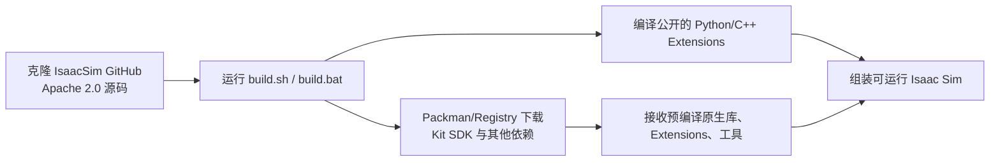

# Isaac Sim 是否全部开源：代码、运行时与许可证边界

> 整理日期：2026-07-22  
> 结论适用范围：Isaac Sim 5.0 之后公开的 GitHub 代码，以及当前 Isaac Sim 6.0/Omniverse 文档  
> 本文结合 NVIDIA 官方仓库、官方许可证、2026 年 Omniverse 政策变化，以及本项目远端 Isaac Sim `6.0.1-rc.7` 安装内容进行分析。  
> 本文是技术与许可证结构说明，不构成法律意见；实际分发产品时应以所使用版本随附的最终许可证为准。

---

## 0. 最简短的答案

**Isaac Sim 不是全部开源。**

更准确地说：

> Isaac Sim 的主要应用层已经开源，但完整可运行技术栈是“Apache 2.0 的 Isaac Sim 应用源码 + 其他开源基础库 + NVIDIA 非 Apache/二进制运行时 + 单独授权资产”的混合系统。

因此下面四句话可以同时成立：

1. NVIDIA 官方称 Isaac Sim 是 open-source application；
2. 可以从公开 GitHub 仓库修改和编译 Isaac Sim 的应用与 Extension 源码；
3. 只克隆这个仓库，不能从零编译出完整的 Kit、RTX Renderer 和所有底层组件；
4. 运行构建结果仍需下载并接受其他许可证约束的 Omniverse Kit、Extensions、模型与纹理等依赖。

最准确的定位是：

```text
Isaac Sim = 开源机器人仿真应用层
          + 混合许可证的 Omniverse/Kit/RTX/Physics 平台
          + 混合许可证的第三方库与内容资产
```

---

# 第一部分：先区分四个经常混淆的概念

## 1. 开源、源码可见、免费和可分发不是一回事

### 1.1 开源 Open Source

一个组件是否开源，不能只看有没有 `.py` 或 `.h` 文件，还要看它是否在明确的开源许可证下提供，并且许可证是否允许：

- 阅读源代码；
- 修改源代码；
- 构建修改版本；
- 在满足许可证条件时分发原版或修改版；
- 不依赖厂商额外许可即可行使上述权利。

Apache 2.0、BSD、MIT 等是典型开源许可证。

### 1.2 源码可见 Source Available

安装包中出现 Python 源码、C++ header 或 sample，并不自动意味着开源。例如：

```text
extension.toml             可以看
Python wrapper             可以看
C/C++ interface header    可以看
原生实现 .so/.dll          只有二进制
许可证                    可能限制修改、反编译和分发
```

这类组件可能只是为了 API 调用、调试和扩展开发而提供部分源码或接口。

### 1.3 免费 Free of Charge

免费表示当前使用不一定收费。免费软件完全可能仍是闭源软件，例如显卡驱动和很多 NVIDIA SDK。

### 1.4 可分发 Redistributable

可分发表示许可证允许以特定方式把软件交付给他人。它仍然可能只允许分发厂商提供的二进制，而不公开实现源码。

所以必须记住：

```text
免费使用 ≠ 开源
允许分发二进制 ≠ 开源
API 文档公开 ≠ 实现源码公开
能从源码构建应用 ≠ 整个依赖栈均可从源码构建
```

---

# 第二部分：NVIDIA 到底开源了什么

## 2. Isaac Sim GitHub 应用仓库采用 Apache 2.0

官方仓库：

- [isaac-sim/IsaacSim](https://github.com/isaac-sim/IsaacSim)
- [仓库 LICENSE](https://github.com/isaac-sim/IsaacSim/blob/main/LICENSE)

NVIDIA 官方许可证页明确写明：GitHub repository 中的 Isaac Sim software 采用 Apache 2.0；同时紧接着说明，构建或使用仍需要按其他条款授权的额外组件，例如 Omniverse Kit SDK、3D 模型和纹理。[Isaac Sim Licensing](https://docs.isaacsim.omniverse.nvidia.com/latest/common/licenses-isaac-sim.html)

公开仓库当前主要包含：

```text
source/
├── apps/                   Isaac Sim Kit application 配置
├── extensions/             大量 Python/C++ Isaac Sim Extensions
├── python_packages/        isaacsim Python packages
├── scripts/                工程脚本
├── standalone_examples/    独立运行示例
└── tools/                  开发与构建工具

docs/                       文档源文件
schemas/                    Isaac Sim 相关 schema
deps/                       依赖描述/Packman manifests，不是所有依赖源码
build.sh / build.bat        构建入口
repo.toml / package.toml    工程和打包配置
```

这使开发者可以对应用层进行真正的源码级工作，例如：

- 阅读和修改 Isaac Sim Python/C++ Extension；
- 修改应用启动配置和依赖集合；
- 修改机器人控制器、传感器工作流和数据生成流程；
- 修改或新增 OmniGraph Node；
- 修改公开的 importer/exporter；
- 增加测试、示例和自定义工具；
- 按 Apache 2.0 条件重新构建和分发仓库代码。

### 2.1 Apache 2.0 大致允许什么

对仓库中确实由 Apache 2.0 覆盖的代码，通常可以：

- 商业或非商业使用；
- 修改；
- 以源码或二进制形式分发；
- 在自己的产品中使用；
- 为自己的修改选择额外条款，但不能违反原始 Apache 2.0 条件。

分发时一般要保留许可证、版权/NOTICE 等信息，并标记修改。具体仍应阅读仓库完整 LICENSE，而不是只看本段摘要。

### 2.2 “Isaac Sim 开源”这一宣传语的准确范围

NVIDIA GitHub README 把它描述为：

```text
an open-source application on NVIDIA Omniverse
```

这里关键的两个词是：

- `application`：开源的是 Isaac Sim 应用及其公开组件；
- `on NVIDIA Omniverse`：它建立在另一个更大的 Omniverse/Kit 平台上。

所以不能把这句话扩大解释成：

```text
Omniverse Kit、Carbonite、RTX Renderer、全部 Physics integration、
全部 NVIDIA GPU 算法和所有随附资产都改成了 Apache 2.0。
```

---

## 3. 部分重要基础库本身也开源

完整技术栈并非“除 Isaac Sim 外全部闭源”。其中确实还有多个开源基础项目。

### 3.1 OpenUSD 与 Hydra

OpenUSD/Hydra 的公开项目提供：

- USD layer、Stage、composition；
- USD schemas；
- `UsdImaging`；
- Hydra scene delegate/scene index；
- RenderIndex、dirty tracking、RenderPass 等基础框架。

但 Isaac Sim 中的 NVIDIA 专用 Hydra/RTX 实现不能由此自动推导为开源。例如：

```text
OpenUSD HdSceneDelegate/Hydra 协议          公开源码
NVIDIA omni.hydra.rtx Render Delegate      不能假定完整实现公开
RTX SceneRenderer/path tracing native code 以二进制为主
```

也就是说，“Hydra 框架开源”和“RTX Hydra Render Delegate 完整开源”是两个不同命题。

### 3.2 PhysX SDK 核心

NVIDIA 公开的 PhysX SDK 仓库采用 BSD 3-Clause，可阅读、修改和构建核心 Physics SDK：[PhysX LICENSE](https://github.com/NVIDIA-Omniverse/PhysX/blob/main/LICENSE.md)。

但是还要区分：

```text
PhysX SDK core
    ≠ Omniverse Physics 的所有 Extension
    ≠ omni.physx 的全部 Kit integration
    ≠ Isaac Sim 传感器、Fabric、GPU pipeline 的所有实现
```

某个底层库开源，不会自动改变其上层适配器、插件和资产的许可证。

### 3.3 第三方开源组件

Isaac Sim/Kit 包含大量第三方库，可能采用 Apache、BSD、MIT、MPL、GPL/LGPL 等不同许可证。应逐项查看安装包中的 license/notices 文件。

“产品包含很多开源库”仍不等于“整个产品采用一个统一开源许可证”。

---

# 第三部分：为什么完整运行时仍不是全部开源

## 4. 构建脚本会下载额外依赖，而不是只编译仓库内容

Isaac Sim 官方 README 明确要求联网，以下载 Omniverse Kit SDK、Extensions 和工具；第一次构建还会提示接受 Omniverse Licensing Terms。

仓库中的：

```text
deps/kit-sdk.packman.xml
deps/kit-sdk-deps.packman.xml
deps/omni-physics.packman.xml
deps/ext-deps.packman.xml
```

主要是依赖 manifest。它们描述要获取哪个构建和包，不等于仓库里已经包含这些依赖的完整实现源码。

因此“从源码构建”更准确的过程是：



这不是传统意义上的：

```text
git clone
cmake/make
所有底层代码都从本地公开源码编译
```

### 4.1 为什么仓库能够打包应用，却仍不是全栈开源

打包系统可以把：

- 本次编译产生的开源应用/Extension 二进制；
- 下载到本地的 Kit/RTX/其他预编译库；
- Python packages；
- 资产和配置；

组装成 archive、wheel 或 container。

“能够打包”说明你得到了许可证允许使用的构建产物，不说明所有构建产物的源代码都位于 Apache 2.0 仓库中。

---

## 5. 各层开源状态总表

| 技术层 | 典型组件 | 状态 | 可以得到什么 | 不能据此推断什么 |
|---|---|---|---|---|
| Isaac Sim 应用层 | `isaacsim.*`、公开 Extensions、apps、examples | 开源 | Apache 2.0 仓库源码 | 不覆盖所有依赖 |
| USD 核心 | OpenUSD、composition、schema | 开源项目 | 完整公开基础源码 | NVIDIA 专用插件不一定同许可证 |
| Hydra 基础 | scene delegate、dirty tracking、render pass | OpenUSD 公开部分 | 协议和框架源码 | `omni.hydra.rtx` native 实现不等于公开 |
| Physics 核心 | PhysX SDK | 开源 | BSD 3-Clause 核心源码 | `omni.physx` 全部集成层不一定开源 |
| Kit 应用运行时 | Omniverse Kit SDK、Kit core | 其他 NVIDIA 条款/混合 | API、SDK、头文件、预编译运行时 | 不能假定完整底层源码在 IsaacSim repo |
| Carbonite/平台层 | plugin framework、renderer/device integration | 主要以 SDK/二进制交付 | 接口、日志、插件调用 | 不能修改未提供的核心实现 |
| RTX 渲染层 | RTX SceneRenderer、raytracing、denoising | 完整实现未在 IsaacSim Apache repo 公开 | settings、API、AOV、诊断、二进制 | 不能源码审计完整 path tracer |
| RTX Hydra 接入 | `omni.hydra.rtx` | 混合/二进制为主 | config、部分 header/interface、`.so/.dll` | 不能看到所有同步/渲染内核源码 |
| Gaussian 原生渲染 | RTX Gaussian geometry/intersection | 完整实现未公开 | USD schema、设置、错误信息和输出行为 | 不能断言内部 exact 算法/数据布局 |
| 内容资产 | robot/environment USD、模型、纹理 | 单独内容许可证 | 按条款用于项目 | 不等于 Apache 2.0 开放资产 |
| 第三方库 | Python/C++ dependencies | 逐项不同 | 取决于对应许可证 | 不能统一归类 |

最容易犯的错误是看见某一层开源，就沿调用链把所有上下游都判定为开源。

---

# 第四部分：远端 Isaac Sim 6.0.1 的直接证据

## 6. 当前项目远端环境

此前已经通过密码免交互 SSH 检查远端，确认：

```text
Isaac Sim: 6.0.1-rc.7+release.42383.32955d8d.gl
OpenUSD Python API: 25.11
omni.hydra.rtx: 1.0.4
omni.kit.converter.gsplat: 0.1.14
```

远端的 Isaac Sim 安装目录同时存在三类内容：

### 6.1 可直接阅读的 Python 实现

例如：

```text
isaacsim.simulation_app/.../simulation_app.py
omni.kit.converter.gsplat/.../ply_reader.py
omni.kit.converter.gsplat/.../usd_writer.py
omni.syntheticdata/.../sensors.py
Path Tracing UI/settings Python 文件
```

从这些文件可以详细确定：

- setting 名称和默认值；
- PLY 属性怎样解析；
- log-scale 怎样 `exp`；
- opacity logit 怎样 sigmoid；
- SH coefficients 怎样重排；
- SyntheticData 输出的 NumPy dtype/shape；
- 应用和 Extension 的调用关系。

### 6.2 可阅读的接口头文件和配置

例如：

```text
omni.hydra.usdrt_delegate/.../ISceneDelegate.h
omni.hydra.rtx/config/extension.toml
Hydra/renderer interface headers
ParticleField3DGaussianSplat schema
```

这些文件可以确定：

- 接口有哪些函数；
- typed buffer descriptor 的字段；
- Render Delegate 依赖哪些插件；
- Fabric/Hydra 更新边界；
- schema 必须提供哪些数组；
- 哪些数据被视为 dirty；
- 原生插件的库名和加载关系。

### 6.3 只有已编译原生库的关键实现

远端 RTX 渲染链实际加载了类似：

```text
librtx.hydra.so
librtx.raytracing.plugin.so
libcarb.scenerenderer-rtx.plugin.so
librtx.optixdenoising.plugin.so
RTX postprocessing/material/scene database plugins
```

可以通过接口、日志、设置、符号/诊断字符串和实验观察其行为，但安装包没有给出完整的：

- Path Tracing GPU kernel 源码；
- exact ray payload C++/CUDA struct；
- RTX Scene DB 内部数据结构；
- BLAS/TLAS 构建策略实现；
- material/light sampling 原生内核；
- Gaussian geometry exact intersection/compositing kernel；
- OptiX denoising 内部算法实现；
- 实际 GPU AOV texture/buffer 压缩格式。

这就是“混合源码/二进制系统”的直接证据。

---

## 7. 为什么 `.py` 能打开仍不能证明整个 Extension 开源

判断一个安装目录 Extension，应至少检查：

```text
extension.toml
LICENSE / NOTICE
Python source
C++ headers
bin/*.so 或 bin/*.dll
deps/ 中的动态库
该 Extension 是否出现在 Apache 2.0 GitHub 仓库
```

常见情况有：

### 情况 A：完整 Python Extension

```text
Python 逻辑全部可见
有明确开源许可证
没有关键闭源 native dependency
```

这可以接近完整开源。

### 情况 B：Python wrapper + native plugin

```text
Python 只做参数检查和调用
真正计算在 .so/.dll
```

这时只能修改 wrapper，不能修改核心算法。

### 情况 C：公开 header + 闭源实现

```text
头文件说明 ABI/API
二进制实现不公开
```

可以开发调用方或替代插件，但不能源码级调试原实现。

### 情况 D：源码随安装包交付，但许可证非开源

即使能看见代码，仍必须遵守该文件/组件的专有许可证，不能自行认定可以公开修改版。

---

# 第五部分：许可证结构与 2026 年政策变化

## 8. Isaac Sim 实际存在不止一个许可证层次

### 8.1 Isaac Sim GitHub 仓库许可证

覆盖仓库内声明的 Isaac Sim software：

```text
Apache License 2.0
```

这是开源层。

### 8.2 Isaac Sim Additional Software and Materials License

NVIDIA 官方明确说明，构建和运行所需的额外组件包括 Omniverse Kit SDK、模型和纹理，这些受其他条款约束。[Isaac Sim Additional Software and Materials License](https://docs.isaacsim.omniverse.nvidia.com/latest/common/license-isaac-sim-additional.html)

当前页面把此类软件描述为 licensed, not sold，并对二进制组件规定了限制，包括不得反编译、反汇编或以其他方式试图取得其源代码。

这直接说明：

```text
至少存在只以二进制形式提供、且不允许自行逆向获得源码的组件。
```

所以“全部开源”在许可证文本层面也不成立。

### 8.3 各第三方组件自己的许可证

开源库的许可证通常按各自条款继续适用。例如 PhysX、Python packages、图像库和系统库可能各不相同。不能用 NVIDIA Additional License 覆盖掉第三方许可证明确提供的权利，也不能用某个第三方开源许可证扩大到 NVIDIA 其他二进制。

### 8.4 内容资产许可证

USD 模型、纹理、HDRI、机器人资产和示例数据可能采用内容许可证，而不是软件许可证。

允许使用某台机器人模型做仿真，不自动意味着可以：

- 把模型单独重新发布；
- 把纹理转成开放数据集；
- 去除版权/商标信息；
- 用 Apache 2.0 重新授权内容。

---

## 9. 2026 年 5 月 Omniverse 政策变化

NVIDIA 当前 Omniverse 文档说明，从 `2026-05-01` 起：

- Omniverse 可免费用于开发；
- 可用于生产；
- 可重新分发；
- 社区支持免费；
- NVIDIA AI Enterprise 主要用于 Enterprise Support。

官方当前页面：[Developing for Omniverse](https://docs.omniverse.nvidia.com/ov/latest/omniverse_quickstart-guide.html) / [Omniverse Licensing](https://docs.omniverse.nvidia.com/omniverse-dgxc/latest/common/NVIDIA_Omniverse_License_Agreement.html)

这一变化影响的是使用、生产、分发和支持政策，不会自动把 Kit/RTX 二进制转换成开源代码。

```text
2026 新政策：更自由地使用/生产/分发 Omniverse
                 ≠
Kit/RTX 全部改用 Apache 2.0 并公开实现
```

### 9.1 为什么仍需检查具体版本许可证

当前文档处在政策更新期：

- 新的 Omniverse 总览页强调免费开发、生产和分发；
- Isaac Sim 页面仍链接到具体 Additional Software and Materials License；
- 旧版 FAQ、论坛回答和旧许可证可能保留更严格的分发描述；
- 不同资产、SDK、cloud 服务、Enterprise Support 可能有额外条款。

因此涉及完整运行时对外分发、预装硬件、商业 SaaS 或向客户交付容器时，不能只摘取某一句“free redistribution”。应确认：

1. 使用的确切 Isaac Sim/Kit build；
2. 安装/构建时接受的许可证文本；
3. 容器中实际包含哪些 NVIDIA 和第三方组件；
4. 是否只是交付自己的代码/资产，还是连 Kit Runtime 一起交付；
5. 是否提供托管服务；
6. 是否需要 NVIDIA Enterprise Support；
7. 资产是否允许随产品分发。

政策变化并不影响本文核心结论：**可免费分发的专有二进制依然不是开源软件。**

---

## 10. 常见使用场景如何判断

| 场景 | 通常涉及的主要许可层 | 开源结论 |
|---|---|---|
| 阅读/修改 GitHub IsaacSim 代码 | Apache 2.0 | 属于开源使用 |
| 编译公开 Isaac Sim Extensions | Apache 2.0 + build dependencies 条款 | 应用源码开源，工具链不全开源 |
| 公司内部运行 Isaac Sim | Isaac Sim/Omniverse/第三方条款 | 能免费运行不代表全开源 |
| 只交付自研 Python 与 USD | 自研代码/资产许可证，客户自装 Isaac Sim | 通常不分发 Kit 本体 |
| 把完整 Isaac Sim 装进客户容器 | Apache + Omniverse/Kit + 资产 + 第三方条款 | 必须逐项检查分发权 |
| 提供基于 Isaac Sim 的托管服务 | 运行时、服务、cloud 和可能的商业条款 | 不应只依据 Apache 2.0 |
| 修改 RTX Path Tracer 内核 | 原生 RTX 实现未公开 | 无法像普通开源项目一样修改 |
| 修改 3DGS PLY→USD Python converter | 先检查该 Extension 源码与许可证 | converter 和 renderer 是两层 |
| 修改 Gaussian RTX 求交内核 | RTX native binary | 当前无法从公开源码直接修改 |

---

# 第六部分：对当前 RTX、Hydra 和 3DGS 研究的影响

## 11. 可以从源码确认的内容

在当前工程中，可以高可信度确认：

- `SimulationApp` 如何映射 renderer 名称和设置；
- Path Tracing UI 暴露哪些 Carb settings；
- Replicator 怎样创建 RenderProduct；
- `rt_subframes` 怎样进入 capture 调用；
- Writer/Annotator 的 Python 数据流；
- SyntheticData 对外 NumPy dtype/shape；
- Hydra/USDRT 公开接口的数据结构；
- 3DGS PLY reader 的字段解析；
- log-scale、sigmoid opacity、quaternion normalize；
- SH coefficient 重排；
- ParticleField USD 的属性写入；
- USD payload/reference composition 行为。

这些内容能由公开源码、安装包 Python、schema、headers 和实际 USD 文件交叉验证。

## 12. 只能由接口与实验推断的内容

对下列问题，可以给出工程级模型，但不能声称已经逐行审计 NVIDIA 实现：

- RTX PT 的 exact wavefront/path state struct；
- ray payload 的真实寄存器布局；
- beauty/AOV 的真实 GPU texture format；
- 哪些内部值使用 FP16、FP32 或其他压缩；
- light sampling/cache 的具体 GPU 算法实现；
- Gaussian 的 exact BVH primitive encoding；
- Gaussian ray intersection payload；
- Gaussian 的 exact sorting/compositing 细节；
- OptiX denoiser 网络和内部执行；
- RTX Scene DB 内存管理与 geometry streaming 内核。

这也是研究报告中应使用“已验证 / 接口确定 / 工程推断”三层证据标记的原因。

### 12.1 对单 SPP 分析的影响

可以确定的逻辑数据：

```text
pixel/sample index
random numbers
ray origin/direction/range
hit distance/IDs
position/normal/UV
BSDF/light/PDF
throughput/radiance
sample count/variance
normal/albedo/depth/motion guides
```

但不能仅凭公开 Python 文件断言：

```text
struct PathPayload 的确切字段顺序
每个字段的寄存器位数
所有数据是否常驻全局显存
具体 AoS/SoA 布局
每个 AOV 的物理 texture format
```

### 12.2 对 Hydra 分析的影响

OpenUSD Hydra 协议和部分 Omniverse headers 能说明：

- scene delegate/render delegate 边界；
- RenderIndex/dirty update；
- camera、geometry、primvar、material 等类型；
- buffer descriptor；
- RenderProduct/AOV 组织。

但 `omni.hydra.rtx` 如何把每一种 prim 转换进 RTX Scene DB，其完整原生代码并未随 IsaacSim Apache 仓库公开。

### 12.3 对 3DGS 分析的影响

公开/可读的 converter 能确定：

```text
PLY → NumPy → ParticleField3DGaussianSplat USD
```

而后半段：

```text
ParticleField USD
    → Hydra/RTX native ingestion
    → Gaussian geometry streaming
    → ray intersection/coverage
    → SH view color/opacity composition
    → beauty/AOV
```

需要依靠 schema、接口、设置、二进制诊断、渲染输出和性能实验分析，不能声称拥有完整 renderer 源码。

---

# 第七部分：怎样自行审计一个 Isaac Sim 组件是否开源

## 13. 推荐检查顺序

### 第一步：先在官方 GitHub 仓库定位

检查组件是否存在于：

```text
https://github.com/isaac-sim/IsaacSim
```

如果完整实现和构建文件都存在，继续检查该目录是否有额外 LICENSE/NOTICE。

### 第二步：看 Extension 配置

```text
config/extension.toml
```

重点检查：

- dependencies；
- native plugins；
- Python modules；
- package metadata；
- license 字段；
- 是否依赖其他 archive/registry extension。

### 第三步：检查原生库

Linux：

```bash
find /isaac-sim -type f \( -name '*.so' -o -name '*.a' \)
```

Windows：

```powershell
Get-ChildItem C:\path\to\isaac-sim -Recurse -Include *.dll,*.lib
```

如果 Python 最终只调用某个 native `.so/.dll`，应继续查这个 native plugin 是否有公开源码仓库。

### 第四步：检查 license/notices

```bash
find /isaac-sim -iname '*license*' -o -iname '*notice*'
```

不能用顶层 Apache LICENSE 代替子组件许可证。

### 第五步：验证是否能脱离二进制依赖构建

可提出三个问题：

1. 源码仓库是否包含核心实现？
2. build 是否只是编译源码，还是会下载预编译 SDK？
3. 把下载的 `.so/.dll` 删除后，能否从公开源码重新生成？

若第三个答案是否定的，就不是完整全栈开源构建。

### 第六步：区分接口源码与实现源码

例如只有：

```cpp
class IRenderer {
public:
    virtual void render(...) = 0;
};
```

只能说明接口公开。如果真正的 `RtxRenderer::render()` 只存在于二进制，核心实现仍未公开。

---

# 第八部分：常见误解

## 14. 误解与修正表

| 误解 | 正确理解 |
|---|---|
| NVIDIA 说 Isaac Sim 开源，所以所有 NVIDIA 组件都开源 | 开源声明主要对应 IsaacSim GitHub 应用仓库 |
| 能 `git clone && build` 就是全栈开源 | build 会下载 Kit SDK、Extensions 和预编译依赖 |
| Python 文件能打开就是开源 | 还要看许可证和 native dependency |
| 有 C++ header 就有实现源码 | header 经常只公开 ABI/API |
| PhysX 开源，所以 `omni.physx` 全开源 | PhysX core 与 Omniverse integration 是不同层 |
| Hydra 开源，所以 `omni.hydra.rtx` 全开源 | Hydra 协议与 NVIDIA RTX Render Delegate 不是同一实现 |
| 免费用于生产就是开源 | 免费生产是使用权，不是源码权利 |
| 允许分发就是 Apache 2.0 | 专有二进制也可以获得分发许可 |
| 安装目录里的所有文件都归顶层 Apache 2.0 | 子组件和资产可能有独立条款 |
| 可以配置 Path Tracing 就能改 Path Tracing 内核 | settings/API 可用不等于 native kernel 源码公开 |
| gsplat converter 可读，所以 Gaussian renderer 也可读 | converter 是 Python 资产转换层，renderer 是 RTX native 层 |

---

# 第九部分：最终结论

## 15. 应该怎样描述 Isaac Sim

不够准确的说法：

```text
Isaac Sim 全部开源。
```

更准确的简短说法：

```text
Isaac Sim 的应用代码已经开源，但其完整运行时依赖的
Omniverse Kit、RTX 等组件并非全部在同一开源许可证下提供。
```

最完整的工程描述：

> Isaac Sim 是一个采用 Apache 2.0 开源的机器人仿真应用层。它复用了 OpenUSD、Hydra、PhysX 等公开基础技术，同时建立在 Omniverse Kit、Carbonite、RTX Renderer、原生 Extensions 和内容资产组成的混合许可证平台之上。开发者可以深入修改公开的 Isaac Sim 应用与 Extension 代码，但不能仅凭公开仓库重新构建、审计或修改全部底层 RTX/Kit 实现。因此它是“开源应用 + 非全开源运行时”，而不是一个完全可从公开源码复现的全栈开源仿真器。

## 16. 对当前项目最实际的结论

当前工程可以继续深入源码研究：

- Isaac Sim Python/C++ 应用逻辑；
- 物理与时间轴调度；
- Replicator 与 Writer；
- USD/Hydra 公开接口；
- 3DGS PLY→USD converter；
- 自定义 Extension、Annotator 和 OmniGraph Node。

遇到以下问题时，则应明确证据边界：

- RTX 单 SPP 的 exact GPU payload；
- Path Tracer 的原生采样内核；
- OptiX denoising 内部；
- Gaussian 的 exact RTX 求交/合成；
- `omni.hydra.rtx` 到 RTX Scene DB 的完整私有实现。

这些部分应通过：

```text
官方文档 + 公开 header/schema + settings + 日志/诊断
+ 可控输入实验 + 输出/性能测量
```

来分析，并在报告中标为“接口确定”或“工程推断”，不能伪装成已经完成源码审计。

---

## 官方资料

- [Isaac Sim 官方 GitHub 仓库](https://github.com/isaac-sim/IsaacSim)
- [Isaac Sim GitHub LICENSE](https://github.com/isaac-sim/IsaacSim/blob/main/LICENSE)
- [Isaac Sim 官方许可证说明](https://docs.isaacsim.omniverse.nvidia.com/latest/common/licenses-isaac-sim.html)
- [Isaac Sim Additional Software and Materials License](https://docs.isaacsim.omniverse.nvidia.com/latest/common/license-isaac-sim-additional.html)
- [Omniverse 2026 当前开发与分发说明](https://docs.omniverse.nvidia.com/ov/latest/omniverse_quickstart-guide.html)
- [Omniverse 当前 Licensing 页面](https://docs.omniverse.nvidia.com/omniverse-dgxc/latest/common/NVIDIA_Omniverse_License_Agreement.html)
- [NVIDIA PhysX 仓库与 BSD 3-Clause License](https://github.com/NVIDIA-Omniverse/PhysX/blob/main/LICENSE.md)
- [OpenUSD 官方仓库](https://github.com/PixarAnimationStudios/OpenUSD)

## 与本项目现有笔记的关系

- [`keypoints01.md`](./keypoints01.md)：Isaac Sim 渲染链路、RTX/DLSS/AOV 与采集流程。
- [`keypoints02.md`](./keypoints02.md)：单 SPP 数据、Hydra、3DGS PLY→USD 组合链路；其中对 RTX/Gaussian 原生内部使用“接口确定/工程推断”的原因，正是本文所说明的开源边界。
